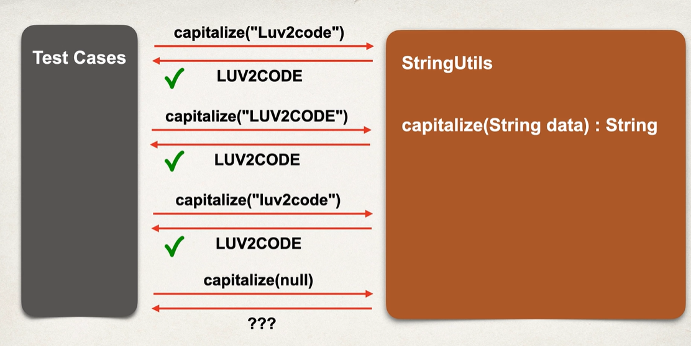
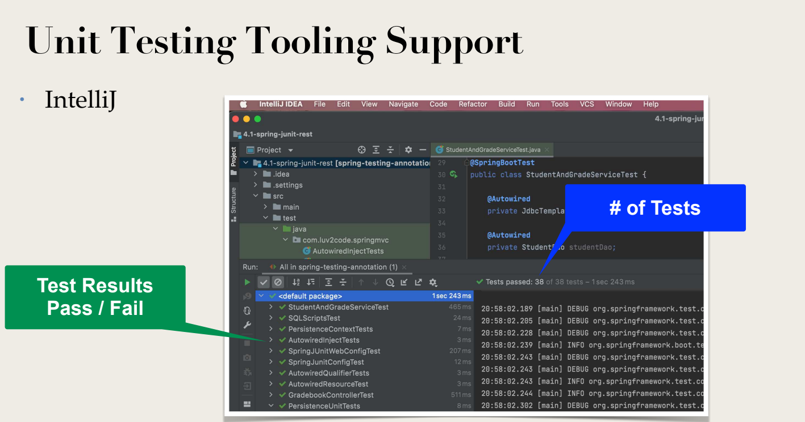
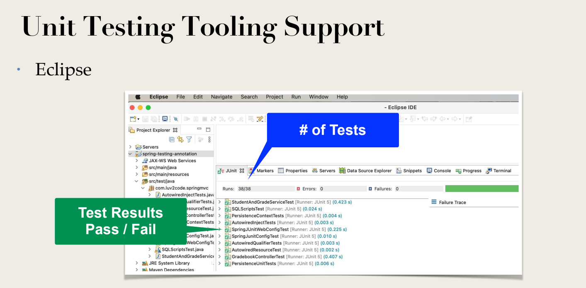

# Notes

## What is Unit Testing?

• Testing an individual unit of code for correctness

• Provide fixed inputs

• Expect known output

We provide test cases and can check output of each test-case!!

## Benefits of Unit Testing

- Automated tests

- Better code design

- Fewer bugs and higher reliability

- Increases confidence for code refactoring ... did I break anything??

- Basic requirement for

    -  DevOps and Build Pipelines

    - Continuous Integration / Continuous Deployment (CI/CD)

## Integration Testing

• Test multiple components together as part of a test plan

• Determine if software units work together as expected

• Identify any negative side effects due to integration

• Can test using mocks / stubs

• Can also test using live integrations (database, file system)

## Unit Testing Frameworks

-  JUnit

    • Supports creating test cases

    • Automation of the test cases with pass / fail

    • Utilities for test setup, teardown and assertions

-  Mockito

    • Create mocks and stubs

    • Minimize dependencies on external components

In Intellij

In Eclipse

LEt us start with Junit now

