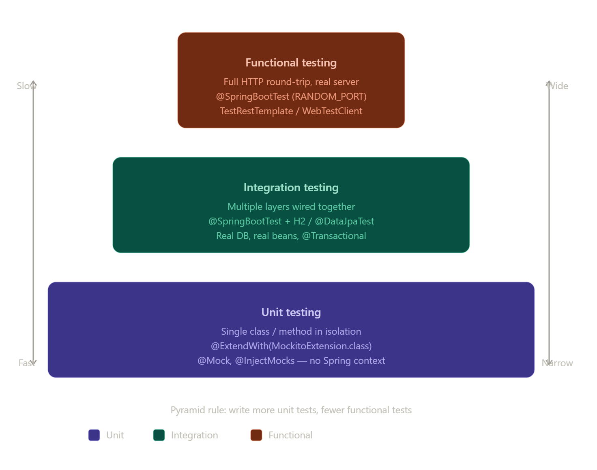
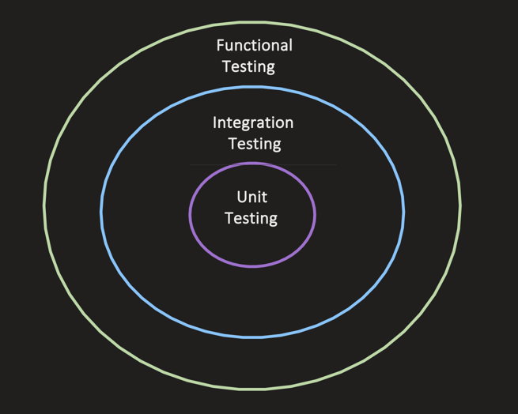
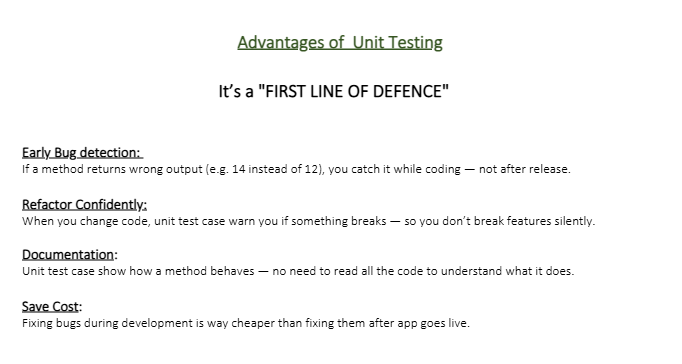
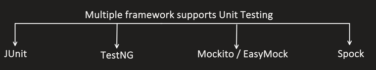
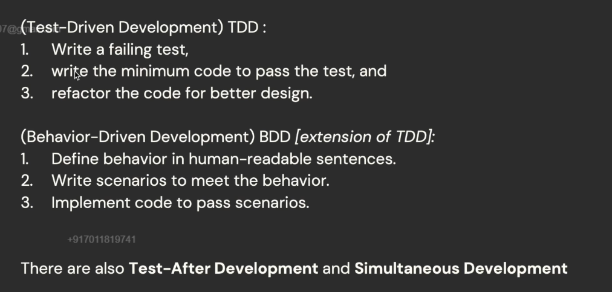

### What is Unit Testing?

> It's a testing method where an **individual unit** (like a method or function) is tested **in isolation**.

```
Test:
When calculateMultiple(4, 2) is called, it should return 8.
```
We will be using Junit for unit testing and Mockito for mocking  and assert4j for asserts. Junit provide basic assertions but we need complex asserations and fluent api which is provided by assert4j.



```java
public class Calculator {
    private NumberUtils numUtil;

    public Calculator(NumberUtils numUtil) {
        this.numUtil = numUtil;
    }

    public int calculateMultiply(int a, int b) {
        // calling another class function
        return numUtil.multiply(a, b);
    }
}

public class NumberUtils {
    public int multiply(int a, int b) {
        return a * b;
    }
}
```

- The goal is to test it in isolation — meaning we need to test the functionality of `calculateMultiply()` only, **not** any other method's functionality.
- In the example above, `calculateMultiply()` calls `NumberUtils` class's `multiply()` method, so we don't want to test `NumberUtils.multiply()`.
- So we **mock** this call `numUtil.multiply(a, b)`.

> **Mocking** means: instead of invoking the real method, we tell the test framework — "when this method is called, just return this predefined value without executing the actual logic."


Mock here means when we call `numUtils.multiply(2,4)` return `8`.

---

### Advantages of Unit Testing

> It's a **"FIRST LINE OF DEFENCE"**

**Early Bug detection** — If a method returns the wrong output (e.g. `14` instead of `12`), you catch it while coding — not after release.

**Refactor Confidently** — When you change code, unit test cases warn you if something breaks — so you don't break features silently.

**Documentation** — Unit test cases show how a method behaves — no need to read all the code to understand what it does.

**Save Cost** — Fixing bugs during development is way cheaper than fixing them after the app goes live.

---

### Unit vs Integration vs Functional Testing



**Unit** — we've already seen above, it's testing of an individual unit (or method).

**Unit testing** is the most granular level — you test a single class or method in complete isolation, mocking all external dependencies. The goal is to verify that one unit of logic works correctly on its own.

---

### Integration Testing

> Testing of **multiple modules or components together**, to test if the system behaves properly when wired together.

**Integration testing** verifies that multiple components work correctly together. (Please read that line again: the goal is **not** to test end-to-end user behavior — the goal is just to check if multiple modules or the system, when wired together, achieve the intended behavior or not.)

**Use case 1: Wired multiple modules of 1 component**

```
Service -> Repository -> DB
```

- You invoke a method in the Service layer
- Verify that Spring Dependency Injection works correctly
- The flow should reach the database layer
- Your test can assert that data was persisted properly into the DB

Stub or mock the external service calls, as the goal is to test multiple modules of **1 component only**, not multiple microservices.

**Use case 2: Integration with multiple components** (not all the components present in the system)

```
Service A -> Service B
```
- Validate that Service A successfully calls Service B via REST (`RestTemplate`, Feign, etc.)
- We can test things like response mapping, HTTP error handling, etc.

```
Service A -> publish to Kafka
```
- Validate that a message is successfully published to the Kafka topic

```
Service A -> send mail
```
- Validate that the email payload is built and sent correctly

**Where the "real" boundary is drawn:**

Integration tests still mock/stub the things *outside* the boundary you're testing (a 3rd-party payment gateway, another team's microservice), but let the *real* wiring run *inside* that boundary (real Spring context, real serialization, real SQL against a real database). That's the whole point — you're validating that the pieces you own actually talk to each other correctly, not just that each piece works in isolation.

**Common tools/approaches:**

- **Testcontainers** — spins up a real Postgres/MySQL/Kafka/Redis instance in a Docker container just for the test run, instead of mocking the DB or using an in-memory fake (H2). This catches real SQL dialect issues, real constraint violations, etc.
- **Spring Boot test slices** — `@DataJpaTest` (loads only the JPA/repository layer), `@WebMvcTest` (loads only the web layer, with `MockMvc`), `@SpringBootTest` (loads the full application context) — each loads progressively more of the real wiring.
- **WireMock / MockServer** — used to stub an *external* HTTP dependency (like a 3rd-party API) with realistic canned responses, so the integration test can still run without needing that external service to be up.
- **Embedded Kafka** (`spring-kafka-test`) — runs an in-memory Kafka broker so you can test real publish/consume flows without a real Kafka cluster.

**Trade-offs vs unit tests:**

- Slower (spinning up a Spring context, a container, etc. takes seconds, not milliseconds).
- More realistic — catches bugs that mocks would hide (e.g. a wrong column name, a misconfigured bean, a serialization mismatch).
- Should be **fewer in number** than unit tests (this is the classic "testing pyramid" — lots of fast unit tests at the bottom, fewer integration tests in the middle, even fewer end-to-end/functional tests at the top).

---

### Why Not Just Do Integration Testing for Everything?

It seems like it would cover everything, but a few practical problems show up once you actually try it:

**Speed** — a unit test that calls a pure function runs in microseconds, since nothing but that function executes. An integration test spins up a Spring context, maybe a real database via Testcontainers, does real serialization — that's seconds per test, not microseconds. If you have 500 edge cases to check across your codebase (null handling, boundary values, exception paths), running each through a full integration test could turn a test suite that takes 10 seconds into one that takes 20+ minutes. That kills the fast feedback loop developers rely on while coding — nobody re-runs a 20-minute suite after every small change, so bugs get caught later, not while you're still looking at the code.

**Debugging is harder** — when an integration test fails, the failure could be in your service logic, the DB mapping, a misconfigured bean, a network hiccup, or the test container itself. You have to dig through more layers to find the actual bug. A unit test failure points at one method — you know exactly what broke.

**Flakiness** — integration tests are flakier by nature: timing issues, container startup races, shared state between tests, external dependencies being briefly unavailable. Flaky tests erode trust in the suite; people start ignoring "red" builds.

**Combinatorial cost** — say a pricing function has 15 edge cases (negative amounts, zero, overflow, rounding rules, currency edge cases). Testing all 15 through a full integration path multiplies your slow, flaky test count by 15. Testing them as unit tests costs almost nothing extra.

**Design feedback** — writing unit tests forces you to structure code with clear boundaries and injectable dependencies, because that's the only way to isolate a unit at all. If you only ever write integration tests, that pressure disappears, and code tends to get more tangled over time since nothing is pushing you toward decoupling it.

So the usual answer isn't "unit tests instead of integration tests," it's both, in different proportions — lots of cheap, fast unit tests covering logic and edge cases, a smaller number of integration tests confirming the pieces actually wire together correctly, and just a handful of functional/E2E tests for the critical user journeys. Each layer catches a different class of bug, and the pyramid shape keeps the whole suite fast enough that people actually run it.

---

### Functional Testing

> **End to end testing** of a feature's business functionality, verifying it works as expected.

**Use case 1** — For 1 component, doing functional testing. End-to-end testing from our client's perspective:

```
API -> Controller -> Service (invokes Real external service call (REST call)) -> DB
```

**Use case 2** — End-to-end testing from the end user's perspective, i.e. how the end user interacts with the system (from the UI). May include frontend, backend, DB, Kafka, etc.

All components involved in a feature need to be deployed on a stage/QA environment, and then testing is done:



**This is essentially "black box" / acceptance testing:**

You don't care *how* the feature is implemented internally — you only care whether, given a certain input/action, the system produces the expected business outcome. This is the same level at which a QA engineer or a business stakeholder would validate a feature, and it's often written as **acceptance criteria** ("Given a logged-in user with items in their cart, when they click checkout with a valid card, then an order should be created and a confirmation email sent").

**Common tools:**

- **API-level functional tests** — RestAssured, Postman/Newman, or plain HTTP clients hitting real deployed endpoints, asserting on status codes, response bodies, and side effects (was the DB row created? was the event published?).
- **UI-level functional tests** — Selenium, Playwright, or Cypress driving a real browser against the deployed frontend, simulating actual user clicks/typing.
- **BDD-style frameworks** — Cucumber, JBehave — express these scenarios in Gherkin (`Given/When/Then`) so non-engineers can read and even help write them.

**Trade-offs:**

- **Slowest and most expensive** of the three types — a full feature flow (UI → API → DB → downstream services) can take seconds to minutes per scenario.
- **Flakiest** — depends on network calls, timing, environment availability, test data state; a UI test can fail because a button rendered 200ms late, not because the feature is actually broken.
- **Fewest in number** — per the testing pyramid, you write functional/E2E tests only for your most critical user journeys (login, checkout, payment), not for every edge case — those edge cases belong in unit/integration tests, which are cheaper to run and easier to debug.
- Usually run less frequently than unit/integration tests — e.g. on a nightly schedule or before a release, rather than on every single commit — because of how slow and resource-heavy they are.

**Why not just write functional tests for everything?**

It seems like it would cover everything, but a few practical problems show up once you actually try it:

Speed is the big one. A unit test that calls a pure function runs in microseconds because nothing but that function executes. An integration test spins up a Spring context, maybe a real database via Testcontainers, does real serialization — that's seconds per test, not microseconds. If you have 500 edge cases to check across your codebase (null handling, boundary values, exception paths), running each through a full integration test could turn a test suite that takes 10 seconds into one that takes 20+ minutes. That kills the fast feedback loop developers rely on while coding — nobody re-runs a 20-minute suite after every small change, so bugs get caught later, not while you're still looking at the code.

Debugging gets harder too. When an integration test fails, the failure could be in your service logic, the DB mapping, a misconfigured bean, a network hiccup, or the test container itself. You have to dig through more layers to find the actual bug. A unit test failure points at one method — you know exactly what broke.

Integration tests are also flakier by nature — timing issues, container startup races, shared state between tests, external dependencies being briefly unavailable. Flaky tests erode trust in the suite; people start ignoring "red" builds.

There's a combinatorial cost too. Say a pricing function has 15 edge cases (negative amounts, zero, overflow, rounding rules, currency edge cases). Testing all 15 through a full integration path multiplies your slow, flaky test count by 15. Testing them as unit tests costs almost nothing extra.

And there's a design side-effect people don't always notice: writing unit tests forces you to structure code with clear boundaries and injectable dependencies, because that's the only way to isolate a unit at all. If you only ever write integration tests, that pressure disappears, and code tends to get more tangled over time since nothing is pushing you toward decoupling it.

So the usual answer isn't "unit tests instead of integration tests," it's both, in different proportions — lots of cheap, fast unit tests covering logic and edge cases, a smaller number of integration tests confirming the pieces actually wire together correctly, and just a handful of functional/E2E tests for the critical user journeys. Each layer catches a different class of bug, and the pyramid shape keeps the whole suite fast enough that people actually run it.

If your entire suite were functional tests, a single failure would be hard to localize (is the bug in the UI? the API? the DB layer? a downstream service?), the suite would take hours to run, and it would be constantly flaky due to environment issues — which is exactly why the pyramid favors many fast, isolated unit tests, a moderate number of integration tests, and just a handful of functional/E2E tests covering the critical paths.

---

### Frameworks that Support Unit Testing



JUnit with Mockito is the most popular combination, and we'll use it in upcoming videos.

## Various Approaches



TDD first we write failing test case and then we try to develop code which passes the test case and then we refactor.


No one uses both TDD and BDD 

generally we use test After development approach.


