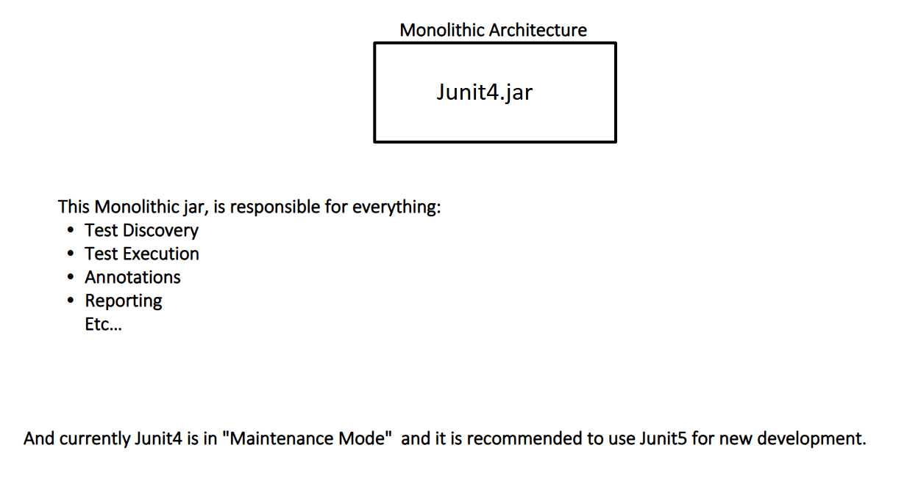

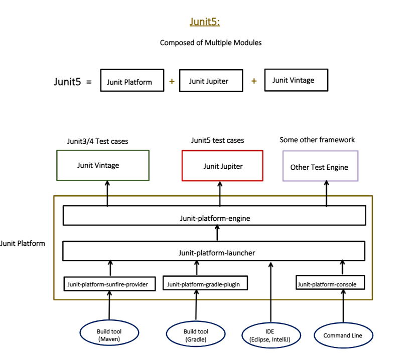


Let me explain every part of it clearly.

---

### JUnit 5 is NOT a single library — it's 3 modules combined

```
JUnit 5 = JUnit Platform + JUnit Jupiter + JUnit Vintage
```

Each module has a **distinct responsibility**. Let's break them all down.

---

### 1. JUnit Platform — the Foundation Layer

This is the **base engine** that makes everything run. It doesn't care what kind of tests you write — it just provides the infrastructure to **discover, launch, and execute** tests.

Think of it as the **railway tracks** — trains (test engines) run on top of it.

It has 3 sub-components:

#### `junit-platform-launcher`
The **entry point** — it receives the request to run tests and coordinates everything.

```
Maven / Gradle / IDE / CLI
        ↓
junit-platform-launcher   ← "ok, find and run all tests"
        ↓
junit-platform-engine     ← hands off to the right engine
```

#### `junit-platform-engine`
The **bridge** between the launcher and actual test engines (Jupiter, Vintage, others). Every test engine must implement this API.

#### Platform providers / plugins:
| Component | Used by | Purpose |
|---|---|---|
| `junit-platform-surefire-provider` | Maven (Build tool) | Lets Maven run JUnit 5 tests via `mvn test` |
| `junit-platform-gradle-plugin` | Gradle (Build tool) | Lets Gradle run JUnit 5 tests via `gradle test` |
| `junit-platform-console` | Command Line | Run tests directly from terminal |
| IDE support | Eclipse, IntelliJ | Run tests with green play button in IDE |

---

### 2. JUnit Jupiter — write NEW JUnit 5 tests

This is what **you use every day** as a developer. Jupiter provides all the new JUnit 5 annotations and APIs.

```java
// All of these come from JUnit JUPITER
import org.junit.jupiter.api.Test;
import org.junit.jupiter.api.BeforeEach;
import org.junit.jupiter.api.AfterEach;
import org.junit.jupiter.api.DisplayName;
import org.junit.jupiter.api.Nested;
import org.junit.jupiter.params.ParameterizedTest;

@DisplayName("Order Service Tests")        // Jupiter
class OrderServiceTest {

    @BeforeEach                            // Jupiter
    void setup() { ... }

    @Test                                  // Jupiter
    void shouldCalculateTotal() { ... }

    @ParameterizedTest                     // Jupiter
    @ValueSource(ints = {1, 2, 3})
    void shouldWorkForMultipleInputs(int val) { ... }

    @Nested                                // Jupiter
    class WhenOrderIsEmpty { ... }
}
```

Jupiter = **the new modern API** for writing tests introduced in JUnit 5.

---

### 3. JUnit Vintage — run OLD JUnit 3/4 tests

This is a **backward compatibility bridge**. If your project has old JUnit 3 or JUnit 4 tests, Vintage lets them run on the JUnit 5 platform **without rewriting** them.

```java
// OLD JUnit 4 test — still works via JUnit VINTAGE
import org.junit.Test;           // JUnit 4 import (not Jupiter!)
import org.junit.Before;

public class OldOrderServiceTest {

    @Before                      // JUnit 4 annotation
    public void setup() { ... }

    @Test                        // JUnit 4 annotation
    public void shouldCalculateTotal() { ... }
}
// Vintage engine picks this up and runs it on JUnit 5 Platform
```

---

### How they all connect — the full flow

```
You type: mvn test  OR  click ▶ in IntelliJ
                │
                ▼
    ┌─────────────────────────────────────┐
    │  junit-platform-surefire-provider   │  (Maven)
    │  junit-platform-gradle-plugin       │  (Gradle)
    │  IDE integration                    │  (IntelliJ/Eclipse)
    │  junit-platform-console             │  (CLI)
    └─────────────────────────────────────┘
                │
                ▼
    ┌─────────────────────────────┐
    │   junit-platform-launcher   │  ← coordinates everything
    └─────────────────────────────┘
                │
                ▼
    ┌─────────────────────────────┐
    │   junit-platform-engine     │  ← routes to right engine
    └─────────────────────────────┘
         │           │           │
         ▼           ▼           ▼
   ┌──────────┐ ┌─────────┐ ┌──────────────┐
   │  Vintage │ │ Jupiter │ │ Other Engine │
   │ (JUnit   │ │ (JUnit  │ │ (TestNG etc) │
   │  3 & 4)  │ │   5)    │ │              │
   └──────────┘ └─────────┘ └──────────────┘
```

---

### "Other Test Engine" — JUnit Platform is open!

The platform is **open to third-party engines** too. Any framework can plug into JUnit Platform by implementing the engine API:

```
TestNG     → can plug in as a test engine
Spock      → can plug in as a test engine
Cucumber   → can plug in as a test engine
```

This is why it's called a **Platform** — not just a library.

---

### Maven dependency — what you actually add

```xml
<!-- This single dependency pulls in Platform + Jupiter + Vintage -->
<dependency>
    <groupId>org.springframework.boot</groupId>
    <artifactId>spring-boot-starter-test</artifactId>
    <scope>test</scope>
    <!-- Includes JUnit Jupiter automatically ✅ -->
</dependency>

<!-- Only add Vintage if you have old JUnit 3/4 tests -->
<dependency>
    <groupId>org.junit.vintage</groupId>
    <artifactId>junit-vintage-engine</artifactId>
    <scope>test</scope>
</dependency>
```

---

### Quick summary of all 3 modules

| Module | Role | Used by |
|---|---|---|
| **JUnit Platform** | Foundation — launches & runs tests | Maven, Gradle, IDE, CLI |
| **JUnit Jupiter** | New API — write modern JUnit 5 tests | Developers writing new tests |
| **JUnit Vintage** | Backward compat — runs JUnit 3/4 tests | Legacy projects with old tests |

---

### Bottom line

> **JUnit Platform** = the engine room — makes tests runnable from anywhere
>
> **JUnit Jupiter** = what YOU write — all the `@Test`, `@BeforeEach`, `@Nested` annotations
>
> **JUnit Vintage** = the compatibility layer — so old JUnit 3/4 tests don't break
>
> Together they form **JUnit 5** — a modular, extensible, modern testing platform.


Let us understand by intellij!!


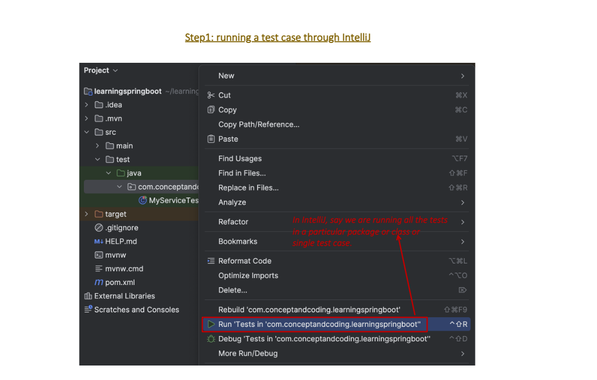


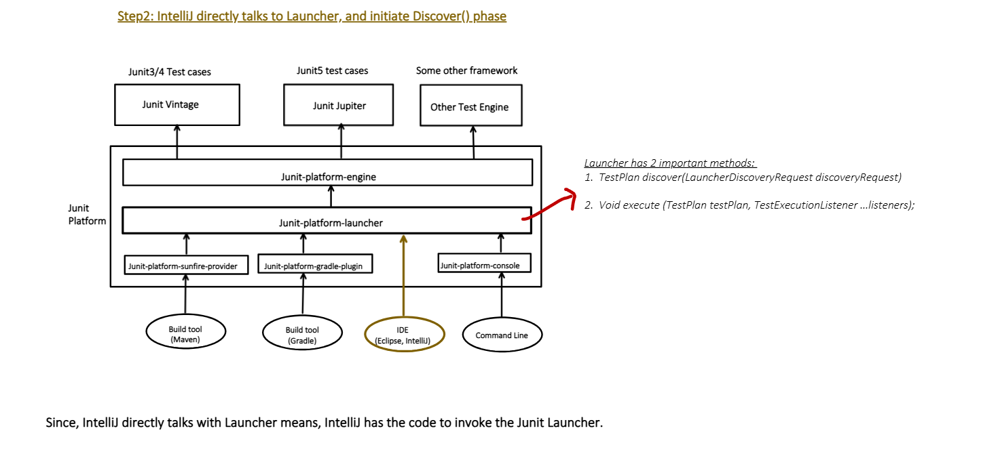

 This explains exactly **how IntelliJ triggers your tests internally**. Let me break it all down.

---

### The Big Picture — what happens when you click ▶ in IntelliJ

When you click the green play button in IntelliJ, a whole chain of events fires internally. This diagram shows **Step 2** of that chain — IntelliJ talking directly to the JUnit Launcher.

---

### Why IntelliJ talks DIRECTLY to the Launcher

Notice from the diagram — IntelliJ (IDE) has a **direct arrow** to `junit-platform-launcher`, bypassing the provider/plugin layer that Maven and Gradle use.

```
Maven   → junit-platform-surefire-provider → launcher
Gradle  → junit-platform-gradle-plugin     → launcher
CLI     → junit-platform-console           → launcher

IntelliJ → junit-platform-launcher  ← DIRECTLY! No middleware
```

This is because **IntelliJ has JUnit launcher code built right into it**. As the diagram says:

> *"IntelliJ has the code to invoke the JUnit Launcher"*

IntelliJ doesn't need a plugin bridge — it speaks the Launcher API natively.

---

### The Launcher has exactly 2 important methods

This is the core of the diagram — the `junit-platform-launcher` exposes only **2 methods** that everything revolves around:

---

#### Method 1 — `discover()`

```java
TestPlan discover(LauncherDiscoveryRequest discoveryRequest);
```

This is the **"find all tests"** phase.

```java
// What IntelliJ internally does when you open a test file:
LauncherDiscoveryRequest request = LauncherDiscoveryRequestBuilder
    .request()
    .selectors(
        selectClass(OrderServiceTest.class),      // specific class
        selectPackage("com.example.service"),     // whole package
        selectMethod("shouldCalculateTotal")      // specific method
    )
    .filters(
        includeClassNamePatterns(".*Test")        // only classes ending in Test
    )
    .build();

// Launcher scans and returns a TestPlan
TestPlan testPlan = launcher.discover(request);
// TestPlan contains: all test classes, methods, nested classes found
```

`TestPlan` is basically a **map of everything** JUnit found:

```
TestPlan
  ├── OrderServiceTest
  │     ├── shouldCalculateTotal()
  │     ├── shouldApplyDiscount()
  │     └── shouldThrowWhenNotFound()
  ├── UserServiceTest
  │     ├── shouldRegisterUser()
  │     └── shouldReturnActiveUsers()
  └── PaymentServiceTest
        └── shouldProcessPayment()
```

This is why IntelliJ can **show you all tests in the sidebar** before you even run them — it called `discover()` first!

---

#### Method 2 — `execute()`

```java
void execute(TestPlan testPlan, TestExecutionListener... listeners);
```

This is the **"actually run the tests"** phase.

```java
// What IntelliJ internally does when you click ▶ Run:
launcher.execute(testPlan,
    new TestExecutionListener() {

        @Override
        public void testStarted(TestIdentifier test) {
            // IntelliJ shows test as "running" (yellow spinner) ⏳
            System.out.println("Started: " + test.getDisplayName());
        }

        @Override
        public void testSuccessful(TestIdentifier test) {
            // IntelliJ marks test GREEN ✅
            System.out.println("Passed: " + test.getDisplayName());
        }

        @Override
        public void testFailed(TestIdentifier test, Throwable cause) {
            // IntelliJ marks test RED ❌ and shows the error
            System.out.println("Failed: " + test.getDisplayName());
        }

        @Override
        public void testSkipped(TestIdentifier test, String reason) {
            // IntelliJ marks test as SKIPPED ⏭️
        }
    }
);
```

`TestExecutionListener` is how IntelliJ **reacts in real time** — every green tick, red cross, and progress bar you see is driven by these listener callbacks.

---

### The full flow — step by step

```
You click ▶ in IntelliJ
        │
        ▼
IntelliJ builds LauncherDiscoveryRequest
  (which class/package/method to look at)
        │
        ▼
IntelliJ calls launcher.discover(request)
        │
        ▼
Launcher asks each engine to find tests:
  ├── Jupiter engine  → finds @Test methods   → adds to TestPlan
  ├── Vintage engine  → finds JUnit4 tests    → adds to TestPlan
  └── Other engine    → finds its own tests   → adds to TestPlan
        │
        ▼
TestPlan returned to IntelliJ
  (sidebar now shows all discovered tests)
        │
        ▼
IntelliJ calls launcher.execute(testPlan, listener)
        │
        ▼
Launcher routes each test to correct engine:
  ├── @Test (Jupiter)  → Jupiter engine runs it
  ├── @Test (JUnit4)   → Vintage engine runs it
  └── Other            → Other engine runs it
        │
        ▼
TestExecutionListener fires callbacks:
  ├── testStarted()   → IntelliJ shows ⏳
  ├── testSuccessful()→ IntelliJ shows ✅
  └── testFailed()    → IntelliJ shows ❌
```

---

### Why this 2-method design is brilliant

Separating `discover` and `execute` gives tools like IntelliJ superpowers:

```
discover() alone → show test tree in sidebar without running
                 → count total tests
                 → filter which tests to run
                 → show @Disabled tests greyed out

execute() alone  → run a previously discovered plan
                 → re-run failed tests only
                 → run in parallel
                 → stream results live to UI
```

```java
// IntelliJ can do "Run failed tests only" like this:
TestPlan fullPlan = launcher.discover(request);

// Filter only failed tests from last run
TestPlan failedOnly = fullPlan.getChildren()
    .stream()
    .filter(test -> lastRunResults.failed(test))
    .collect(...);

launcher.execute(failedOnly, listener);  // only reruns failures!
```

---

### Summary table

| | `discover()` | `execute()` |
|---|---|---|
| Purpose | Find all tests | Run the tests |
| Input | `LauncherDiscoveryRequest` | `TestPlan` + `listeners` |
| Output | `TestPlan` | void (results via listener) |
| IntelliJ uses it for | Showing test tree in sidebar | Running & showing results |
| When called | When you open test file | When you click ▶ Run |

---

### Bottom line

> IntelliJ **directly implements** the JUnit Launcher API — no plugin needed.
>
> **`discover()`** = *"scan my code and tell me what tests exist"* → builds the sidebar tree
>
> **`execute()`** = *"now run those tests and tell me results as they happen"* → drives the green/red UI
>
> This clean 2-method design is why IntelliJ can show test counts, run subsets, rerun failures, and stream live results — all powered by just these two calls.

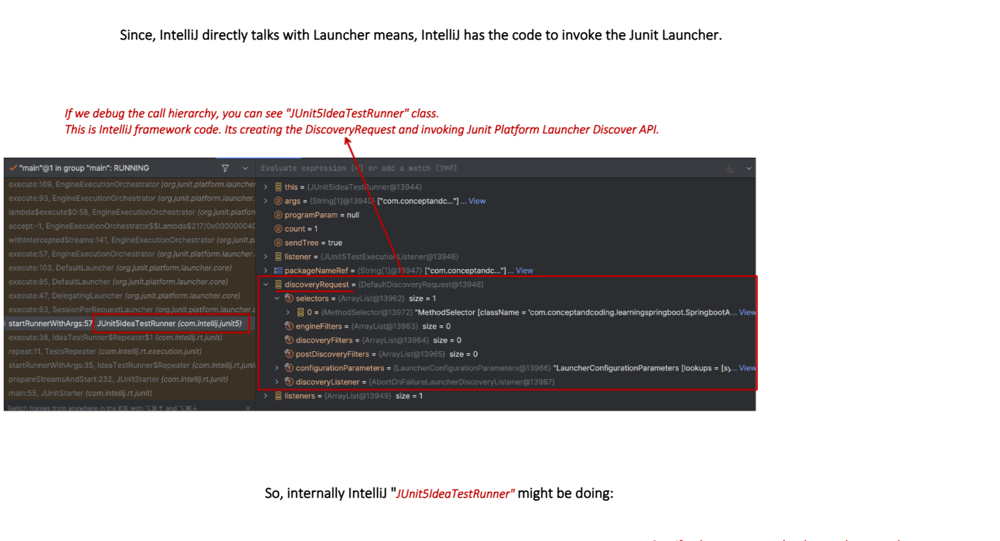

Excellent! This is a **real debugger screenshot** showing IntelliJ's internal code caught in action. Let me explain every part of what you're seeing.

---

### What this screenshot proves

Someone actually **put a debugger breakpoint** inside IntelliJ's own internal code and caught it mid-execution. This reveals exactly what IntelliJ does internally when you click ▶ Run.

---

### The key class — `JUnit5IdeaTestRunner`

Look at the call stack on the left side:

```
main:55, JUnitStarter (com.intellij.rt.junit)
prepareStreamsAndStart:232, JUnitStarter (com.intellij.rt.junit)
startRunnerWithArgs:35, IdeaTestRunner$Repeater (com.intellij.rt.junit)
startRunnerWithArgs:57 JUnit5IdeaTestRunner (com.intellij.junit5)  ← HERE
repeat:11, TestsRepeater (com.intellij.rt.execution.junit)
execute:38, IdeaTestRunner$Repeater (com.intellij.rt.junit)
execute:63, SessionPerRequestLauncher (org.junit.platform.launcher.core)
execute:47, DelegatingLauncher (org.junit.platform.launcher.core)
execute:85, DefaultLauncher (org.junit.platform.launcher.core)
execute:103, DefaultLauncher (org.junit.platform.launcher.core)
...
```

This is IntelliJ's own framework code (`com.intellij.junit5`) calling JUnit Platform (`org.junit.platform.launcher.core`).

---

### Breaking down the call stack — bottom to top

```
JUnitStarter.main()                    ← IntelliJ entry point
    └── prepareStreamsAndStart()        ← sets up output streams
          └── IdeaTestRunner$Repeater  ← handles test repetition
                └── JUnit5IdeaTestRunner.startRunnerWithArgs()
                      └── TestsRepeater.repeat()
                            └── IdeaTestRunner$Repeater.execute()
                                  └── SessionPerRequestLauncher.execute()
                                        └── DelegatingLauncher.execute()
                                              └── DefaultLauncher.execute()
                                                    └── YOUR TESTS RUN HERE
```

The top half (`com.intellij.*`) = **IntelliJ's code**
The bottom half (`org.junit.platform.*`) = **JUnit Platform's code**

They meet at `JUnit5IdeaTestRunner` — the bridge between IntelliJ and JUnit.

---

### The `discoveryRequest` object — what IntelliJ built

Look at the right panel in the debugger — this is the `DefaultDiscoveryRequest` object IntelliJ constructed:

```java
// What IntelliJ internally built — reconstructed from debugger:
LauncherDiscoveryRequest discoveryRequest = LauncherDiscoveryRequestBuilder
    .request()
    .selectors(
        // selectors: ArrayList size=1
        // MethodSelector [className='com.conceptandcoding.learningspringboot.SpringbootA...']
        selectMethod("com.conceptandcoding.learningspringboot.SpringbootATest#methodName")
    )
    .filters(
        // engineFilters:       ArrayList size=0  → no engine filter
        // discoveryFilters:    ArrayList size=0  → no discovery filter
        // postDiscoveryFilters:ArrayList size=0  → no post-discovery filter
    )
    .configurationParameter(/* LauncherConfigurationParameters */)
    .build();
```

Breaking down each field in the debugger:

```
discoveryRequest = {DefaultDiscoveryRequest@13948}
│
├── selectors = {ArrayList@13962} size=1
│       └── 0 = {MethodSelector@13972}
│               "MethodSelector [className='com.conceptandcoding.
│                learningspringboot.SpringbootA...']"
│               ← IntelliJ knows EXACTLY which method to run
│
├── engineFilters        = {ArrayList@13963} size=0  ← no filter
├── discoveryFilters     = {ArrayList@13964} size=0  ← no filter
├── postDiscoveryFilters = {ArrayList@13965} size=0  ← no filter
│
├── configurationParameters = {LauncherConfigurationParameters@13966}
│       "LauncherConfigurationParameters [lookups=[s}..."
│
└── discoveryListener = {AbortOnFailureLauncherDiscoveryListener@13967}
        ← stops discovery if something goes wrong
```

---

### Other variables in the debugger

```java
// From the right panel:
this          = {JUnit5IdeaTestRunner@13944}   // the runner instance itself
args          = {String[1]@13940}              // ["com.conceptandc..."] — test class name
programParam  = null                           // no program args
count         = 1                              // run once (not repeated)
sendTree      = true                           // send test tree to IDE UI
listener      = {JUnit5TestExecutionListener@13946} // listens to results
packageNameRef= {String[1]@13947}             // ["com.conceptandc..."]
listeners     = {ArrayList@13949} size=1       // list of listeners
```

`sendTree = true` is especially interesting — this tells IntelliJ to send the **test tree structure** back to the IDE so it can display the sidebar with all test names before running.

---

### What `JUnit5IdeaTestRunner` is doing internally

Based on the debugger, IntelliJ's runner is essentially doing this:

```java
// Simplified reconstruction of JUnit5IdeaTestRunner internals
public class JUnit5IdeaTestRunner implements IdeaTestRunner {

    @Override
    public int startRunnerWithArgs(String[] args, String[] name, int count) {

        // Step 1: Build the discovery request
        // (targeting specific class/method from args)
        LauncherDiscoveryRequest discoveryRequest =
            LauncherDiscoveryRequestBuilder.request()
                .selectors(selectMethod(args[0]))  // args[0] = test class name
                .build();

        // Step 2: Create listener
        // (sends results back to IntelliJ UI)
        JUnit5TestExecutionListener listener =
            new JUnit5TestExecutionListener(sendTree);

        // Step 3: Get the launcher
        Launcher launcher = LauncherFactory.create();

        // Step 4: DISCOVER — find all tests
        TestPlan testPlan = launcher.discover(discoveryRequest);
        // sendTree=true → test names appear in IntelliJ sidebar now

        // Step 5: EXECUTE — run the tests
        launcher.execute(testPlan, listener);
        // listener fires → IntelliJ shows ✅ ❌ in real time

        return listener.getFailureCount();
    }
}
```

---

### The full picture — IntelliJ to your test method

```
You click ▶ Run on shouldCalculateTotal()
            │
            ▼
JUnitStarter.main()                      ← IntelliJ starts here
            │
            ▼
JUnit5IdeaTestRunner.startRunnerWithArgs()
    builds: MethodSelector["SpringbootATest#shouldCalculateTotal"]
    builds: DefaultDiscoveryRequest
            │
            ▼
DefaultLauncher.discover(discoveryRequest)
    → finds shouldCalculateTotal() method
    → returns TestPlan
    → sendTree=true → IntelliJ sidebar updates
            │
            ▼
DefaultLauncher.execute(testPlan, listener)
    → Jupiter engine picks up @Test method
    → runs shouldCalculateTotal()
            │
            ▼
JUnit5TestExecutionListener callbacks:
    testStarted()    → IntelliJ shows ⏳
    testSuccessful() → IntelliJ shows ✅
    testFailed()     → IntelliJ shows ❌
```

---

### Why this matters to understand

| Insight | What it means |
|---|---|
| `JUnit5IdeaTestRunner` exists | IntelliJ ships with JUnit5 runner code built-in |
| `MethodSelector` in request | IntelliJ targets exact test method you clicked |
| `sendTree=true` | Test tree appears in sidebar before tests run |
| `size=0` filters | No filtering — run everything discovered |
| `AbortOnFailureLauncherDiscoveryListener` | Discovery stops if classpath errors found |
| Call stack crosses `intellij` → `junit.platform` | Exact handoff point between IDE and JUnit |

---

### Bottom line

> This debugger screenshot proves that IntelliJ internally creates a `JUnit5IdeaTestRunner` which builds a `LauncherDiscoveryRequest` with a `MethodSelector` pointing to your exact test, then calls `launcher.discover()` and `launcher.execute()` — exactly the 2-method flow from the previous diagram.
>
> You're not just clicking a button — IntelliJ is **programmatically invoking the JUnit Platform API** behind the scenes, every single time.

Great question! This is a concept that confuses many developers. Let me explain it clearly with real examples.

---

### One line summary

> **API** — code that YOU call (library gives it to you)
>
> **SPI** — code that YOU implement (library calls your implementation)

---

### Simple analogy first

Think of a **restaurant**:

```
API = Restaurant MENU
      You (customer) look at menu and CALL/ORDER what you want
      Kitchen provides the food — you just consume it

SPI = Job APPLICATION form for a Chef
      Restaurant defines what skills a chef MUST have
      You implement those skills — restaurant CALLS you to cook
```

---

### API — Application Programming Interface

YOU are the **caller**. The library provides ready-made methods for you to use.

```java
// Java List API — List is provided, you just CALL its methods
List<String> names = new ArrayList<>();
names.add("Alice");       // you CALL add()
names.get(0);             // you CALL get()
names.size();             // you CALL size()
// You don't implement these — you just USE them
```

```java
// JUnit Launcher API — Launcher provided, you just CALL it
Launcher launcher = LauncherFactory.create();

launcher.discover(request);   // you CALL discover()
launcher.execute(testPlan);   // you CALL execute()
// You don't implement Launcher — JUnit did that for you
```

```java
// Spring JPA API — you CALL repository methods
@Autowired
UserRepository userRepository;

userRepository.save(user);        // you CALL save()
userRepository.findById(1L);      // you CALL findById()
userRepository.deleteAll();       // you CALL deleteAll()
// Spring Data implements these — you just call them
```

Pattern:
```
Library defines & implements → YOU call it
```

---

### SPI — Service Provider Interface

YOU are the **implementer**. The library defines a contract (interface) and CALLS your implementation.

```java
// JUnit TestEngine SPI — JUnit defines it, YOU implement it
interface TestEngine {
    TestDescriptor discover(EngineDiscoveryRequest request, UniqueId id);
    void execute(ExecutionRequest request);
}

// JUnit Jupiter TEAM implemented it:
class JupiterTestEngine implements TestEngine {
    @Override
    public TestDescriptor discover(...) {
        // Jupiter's logic to find @Test methods
    }
    @Override
    public void execute(...) {
        // Jupiter's logic to run @Test methods
    }
}

// YOU could implement it too:
class MyCustomEngine implements TestEngine {
    @Override
    public TestDescriptor discover(...) {
        // YOUR logic to find tests
    }
    @Override
    public void execute(...) {
        // YOUR logic to run tests
    }
}
// JUnit Platform CALLS your implementation automatically!
```

Pattern:
```
Library defines interface → YOU implement it → Library calls it
```

---

### Side by side — same domain, API vs SPI

```java
// ─────────────────────────────────────────
// LAUNCHER API — you CALL these
// ─────────────────────────────────────────
Launcher launcher = LauncherFactory.create();

TestPlan plan = launcher.discover(request);  // YOU call
launcher.execute(plan, listener);            // YOU call


// ─────────────────────────────────────────
// TestEngine SPI — JUnit CALLS your impl
// ─────────────────────────────────────────
class MyEngine implements TestEngine {

    @Override
    public TestDescriptor discover(...) { // JUnit CALLS this
        // your implementation
    }

    @Override
    public void execute(...) {            // JUnit CALLS this
        // your implementation
    }
}
```

```
YOU           →  Launcher.discover()   →  API (you call)
JUnit Platform →  TestEngine.discover() →  SPI (JUnit calls yours)
```

---

### Real world Java SPI examples

#### JDBC — classic SPI example

```java
// JDBC SPI — java.sql.Driver interface
// Java defines it — database vendors implement it

// MySQL implements it:
class com.mysql.jdbc.Driver implements java.sql.Driver {
    @Override
    public Connection connect(String url, Properties info) {
        // MySQL's own connection logic
    }
}

// PostgreSQL implements it:
class org.postgresql.Driver implements java.sql.Driver {
    @Override
    public Connection connect(String url, Properties info) {
        // PostgreSQL's own connection logic
    }
}

// YOU just use the API:
Connection conn = DriverManager.getConnection(
    "jdbc:mysql://localhost/mydb"  // DriverManager calls MySQL's impl
);
// You never call Driver.connect() directly — Java does!
```

#### Slf4j logging — SPI example

```java
// Slf4j defines the SPI:
interface ILoggerFactory {
    Logger getLogger(String name);  // logging frameworks implement this
}

// Logback implements it:
class LogbackLoggerFactory implements ILoggerFactory { ... }

// Log4j implements it:
class Log4jLoggerFactory implements ILoggerFactory { ... }

// YOU just use the API:
Logger log = LoggerFactory.getLogger(MyClass.class);
log.info("Hello");  // you call API — Slf4j calls your SPI impl internally
```

---

### How SPI works — ServiceLoader mechanism

```java
// Step 1: Define the SPI interface (JUnit does this)
public interface TestEngine {
    TestDescriptor discover(...);
    void execute(...);
}

// Step 2: Implement it in your jar (engine authors do this)
public class MyEngine implements TestEngine { ... }

// Step 3: Register in META-INF/services (engine jar does this)
// File: META-INF/services/org.junit.platform.engine.TestEngine
// Content: com.mycompany.MyEngine

// Step 4: JUnit auto-discovers via ServiceLoader (JUnit does this)
ServiceLoader<TestEngine> engines =
    ServiceLoader.load(TestEngine.class);

for (TestEngine engine : engines) {
    engine.discover(...);   // JUnit calls YOUR implementation!
    engine.execute(...);    // JUnit calls YOUR implementation!
}
```

Just adding the jar to classpath is enough — no manual registration!

---

### Spring Boot SPI examples

```java
// Spring's BeanPostProcessor — SPI
// Spring calls YOUR implementation after every bean creation
@Component
public class MyBeanPostProcessor implements BeanPostProcessor {

    @Override
    public Object postProcessAfterInitialization(Object bean, String name) {
        // Spring CALLS this for every bean — you don't call it!
        System.out.println("Bean created: " + name);
        return bean;
    }
}


// Spring's ApplicationListener — SPI
// Spring calls YOUR implementation when events happen
@Component
public class MyStartupListener implements ApplicationListener<ContextRefreshedEvent> {

    @Override
    public void onApplicationEvent(ContextRefreshedEvent event) {
        // Spring CALLS this on startup — you don't call it!
        System.out.println("App started!");
    }
}


// Spring's HandlerInterceptor — SPI
// Spring calls YOUR implementation before/after every HTTP request
@Component
public class MyInterceptor implements HandlerInterceptor {

    @Override
    public boolean preHandle(HttpServletRequest req,
                             HttpServletResponse res, Object handler) {
        // Spring CALLS this — you don't call it!
        return true;
    }
}
```

---

### The key mental model

```
API  →  YOU are the driver   — you decide WHEN and WHAT to call
SPI  →  Library is the driver — library decides WHEN to call YOUR code


API flow:
  Your code  ──calls──▶  Library code
  (you're in control)

SPI flow:
  Library code  ──calls──▶  Your code
  (library is in control — "Don't call us, we'll call you!")
```

The SPI principle is also called **"Hollywood Principle"**:
> *"Don't call us, we'll call you"*

---

### Summary table

| | API | SPI |
|---|---|---|
| Full form | Application Programming Interface | Service Provider Interface |
| Who defines it | Library | Library |
| Who implements it | Library | YOU |
| Who calls it | YOU | Library |
| Your role | Consumer / Caller | Provider / Implementer |
| Direction | You → Library | Library → You |
| JUnit example | `Launcher.discover()` | `TestEngine.discover()` |
| Spring example | `userRepository.save()` | `BeanPostProcessor.postProcess()` |
| Java example | `List.add()` | `java.sql.Driver.connect()` |
| Purpose | Use library features | Extend / plug into library |

---

### Bottom line

> **API** = the library hands you tools — you use them when YOU want
>
> **SPI** = you hand the library your implementation — it calls YOU when IT wants
>
> Same interface, completely opposite direction of control.
>
> JUnit Platform is brilliant because it exposes **both** — `Launcher` as API (tools use it) and `TestEngine` as SPI (engines implement it) — making it infinitely extensible.

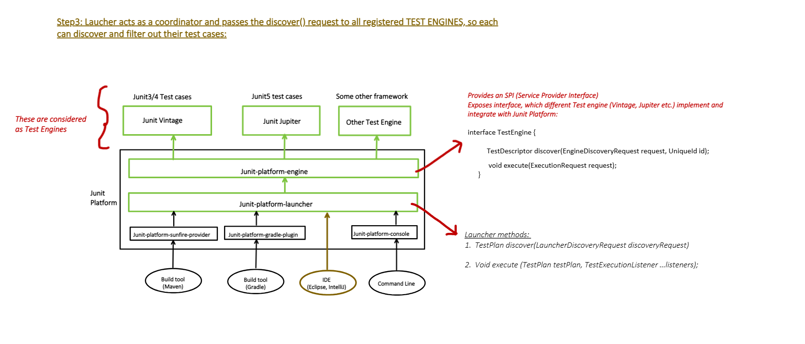


Perfect! This is **Step 3** — the most important architectural piece. Let me explain everything in detail.

---

### The Core Concept — Launcher is a COORDINATOR

The Launcher doesn't run tests itself. It **broadcasts** the discovery request to ALL registered test engines and lets each engine find its own tests.

```
Launcher = Air Traffic Controller
Engines  = Airplanes (each knows its own flight plan)
```

---

### The `TestEngine` interface — the SPI contract

>Junit jupyter, Junit Vintage ,cocumber  are example of testEngine

This is the key insight from the diagram. JUnit Platform exposes a **Service Provider Interface (SPI)**:

```java
// This interface is what JUnit Platform EXPOSES
// Every test engine MUST implement this
interface TestEngine {

    // Method 1: Find all your tests
    TestDescriptor discover(EngineDiscoveryRequest request, UniqueId id);

    // Method 2: Run the tests you found
    void execute(ExecutionRequest request);
}
```

This is an **SPI** (Service Provider Interface) — not an API.

| API | SPI |
|---|---|
| YOU call it | YOU implement it |
| JUnit provides it for you to use | JUnit defines it for engines to implement |
| `Launcher.discover()` | `TestEngine.discover()` |

---

### What is SPI? — simple explanation

```java
// API — you CALL this (JUnit provides it)
TestPlan plan = launcher.discover(request);  // you call launcher

// SPI — you IMPLEMENT this (JUnit calls YOUR implementation)
class JupiterTestEngine implements TestEngine {
    @Override
    public TestDescriptor discover(EngineDiscoveryRequest request, UniqueId id) {
        // Jupiter's own logic to find @Test methods
        // JUnit Platform CALLS this — you don't call it yourself
    }

    @Override
    public void execute(ExecutionRequest request) {
        // Jupiter's own logic to run the tests it found
    }
}
```

JUnit Platform says: *"Anyone who wants to be a test engine, implement `TestEngine` and I'll call you automatically."*

---

### How each engine implements `TestEngine`

#### Jupiter Engine (JUnit 5 tests)
```java
public class JupiterTestEngine implements TestEngine {

    @Override
    public String getId() {
        return "junit-jupiter";  // unique engine ID
    }

    @Override
    public TestDescriptor discover(EngineDiscoveryRequest request, UniqueId id) {
        // Scans for classes with @Test, @ParameterizedTest,
        // @Nested, @TestFactory etc.
        // Returns a tree of discovered tests
        return new JupiterEngineDescriptor(id, request);
    }

    @Override
    public void execute(ExecutionRequest request) {
        // Actually runs the @Test methods
        // Calls @BeforeEach, @AfterEach, handles @ExtendWith etc.
    }
}
```

#### Vintage Engine (JUnit 3/4 tests)
```java
public class VintageTestEngine implements TestEngine {

    @Override
    public String getId() {
        return "junit-vintage";  // different engine ID
    }

    @Override
    public TestDescriptor discover(EngineDiscoveryRequest request, UniqueId id) {
        // Scans for classes with OLD @Test (org.junit.Test)
        // Looks for classes extending TestCase (JUnit 3)
        return vintageDescriptor;
    }

    @Override
    public void execute(ExecutionRequest request) {
        // Runs JUnit 4 tests using old runner mechanism
    }
}
```

#### Custom Engine (your own framework)
```java
// Anyone can create their own engine!
public class MyCustomTestEngine implements TestEngine {

    @Override
    public String getId() { return "my-custom-engine"; }

    @Override
    public TestDescriptor discover(EngineDiscoveryRequest request, UniqueId id) {
        // Find tests marked with YOUR custom annotation
        // e.g., @MyTest, @ScenarioTest, @BddTest
    }

    @Override
    public void execute(ExecutionRequest request) {
        // Run them your own way
    }
}
```

---

### How engines are REGISTERED — Java ServiceLoader mechanism

Engines register themselves via Java's built-in `ServiceLoader` — a file in `META-INF`:

```
// Inside junit-jupiter-engine.jar:
META-INF/services/org.junit.platform.engine.TestEngine
    └── contents: org.junit.jupiter.engine.JupiterTestEngine

// Inside junit-vintage-engine.jar:
META-INF/services/org.junit.platform.engine.TestEngine
    └── contents: org.junit.vintage.engine.VintageTestEngine

// Inside your-custom-engine.jar:
META-INF/services/org.junit.platform.engine.TestEngine
    └── contents: com.yourcompany.MyCustomTestEngine
```

The Launcher loads them automatically:

```java
// How Launcher finds ALL registered engines — internally:
ServiceLoader<TestEngine> engines =
    ServiceLoader.load(TestEngine.class);

// This automatically finds:
// → JupiterTestEngine    (from junit-jupiter-engine.jar)
// → VintageTestEngine    (from junit-vintage-engine.jar)
// → MyCustomTestEngine   (from your jar, if present)
```

**No configuration needed** — just add the jar to classpath and the engine is registered!

---

### Step 3 — the full discover() coordination flow

```java
// What Launcher.discover() does internally:
public TestPlan discover(LauncherDiscoveryRequest request) {

    TestPlan testPlan = TestPlan.create();

    // Get ALL registered engines via ServiceLoader
    for (TestEngine engine : getAllRegisteredEngines()) {

        // Ask EACH engine to find its own tests
        TestDescriptor engineDescriptor =
            engine.discover(request, UniqueId.forEngine(engine.getId()));
        //      ↑
        //  Jupiter finds @Test methods
        //  Vintage finds old JUnit4 tests
        //  Others find their own tests

        // Add what each engine found to the master TestPlan
        testPlan.add(engineDescriptor);
    }

    return testPlan;  // combined plan from ALL engines
}
```

```
Launcher.discover(request)
        │
        ├──→ JupiterTestEngine.discover()
        │         └── finds: OrderServiceTest.shouldCalculateTotal()
        │                    UserServiceTest.shouldRegisterUser()
        │
        ├──→ VintageTestEngine.discover()
        │         └── finds: OldOrderTest.testCalculate()  (JUnit4)
        │
        └──→ OtherTestEngine.discover()
                  └── finds: (nothing, or its own tests)
        │
        ▼
    Combined TestPlan:
        ├── [jupiter] OrderServiceTest
        │       ├── shouldCalculateTotal()
        │       └── shouldRegisterUser()
        └── [vintage] OldOrderTest
                └── testCalculate()
```

---

### Step 3 — the full execute() coordination flow

```java
// What Launcher.execute() does internally:
public void execute(TestPlan testPlan,
                    TestExecutionListener... listeners) {

    // For each engine's portion of the test plan:
    for (TestEngine engine : getAllRegisteredEngines()) {

        // Build execution request for THIS engine's tests only
        ExecutionRequest executionRequest =
            new ExecutionRequest(
                testPlan.getDescriptorFor(engine),
                listeners
            );

        // Tell the engine to run ITS tests
        engine.execute(executionRequest);
        //     ↑
        // Jupiter runs @Test methods its own way
        // Vintage runs JUnit4 tests its own way
        // Each engine is fully independent
    }
}
```

---

### The complete 3-step picture

```
STEP 1: IntelliJ builds LauncherDiscoveryRequest
         └── MethodSelector["SpringbootATest#myTest"]

STEP 2: IntelliJ calls launcher.discover(request)
         └── Launcher calls each TestEngine.discover()
               ├── Jupiter finds @Test methods      → TestDescriptor
               ├── Vintage finds JUnit4 tests       → TestDescriptor
               └── Others find their tests          → TestDescriptor
         └── Returns combined TestPlan to IntelliJ

STEP 3: IntelliJ calls launcher.execute(testPlan, listener)
         └── Launcher calls each TestEngine.execute()
               ├── Jupiter runs its tests  → fires listener callbacks
               ├── Vintage runs its tests  → fires listener callbacks
               └── Others run their tests  → fires listener callbacks
         └── IntelliJ UI updates: ✅ ❌ in real time
```

---

### Summary table

| | Launcher | TestEngine (SPI) |
|---|---|---|
| Type | API (you call it) | SPI (you implement it) |
| Who creates it | JUnit Platform | Engine authors |
| Role | Coordinator | Worker |
| `discover()` input | `LauncherDiscoveryRequest` | `EngineDiscoveryRequest` |
| `discover()` output | `TestPlan` (all engines) | `TestDescriptor` (one engine) |
| `execute()` input | `TestPlan` + listeners | `ExecutionRequest` |
| Knows about engines? | Yes — broadcasts to all | No — only knows its own tests |

---

### Bottom line

> The Launcher is a **coordinator** — it doesn't know how to find or run tests itself.
>
> It delegates to **TestEngines** via the SPI contract — each engine implements `discover()` and `execute()` in its own way.
>
> Jupiter handles `@Test`, Vintage handles old JUnit 3/4, and **anyone can write their own engine** by just implementing `TestEngine` and registering it via `ServiceLoader`.
>
> This is why JUnit 5 is called a **Platform** — it's an open, pluggable system, not just a testing library.


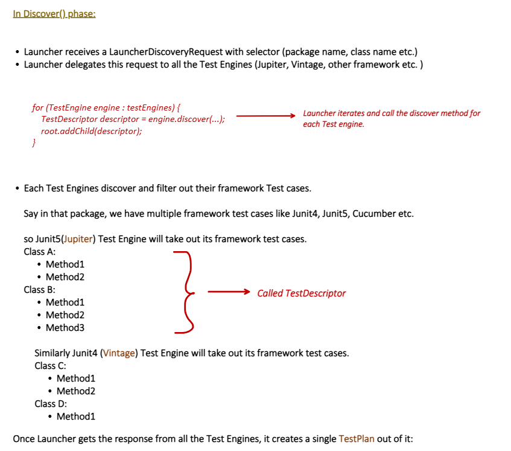

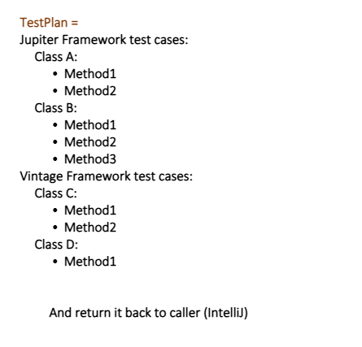


Perfect! These two images show exactly **how the Discover() phase works end to end**. Let me explain every detail.

---

### The Discover() Phase — full flow

---

### Step 1 — Launcher receives `LauncherDiscoveryRequest`

```java
// IntelliJ built this and passed it to Launcher:
LauncherDiscoveryRequest request = LauncherDiscoveryRequestBuilder
    .request()
    .selectors(
        selectPackage("com.example"),     // scan this package
        selectClass(OrderServiceTest.class) // or specific class
    )
    .build();

// Now Launcher starts coordinating
TestPlan testPlan = launcher.discover(request);
```

---

### Step 2 — Launcher iterates ALL registered engines

Exactly as shown in the diagram:

```java
// Inside Launcher.discover() — simplified:
EngineDescriptor root = new EngineDescriptor();

for (TestEngine engine : testEngines) {  // all registered engines

    // Call EACH engine's discover method
    TestDescriptor descriptor = engine.discover(...);

    // Add what each engine found to root
    root.addChild(descriptor);
}
```

```
testEngines = [
    JupiterTestEngine,   // handles JUnit5 @Test
    VintageTestEngine,   // handles JUnit3/4 @Test
    CucumberEngine,      // handles Cucumber scenarios
    ... any other engine
]

Launcher calls each one → "hey, what tests did YOU find?"
```

---

### Step 3 — Each engine discovers ITS OWN tests

This is the key — each engine only picks up tests it understands:

#### Jupiter Engine scans and finds JUnit 5 tests:

```java
class JupiterTestEngine implements TestEngine {

    @Override
    public TestDescriptor discover(EngineDiscoveryRequest request, UniqueId id) {

        // Scans for classes with JUnit5 annotations ONLY
        // Finds @Test, @ParameterizedTest, @Nested etc.

        // Returns this structure — called TestDescriptor:
        // ┌─────────────────────────┐
        // │  Class A                │
        // │    ├── Method1 (@Test)  │
        // │    └── Method2 (@Test)  │
        // │  Class B                │
        // │    ├── Method1 (@Test)  │
        // │    ├── Method2 (@Test)  │
        // │    └── Method3 (@Test)  │
        // └─────────────────────────┘
    }
}
```

#### Vintage Engine scans and finds JUnit 3/4 tests:

```java
class VintageTestEngine implements TestEngine {

    @Override
    public TestDescriptor discover(EngineDiscoveryRequest request, UniqueId id) {

        // Scans for classes with OLD JUnit4 annotations
        // Finds org.junit.Test (not org.junit.jupiter.api.Test)
        // Also finds classes extending TestCase (JUnit3)

        // Returns this structure — its own TestDescriptor:
        // ┌─────────────────────────┐
        // │  Class C                │
        // │    ├── Method1          │
        // │    └── Method2          │
        // │  Class D                │
        // │    └── Method1          │
        // └─────────────────────────┘
    }
}
```

#### Important — engines FILTER their own tests:

```java
// In the same package you might have:
class OrderServiceTest {
    @org.junit.jupiter.api.Test  // JUnit 5 → Jupiter picks this
    void shouldCalculateTotal() {}
}

class OldOrderTest {
    @org.junit.Test              // JUnit 4 → Vintage picks this
    public void testCalculate() {}
}

@CucumberOptions(...)
class CucumberTest {             // Cucumber → Cucumber engine picks this
}

// Each engine ONLY picks what it knows — ignores the rest!
```

---

### What is `TestDescriptor`?

`TestDescriptor` is the **tree structure** returned by each engine — it describes everything that engine found:

```java
// TestDescriptor is a tree node — can have children
interface TestDescriptor {

    String getDisplayName();        // "OrderServiceTest"
    UniqueId getUniqueId();         // "[engine:junit-jupiter]/[class:OrderServiceTest]"
    Set<? extends TestDescriptor> getChildren();  // methods inside class
    Optional<TestDescriptor> getParent();         // class this method belongs to
    boolean isTest();               // is this a test method? (leaf node)
    boolean isContainer();          // is this a class? (has children)
    Set<TestTag> getTags();         // @Tag annotations
    TestSource getSource();         // file + line number
}

// Tree structure for Jupiter's TestDescriptor:
JupiterEngineDescriptor (root)
    ├── ClassTestDescriptor → "Class A"
    │       ├── MethodTestDescriptor → "Method1"
    │       └── MethodTestDescriptor → "Method2"
    └── ClassTestDescriptor → "Class B"
            ├── MethodTestDescriptor → "Method1"
            ├── MethodTestDescriptor → "Method2"
            └── MethodTestDescriptor → "Method3"
```

---

### Step 4 — Launcher combines everything into ONE `TestPlan`

Once ALL engines respond with their `TestDescriptor`, Launcher merges them:

```java
// Launcher builds the final TestPlan:
TestPlan testPlan = TestPlan.from(engineDescriptors);

// Result — as shown in image 2:
TestPlan
├── Jupiter Framework test cases
│       ├── Class A
│       │     ├── Method1
│       │     └── Method2
│       └── Class B
│             ├── Method1
│             ├── Method2
│             └── Method3
│
└── Vintage Framework test cases
        ├── Class C
        │     ├── Method1
        │     └── Method2
        └── Class D
              └── Method1
```

---

### Step 5 — TestPlan returned to IntelliJ

```java
// Back in IntelliJ's JUnit5IdeaTestRunner:
TestPlan testPlan = launcher.discover(request);
// ↑ This now contains EVERYTHING from ALL engines

// IntelliJ reads the TestPlan and builds the sidebar:
// ✅ shows all test classes
// ✅ shows all test methods
// ✅ shows correct count "8 tests found"
// ✅ shows @Disabled tests greyed out
// ALL BEFORE running a single test!
```

This is why IntelliJ can show you **"8 tests"** in the gutter before you run anything — it already called `discover()`.

---

### Complete Discover() phase — visual flow

```
IntelliJ
    │
    │  launcher.discover(request)
    ▼
┌─────────────────────────────────────────┐
│           Launcher                      │
│                                         │
│  for (engine : testEngines) {           │
│      descriptor = engine.discover()     │
│      root.addChild(descriptor)          │
│  }                                      │
└─────────────────────────────────────────┘
        │               │              │
        ▼               ▼              ▼
  Jupiter           Vintage        Cucumber
  engine            engine         engine
  discovers         discovers      discovers
  JUnit5 tests      JUnit4 tests   Scenarios
        │               │              │
        ▼               ▼              ▼
  TestDescriptor    TestDescriptor  TestDescriptor
  [Class A          [Class C        [Scenario1
    Method1           Method1         Step1
    Method2           Method2         Step2]
   Class B           Class D]
    Method1
    Method2
    Method3]
        │               │              │
        └───────────────┴──────────────┘
                        │
                        ▼
              Combined TestPlan
              (returned to IntelliJ)
```

---

### Summary of key objects

| Object | Who creates it | What it contains |
|---|---|---|
| `LauncherDiscoveryRequest` | IntelliJ / Maven / Gradle | Selectors — what to scan |
| `EngineDiscoveryRequest` | Launcher | Per-engine version of discovery request |
| `TestDescriptor` | Each engine | Tree of tests ONE engine found |
| `TestPlan` | Launcher | Combined tree from ALL engines |

---

### Bottom line

> Discover phase = **Launcher asks every engine "what tests did you find?"**
>
> Each engine returns a **`TestDescriptor`** — a tree of its own tests only
>
> Launcher merges all `TestDescriptor`s into one **`TestPlan`**
>
> `TestPlan` goes back to IntelliJ — which uses it to **draw the test sidebar** and then later **drive the execute phase**


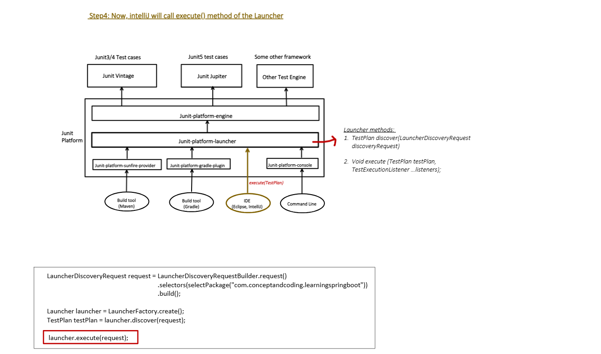


Perfect! This is **Step 4** — the Execute phase. Let me explain everything in complete detail.

---

### The complete code shown in the diagram

```java
// Step 1: Build the discovery request
LauncherDiscoveryRequest request = LauncherDiscoveryRequestBuilder
    .request()
    .selectors(selectPackage("com.conceptandcoding.learningspringboot"))
    .build();

// Step 2: Create the Launcher
Launcher launcher = LauncherFactory.create();

// Step 3: DISCOVER — find all tests
TestPlan testPlan = launcher.discover(request);

// Step 4: EXECUTE — run all tests  ← THIS is what this diagram focuses on
launcher.execute(request);   // highlighted in red box
```

---

### Wait — why is `execute()` passing `request` not `testPlan`?

Look carefully at the diagram — it shows:

```java
launcher.execute(request);   // passing request
```

But the Launcher method signature is:

```java
void execute(TestPlan testPlan, TestExecutionListener... listeners);
```

This is because **internally JUnit has an overloaded version** that accepts the request directly and does discover + execute together:

```java
// Overload 1 — you do discover separately first
TestPlan testPlan = launcher.discover(request);
launcher.execute(testPlan, listeners);

// Overload 2 — launcher does discover internally for you
launcher.execute(request, listeners);
// internally does: testPlan = discover(request) → then execute(testPlan)
```

Both achieve the same result — the diagram is showing the shorthand version.

---

### What happens inside `execute()`

```java
// Inside Launcher.execute() — simplified:
public void execute(TestPlan testPlan,
                    TestExecutionListener... listeners) {

    // Notify listeners: execution is STARTING
    listeners.forEach(l -> l.testPlanExecutionStarted(testPlan));

    // Iterate each engine
    for (TestEngine engine : testEngines) {

        // Get THIS engine's portion of the TestPlan
        TestDescriptor engineDescriptor =
            testPlan.getDescriptorFor(engine);

        // Build execution request for this engine
        ExecutionRequest executionRequest = new ExecutionRequest(
            engineDescriptor,
            new EngineExecutionListener(listeners)
        );

        // Tell engine to EXECUTE its own tests
        engine.execute(executionRequest);
        //     ↑
        //  Jupiter runs @Test methods
        //  Vintage runs JUnit4 methods
        //  Each engine handles its own execution
    }

    // Notify listeners: execution is FINISHED
    listeners.forEach(l -> l.testPlanExecutionFinished(testPlan));
}
```

---

### The `TestExecutionListener` — how IntelliJ gets real-time updates

This is the second parameter of `execute()` — IntelliJ passes its own listener:

```java
// What IntelliJ passes as listener:
launcher.execute(testPlan,
    new TestExecutionListener() {

        @Override
        public void testPlanExecutionStarted(TestPlan plan) {
            // IntelliJ: initialise progress bar
            // "Running 8 tests..."
        }

        @Override
        public void executionStarted(TestIdentifier testId) {
            if (testId.isTest()) {
                // IntelliJ: show yellow spinner ⏳ next to test
            }
        }

        @Override
        public void executionFinished(TestIdentifier testId,
                                      TestExecutionResult result) {
            switch (result.getStatus()) {
                case SUCCESSFUL:
                    // IntelliJ: show GREEN ✅
                    break;
                case FAILED:
                    // IntelliJ: show RED ❌ + show error message
                    result.getThrowable().ifPresent(
                        e -> showErrorInIDE(e)
                    );
                    break;
                case ABORTED:
                    // IntelliJ: show YELLOW ⚠️ (assumption failed)
                    break;
            }
        }

        @Override
        public void executionSkipped(TestIdentifier testId, String reason) {
            // IntelliJ: show GREY ⏭️ (@Disabled test)
            // reason = value from @Disabled("reason here")
        }

        @Override
        public void testPlanExecutionFinished(TestPlan plan) {
            // IntelliJ: show final summary
            // "Tests passed: 7, failed: 1, skipped: 0"
        }
    }
);
```

---

### How Jupiter engine executes YOUR test method

When `engine.execute()` is called on Jupiter, here's what it does for each `@Test` method:

```java
// Inside JupiterTestEngine.execute() — simplified:
public void execute(ExecutionRequest request) {

    TestDescriptor engineDescriptor = request.getRootTestDescriptor();

    // For each test class:
    for (TestDescriptor classDescriptor : engineDescriptor.getChildren()) {

        Object testInstance = instantiateTestClass(classDescriptor);
        // = new OrderServiceTest()

        // For each test method in the class:
        for (TestDescriptor methodDescriptor : classDescriptor.getChildren()) {

            // 1. Call @BeforeEach
            invokeBeforeEachMethods(testInstance);

            try {
                // 2. Run the actual @Test method
                invokeTestMethod(testInstance, methodDescriptor);

                // 3. Notify listener: PASSED ✅
                listener.executionFinished(
                    methodDescriptor,
                    TestExecutionResult.successful()
                );

            } catch (AssertionError | Exception e) {

                // 3. Notify listener: FAILED ❌
                listener.executionFinished(
                    methodDescriptor,
                    TestExecutionResult.failed(e)
                );

            } finally {
                // 4. Always call @AfterEach
                invokeAfterEachMethods(testInstance);
            }
        }
    }
}
```

---

### Full end-to-end picture — all 4 steps together

```
STEP 1: Build request
────────────────────────────────────────────
LauncherDiscoveryRequest
  └── selector: package "com.conceptandcoding"


STEP 2: Create Launcher
────────────────────────────────────────────
Launcher launcher = LauncherFactory.create()
  └── auto-loads: JupiterEngine, VintageEngine, ...


STEP 3: launcher.discover(request)
────────────────────────────────────────────
Launcher asks each engine:
  ├── Jupiter  → finds ClassA(M1,M2), ClassB(M1,M2,M3)
  └── Vintage  → finds ClassC(M1,M2), ClassD(M1)

Returns TestPlan:
  ├── Jupiter: ClassA, ClassB
  └── Vintage: ClassC, ClassD

IntelliJ sidebar now shows all 8 tests ✅


STEP 4: launcher.execute(testPlan, listener)
────────────────────────────────────────────
Launcher routes to each engine:

Jupiter.execute()
  ├── ClassA.Method1 → @BeforeEach → run → @AfterEach → ✅ listener fired
  ├── ClassA.Method2 → @BeforeEach → run → @AfterEach → ✅ listener fired
  ├── ClassB.Method1 → @BeforeEach → run → @AfterEach → ✅ listener fired
  ├── ClassB.Method2 → @BeforeEach → run → @AfterEach → ❌ listener fired
  └── ClassB.Method3 → @BeforeEach → run → @AfterEach → ✅ listener fired

Vintage.execute()
  ├── ClassC.Method1 → setUp → run → tearDown → ✅ listener fired
  ├── ClassC.Method2 → setUp → run → tearDown → ✅ listener fired
  └── ClassD.Method1 → setUp → run → tearDown → ✅ listener fired

IntelliJ UI:
  "Tests passed: 7 ✅  Failed: 1 ❌"
```

---

### Summary — Discover vs Execute

| | `discover()` | `execute()` |
|---|---|---|
| Input | `LauncherDiscoveryRequest` | `TestPlan` + `listeners` |
| Output | `TestPlan` | void |
| What engines return | `TestDescriptor` (tree of tests found) | nothing (fires listener callbacks) |
| IntelliJ result | Sidebar tree populated | Green/red results shown |
| When | Before running | When you click ▶ Run |
| Can run without other? | Yes — just shows tests | No — needs TestPlan from discover |

---

### Bottom line

> **Step 4 = execute phase** — IntelliJ calls `launcher.execute()` with the `TestPlan` it got from discover
>
> Launcher **routes each engine's tests** back to that engine for execution
>
> Each engine runs its own tests and **fires `TestExecutionListener` callbacks** for every result
>
> IntelliJ listens to those callbacks and **updates the UI in real time** — green ticks, red crosses, error messages, final summary — all driven by the listener pattern

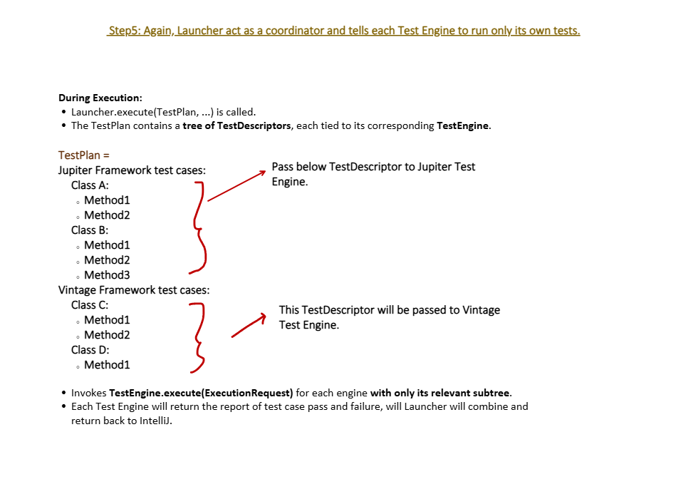


Perfect! This is **Step 5** — the most detailed part of the execute phase. Let me break it all down clearly.

---

### The Core Idea of Step 5

Launcher doesn't run tests itself — it **splits the TestPlan** and gives each engine **only its own portion** to execute.

```
TestPlan (combined)
    │
    ├── Jupiter's tests  ──→  given ONLY to JupiterEngine
    └── Vintage's tests  ──→  given ONLY to VintageEngine
```

---

### How Launcher splits and routes — internally

```java
// Inside Launcher.execute() — simplified:
public void execute(TestPlan testPlan,
                    TestExecutionListener... listeners) {

    // Notify: execution starting
    listeners.forEach(l -> l.testPlanExecutionStarted(testPlan));

    for (TestEngine engine : testEngines) {

        // Get ONLY this engine's subtree from the TestPlan
        // Jupiter gets Jupiter's TestDescriptor only
        // Vintage gets Vintage's TestDescriptor only
        TestDescriptor engineSubtree =
            testPlan.getDescriptorFor(engine);
        //          ↑
        // Jupiter  → [ClassA(M1,M2), ClassB(M1,M2,M3)]
        // Vintage  → [ClassC(M1,M2), ClassD(M1)]

        // Build execution request with ONLY this engine's subtree
        ExecutionRequest executionRequest = new ExecutionRequest(
            engineSubtree,          // only relevant tests
            engineExecutionListener // listener for callbacks
        );

        // Tell THIS engine to run ITS tests only
        engine.execute(executionRequest);
    }

    // Notify: execution finished
    listeners.forEach(l -> l.testPlanExecutionFinished(testPlan));
}
```

---

### Jupiter engine receives its subtree and executes

```java
// ExecutionRequest passed to Jupiter contains ONLY:
// ClassA → Method1, Method2
// ClassB → Method1, Method2, Method3

class JupiterTestEngine implements TestEngine {

    @Override
    public void execute(ExecutionRequest request) {

        TestDescriptor jupiterSubtree = request.getRootTestDescriptor();
        EngineExecutionListener listener = request.getEngineExecutionListener();

        // Notify: Jupiter engine starting
        listener.executionStarted(jupiterSubtree);

        // Run each class
        for (TestDescriptor classDesc : jupiterSubtree.getChildren()) {

            listener.executionStarted(classDesc); // ClassA starting

            // Instantiate test class
            Object testInstance = classDesc.getTestClass()
                                           .getDeclaredConstructor()
                                           .newInstance();
            // = new ClassA()  or  new ClassB()

            // Run each method
            for (TestDescriptor methodDesc : classDesc.getChildren()) {

                listener.executionStarted(methodDesc); // Method1 starting

                try {
                    invokeBeforeEachMethods(testInstance); // @BeforeEach
                    invokeTestMethod(testInstance, methodDesc); // @Test
                    invokeAfterEachMethods(testInstance); // @AfterEach

                    // Report PASS
                    listener.executionFinished(
                        methodDesc,
                        TestExecutionResult.successful() // ✅
                    );

                } catch (AssertionError e) {
                    // Report FAIL — assertion went wrong
                    listener.executionFinished(
                        methodDesc,
                        TestExecutionResult.failed(e) // ❌
                    );

                } catch (Exception e) {
                    // Report FAIL — unexpected exception
                    listener.executionFinished(
                        methodDesc,
                        TestExecutionResult.failed(e) // ❌
                    );
                }
            }

            listener.executionFinished(classDesc,
                TestExecutionResult.successful());
        }

        listener.executionFinished(jupiterSubtree,
            TestExecutionResult.successful());
    }
}
```

---

### Vintage engine receives ITS subtree and executes

```java
// ExecutionRequest passed to Vintage contains ONLY:
// ClassC → Method1, Method2
// ClassD → Method1

class VintageTestEngine implements TestEngine {

    @Override
    public void execute(ExecutionRequest request) {

        // Vintage uses JUnit4's old Runner mechanism internally
        // It wraps the old @RunWith, @Rule, @Before/@After etc.

        for (TestDescriptor classDesc : request.getRootTestDescriptor()
                                               .getChildren()) {

            // Uses JUnit4's BlockJUnit4ClassRunner internally
            Runner runner = Request.aClass(classDesc.getTestClass())
                                   .getRunner();

            // Adapts JUnit4 results → JUnit5 listener callbacks
            runner.run(new RunNotifierAdapter(request.getListener()));
            //          ↑
            // Vintage bridges old JUnit4 RunNotifier
            // to new JUnit5 EngineExecutionListener
        }
    }
}
```

This is the beauty of Vintage — it **wraps** JUnit4's old mechanism and translates results into JUnit5's listener format.

---

### Each engine reports back — listener callback chain

```
Jupiter runs ClassA.Method1
    │
    ├── executionStarted(Method1)        → IntelliJ: ⏳ spinning
    ├── [test runs]
    └── executionFinished(Method1, PASS) → IntelliJ: ✅ green

Jupiter runs ClassB.Method2
    │
    ├── executionStarted(Method2)        → IntelliJ: ⏳ spinning
    ├── [test runs — assertion fails]
    └── executionFinished(Method2, FAIL) → IntelliJ: ❌ red
                                         → IntelliJ: shows stack trace

Vintage runs ClassC.Method1
    │
    ├── executionStarted(Method1)        → IntelliJ: ⏳ spinning
    ├── [test runs]
    └── executionFinished(Method1, PASS) → IntelliJ: ✅ green
```

---

### Launcher combines ALL results and returns to IntelliJ

```java
// After all engines finish:
// Launcher has collected from ALL listeners:

ExecutionResults combined = {
    Jupiter results:
        ClassA.Method1 → PASSED  ✅
        ClassA.Method2 → PASSED  ✅
        ClassB.Method1 → PASSED  ✅
        ClassB.Method2 → FAILED  ❌  "Expected 500 but was 450"
        ClassB.Method3 → PASSED  ✅

    Vintage results:
        ClassC.Method1 → PASSED  ✅
        ClassC.Method2 → PASSED  ✅
        ClassD.Method1 → PASSED  ✅
}

// Launcher fires final callback:
listeners.forEach(l -> l.testPlanExecutionFinished(testPlan));

// IntelliJ shows final summary:
// "8 tests: 7 passed ✅, 1 failed ❌"
```

---

### Complete all 5 steps — the full journey

```
STEP 1: IntelliJ builds LauncherDiscoveryRequest
         └── selector: package "com.conceptandcoding"

STEP 2: IntelliJ calls launcher.discover(request)
         └── Launcher calls TestEngine.discover() on each engine
               ├── Jupiter finds: ClassA, ClassB
               └── Vintage finds: ClassC, ClassD
         └── Returns combined TestPlan to IntelliJ
               (sidebar now shows all 8 tests)

STEP 3: TestEngine SPI — each engine implements discover()
         └── Jupiter scans for @Test (JUnit5)
         └── Vintage scans for @Test (JUnit4)
         └── Each returns TestDescriptor (its own subtree)

STEP 4: IntelliJ calls launcher.execute(testPlan, listener)
         └── Launcher starts coordinating execution

STEP 5: Launcher splits TestPlan → gives each engine its subtree
         ├── Jupiter gets [ClassA, ClassB] → runs them → fires callbacks
         │     ✅✅✅❌✅
         └── Vintage gets [ClassC, ClassD] → runs them → fires callbacks
               ✅✅✅
         └── Launcher combines all results
         └── Returns final report to IntelliJ
               "8 tests: 7 ✅ 1 ❌"
```

---

### Why this design is powerful

```java
// Each engine is COMPLETELY INDEPENDENT:

// Jupiter doesn't know Vintage exists
// Vintage doesn't know Jupiter exists
// Neither knows about Cucumber or any other engine

// Launcher is the ONLY coordinator — clean separation!

// This means:
// ✅ Add new engine → zero changes to existing engines
// ✅ Remove Vintage → Jupiter unaffected
// ✅ Each engine evolves independently
// ✅ Engines can run in parallel (future possibility)
```

---

### Summary table — what each piece does in Step 5

| Component | Role in Execute phase |
|---|---|
| `Launcher` | Splits TestPlan, routes each subtree to correct engine |
| `ExecutionRequest` | Carries one engine's subtree + listener |
| `TestEngine.execute()` | Runs its own tests, fires listener per result |
| `EngineExecutionListener` | Receives pass/fail callbacks from engine |
| `TestExecutionResult` | Wraps outcome: `SUCCESSFUL`, `FAILED`, `ABORTED` |
| `TestExecutionListener` | IntelliJ's listener — updates UI in real time |

---

### Bottom line

> Step 5 = Launcher takes the combined `TestPlan`, **splits it by engine**, and calls `engine.execute()` with **only that engine's relevant subtree**
>
> Each engine runs its own tests completely independently and reports results via **listener callbacks**
>
> Launcher **combines all results** from all engines and sends the final report back to IntelliJ
>
> This is why JUnit 5 is a true **platform** — any number of engines can coexist, run independently, and report back through one unified listener pipeline


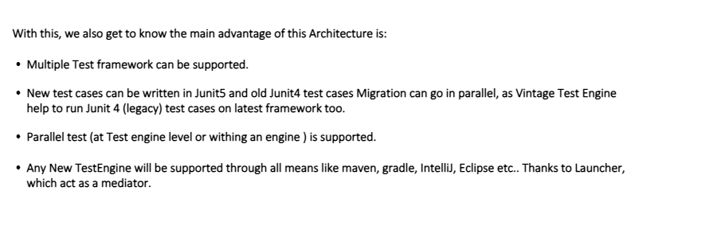


Perfect! This is the **conclusion slide** — summarizing why JUnit 5's architecture is so powerful. Let me expand each advantage with real examples.

---

### The 4 Main Advantages of JUnit 5 Architecture

---

### Advantage 1 — Multiple Test Frameworks Supported

Because any framework can implement the `TestEngine` SPI, JUnit Platform supports ALL of them simultaneously:

```java
// In the SAME project, SAME package, you can have:

// JUnit 5 test (Jupiter engine picks this up)
@Test
void shouldCalculateTotal() {
    assertThat(orderService.getTotal()).isEqualTo(500.0);
}

// JUnit 4 test (Vintage engine picks this up)
@org.junit.Test
public void testCalculateTotal() {
    assertEquals(500.0, orderService.getTotal(), 0);
}

// Cucumber test (Cucumber engine picks this up)
@CucumberOptions(features = "src/test/resources/features")
@Suite
public class CucumberRunner {}

// All 3 run together with ONE command:
// mvn test   OR   click ▶ in IntelliJ
```

```
Single TestPlan contains:
├── Jupiter tests    (JUnit5)
├── Vintage tests    (JUnit4)
├── Cucumber tests   (BDD)
└── TestNG tests     (if engine added)

All discovered and run by ONE Launcher ✅
```

---

### Advantage 2 — JUnit4 → JUnit5 Migration can go in PARALLEL

This is huge for large enterprise projects. You don't have to migrate everything at once:

```
Without JUnit 5 architecture:
────────────────────────────────────────────
Week 1:  migrate ALL tests     → huge risk!
         if something breaks   → nothing runs
         team blocked          → can't ship


With JUnit 5 architecture (Vintage engine):
────────────────────────────────────────────
Week 1:  add JUnit5 dependency
         old JUnit4 tests      → still run via Vintage  ✅
         new tests             → write in JUnit5        ✅

Week 2:  migrate Class A       → JUnit5  ✅
         rest still JUnit4     → Vintage runs them      ✅

Week 3:  migrate Class B, C    → JUnit5  ✅
         rest still JUnit4     → Vintage runs them      ✅

Week N:  all migrated          → remove Vintage dep     ✅
         zero disruption throughout!
```

```java
// pom.xml during migration period:
<dependency>
    <groupId>org.junit.vintage</groupId>
    <artifactId>junit-vintage-engine</artifactId>
    <scope>test</scope>
    <!-- Keep this until ALL JUnit4 tests are migrated -->
    <!-- Remove it when migration is 100% complete -->
</dependency>
```

Real example — both coexist perfectly:

```java
// OLD test — not migrated yet (Vintage runs this)
public class OldPaymentServiceTest {
    @org.junit.Before
    public void setUp() { ... }

    @org.junit.Test
    public void testPayment() {
        assertEquals("SUCCESS", service.pay(1000));
    }
}

// NEW test — already migrated (Jupiter runs this)
class NewPaymentServiceTest {
    @BeforeEach
    void setUp() { ... }

    @Test
    void shouldProcessPayment() {
        assertThat(service.pay(1000)).isEqualTo("SUCCESS");
    }
}
// Both run together — no conflicts! ✅
```

---

### Advantage 3 — Parallel Test Execution Supported

JUnit 5 supports parallelism at **two levels**:

#### Level 1 — Parallel across engines
```
Launcher
    ├── Thread 1: JupiterEngine runs its tests  ──┐
    ├── Thread 2: VintageEngine runs its tests  ──┤ → simultaneously!
    └── Thread 3: CucumberEngine runs its tests ──┘
```

#### Level 2 — Parallel within an engine
```java
// junit-platform.properties
junit.jupiter.execution.parallel.enabled = true
junit.jupiter.execution.parallel.mode.default = concurrent

// Now Jupiter runs YOUR tests in parallel:
@Test void test1() { ... }  // Thread 1
@Test void test2() { ... }  // Thread 2
@Test void test3() { ... }  // Thread 3
// All run at the same time!
```

```java
// Fine-grained control per class:
@Execution(ExecutionMode.CONCURRENT)  // this class runs in parallel
class OrderServiceTest {
    @Test void test1() { ... }
    @Test void test2() { ... }
    @Test void test3() { ... }
}

@Execution(ExecutionMode.SAME_THREAD)  // this class runs sequentially
class DatabaseTest {
    // DB tests — need sequential execution to avoid conflicts
    @Test void test1() { ... }
    @Test void test2() { ... }
}
```

Impact on build time:

```
Sequential (old JUnit4):
test1 (2s) → test2 (2s) → test3 (2s) → total: 6s

Parallel (JUnit5):
test1 (2s) ──┐
test2 (2s) ──┤ → total: 2s  (3x faster!)
test3 (2s) ──┘
```

---

### Advantage 4 — Any New Engine works everywhere automatically

This is the **Launcher as mediator** power. When a new test engine is created:

```java
// Some new company creates "SpockEngine" for Groovy tests
public class SpockEngine implements TestEngine {

    @Override
    public String getId() { return "spock"; }

    @Override
    public TestDescriptor discover(EngineDiscoveryRequest request,
                                   UniqueId id) {
        // Find Spock specifications
    }

    @Override
    public void execute(ExecutionRequest request) {
        // Run Spock specifications
    }
}

// Register in META-INF/services:
// org.junit.platform.engine.TestEngine=com.spock.SpockEngine
```

Now **without changing anything else**, it works everywhere:

```
Maven      → mvn test          → SpockEngine runs ✅
Gradle     → gradle test       → SpockEngine runs ✅
IntelliJ   → click ▶           → SpockEngine runs ✅
Eclipse    → Run As JUnit Test  → SpockEngine runs ✅
CLI        → java -jar ...      → SpockEngine runs ✅
CI/CD      → pipeline runs      → SpockEngine runs ✅
```

Because Launcher is the **single mediator** between tools and engines:

```
WITHOUT Launcher (old world):
─────────────────────────────────────────────────
New engine → must integrate with Maven  separately
          → must integrate with Gradle  separately
          → must integrate with IntelliJ separately
          → must integrate with Eclipse separately
          = 4 integrations per engine = nightmare!


WITH Launcher (JUnit 5):
─────────────────────────────────────────────────
New engine → implements TestEngine SPI
           → registered in META-INF/services
           = works everywhere automatically! ✅
           = 1 integration for ALL tools!
```

---

### Architecture advantages — complete summary

```
JUnit 5 Platform Architecture
            │
            ├── 1. MULTI-FRAMEWORK
            │       Any TestEngine can plug in
            │       Jupiter + Vintage + Cucumber + TestNG
            │       all coexist in same project
            │
            ├── 2. GRADUAL MIGRATION
            │       Vintage bridges JUnit3/4 → JUnit5
            │       Migrate class by class, no big bang
            │       Old and new tests run side by side
            │
            ├── 3. PARALLEL EXECUTION
            │       Engine level parallelism
            │       Method level parallelism
            │       Configurable per class/method
            │       Massive build time reduction
            │
            └── 4. UNIVERSAL TOOL SUPPORT
                    Launcher = single mediator
                    One SPI → works in Maven, Gradle,
                    IntelliJ, Eclipse, CLI, CI/CD
                    New engines get all tools for free
```

---

### Bottom line

> JUnit 5's architecture is brilliant because **Launcher acts as a universal mediator** between tools (Maven, Gradle, IntelliJ) and engines (Jupiter, Vintage, Cucumber)
>
> This gives you: **plug any framework in**, **migrate gradually**, **run tests faster in parallel**, and **any new engine works everywhere for free**
>
> The `TestEngine` SPI is the key — it's the contract that makes the entire ecosystem open, extensible, and future-proof