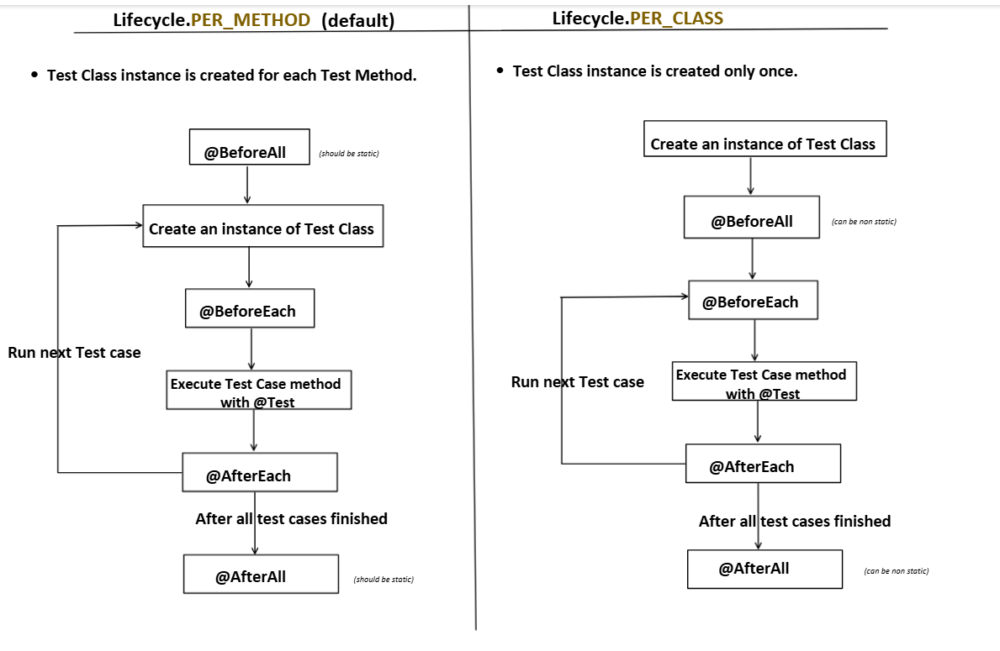
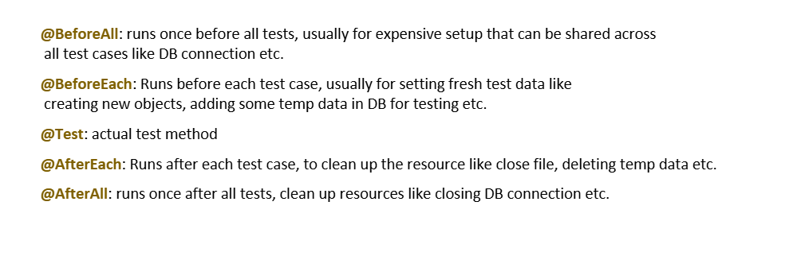
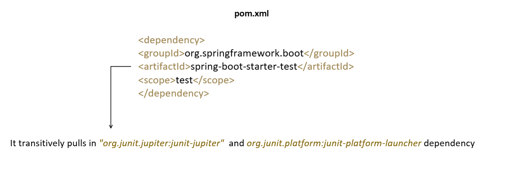
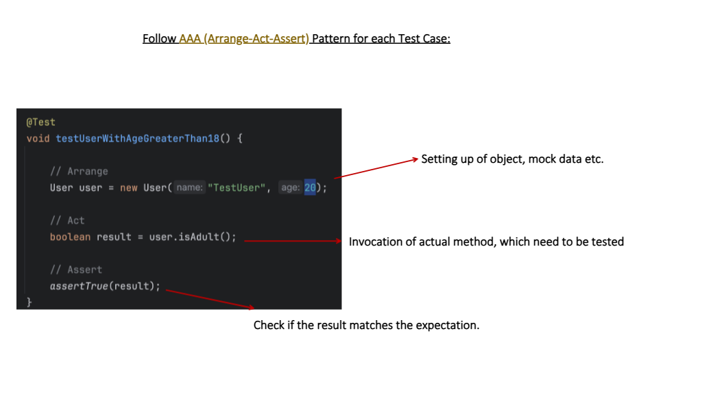

# Lifecycle of TC





Great diagram! This explains one of the most important but often misunderstood concepts in JUnit 5 — **Test Instance Lifecycle**.

---

### The Core Question

> How many times is your test class instantiated when tests run?

JUnit 5 gives you two choices.

---

### Lifecycle.PER_METHOD (default)

**A brand new instance of the test class is created before EVERY test method.**

```java
@TestInstance(TestInstance.Lifecycle.PER_METHOD) // default — don't need to write this
class OrderServiceTest {

    int counter = 0; // instance variable

    @BeforeAll
    static void initAll() {
        // MUST be static — no instance exists yet when this runs!
        System.out.println("BeforeAll — runs ONCE");
    }

    @BeforeEach
    void init() {
        System.out.println("BeforeEach — new instance created");
    }

    @Test
    void test1() {
        counter++;
        System.out.println("test1 — counter = " + counter); // always 1
    }

    @Test
    void test2() {
        counter++;
        System.out.println("test2 — counter = " + counter); // always 1
    }

    @AfterEach
    void cleanup() {
        System.out.println("AfterEach");
    }

    @AfterAll
    static void cleanupAll() {
        // MUST be static — no instance exists at this point!
        System.out.println("AfterAll — runs ONCE");
    }
}
```

Execution flow:

```
@BeforeAll (static)          ← runs once, no instance yet

  new OrderServiceTest()     ← instance #1 created
  @BeforeEach
  test1() → counter = 1      ← fresh counter every time
  @AfterEach

  new OrderServiceTest()     ← instance #2 created (brand new!)
  @BeforeEach
  test2() → counter = 1      ← starts from 0 again!
  @AfterEach

@AfterAll (static)           ← runs once, instance gone
```

Key point — `counter` is **always 1** because each test gets a **fresh object** with `counter = 0`.

---

### Lifecycle.PER_CLASS

**One single instance is created for the entire test class — all methods share it.**

```java
@TestInstance(TestInstance.Lifecycle.PER_CLASS) // must declare this
class OrderServiceTest {

    int counter = 0; // shared instance variable

    @BeforeAll
    void initAll() {
        // CAN be non-static! Instance already exists
        System.out.println("BeforeAll — instance exists here!");
    }

    @BeforeEach
    void init() {
        System.out.println("BeforeEach");
    }

    @Test
    void test1() {
        counter++;
        System.out.println("test1 — counter = " + counter); // 1
    }

    @Test
    void test2() {
        counter++;
        System.out.println("test2 — counter = " + counter); // 2 !!
    }

    @AfterEach
    void cleanup() {
        System.out.println("AfterEach");
    }

    @AfterAll
    void cleanupAll() {
        // CAN be non-static! Instance still alive
        System.out.println("AfterAll — counter final = " + counter); // 2
    }
}
```

Execution flow:

```
new OrderServiceTest()       ← instance created ONCE

@BeforeAll (non-static ok!)  ← same instance

  @BeforeEach
  test1() → counter = 1      ← counter increments
  @AfterEach

  @BeforeEach
  test2() → counter = 2      ← counter keeps incrementing!
  @AfterEach

@AfterAll (non-static ok!)   ← same instance, counter = 2
```

---

### The biggest difference — `@BeforeAll` and `@AfterAll`

This is where it really matters:

```java
// ── PER_METHOD (default) ──
// @BeforeAll MUST be static
// Because NO instance exists when it runs

@BeforeAll
static void setup() {
    // can't use 'this' here — no instance!
    // can't access instance variables
    System.out.println("Setting up...");
}


// ── PER_CLASS ──
// @BeforeAll CAN be non-static
// Because the single instance already exists

@BeforeAll
void setup() {
    // 'this' works perfectly here!
    // can access instance variables
    this.dbConnection = createConnection(); // works! ✅
}
```

---

### Real world use cases

#### Use PER_METHOD (default) when:
```java
// Each test should be completely ISOLATED
// No shared state between tests
@TestInstance(Lifecycle.PER_METHOD)
class UserServiceTest {

    @Mock
    UserRepository userRepository;

    @InjectMocks
    UserService userService;

    // Fresh mocks for every test — perfect isolation ✅
    @Test void test1() { ... }
    @Test void test2() { ... }
}
```

#### Use PER_CLASS when:
```java
// Expensive setup that should happen only ONCE
// e.g., DB connection, server startup, file loading

@TestInstance(Lifecycle.PER_CLASS)
class DatabaseIntegrationTest {

    DatabaseConnection connection; // shared across all tests

    @BeforeAll
    void startDatabase() {
        // Expensive — only do once!
        connection = DatabaseConnection.create("jdbc:h2:mem:test");
        connection.runMigrations();
        System.out.println("DB started once ✅");
    }

    @BeforeEach
    void cleanData() {
        // Clean data before each test — but keep connection alive
        connection.execute("DELETE FROM orders");
    }

    @Test
    void test1() {
        // uses same connection
        connection.save(new Order("Laptop"));
        assertThat(connection.count("orders")).isEqualTo(1);
    }

    @Test
    void test2() {
        // uses same connection — data cleaned by @BeforeEach
        connection.save(new Order("Phone"));
        assertThat(connection.count("orders")).isEqualTo(1);
    }

    @AfterAll
    void stopDatabase() {
        // Close connection once — non-static works here!
        connection.close();
        System.out.println("DB stopped ✅");
    }
}
```

---

### Side by side — the key differences

```
PER_METHOD                      PER_CLASS
──────────────────────────────────────────────────────
New instance per test           One instance for all tests
Instance vars reset each test   Instance vars shared
@BeforeAll MUST be static       @BeforeAll can be non-static
@AfterAll  MUST be static       @AfterAll  can be non-static
Tests fully isolated            Tests can share state
Default behavior                Must explicitly declare
Good for: unit tests            Good for: integration tests
Good for: mock-based tests      Good for: expensive setup
```

---

### Common mistake — shared state in PER_METHOD

```java
// ❌ WRONG — expecting shared state in default lifecycle
class BadTest {
    List<String> results = new ArrayList<>(); // think it accumulates

    @Test
    void test1() {
        results.add("one");
        assertThat(results).hasSize(1); // ✅ passes
    }

    @Test
    void test2() {
        results.add("two");
        assertThat(results).hasSize(2); // ❌ FAILS — size is 1!
        // new instance created — results is empty again!
    }
}

// ✅ CORRECT — use PER_CLASS if you need shared state
@TestInstance(Lifecycle.PER_CLASS)
class GoodTest {
    List<String> results = new ArrayList<>();

    @Test
    void test1() {
        results.add("one");
        assertThat(results).hasSize(1); // ✅
    }

    @Test
    void test2() {
        results.add("two");
        assertThat(results).hasSize(2); // ✅ — same instance!
    }
}
```

---

### Summary table

| | `PER_METHOD` (default) | `PER_CLASS` |
|---|---|---|
| Instances created | One per `@Test` method | One for entire class |
| Instance variable state | Reset before each test | Shared across all tests |
| `@BeforeAll` | Must be `static` | Can be non-static |
| `@AfterAll` | Must be `static` | Can be non-static |
| Test isolation | Maximum | Shared state possible |
| Performance | More object creation | Less object creation |
| Best for | Unit tests, mock tests | Integration, expensive setup |
| Declaration | No annotation needed | `@TestInstance(PER_CLASS)` |

---

### Bottom line

> **PER_METHOD** = fresh start for every test — maximum isolation, mocks reset, no shared state — this is the safe default
>
> **PER_CLASS** = one shared instance — use when setup is expensive (DB connections, servers) or when you deliberately need shared state between tests
>
> The biggest practical difference: `@BeforeAll` and `@AfterAll` **must be static** in PER_METHOD but **can be non-static** in PER_CLASS — because in PER_CLASS the instance already exists when they run




Let me explain `@Execution` clearly.

---

### What is `@Execution`?

It's a JUnit 5 annotation that controls **how tests run** — sequentially or in parallel — at the **class or method level**.

```java
@Execution(ExecutionMode.CONCURRENT)  // run in parallel
@Execution(ExecutionMode.SAME_THREAD) // run sequentially
```

---

### Two modes

#### `ExecutionMode.CONCURRENT` — run in parallel

```java
@Execution(ExecutionMode.CONCURRENT)
class OrderServiceTest {

    @Test
    void test1() {
        Thread.sleep(1000);
        System.out.println("test1 - " + Thread.currentThread().getName());
    }

    @Test
    void test2() {
        Thread.sleep(1000);
        System.out.println("test2 - " + Thread.currentThread().getName());
    }

    @Test
    void test3() {
        Thread.sleep(1000);
        System.out.println("test3 - " + Thread.currentThread().getName());
    }
}

// Output:
// test1 - ForkJoinPool-1-worker-1   ← different threads!
// test2 - ForkJoinPool-1-worker-2   ← running simultaneously
// test3 - ForkJoinPool-1-worker-3   ← all at same time
// Total time: ~1 second (not 3!) ✅
```

#### `ExecutionMode.SAME_THREAD` — run sequentially

```java
@Execution(ExecutionMode.SAME_THREAD)
class OrderServiceTest {

    @Test
    void test1() {
        System.out.println("test1 - " + Thread.currentThread().getName());
    }

    @Test
    void test2() {
        System.out.println("test2 - " + Thread.currentThread().getName());
    }

    @Test
    void test3() {
        System.out.println("test3 - " + Thread.currentThread().getName());
    }
}

// Output:
// test1 - main   ← same thread!
// test2 - main   ← one after another
// test3 - main   ← sequential
// Total time: ~3 seconds
```

---

### IMPORTANT — prerequisite to make it work

`@Execution` alone does NOTHING without enabling parallel in properties first:

```properties
# /src/test/resources/junit-platform.properties

# This MUST be true — otherwise @Execution is ignored!
junit.jupiter.execution.parallel.enabled = true
junit.jupiter.execution.parallel.mode.default = same_thread
junit.jupiter.execution.parallel.config.strategy = dynamic
junit.jupiter.execution.parallel.config.dynamic.factor = 2
```

```
parallel.enabled = false
    └── @Execution(CONCURRENT) → IGNORED — still runs sequentially

parallel.enabled = true
    └── @Execution(CONCURRENT) → WORKS — runs in parallel ✅
```

---

### Using it at different levels

#### On the whole CLASS — all methods run in parallel

```java
@Execution(ExecutionMode.CONCURRENT)  // ← applies to ALL methods
class UserServiceTest {

    @Test void test1() { ... }  // parallel ✅
    @Test void test2() { ... }  // parallel ✅
    @Test void test3() { ... }  // parallel ✅
}
```

#### On a specific METHOD — only that method runs in parallel

```java
class MixedTest {

    @Test
    @Execution(ExecutionMode.CONCURRENT)   // this one parallel
    void fastTest() {
        // runs in its own thread ✅
    }

    @Test
    @Execution(ExecutionMode.SAME_THREAD)  // this one sequential
    void sensitiveTest() {
        // always runs on same thread 🔒
    }

    @Test  // no annotation — follows class/global default
    void normalTest() { ... }
}
```

---

### Real world use case — mix parallel and sequential

```java
// Global config: parallel enabled, default = same_thread
// (in junit-platform.properties)

@Execution(ExecutionMode.CONCURRENT)   // fast, isolated tests → parallel
class ProductServiceTest {

    @Test
    void shouldCalculatePrice() { ... }  // parallel ✅

    @Test
    void shouldApplyDiscount() { ... }   // parallel ✅

    @Test
    void shouldCheckInventory() { ... }  // parallel ✅
}


@Execution(ExecutionMode.SAME_THREAD)  // DB tests → sequential
class DatabaseTest {

    @Test
    void shouldSaveUser() { ... }    // sequential 🔒

    @Test
    void shouldDeleteUser() { ... }  // sequential 🔒
    // Can't run in parallel — would conflict in DB!
}
```

---

### Thread safety check before using CONCURRENT

```java
// ❌ NOT safe for CONCURRENT — shared mutable static state
@Execution(ExecutionMode.CONCURRENT)
class UnsafeTest {

    static int counter = 0;  // shared across threads — DANGER!

    @Test void test1() { counter++; }  // race condition ❌
    @Test void test2() { counter++; }  // race condition ❌
}


// ✅ SAFE for CONCURRENT — each test is fully independent
@Execution(ExecutionMode.CONCURRENT)
class SafeTest {

    // No shared state — each test creates its own objects
    @Test
    void test1() {
        User user = new User("Alice", 20);  // local variable
        assertThat(user.isAdult()).isTrue(); // ✅ always safe
    }

    @Test
    void test2() {
        User user = new User("Bob", 15);    // local variable
        assertThat(user.isAdult()).isFalse();// ✅ always safe
    }
}
```

---

### `@Execution` vs `junit-platform.properties` — when to use which

```
junit-platform.properties
    → sets the DEFAULT for ALL tests globally
    → one setting affects everything

@Execution annotation
    → overrides the default for SPECIFIC class or method
    → fine-grained control
    → takes priority over properties file


Example:
properties file  → mode.default = same_thread  (all tests sequential by default)
@Execution(CONCURRENT) on ClassA               → ClassA runs parallel  (override!)
@Execution(SAME_THREAD) on ClassB              → ClassB runs sequential (follows default)
no annotation on ClassC                        → ClassC runs sequential (follows default)
```

---

### Summary

| | `CONCURRENT` | `SAME_THREAD` |
|---|---|---|
| Runs on | Multiple threads | Single thread |
| Speed | Faster | Slower |
| Safe for | Stateless, isolated tests | Stateful, DB, ordered tests |
| Prerequisite | `parallel.enabled=true` | Nothing needed |
| Use when | Tests are independent | Tests share state or DB |

---

### Bottom line

> `@Execution(ExecutionMode.CONCURRENT)` tells JUnit — **"run this class or method in parallel using multiple threads"**
>
> `@Execution(ExecutionMode.SAME_THREAD)` tells JUnit — **"always run this on a single thread, one after another"**
>
> It only works when `junit.jupiter.execution.parallel.enabled=true` is set in `junit-platform.properties` — without that, the annotation is completely ignored


---

### Why PER_METHOD is preferred

---

#### Reason 1 — Test Isolation — tests run in ANY order

```java
// PER_METHOD — each test gets fresh instance
// Order doesn't matter — they never affect each other

class OrderServiceTest {

    int counter = 0;
    List<String> log = new ArrayList<>();

    @Test
    void test1() {
        counter++;
        log.add("test1");
        assertThat(counter).isEqualTo(1); // always 1 ✅
    }

    @Test
    void test2() {
        counter++;
        log.add("test2");
        assertThat(counter).isEqualTo(1); // always 1 ✅
    }

    @Test
    void test3() {
        counter++;
        log.add("test3");
        assertThat(counter).isEqualTo(1); // always 1 ✅
    }
}

// Run order 1: test1 → test2 → test3  → all pass ✅
// Run order 2: test3 → test1 → test2  → all pass ✅
// Run order 3: test2 → test3 → test1  → all pass ✅
// Order NEVER matters — fully isolated!
```

Compare with PER_CLASS — order DOES matter:

```java
// ❌ DANGER with PER_CLASS — order dependent tests!
@TestInstance(Lifecycle.PER_CLASS)
class BadOrderTest {

    int counter = 0;

    @Test
    void test1() {
        counter++;
        assertThat(counter).isEqualTo(1); // passes only if runs FIRST
    }

    @Test
    void test2() {
        counter++;
        assertThat(counter).isEqualTo(2); // passes only if runs SECOND
    }
    // If JUnit changes execution order → BOTH FAIL ❌
    // This is called "order-dependent tests" — a serious anti-pattern!
}
```

---

#### Reason 2 — Easy Debugging when a test fails

```java
// PER_METHOD — when test2 fails, you know EXACTLY why:
// Only test2's own code caused it — no other test polluted the state

class PaymentServiceTest {

    @Mock PaymentGateway gateway;   // fresh mock for EACH test
    @InjectMocks PaymentService service;

    @Test
    void test1() {
        when(gateway.charge(100)).thenReturn("SUCCESS");
        // test1 stubs gateway to return SUCCESS
        // DOES NOT affect test2 — different instance!
    }

    @Test
    void test2() {
        // gateway is a FRESH mock here — test1's stub is gone
        // If test2 fails → 100% test2's own code is the problem
        // No "was it test1 that broke something?" confusion ✅

        when(gateway.charge(500)).thenReturn("FAILED");
        assertThat(service.process(500)).isEqualTo("FAILED");
    }
}
```

With PER_CLASS — debugging becomes a nightmare:

```java
// ❌ PER_CLASS — test failure is HARD to debug
@TestInstance(Lifecycle.PER_CLASS)
class HardToDebugTest {

    List<String> sharedList = new ArrayList<>();

    @Test
    void test1() {
        sharedList.add("poison"); // pollutes shared state
    }

    @Test
    void test2() {
        // Did test2 fail because of its OWN code?
        // Or because test1 added "poison" to sharedList?
        // You don't know without checking test1 too!
        assertThat(sharedList).isEmpty(); // ❌ FAILS — but WHY?
    }
    // Debugging requires understanding ALL tests — nightmare in large suites
}
```

---

#### Reason 3 — Safe for Parallel Execution

```java
// PER_METHOD — each test has its OWN instance
// No shared state → threads never interfere with each other

@Execution(ExecutionMode.CONCURRENT) // run all tests in parallel
class SafeParallelTest {

    // Each thread gets its OWN instance of this class
    int counter = 0; // NOT shared between threads

    @Test
    void test1() {
        counter++;
        assertThat(counter).isEqualTo(1); // safe ✅
        // Thread 1 has its own counter
    }

    @Test
    void test2() {
        counter++;
        assertThat(counter).isEqualTo(1); // safe ✅
        // Thread 2 has its own counter — completely separate
    }

    @Test
    void test3() {
        counter++;
        assertThat(counter).isEqualTo(1); // safe ✅
        // Thread 3 has its own counter — no race condition
    }
}

// Timeline:
// Thread 1: [test1 - counter=1] ✅
// Thread 2:    [test2 - counter=1] ✅
// Thread 3:       [test3 - counter=1] ✅
// All independent — no race conditions!
```

With PER_CLASS + parallel — race conditions happen:

```java
// ❌ DANGEROUS — PER_CLASS + parallel execution
@TestInstance(Lifecycle.PER_CLASS)
@Execution(ExecutionMode.CONCURRENT)
class DangerousParallelTest {

    int counter = 0; // SHARED between all threads!

    @Test
    void test1() {
        counter++; // Thread 1 reads 0, writes 1
    }

    @Test
    void test2() {
        counter++; // Thread 2 reads 0, writes 1 (not 2!)
        // RACE CONDITION — both threads read same value!
    }

    // Expected: counter = 2
    // Actual:   counter = 1  (or any unpredictable value)
    // Flaky test — passes sometimes, fails sometimes ❌
}
```

---

### When to use PER_CLASS

---

#### Use case 1 — Shared state across tests (deliberately)

```java
// Ordered test scenario — each test builds on previous result
@TestInstance(Lifecycle.PER_CLASS)
@TestMethodOrder(MethodOrderer.OrderAnnotation.class)
class UserJourneyTest {

    // Shared state — intentionally passed between tests
    Long createdUserId;
    String authToken;

    @Test
    @Order(1)
    void shouldRegisterUser() {
        User user = userService.register("alice@example.com");
        createdUserId = user.getId(); // saved for next test
        assertThat(createdUserId).isNotNull();
    }

    @Test
    @Order(2)
    void shouldLoginUser() {
        // Uses createdUserId from test1
        authToken = authService.login(createdUserId, "password");
        assertThat(authToken).isNotBlank(); // saved for next test
    }

    @Test
    @Order(3)
    void shouldPlaceOrder() {
        // Uses both createdUserId and authToken
        Order order = orderService.place(
            createdUserId, authToken, new Item("Laptop")
        );
        assertThat(order.getStatus()).isEqualTo("CONFIRMED");
    }
}
// Each test intentionally depends on previous — PER_CLASS makes sense here
```

---

#### Use case 2 — Thread-safe shared resources

```java
// ✅ Thread-safe shared state with PER_CLASS
@TestInstance(Lifecycle.PER_CLASS)
class ThreadSafeIntegrationTest {

    // Thread-safe shared resource — created once, used by all tests
    // DatabaseConnectionPool is internally thread-safe
    private DatabaseConnectionPool pool;

    @BeforeAll
    void startPool() {
        // Expensive — only create once for all tests
        pool = DatabaseConnectionPool.create(
            "jdbc:h2:mem:test",
            maxConnections: 10  // pool handles thread safety internally
        );
    }

    @Test
    void test1() {
        // Gets a connection from pool — thread safe ✅
        try (Connection conn = pool.getConnection()) {
            conn.execute("INSERT INTO users VALUES (1, 'Alice')");
            assertThat(conn.count("users")).isEqualTo(1);
        }
    }

    @Test
    void test2() {
        // Gets different connection from pool — thread safe ✅
        try (Connection conn = pool.getConnection()) {
            conn.execute("INSERT INTO users VALUES (2, 'Bob')");
            assertThat(conn.count("users")).isEqualTo(1);
        }
    }

    @AfterAll
    void stopPool() {
        pool.shutdown(); // cleanup once — non-static works ✅
    }
}
```

---

### Decision guide — which one to choose?

```
Start here: Do your tests need shared state?
                │
                ├── NO  → PER_METHOD ✅ (always safe)
                │
                └── YES → Ask: Is the shared resource thread-safe?
                                │
                                ├── NO  → PER_METHOD with @BeforeEach setup
                                │         (recreate resource before each test)
                                │
                                └── YES → PER_CLASS ✅
                                          (share safely across tests)
```

---

### Quick comparison — final

| Scenario | Use |
|---|---|
| Unit tests with mocks | `PER_METHOD` ✅ |
| Tests that must run in any order | `PER_METHOD` ✅ |
| Parallel test execution | `PER_METHOD` ✅ |
| Easy debugging | `PER_METHOD` ✅ |
| Expensive DB connection (shared) | `PER_CLASS` ✅ |
| Deliberate ordered test journey | `PER_CLASS` ✅ |
| Thread-safe shared resource | `PER_CLASS` ✅ |
| Unsure which to pick | `PER_METHOD` ✅ |

---

### Bottom line

> Always start with **PER_METHOD** — it's the default for a reason
>
> It gives you **isolation** (run in any order), **easy debugging** (failures are self-contained), and **parallel safety** (no shared state between threads)
>
> Only switch to **PER_CLASS** when you deliberately need shared state AND you are sure that shared state is **thread-safe** — otherwise you'll get flaky, order-dependent, hard-to-debug tests


---

### The Key Rule

> You CAN have multiple `@BeforeAll`, `@BeforeEach`, `@AfterEach`, `@AfterAll` methods — but the **order between them is NOT guaranteed**.

---

### The code from the image

```java
public class Junit5LifecycleDemo {

    @BeforeAll
    static void beforeAll1() {
        System.out.println("inside beforeAll1 method");
    }

    @BeforeAll
    static void beforeAll2() {
        System.out.println("inside beforeAll2 method");
    }
    // ⚠️ beforeAll1 and beforeAll2 — order NOT guaranteed!
    // might run: beforeAll1 → beforeAll2
    // or might run: beforeAll2 → beforeAll1

    @BeforeEach
    void beforeEach() {
        System.out.println("inside beforeEach method");
    }

    @Test
    void testcase() {
        System.out.println("inside testcase");
    }

    @AfterEach
    void afterEach() {
        System.out.println("inside AfterEach method");
    }

    @AfterAll
    static void afterAll1() {
        System.out.println("inside afterAll1 method");
    }

    @AfterAll
    static void afterAll2() {
        System.out.println("inside afterAll2 method");
    }
    // ⚠️ afterAll1 and afterAll2 — order NOT guaranteed!
}
```

---

### What IS guaranteed vs what is NOT

```
GUARANTEED order (between lifecycle phases):
────────────────────────────────────────────
@BeforeAll   → always before everything
@BeforeEach  → always before each @Test
@Test        → the test itself
@AfterEach   → always after each @Test
@AfterAll    → always after everything


NOT GUARANTEED (within same annotation):
────────────────────────────────────────────
@BeforeAll beforeAll1()  ┐
@BeforeAll beforeAll2()  ┘ → could run in EITHER order

@BeforeEach beforeEach1() ┐
@BeforeEach beforeEach2() ┘ → could run in EITHER order

@AfterEach afterEach1()  ┐
@AfterEach afterEach2()  ┘ → could run in EITHER order

@AfterAll afterAll1()    ┐
@AfterAll afterAll2()    ┘ → could run in EITHER order
```

---

### Possible outputs — both are valid

```
// Possible output 1:
inside beforeAll1 method    ← beforeAll1 first
inside beforeAll2 method    ← beforeAll2 second
inside beforeEach method
inside testcase
inside AfterEach method
inside afterAll1 method     ← afterAll1 first
inside afterAll2 method     ← afterAll2 second

// Possible output 2:
inside beforeAll2 method    ← beforeAll2 first!
inside beforeAll1 method    ← beforeAll1 second!
inside beforeEach method
inside testcase
inside AfterEach method
inside afterAll2 method     ← afterAll2 first!
inside afterAll1 method     ← afterAll1 second!

// Both are completely valid — JUnit makes NO promise!
```

---

### The DANGER — order-dependent multiple lifecycle methods

```java
// ❌ DANGEROUS — assuming order between multiple @BeforeAll
class DangerousTest {

    static DatabaseConnection connection;
    static Schema schema;

    @BeforeAll
    static void createSchema() {
        // assumes connection exists — but what if this runs FIRST?
        schema = connection.createSchema("test"); // NullPointerException! 💥
    }

    @BeforeAll
    static void createConnection() {
        connection = DatabaseConnection.create("jdbc:h2:mem");
        // if this runs SECOND — schema creation already failed!
    }
}
// Order not guaranteed → NullPointerException possible!
```

---

### The FIX — keep it in ONE method

```java
// ✅ CORRECT — single @BeforeAll, ordered logic inside
class SafeTest {

    static DatabaseConnection connection;
    static Schema schema;

    @BeforeAll
    static void setup() {
        // ORDER is guaranteed inside a single method!
        connection = DatabaseConnection.create("jdbc:h2:mem"); // step 1
        schema = connection.createSchema("test");              // step 2
        schema.runMigrations();                                // step 3
        // always runs in this exact order ✅
    }

    @AfterAll
    static void teardown() {
        schema.drop();       // step 1
        connection.close();  // step 2
        // always runs in this exact order ✅
    }
}
```

---

### When multiple lifecycle methods ARE useful

Even though order isn't guaranteed, multiple lifecycle methods are fine when they are **completely independent**:

```java
// ✅ FINE — independent setup, order doesn't matter
class IndependentSetupTest {

    @BeforeEach
    void setupLogger() {
        // sets up logging — doesn't depend on anything else
        Logger.setLevel(Level.DEBUG);
    }

    @BeforeEach
    void setupClock() {
        // sets up clock — doesn't depend on anything else
        Clock.freeze(LocalDateTime.of(2026, 1, 1, 0, 0));
    }

    @BeforeEach
    void setupSecurityContext() {
        // sets up security — doesn't depend on anything else
        SecurityContext.setUser("testUser");
    }

    // All 3 run before each test — order doesn't matter
    // because they're completely independent ✅

    @Test
    void test1() { ... }
}
```

---

### Fix order with `@TestMethodOrder` — for `@Test` methods only

```java
// For @Test methods — you CAN force order
@TestMethodOrder(MethodOrderer.OrderAnnotation.class)
class OrderedTests {

    @Test @Order(1)
    void firstTest() { ... }

    @Test @Order(2)
    void secondTest() { ... }

    @Test @Order(3)
    void thirdTest() { ... }
}

// But @TestMethodOrder does NOT apply to lifecycle methods!
// @BeforeAll/@AfterAll order still not guaranteed
// if you have multiple of them
```

---

### Summary of rules

| Annotation | Multiple allowed? | Order guaranteed? | Fix if needed |
|---|---|---|---|
| `@BeforeAll` | ✅ Yes | ❌ No | Combine into one method |
| `@BeforeEach` | ✅ Yes | ❌ No | Combine into one method |
| `@AfterEach` | ✅ Yes | ❌ No | Combine into one method |
| `@AfterAll` | ✅ Yes | ❌ No | Combine into one method |
| `@Test` | ✅ Yes | ❌ No | Use `@Order` annotation |

---

### Golden rules

```
Rule 1: Multiple lifecycle methods are allowed ✅

Rule 2: Order between them is NOT guaranteed ❌
        Don't rely on one running before the other

Rule 3: If order matters → put logic in ONE method
        and control order with code inside it

Rule 4: Multiple lifecycle methods are fine
        only when they are COMPLETELY INDEPENDENT
        of each other
```

---

### Bottom line

> JUnit 5 **allows** multiple `@BeforeAll`, `@BeforeEach`, `@AfterEach`, `@AfterAll` methods — but makes **zero guarantee** about which runs first
>
> If your setup steps depend on each other — **merge them into one method** and control order with sequential code inside it
>
> Use multiple lifecycle methods only when they are **completely independent** — then order truly doesn't matter


---

### The Key Insight

> Default = **sequential**. Parallelism is applied at **Step 2 — the execute() phase**, not the discover() phase.

```
Step 1: discover()  → always sequential (just scanning, no running)
Step 2: execute()   → THIS is where parallel strategy kicks in ← 
```

---

### How to enable parallel execution

Everything is configured in one file:

```properties
# /src/test/resources/junit-platform.properties

# Step 1: Enable parallel execution
junit.jupiter.execution.parallel.enabled = true

# Step 2: Set default mode for all tests
# SAME_THREAD = sequential (default)
# CONCURRENT  = parallel
junit.jupiter.execution.parallel.mode.default = concurrent

# Step 3: Set mode for top-level classes
junit.jupiter.execution.parallel.mode.classes.default = concurrent

# Step 4: Configure the parallel strategy
# FIXED    = fixed number of threads
# DYNAMIC  = based on CPU cores
# CUSTOM   = your own strategy
junit.jupiter.execution.parallel.config.strategy = fixed
junit.jupiter.execution.parallel.config.fixed.parallelism = 4
```

---

### Parallelism Strategy options explained

#### Strategy 1 — FIXED (fixed thread pool)

```properties
junit.jupiter.execution.parallel.config.strategy = fixed
junit.jupiter.execution.parallel.config.fixed.parallelism = 4
# Always uses exactly 4 threads — regardless of CPU cores
```

```
Thread 1: [ClassA.test1] [ClassA.test2] [ClassB.test1]
Thread 2: [ClassB.test2] [ClassC.test1]
Thread 3: [ClassC.test2] [ClassD.test1]
Thread 4: [ClassD.test2] [ClassE.test1]
# Fixed 4 threads always
```

#### Strategy 2 — DYNAMIC (CPU-based)

```properties
junit.jupiter.execution.parallel.config.strategy = dynamic
junit.jupiter.execution.parallel.config.dynamic.factor = 2
# threads = CPU cores × factor
# 4 cores × 2 = 8 threads
```

```java
// On a 4-core machine:
// threads = 4 × 2 = 8 threads

// On an 8-core machine:
// threads = 8 × 2 = 16 threads

// Scales automatically with the machine ✅
```

#### Strategy 3 — CUSTOM (your own logic)

```properties
junit.jupiter.execution.parallel.config.strategy = custom
junit.jupiter.execution.parallel.config.custom.class = com.example.MyParallelStrategy
```

```java
// Your own strategy class:
public class MyParallelStrategy
    implements ParallelExecutionConfigurationStrategy {

    @Override
    public ParallelExecutionConfiguration createConfiguration(
            ConfigurationParameters config) {

        int cores = Runtime.getRuntime().availableProcessors();
        int threads = cores > 4 ? cores : 4; // minimum 4 threads

        return new DefaultParallelExecutionConfiguration(
            threads,    // parallelism
            threads,    // min runnable
            threads + 256, // max pool size
            threads,    // core pool size
            30          // keep alive seconds
        );
    }
}
```

---

### Two levels of parallelism

#### Level 1 — Between test CLASSES (class-level)

```
Sequential (default):
────────────────────────────────────────────
ClassA tests  (3s) → ClassB tests (3s) → ClassC tests (3s) = 9s total

Parallel classes:
────────────────────────────────────────────
Thread 1: [ClassA tests (3s)]
Thread 2: [ClassB tests (3s)]  → all at same time = 3s total! ✅
Thread 3: [ClassC tests (3s)]
```

#### Level 2 — Between test METHODS (method-level)

```
Sequential methods within a class:
────────────────────────────────────────────
test1 (1s) → test2 (1s) → test3 (1s) = 3s

Parallel methods:
────────────────────────────────────────────
Thread 1: [test1 (1s)]
Thread 2: [test2 (1s)]  → all at same time = 1s! ✅
Thread 3: [test3 (1s)]
```

---

### Fine-grained control with annotations

```java
// ── Control at CLASS level ──

@Execution(ExecutionMode.CONCURRENT)  // this class runs in parallel
class FastParallelTest {
    @Test void test1() { ... }  // runs concurrently
    @Test void test2() { ... }  // runs concurrently
    @Test void test3() { ... }  // runs concurrently
}

@Execution(ExecutionMode.SAME_THREAD)  // this class runs sequentially
class OrderedDatabaseTest {
    // DB tests — need sequential to avoid conflicts
    @Test void test1() { ... }  // runs after test above finishes
    @Test void test2() { ... }
}


// ── Control at METHOD level ──

class MixedTest {

    @Test
    @Execution(ExecutionMode.CONCURRENT)
    void fastTest() {
        // this specific method runs in parallel ✅
        Thread.sleep(100);
    }

    @Test
    @Execution(ExecutionMode.SAME_THREAD)
    void sensitiveTest() {
        // this specific method always runs on same thread 🔒
        // e.g., modifies ThreadLocal or static state
    }
}
```

---

### The execute() phase with parallelism — inside the Launcher

```java
// Inside Launcher.execute() with parallelism enabled:

public void execute(TestPlan testPlan,
                    TestExecutionListener... listeners) {

    // Create thread pool based on strategy
    ForkJoinPool pool = createPool(parallelStrategy);
    // FIXED:   new ForkJoinPool(4)
    // DYNAMIC: new ForkJoinPool(cores × factor)

    // Submit each engine's tests to the pool
    for (TestEngine engine : testEngines) {

        ExecutionRequest request = new ExecutionRequest(
            testPlan.getDescriptorFor(engine),
            listeners
        );

        // Each engine executes in parallel!
        pool.submit(() -> engine.execute(request));
    }

    pool.awaitQuiescence(); // wait for all to finish

    // Combine all Test Reports from all Test Engines
    // (as shown in right diagram)
    listeners.forEach(l -> l.testPlanExecutionFinished(testPlan));
}
```

---

### Sequential vs Parallel — timing comparison

```
10 tests, each takes 1 second:

SEQUENTIAL (default):
─────────────────────────────────────────────────
test1 test2 test3 test4 test5 test6 test7 test8 test9 test10
├──1s─┤├──1s─┤├──1s─┤├──1s─┤├──1s─┤├──1s─┤├──1s─┤├──1s─┤├──1s─┤├──1s─┤
Total: 10 seconds


PARALLEL (4 threads):
─────────────────────────────────────────────────
Thread 1: test1 ├──1s─┤  test5 ├──1s─┤  test9  ├──1s─┤
Thread 2: test2 ├──1s─┤  test6 ├──1s─┤  test10 ├──1s─┤
Thread 3: test3 ├──1s─┤  test7 ├──1s─┤
Thread 4: test4 ├──1s─┤  test8 ├──1s─┤
Total: ~3 seconds  (3x faster!) ✅
```

---

### Shared state warning with parallel tests

```java
// ❌ DANGEROUS — static shared state + parallel
class UnsafeParallelTest {

    static int counter = 0; // shared across ALL threads!

    @Test void test1() { counter++; } // Thread 1 reads 0, writes 1
    @Test void test2() { counter++; } // Thread 2 reads 0, writes 1
    // Race condition! Expected 2, got 1 ❌
}


// ✅ SAFE — ThreadLocal for per-thread state
class SafeParallelTest {

    static ThreadLocal<Integer> counter =
        ThreadLocal.withInitial(() -> 0);

    @Test void test1() {
        counter.set(counter.get() + 1);
        assertThat(counter.get()).isEqualTo(1); // ✅ always 1
    }

    @Test void test2() {
        counter.set(counter.get() + 1);
        assertThat(counter.get()).isEqualTo(1); // ✅ always 1
    }
}


// ✅ SAFE — @ResourceLock for controlled shared access
class DatabaseParallelTest {

    @Test
    @ResourceLock("database")  // only 1 thread accesses DB at a time
    void test1() {
        db.insert(new User("Alice"));
    }

    @Test
    @ResourceLock("database")  // waits for test1 to release lock
    void test2() {
        db.insert(new User("Bob"));
    }
}
```

---

### Complete configuration reference

```properties
# /src/test/resources/junit-platform.properties

# ── Enable parallel ──
junit.jupiter.execution.parallel.enabled = true

# ── Default mode ──
# SAME_THREAD = sequential
# CONCURRENT  = parallel
junit.jupiter.execution.parallel.mode.default = concurrent
junit.jupiter.execution.parallel.mode.classes.default = concurrent

# ── Strategy ──
# fixed / dynamic / custom
junit.jupiter.execution.parallel.config.strategy = dynamic
junit.jupiter.execution.parallel.config.dynamic.factor = 1
# 1 = one thread per CPU core

# ── OR use fixed ──
# junit.jupiter.execution.parallel.config.strategy = fixed
# junit.jupiter.execution.parallel.config.fixed.parallelism = 8
```

fixed means we tell how many threads it will use ,dynamic system will decide number of threads

---

### Summary

| | Sequential (default) | Parallel |
|---|---|---|
| Config needed | None | `junit-platform.properties` |
| Where applied | N/A | execute() phase |
| Levels | N/A | Class-level + Method-level |
| Strategies | N/A | FIXED / DYNAMIC / CUSTOM |
| Speed | Slower | Much faster |
| Thread safety needed | No | Yes |
| Annotation override | N/A | `@Execution(CONCURRENT/SAME_THREAD)` |

---

### Bottom line

> Parallelism in JUnit 5 is applied at the **execute() phase** — the Launcher uses a thread pool to run test engines and their tests concurrently
>
> Configure everything in **`junit-platform.properties`** — choose FIXED, DYNAMIC, or CUSTOM strategy
>
> Control granularity with **`@Execution`** annotation — mix parallel and sequential at class or method level
>
> Always ensure **thread safety** when enabling parallelism — avoid static mutable state, use `@ResourceLock` for shared resources





Great! The **AAA pattern** is the most fundamental best practice in writing tests. Let me explain it thoroughly.

---

### What is AAA Pattern?

```
A rrange  → Set up everything the test needs
A ct      → Call the method you're testing
A ssert   → Verify the result is what you expected
```

Every single test you write should follow this structure — it makes tests **readable, maintainable, and clear in intent**.

---

### The exact code from the image — explained

```java
@Test
void testUserWithAgeGreaterThan18() {

    // ── ARRANGE ── Setting up object, mock data etc.
    User user = new User(name: "TestUser", age: 20);
    // Create everything the test needs to work
    // No actual testing happens here — just preparation

    // ── ACT ── Invocation of actual method which needs to be tested
    boolean result = user.isAdult();
    // Call the ONE method you're testing
    // Capture the result

    // ── ASSERT ── Check if result matches expectation
    assertTrue(result);
    // Verify the output is what you expected
}
```

---

### Why each section matters

#### ARRANGE — set up the world

```java
// Arrange is where you:
// 1. Create objects
User user = new User("Alice", 20);

// 2. Set up mocks
when(userRepository.findById(1L)).thenReturn(Optional.of(user));

// 3. Prepare test data
List<Item> items = List.of(
    new Item("Laptop", 80000.0),
    new Item("Mouse",  1500.0)
);

// 4. Configure the system under test
orderService.setDiscountRate(0.10);

// Rule: NO assertions here, NO method calls being tested here
// ONLY preparation
```

#### ACT — call exactly ONE thing

```java
// Act is where you:
// Call the SINGLE method you're testing
boolean result    = user.isAdult();
double total      = orderService.calculateTotal(items);
String token      = authService.generateToken(user);
List<User> active = userService.getActiveUsers();

// Rule: ONE line ideally
// If you have multiple act lines — split into multiple tests
```

#### ASSERT — verify the outcome

```java
// Assert is where you:
// 1. Check return value
assertTrue(result);
assertThat(total).isEqualTo(81500.0);

// 2. Check state change
assertThat(user.isActive()).isTrue();

// 3. Check interactions (with Mockito)
verify(emailService).sendWelcome("alice@example.com");

// 4. Check exceptions
assertThatThrownBy(() -> service.findById(999L))
    .isInstanceOf(UserNotFoundException.class);

// Rule: Assert on ONE concept per test
```

---

### Real examples — AAA in different scenarios

#### Example 1 — Simple unit test

```java
@Test
void shouldCalculateOrderTotal() {

    // Arrange
    Order order = new Order();
    order.addItem(new Item("Laptop", 80000.0));
    order.addItem(new Item("Mouse",   1500.0));

    // Act
    double total = order.calculateTotal();

    // Assert
    assertThat(total).isEqualTo(81500.0);
}
```

#### Example 2 — With mocks

```java
@ExtendWith(MockitoExtension.class)
class UserServiceTest {

    @Mock UserRepository userRepository;
    @InjectMocks UserService userService;

    @Test
    void shouldReturnUserById() {

        // Arrange
        User expectedUser = new User(1L, "Alice", "alice@example.com");
        when(userRepository.findById(1L))
            .thenReturn(Optional.of(expectedUser));

        // Act
        User actualUser = userService.findById(1L);

        // Assert
        assertThat(actualUser.getName()).isEqualTo("Alice");
        assertThat(actualUser.getEmail()).isEqualTo("alice@example.com");
        verify(userRepository).findById(1L);
    }
}
```

#### Example 3 — Exception test

```java
@Test
void shouldThrowExceptionWhenUserNotFound() {

    // Arrange
    when(userRepository.findById(999L))
        .thenReturn(Optional.empty());

    // Act + Assert (combined for exception testing)
    assertThatThrownBy(() -> userService.findById(999L))
        .isInstanceOf(UserNotFoundException.class)
        .hasMessage("User not found: 999");
}
```

#### Example 4 — Integration test

```java
@SpringBootTest
@Transactional
class OrderServiceIntegrationTest {

    @Autowired OrderService orderService;
    @Autowired OrderRepository orderRepository;

    @Test
    void shouldSaveOrderToDatabase() {

        // Arrange
        OrderRequest request = new OrderRequest(
            userId: 1L,
            items: List.of(new ItemDto("Phone", 50000.0))
        );

        // Act
        Order savedOrder = orderService.placeOrder(request);

        // Assert
        assertThat(savedOrder.getId()).isNotNull();
        assertThat(savedOrder.getStatus()).isEqualTo("CONFIRMED");
        assertThat(orderRepository.findById(savedOrder.getId()))
            .isPresent();
    }
}
```

---

### Common mistakes — violating AAA

#### Mistake 1 — Multiple ACTs in one test

```java
// ❌ WRONG — testing too many things
@Test
void badTest() {

    // Arrange
    User user = new User("Alice", 20);

    // Act 1
    boolean isAdult = user.isAdult();

    // Assert 1
    assertTrue(isAdult);

    // Act 2 ← second act — should be separate test!
    user.deactivate();

    // Assert 2
    assertFalse(user.isActive());
}

// ✅ CORRECT — split into two focused tests
@Test
void shouldConfirmUserIsAdult() {
    User user = new User("Alice", 20);   // Arrange
    boolean result = user.isAdult();      // Act
    assertTrue(result);                   // Assert
}

@Test
void shouldDeactivateUser() {
    User user = new User("Alice", 20);   // Arrange
    user.deactivate();                    // Act
    assertFalse(user.isActive());         // Assert
}
```

#### Mistake 2 — Assertions in Arrange

```java
// ❌ WRONG — asserting during setup
@Test
void badArrange() {
    User user = new User("Alice", 20);
    assertNotNull(user);  // ← assertion in Arrange!
    // If constructor fails, error message is confusing

    boolean result = user.isAdult();
    assertTrue(result);
}

// ✅ CORRECT — trust your setup, assert only the outcome
@Test
void goodTest() {
    User user = new User("Alice", 20);   // Arrange — trust it works

    boolean result = user.isAdult();      // Act

    assertTrue(result);                   // Assert — only real assertion
}
```

#### Mistake 3 — Logic in Assert

```java
// ❌ WRONG — complex logic in assert
@Test
void badAssert() {
    List<User> users = userService.getActiveUsers();

    // Logic in assert — hard to read!
    for (User u : users) {
        if (u.getAge() > 18) {
            assertTrue(u.isActive());
        }
    }
}

// ✅ CORRECT — keep assert simple and direct
@Test
void goodAssert() {
    List<User> users = userService.getActiveUsers();  // Act

    // Clear, readable assertions
    assertThat(users)
        .isNotEmpty()
        .allMatch(User::isActive)
        .allMatch(u -> u.getAge() > 18);
}
```

---

### AAA with `@BeforeEach` — shared arrange

```java
@ExtendWith(MockitoExtension.class)
class PaymentServiceTest {

    @Mock PaymentGateway gateway;
    @InjectMocks PaymentService paymentService;

    // Shared ARRANGE — runs before each test
    User user;
    Order order;

    @BeforeEach
    void arrange() {
        user  = new User(1L, "Alice");
        order = new Order(user, 1000.0);
        // common setup shared across tests
    }

    @Test
    void shouldProcessPayment() {
        // Arrange (additional, specific to this test)
        when(gateway.charge(1000.0)).thenReturn("TXN_001");

        // Act
        String result = paymentService.process(order);

        // Assert
        assertThat(result).isEqualTo("TXN_001");
    }

    @Test
    void shouldRefundPayment() {
        // Arrange (specific)
        when(gateway.refund("TXN_001")).thenReturn(true);

        // Act
        boolean refunded = paymentService.refund("TXN_001");

        // Assert
        assertTrue(refunded);
    }
}
```

---

### AAA naming convention for test methods

```java
// Pattern: should[ExpectedBehavior]When[Condition]

@Test void shouldReturnTrueWhenUserIsAdult() { ... }
@Test void shouldThrowExceptionWhenUserNotFound() { ... }
@Test void shouldSendEmailWhenUserRegisters() { ... }
@Test void shouldReturnEmptyListWhenNoActiveUsers() { ... }
@Test void shouldCalculateDiscountWhenOrderExceedsThreshold() { ... }

// Reading the test name tells you:
// WHAT it tests + WHEN/conditions
// No need to read the code body to understand the test!
```

---

### Summary

| Section | Purpose | Key rule |
|---|---|---|
| **Arrange** | Set up test data, mocks, objects | No assertions, no method under test called |
| **Act** | Call the method being tested | ONE call, capture result |
| **Assert** | Verify result matches expectation | Assert ONE concept, keep it simple |

---

### Bottom line

> **AAA = Arrange → Act → Assert** — the universal structure for every test
>
> **Arrange** = build the world your test needs
> **Act** = poke the one thing you're testing
> **Assert** = verify it behaved correctly
>
> Following AAA makes tests **self-documenting** — anyone reading the test immediately understands what's being tested, under what conditions, and what the expected outcome is


