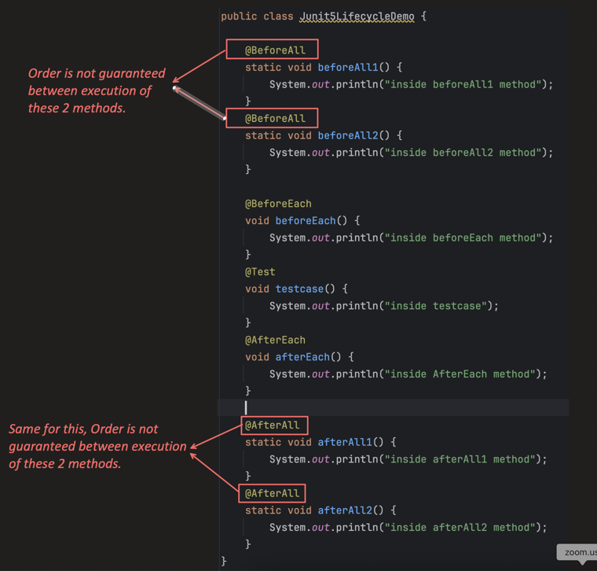
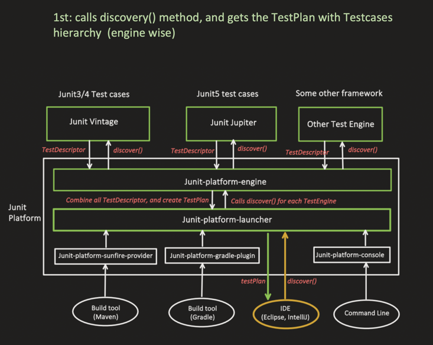
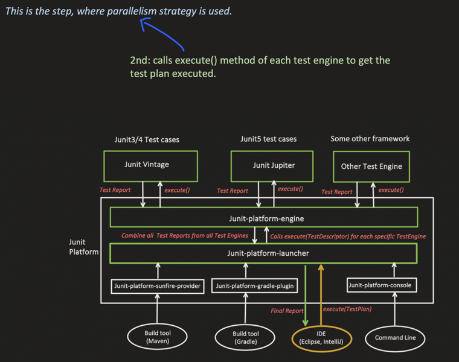
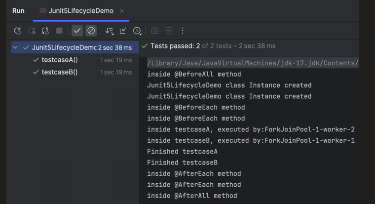
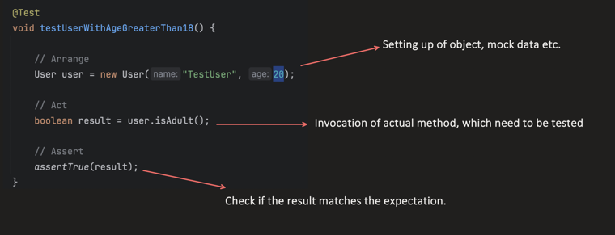

### Lifecycle of a JUnit5 Test Case

#### `Lifecycle.PER_METHOD` (default)

> Test class instance is **created for each test method**.


#### `Lifecycle.PER_CLASS`

> Test class instance is **created only once**.


---

### The Lifecycle Annotations

- **`@BeforeAll`** — runs once before all tests, usually for expensive setup that can be shared across all test cases, like a DB connection, etc.
- **`@BeforeEach`** — runs before each test case, usually for setting fresh test data, like creating new objects, adding temp data in the DB for testing, etc.
- **`@Test`** — the actual test method.
- **`@AfterEach`** — runs after each test case, to clean up resources like closing a file, deleting temp data, etc.
- **`@AfterAll`** — runs once after all tests, to clean up resources like closing a DB connection, etc.

**`pom.xml`**

```xml
<dependency>
    <groupId>org.springframework.boot</groupId>
    <artifactId>spring-boot-starter-test</artifactId>
    <scope>test</scope>
</dependency>
```

It transitively pulls in `org.junit.jupiter:junit-jupiter` and `org.junit.platform:junit-platform-launcher` dependencies.

---

### `Lifecycle.PER_METHOD` Example

```java
public class Junit5LifecycleDemo {

    public Junit5LifecycleDemo() {
        System.out.println("Junit5LifecycleDemo class Instance created");
    }

    @BeforeAll
    static void beforeAll() {
        System.out.println("inside @BeforeAll method");
    }

    @BeforeEach
    void beforeEach() {
        System.out.println("inside @BeforeEach method");
    }

    @Test
    void testcase1() {
        System.out.println("inside Testcase 1");
    }

    @Test
    void testcase2() {
        System.out.println("inside Testcase 2");
    }

    @AfterEach
    void afterEach() {
        System.out.println("inside @AfterEach method");
    }

    @AfterAll
    static void afterAll() {
        System.out.println("inside @AfterAll method");
    }
}
```

Output — notice a **new class instance** is created for each test case:


---

### `Lifecycle.PER_CLASS` Example

```java
@TestInstance(TestInstance.Lifecycle.PER_CLASS)
public class Junit5LifecycleDemo {

    public Junit5LifecycleDemo() {
        System.out.println("Junit5LifecycleDemo class Instance created");
    }

    @BeforeAll
    void beforeAll() {   // note: can be non-static here
        System.out.println("inside @BeforeAll method");
    }

    @BeforeEach
    void beforeEach() {
        System.out.println("inside @BeforeEach method");
    }

    @Test
    void testcase1() {
        System.out.println("inside Testcase 1");
    }

    @Test
    void testcase2() {
        System.out.println("inside Testcase 2");
    }

    @AfterEach
    void afterEach() {
        System.out.println("inside @AfterEach method");
    }

    @AfterAll
    void afterAll() {   // note: can be non-static here
        System.out.println("inside @AfterAll method");
    }
}
```

Output — notice only **one class instance** is created for both test cases:


---

### Why `Lifecycle.PER_METHOD` is Preferred

- It provides **test isolation**, so tests can run in any order.
- **Easy debugging** when any test case fails.
- **Safe for parallel execution**.

**Go for `Lifecycle.PER_CLASS` only when:**

- You want to share state across test cases.
- Your test code should be thread-safe as state is shared and all run in parallel.

---

### Multiple `@BeforeAll` / `@BeforeEach` / `@AfterEach` / `@AfterAll`

Multiple methods with the same lifecycle annotation can be used, **but**: the order is **not guaranteed** between execution of 2 methods with the same annotation.



---

### Parallel Execution

By default, test cases run **sequentially**, but we can also configure them to run in **parallel**.

From the JUnit5 Architecture topic, it's clear that the component which enables parallel execution is the **Platform Launcher**:

1st — it calls `discover()` and gets the `TestPlan` with the test-case hierarchy (engine-wise):



2nd — it calls `execute()` on each Test Engine to get the test plan executed. **This is the step where the parallelism strategy is used:**



```java
public class Junit5LifecycleDemo {

    public Junit5LifecycleDemo() {
        System.out.println("Junit5LifecycleDemo class Instance created");
    }

    @BeforeAll
    static void beforeAll() {
        System.out.println("inside @BeforeAll method");
    }

    @BeforeEach
    void beforeEach() {
        System.out.println("inside @BeforeEach method");
    }

    @Test
    void testcaseA() throws InterruptedException {
        System.out.println("inside testcaseA, executed by: " + Thread.currentThread().getName());
        Thread.sleep(1000);
        System.out.println("Finished testcaseA");
    }

    @Test
    void testcaseB() throws InterruptedException {
        System.out.println("inside testcaseB, executed by: " + Thread.currentThread().getName());
        Thread.sleep(1000);
        System.out.println("Finished testcaseB");
    }

    @AfterEach
    void afterEach() {
        System.out.println("inside @AfterEach method");
    }

    @AfterAll
    static void afterAll() {
        System.out.println("inside @AfterAll method");
    }
}
```

src/test/resouces/**`junit-platform.properties`**

**`junit-platform.properties`**

```properties
# below configurations, junit platform launcher will apply to
# junit.jupiter (i.e. Jupiter Test Engine only)

# Enables or disables parallel execution, default value is "false"
junit.jupiter.execution.parallel.enabled = true

# Run methods within a test class in parallel, default value is
# "same_thread" means sequentially
junit.jupiter.execution.parallel.mode.default = concurrent

# Multiple Test Classes can be executed in parallel, default value is
# "same_thread" means sequentially
# Above one was for methods this for class
junit.jupiter.execution.parallel.mode.classes.default = concurrent

# thread pool managing strategy:
#   "dynamic" (default): thread pool size is computed dynamically based on system resources
#   "fixed": we define the specific number of threads within a pool
junit.jupiter.execution.parallel.config.strategy = fixed

# used when "fixed" thread pool strategy is used; below it creates a
# thread pool with 5 threads.
junit.jupiter.execution.parallel.config.fixed.parallelism = 5
```

Output — notice `testcaseA` and `testcaseB` run on **different threads** (`ForkJoinPool-1-worker-2` and `-worker-1`) concurrently:



---

### AAA (Arrange-Act-Assert) Pattern

> Follow the **AAA pattern** for each test case:

```java
@Test
void testUserWithAgeGreaterThan18() {

    // Arrange — setting up the object, mock data, etc.
    User user = new User("TestUser", 20);

    // Act — invocation of the actual method which needs to be tested
    boolean result = user.isAdult();

    // Assert — check if the result matches the expectation
    assertTrue(result);
}
```


