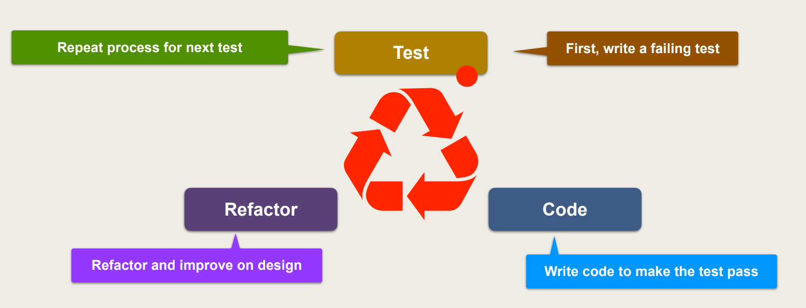
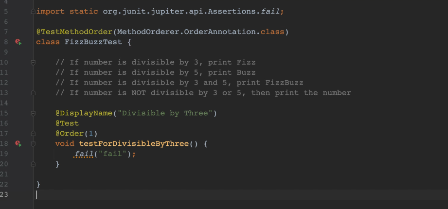
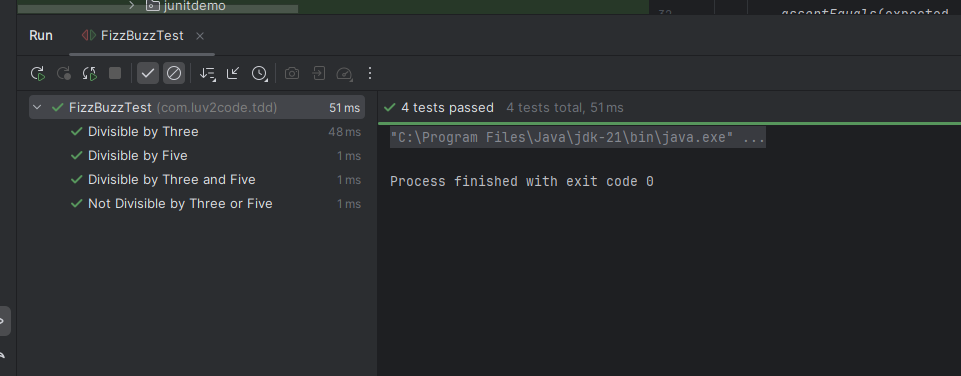
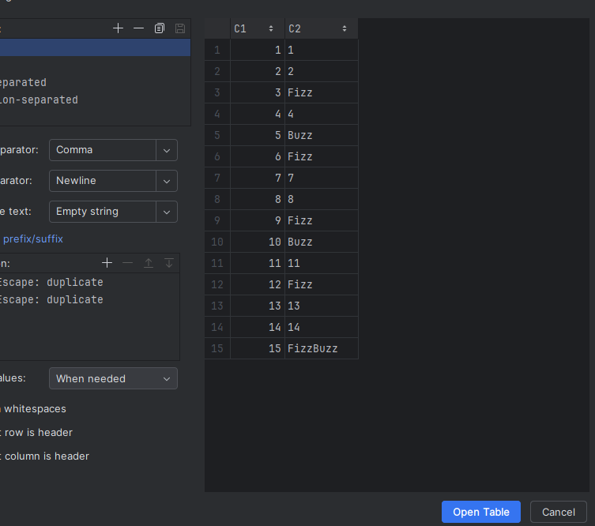
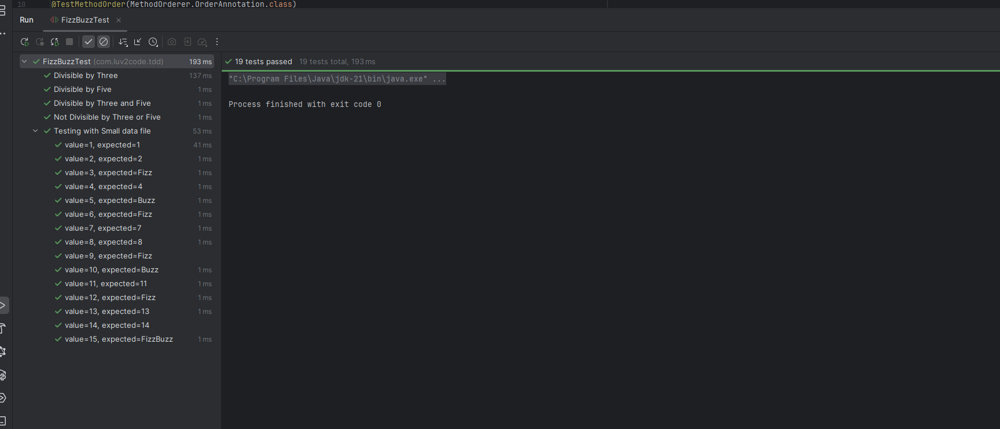
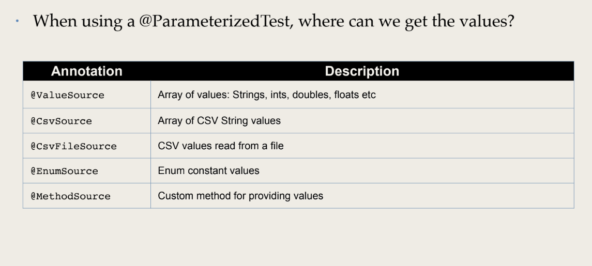
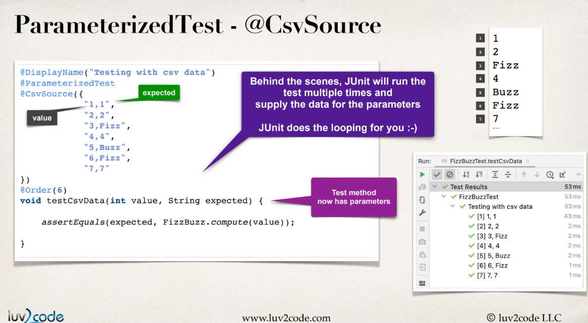
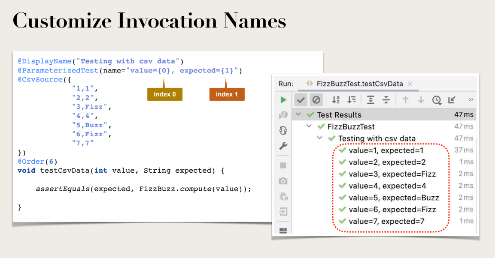

# Notes

Normally we first code and then test!! But in Test-driven approach every single piece of tested and 
if test not clear Refactor and then test again!!



### Benefits of Test Driven Development (TDD)

• Clear task list of things to test and develop

• Tests will help you identify edge cases

• Develop code in small increments

• Passing tests increases confidence in code

• Gives freedom to refactor ... tests are your safety net ... did I break anything??

### Question 

Problem

• Write a program to print the first 100 FizzBuzz numbers. Start at 1 and end at 100.

• If number is divisible by 3, print Fizz

• If number is divisible by 5, print Buzz

• If number is divisible by 3 and 5, print FizzBuzz

• If number is not divisible by 3 or 5, then print the number

### Development Process Step-By-Step

1. Write a failing test

    

2. Write code to make the test pass

```java
public class FizzBuzz {

    // If number is divisible by 3, print Fizz
    // If number is divisible by 5, print Buzz
    // If number is divisible by 3 and 5, print FizzBuzz
    // If number is NOT divisible by 3 or 5, then print the number

    public static String compute(int i) {

        StringBuilder result = new StringBuilder();

        if (i % 3 == 0) {
            result.append("Fizz");
        }

        if (i % 5 == 0) {
            result.append("Buzz");
        }

        if (result.isEmpty()) {
            result.append(i);
        }

        return result.toString();
    }
````

3. Refactor the code


4. Repeat the process

```java


@TestMethodOrder(MethodOrderer.OrderAnnotation.class)
class FizzBuzzTest {

    // If number is divisible by 3, print Fizz
    @DisplayName("Divisible by Three")
    @Test
    @Order(1)
    void testForDivisibleByThree() {

        String expected = "Fizz";

        assertEquals(expected, FizzBuzz.compute(3), "Should return Fizz");
    }

    // If number is divisible by 5, print Buzz
    @DisplayName("Divisible by Five")
    @Test
    @Order(2)
    void testForDivisibleByFive() {

        String expected = "Buzz";

        assertEquals(expected, FizzBuzz.compute(5), "Should return Buzz");
    }

    // If number is divisible by 3 and 5, print FizzBuzz
    @DisplayName("Divisible by Three and Five")
    @Test
    @Order(3)
    void testForDivisibleByThreeAndFive() {

        String expected = "FizzBuzz";

        assertEquals(expected, FizzBuzz.compute(15), "Should return FizzBuzz");
    }

    // If number is NOT divisible by 3 or 5, then print the number
    @DisplayName("Not Divisible by Three or Five")
    @Test
    @Order(4)
    void testForNotDivisibleByThreeOrFive() {

        String expected = "1";

        assertEquals(expected, FizzBuzz.compute(1), "Should return 1");
    }


}
```


## Parametrized test


```java

    @DisplayName("Testing with Small data file")
    @ParameterizedTest(name="value={0}, expected={1}")
    @CsvFileSource(resources="/small-test-data.csv")
    @Order(5)
    void testSmallDataFile(int value, String expected) {

        assertEquals(expected, FizzBuzz.compute(value));

    }


```
And put the csv in resources 



Result 










