### JUnit5 Assertions

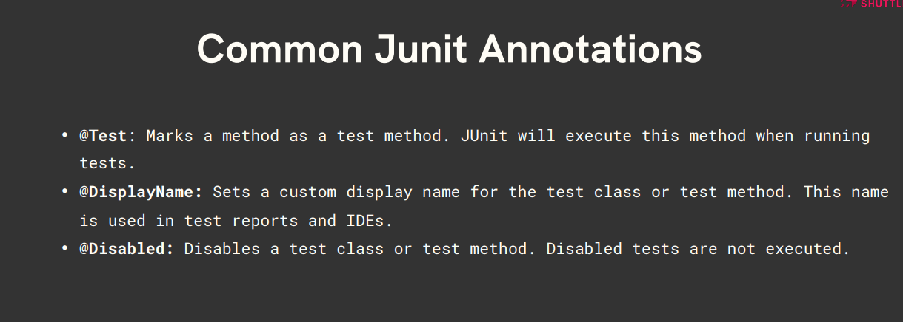

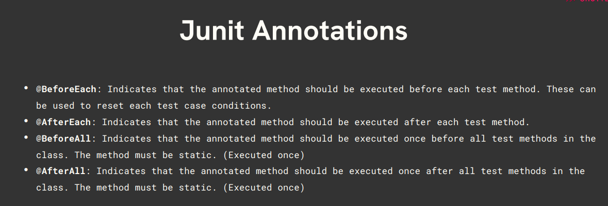

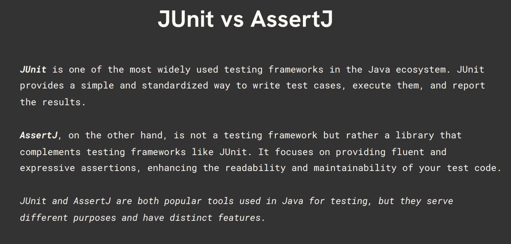

- Assertions are used to verify expected outcomes in tests.
- If an assertion fails, the test fails.

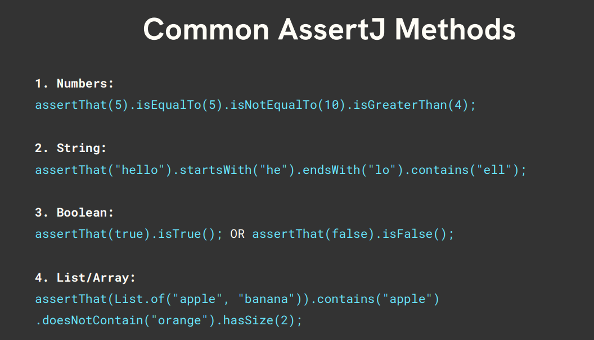

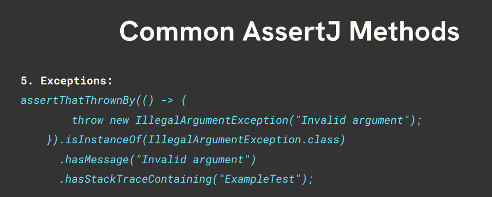


Let's go through each of these assertions one by one.

---

### 1. `assertEquals()`

- Checks if two values are equal or not.
- If expected and actual value matches, test case is considered PASS.

```java
assertEquals(expected, actual);
assertEquals(expected, actual, failureMessage);
```

> For primitive values it uses `==`, and for objects it uses `.equals()`. So, if you are comparing custom objects, then do override the `equals` and `hashCode` methods in your class — else the default `equals` method from the `Object` class is used, which checks for **reference equality** (2 different objects with the same value won't be considered same).

```java
import static org.junit.jupiter.api.Assertions.assertEquals;
import org.junit.jupiter.api.Test;

class MyServiceTest {

    @Test
    void testAddition() {

        // arrange
        MyService obj = new MyService();

        // act
        int output = obj.multiply(5, 6);

        // assert
        assertEquals(30, output, "both are not equal");
    }
}
```

`String` class overrides `equals()`, comparing the sequence of characters:


**Custom object without overriding `equals`:**

```java
public class MyService {
    String name;

    public MyService(String name) {
        this.name = name;
    }
}
```

```java
class MyServiceTest {

    @Test
    void testAssertEqualsForObject() {
        MyService object1 = new MyService("XYZ");
        MyService object2 = new MyService("XYZ");

        assertEquals(object1, object2);
    }
}
```

Fails, since reference equality is used by default:

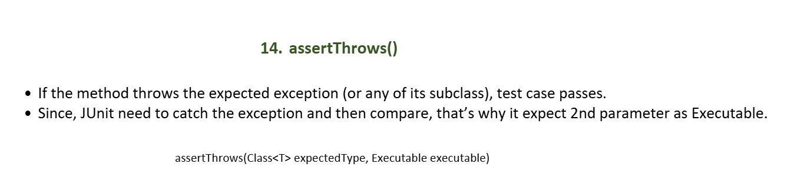

**Custom object with `equals`/`hashCode` overridden:**

```java
import java.util.Objects;

public class MyService {
    String name;

    public MyService(String name) {
        this.name = name;
    }

    @Override
    public boolean equals(Object o) {
        if (this == o) return true;
        if (!(o instanceof MyService)) return false;

        MyService servObject = (MyService) o;
        return Objects.equals(this.name, servObject.name);
    }

    @Override
    public int hashCode() {
        return Objects.hash(name);
    }
}
```

Now `assertEquals(object1, object2)` passes.

---

### 2. `assertNotEquals()`

- Checks if two values are **not** equal.
- If unexpected and actual value do not match, test case is considered PASS.

```java
assertNotEquals(unexpected, actual);
```

```java
@Test
void testAssertNotEqualsForObject() {
    MyService object = new MyService();

    int actualResult = object.multiply(5, 6); // 30
    assertNotEquals(11, actualResult);
}
```

---

### 3. `assertArrayEquals()`

Verifies 2 arrays contain the same elements in the same order.

```java
@Test
void testAssertArrayEquals() {
    int[] expected = {1, 2, 3};
    int[] actual = MyService.sortArray(new int[]{3, 1, 2});
    assertArrayEquals(expected, actual); // for primitive: 1==1, 2==2, 3==3
}
```

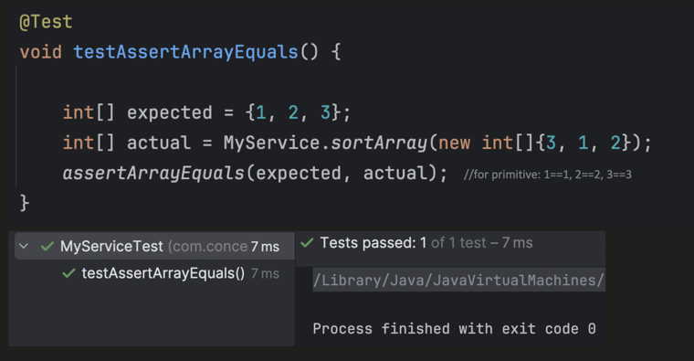

```java
@Test
void testAssertArrayEquals() {
    String[] arr1 = {"Hello", "World"};
    String[] arr2 = {new String("Hello"), new String("World")};

    assertArrayEquals(arr1, arr2); // for object: "hi".equals("hi"), "bye".equals("bye")
}
```

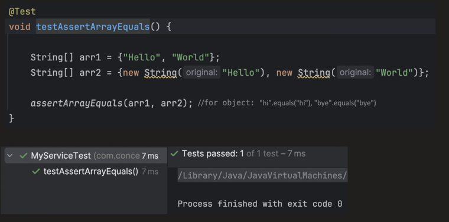

---

### 4. `assertIterableEquals()`

- Similar to `assertArrayEquals`, but used to compare two `Iterable` collections like `List`, `Queue`, etc.
- Checks element by element in order using `.equals()`.
- Iteration sequence should match.
- `Set` does not guarantee insertion order, so it's **not recommended** to use this assertion on such unordered collections.

```java
@Test
void testAssertIterableEquals() {
    List<String> expected = List.of("A", "B", "C");
    List<String> actual = List.of("A", "B", "C");

    assertIterableEquals(expected, actual);
}
```

---

### 5. `assertLinesMatch()`

- Both expected and actual must be `List<String>`.
- Each element of `List<String>` is treated as one line.
- Supports regex match too.

```java
assertLinesMatch(List<String> expectedLines, List<String> actualLines)
```

```java
@Test
void testAssertLinesMatch() {
    List<String> expected = List.of("Hello", "World");
    List<String> actual   = List.of("Hello", "World");

    assertLinesMatch(expected, actual);
}
```

**Regex matches:**

```java
@Test
void testAssertLinesMatch() {
    List<String> expected = List.of("Hello", "World from [A-Za-z]+");
    List<String> actual   = List.of("Hello", "World from XYZ");

    assertLinesMatch(expected, actual);
}
```

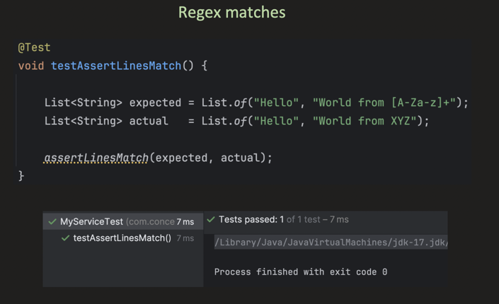

### Regex, Explained Clearly

> A **regex** (regular expression) is just a **pattern that describes text**, instead of the exact text itself. `assertLinesMatch` checks each *actual* line against the corresponding *expected* line — if the expected line isn't a valid exact match, JUnit treats it as a regex and tries to match it against the actual line.

**How to read a regex — build it from 3 building blocks:**

**1. What characters are allowed (character classes)**

| Pattern | Meaning | Matches | Doesn't match |
|---|---|---|---|
| `\d` | a single digit (`0-9`) | `5` in `"a5b"` | `a`, `_` |
| `\w` | a single "word" character — letters, digits, underscore (same as `[A-Za-z0-9_]`) | `a`, `5`, `_` | `@`, ` ` (space) |
| `\s` | a single whitespace character (space, tab, newline) | `" "` | `a` |
| `[A-Za-z]` | a single letter, upper or lower case | `X`, `x` | `5`, `_` |
| `[A-Za-z0-9]` | a single letter or digit | `X`, `5` | `_`, `@` |
| `.` | **any** single character (except newline) | `a`, `5`, `@` | (matches almost everything) |
| `[abc]` | any **one** of the listed characters | `a`, `b`, `c` | `d` |
| `[^abc]` | any character **except** the listed ones (`^` inside `[]` means NOT) | `d`, `5` | `a`, `b`, `c` |

**2. How many times it can repeat (quantifiers)** — these go *right after* whatever they're quantifying:

| Pattern | Meaning | Example |
|---|---|---|
| `+` | 1 or more times | `\d+` matches `5`, `42`, `1000` (but not `""`) |
| `*` | 0 or more times | `\d*` matches `""`, `5`, `1000` |
| `?` | 0 or 1 time (optional) | `colou?r` matches `color` and `colour` |
| `{3}` | exactly 3 times | `\d{3}` matches `123` but not `12` or `1234` |
| `{2,4}` | between 2 and 4 times | `\d{2,4}` matches `12`, `123`, `1234` |

So `[A-Za-z]+` reads as: "**1 or more** letters, in a row" — that's how it matches whole words like `"Hello"` or `"World"`, but a single character class like `[A-Za-z]` (without the `+`) would only match **one** letter.

**3. Position / structure (anchors and groups)**

| Pattern | Meaning |
|---|---|
| `^` | start of the line/text |
| `$` | end of the line/text |
| `(abc)` | groups `abc` together, e.g. for applying a quantifier to the whole group, or for `\|` (OR) |
| `a\|b` | matches `a` OR `b` |

**Putting it together — walking through the example in this file:**

```java
List<String> expected = List.of("Hello", "World from [A-Za-z]+");
List<String> actual   = List.of("Hello", "World from XYZ");
```

- Line 1: `"Hello"` has no special regex characters, so JUnit just does an exact string match against `"Hello"` — matches.
- Line 2: `"World from [A-Za-z]+"` is treated as a regex, because `assertLinesMatch` first tries an exact match, and only falls back to regex if that fails.
  - `World from ` — matched literally, character by character.
  - `[A-Za-z]+` — matches **1 or more letters**. Against the actual text `XYZ`, this matches `X`, `Y`, `Z` (3 letters, all allowed by `[A-Za-z]`) — so the whole line matches.

**Why the mismatch example below fails:**

```java
List<String> expected = List.of("Hello", "World from [A-Za-z]+");
List<String> actual   = List.of("Hello", "World from 42");
```

- `World from ` matches literally, same as before.
- `[A-Za-z]+` needs **1 or more letters**, but the actual text has `42` — digits, not letters. `4` isn't in the character class `[A-Za-z]`, so the match fails right there, and the whole line (and the test) fails.

**A few more practical patterns you'll commonly reach for:**

| Pattern | Meaning | Example |
|---|---|---|
| `\d+` | one or more digits | matches `"123"`, `"42"` |
| `\w+` | one or more word characters | matches `"Hello"`, `"user_1"` |
| `.*` | anything, including nothing — matches the **rest of the line** | useful when only part of a line matters, e.g. `"Started in .*"` matches `"Started in 2.3 seconds"` |
| `\d{4}-\d{2}-\d{2}` | a date in `YYYY-MM-DD` format | matches `"2026-07-20"` |
| `.*ERROR.*` | any line that **contains** the word `ERROR` anywhere | matches `"12:30 ERROR: failed"` |

**Regex Patterns (quick reference used in this file):**

| Pattern | Meaning |
|---|---|
| `\d+` | Digits (e.g., `"123"`, `"42"`) |
| `[A-Za-z]+` | Letters/words (e.g., `"Hello"`, `"World"`) |
| `\w+` | Alphanumeric (same as `[A-Za-z0-9_]`, includes underscore) |
| `.*` | Anything (any characters) — matches whole line, useful if only part matters |

**Regex Mismatch:**

```java
@Test
void testAssertLinesMatch() {
    List<String> expected = List.of("Hello", "World from [A-Za-z]+");
    List<String> actual   = List.of("Hello", "World from 42");

    assertLinesMatch(expected, actual);
}
```

Fails — `42` doesn't match the letters-only pattern `[A-Za-z]+`:

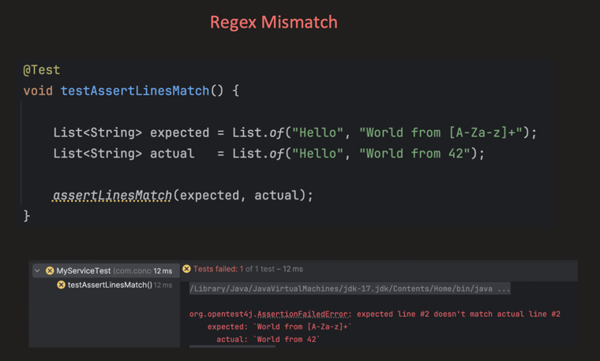

---

### 6. `assertSame()`

Just checks whether both objects point to the **same reference** or not.

```java
@Test
void testAssertSame() {
    String object1 = "JUnit";
    String object2 = "JUnit";   // same String literal → same reference (string pool)

    assertSame(object1, object2);
}
```

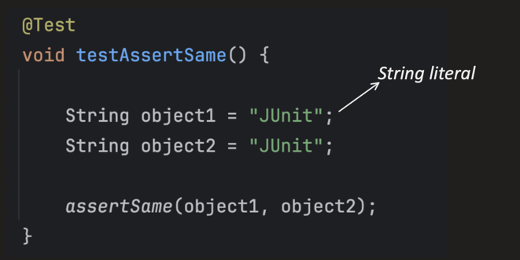

In the example below, both `object1` and `object2` point to **different** objects:

```java
@Test
void testAssertSame() {
    String object1 = "JUnit";
    String object2 = new String("JUnit");

    assertSame(object1, object2);
}
```

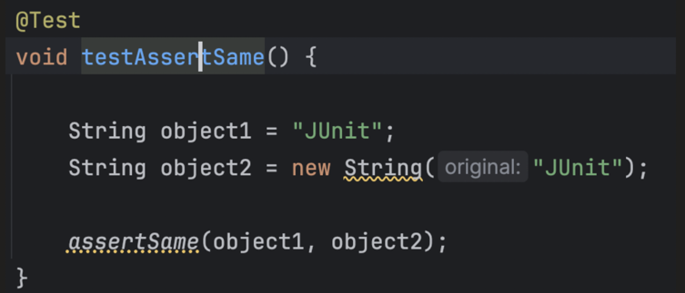

Fails, since `new String("JUnit")` creates a separate object:

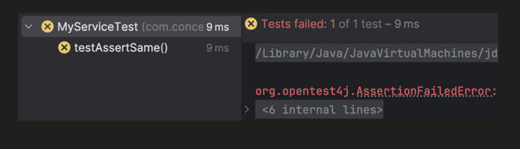

---

### 7. `assertNotSame()`

Checks if both objects have **different** references.

```java
@Test
void testAssertNotSame() {
    String object1 = "JUnit";
    String object2 = new String("JUnit");

    assertNotSame(object1, object2);
}
```

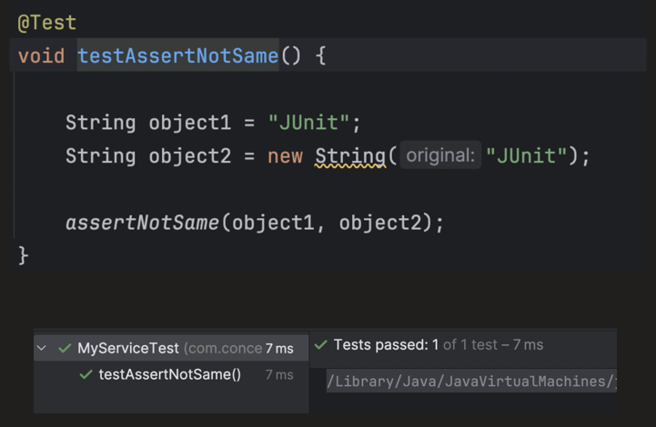

---

### 8. `assertNull()`

Checks if the object value is `null`.

```java
@Test
void testAssertNull() {
    MyService object = null;
    assertNull(object);
}
```

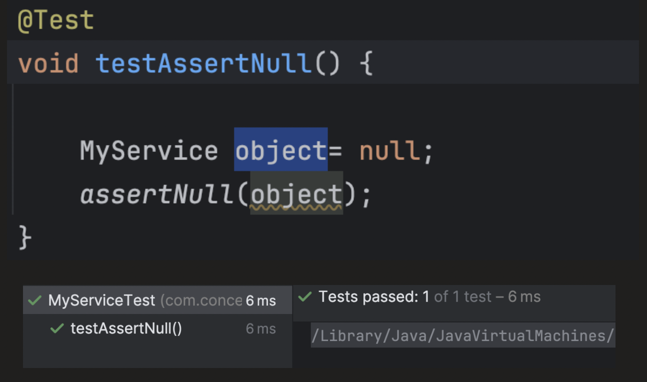

---

### 9. `assertNotNull()`

Checks if the object value is **not** `null`.

```java
@Test
void testAssertNotNull() {
    MyService object = new MyService();
    assertNotNull(object);
}
```

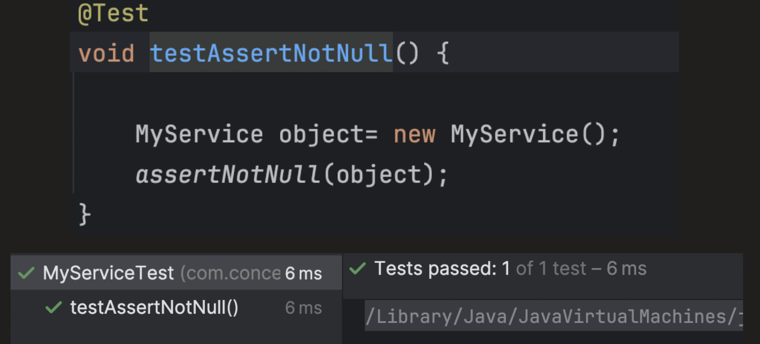

---

### 10. `assertTrue()`

Checks if the condition is `true`.

```java
@Test
void testAssertTrue() {
    assertTrue(5 > 2);
}
```

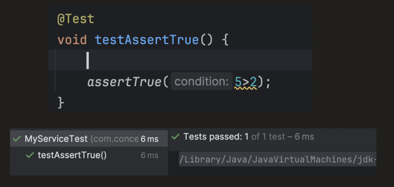

---

### 11. `assertFalse()`

Checks if the condition is `false`.

```java
@Test
void testAssertFalse() {
    assertFalse(5 < 2);
}
```

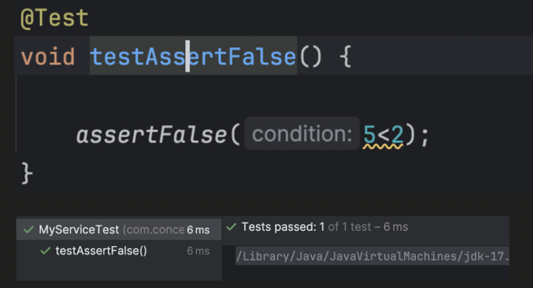

---

### 12. `fail()`

- Fails the test deliberately.
- Generally used when the flow reaches a point where it should not.

```java
@Test
void testAssertFail() {
    MyService object = new MyService();
    try {
        object.methodThrowsException();
        fail("above method should throw exception");
    } catch (Exception e) {
        // expecting the control should reach here.
    }
}
```

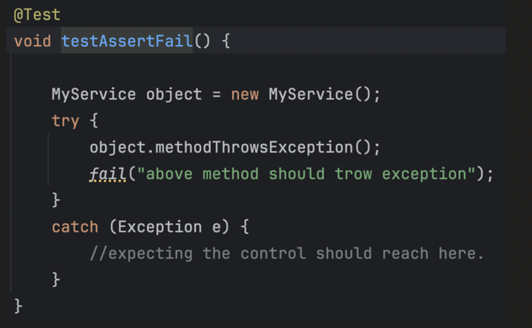

If the exception is **not** thrown, `fail()` executes and the test fails with our custom message:

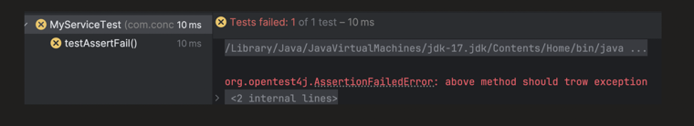

---

### 13. `assertInstanceOf()`

Checks if an object is an instance of the specified class (or subclass).

```java
@Test
void testAssertInstanceOf() {
    Number n = Integer.valueOf(10);

    // passes, because Integer is a subclass of Number
    assertInstanceOf(Number.class, n);

    // fails, because n is not a Double
    assertInstanceOf(Double.class, n);
}
```

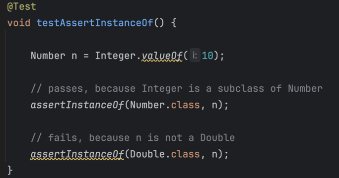

---

### 14. `assertThrows()`

- If the method throws the expected exception (or any of its subclasses), the test case passes.
- Since JUnit needs to catch the exception and then compare, it expects the 2nd parameter as an `Executable`.

```java
assertThrows(Class<T> expectedType, Executable executable)
```

```java
@Test
void testAssertThrows() {
    assertThrows(Exception.class, () -> Integer.parseInt("abc"));
}
```

Passes — the exception thrown (`NumberFormatException`) is a subclass of the expected `Exception`:

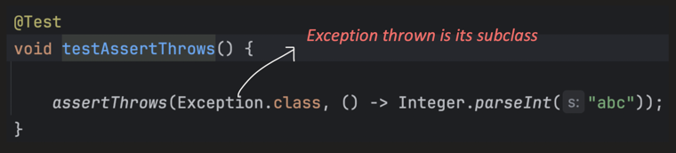

Or we can directly specify the exact exception type:

```java
@Test
void testAssertThrows() {
    assertThrows(NumberFormatException.class, () -> Integer.parseInt("abc"));
}
```

In the test below, the expected exception is `NullPointerException`, but the actual exception thrown is different — hence the test case fails:

```java
@Test
void testAssertThrows() {
    assertThrows(NullPointerException.class, () -> Integer.parseInt("abc"));
}
```

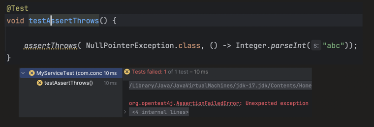

---

### 15. `assertThrowsExactly()`

Must throw the exact same type of exception (**no subclasses**).

We need to provide the exact exception that's going to be thrown. If we use the parent class type, the test fails, since the exception thrown is its child, `NumberFormatException`, and it expects the exact same type:

```java
@Test
void testAssertThrowsExactly() {
    assertThrowsExactly(Exception.class, () -> Integer.parseInt("abc"));
}
```

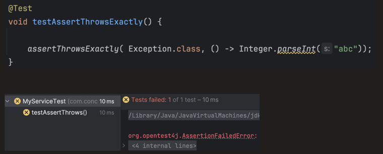

If we provide the exact same exception, it passes:

```java
@Test
void testAssertThrowsExactly() {
    assertThrowsExactly(NumberFormatException.class, () -> Integer.parseInt("abc"));
}
```

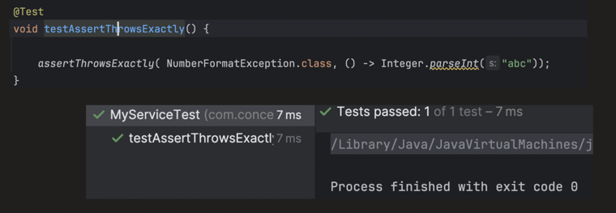

---

### 16. `assertDoesNotThrow()`

Expectation is that the method does **not** throw any exception. If any exception is thrown, the test case will fail.

```java
@Test
void testAssertDoNotThrow() {
    assertDoesNotThrow(() -> Integer.parseInt("123"));
}
```

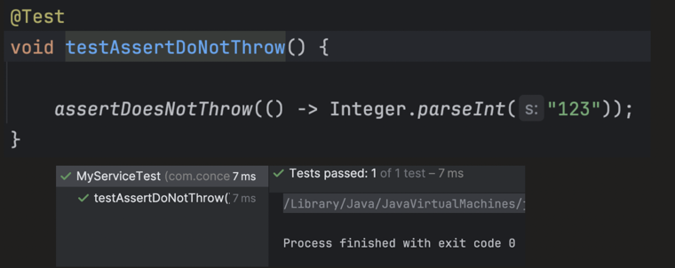

```java
@Test
void testAssertDoNotThrow() {
    assertDoesNotThrow(() -> Integer.parseInt("abc"));
}
```

Fails, since `"abc"` throws a `NumberFormatException`:

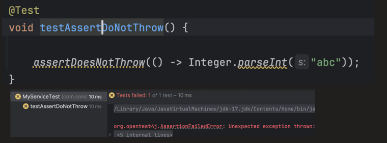

---

### 17. `assertTimeout()`

Ensures code finishes within time, else test fails (**but still runs to end**).

```java
assertTimeout(Duration timeout, Executable executable)
```

```java
@Test
void testAssertTimeout() {
    assertTimeout(Duration.ofMillis(100), () -> Thread.sleep(50));
}
```

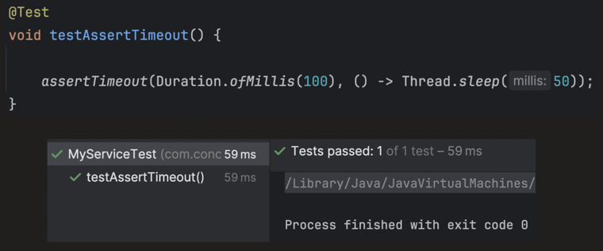

The test case takes more time than expected, so it fails:

```java
@Test
void testAssertTimeout() {
    assertTimeout(Duration.ofMillis(100), () -> Thread.sleep(150));
}
```

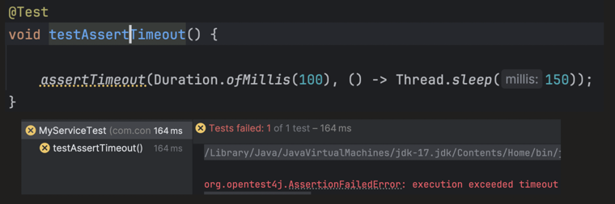

---

### 18. `assertTimeoutPreemptively()`

- Similar to `assertTimeout()`, but aborts execution **immediately** when the timeout is exceeded.
- Internally it uses a **different thread** for execution, so when the timeout exceeds, it interrupts it.

### `assertTimeout()` vs `assertTimeoutPreemptively()` — The Key Difference

**`assertTimeout()` — runs on the same thread, always lets the code finish:**

```java
assertTimeout(Duration timeout, Executable executable)
```

- The `Executable` runs on the **calling thread** (the same thread the test itself runs on) — no new thread is created.
- JUnit lets the code **run to completion**, no matter how long it takes, and *then* checks whether the elapsed time exceeded the timeout.
- If it took too long, the assertion fails **after the fact** — but by then, all the side effects of that code have already happened.

```java
@Test
void testAssertTimeout() {
    assertTimeout(Duration.ofMillis(100), () -> {
        Thread.sleep(150);
        System.out.println("This line still runs, even though we exceeded the timeout");
    });
}
```

Even though this fails (150ms > 100ms), `"This line still runs..."` is still printed, because the code wasn't stopped early — it just ran and then got judged.

**`assertTimeoutPreemptively()` — runs on a separate thread, aborts as soon as the timeout hits:**

```java
assertTimeoutPreemptively(Duration timeout, Executable executable)
```

- The `Executable` runs on a **new, separate thread**, while the main test thread waits for either: (a) the code to finish, or (b) the timeout to elapse — whichever comes first.
- The moment the timeout elapses, JUnit **interrupts** that separate thread and immediately fails the test — it does **not** wait for the code to finish.

```java
@Test
void testAssertTimeoutPreemptively() {
    assertTimeoutPreemptively(Duration.ofMillis(100), () -> {
        Thread.sleep(150);
        System.out.println("This line may never run — the thread gets interrupted at ~100ms");
    });
}
```

Here, the test fails at ~100ms — it doesn't wait around for the full 150ms `Thread.sleep()` to finish.

**Side-by-side comparison:**

| | `assertTimeout()` | `assertTimeoutPreemptively()` |
|---|---|---|
| Runs on | Same (calling) thread | A new, separate thread |
| When does it fail | *After* the code finishes running, if it took too long | *As soon as* the timeout elapses — doesn't wait |
| Does the code finish executing | **Yes, always** — even on failure | **Not necessarily** — gets interrupted mid-way |
| Side effects on timeout | All side effects from the code still happen | Side effects may be **partial/incomplete**, since execution was cut off |
| Thread-safety concerns | None — single-threaded, straightforward | Code must be written to be safe when run on another thread (e.g. no reliance on `ThreadLocal`s tied to the test thread, no assumptions about ordering with the main thread) |
| Typical use case | You just want to know "did this take too long?" without changing behavior | You want to **hard-cap** execution — useful for tests where letting a slow/hanging call run to completion would make the *whole test suite* slow or hang |

**A subtlety worth knowing:** `assertTimeoutPreemptively()` interrupting the thread doesn't *guarantee* the thread actually stops. Java's thread interruption is cooperative — if the code inside the `Executable` is in a tight loop that never checks `Thread.interrupted()`, or is blocked on something that doesn't respond to interrupts, that background thread can keep running in the background even after the test has already failed and moved on. This is exactly why the JUnit team's own guidance leans towards preferring `assertTimeout()` unless you specifically need the "cut it off now" behavior.

---

### 19. `assertAll()`

Groups multiple assertions, runs **all** of them, and reports failures together.

```java
assertAll(Executable...executables)
```

```java
@Test
void testAssertAll() {
    String str = "JUnit5";
    assertAll(
            () -> assertEquals(6, str.length()),
            () -> assertTrue(str.startsWith("J")),
            () -> assertFalse(str.isEmpty())
    );
}
```

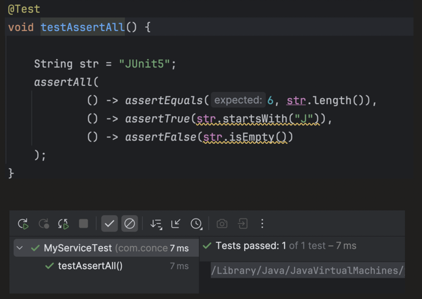

It properly shows the result of **each** assertion — even if multiple fail together:

```java
@Test
void testAssertAll() {
    String str = "";
    assertAll(
            () -> assertEquals(6, str.length()),
            () -> assertTrue(str.startsWith("J")),
            () -> assertFalse(str.isEmpty())
    );
}
```

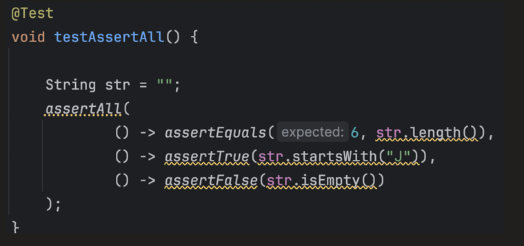

Output — reports all 3 failures together (`MultipleFailuresError`), instead of stopping at the first one:

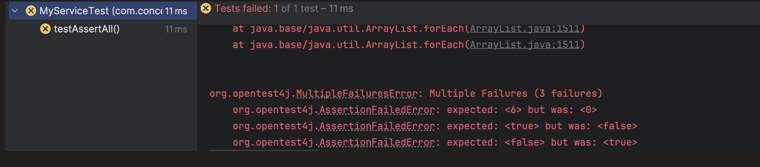
