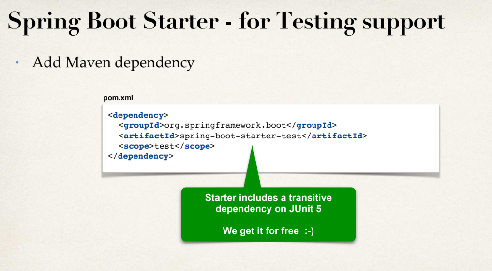
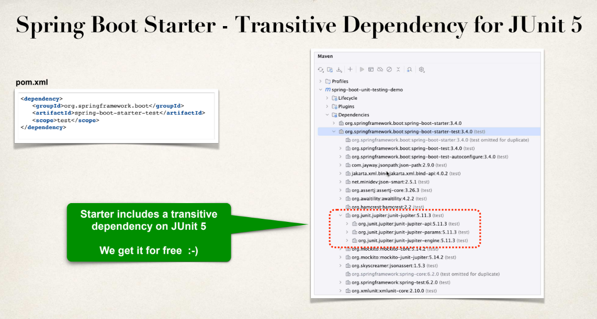
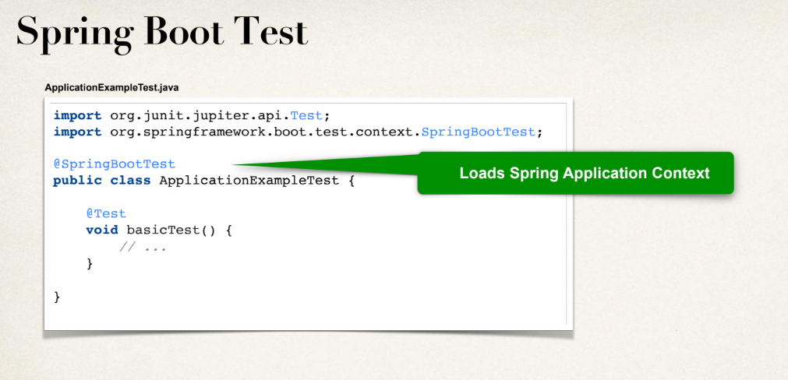
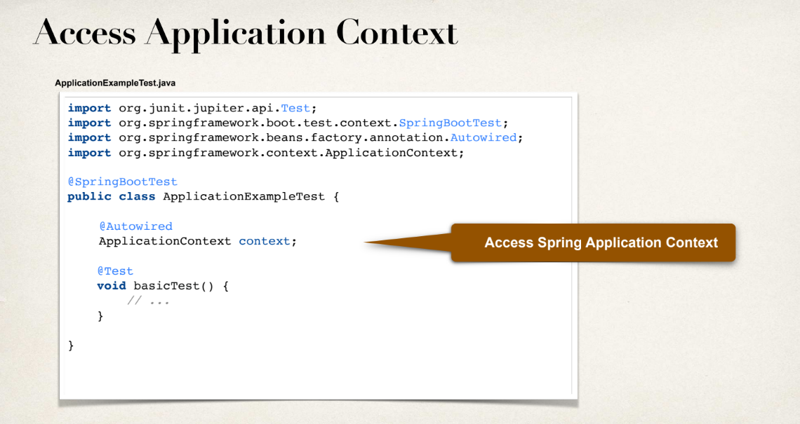
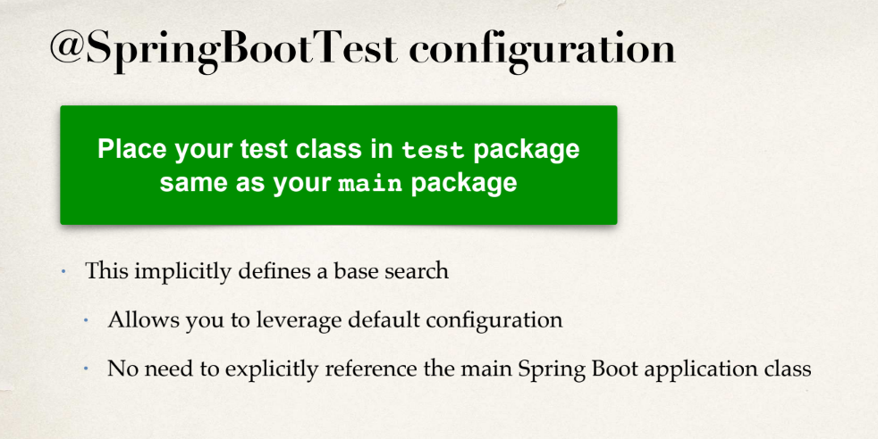
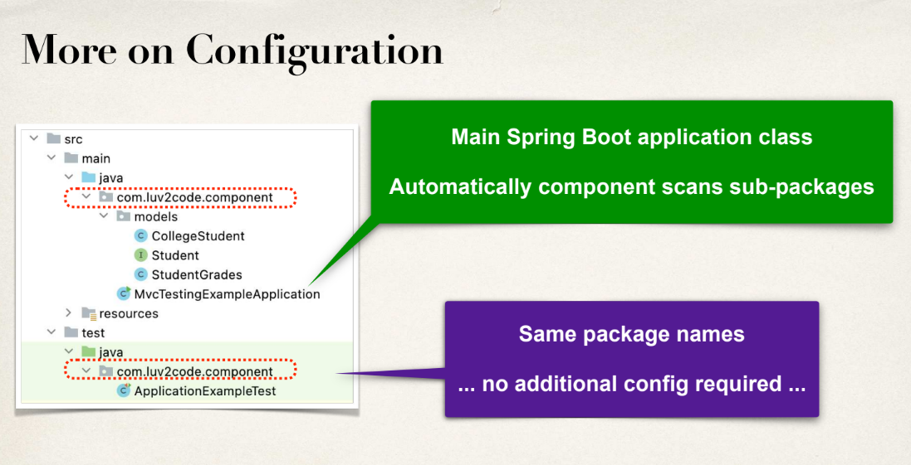
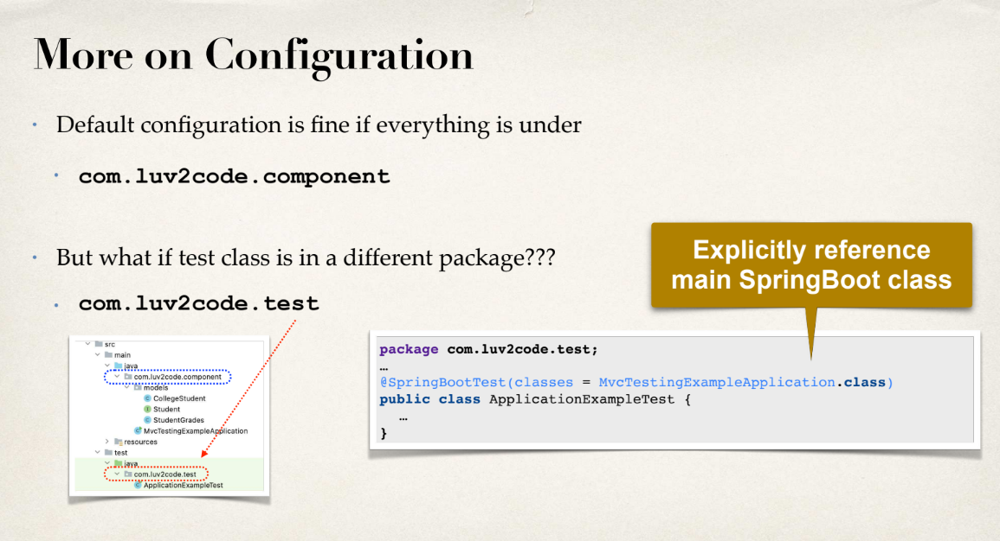

# Notes

## What do you need for Spring Boot unit testing?

• Access to the Spring Application Context

• Support for Spring dependency injection

• Retrieve data from Spring application.properties

• Mock object support for web, data, REST APIs etc ...

## Unit Testing support in Spring Boot

• Spring Boot provides rich testing support

` @SpringBootTest`

• Loads the application context

• Support for Spring dependency injection

• You can access data from Spring application.properties

