### What is an Extension?

> In simple terms, it allows us to add **custom behavior** to tests, like:

- Enable or disable a test conditionally.
- Add custom code before or after tests.
- Intercept method calls for logging, etc.

Remember this diagram from the "Architecture" topic:

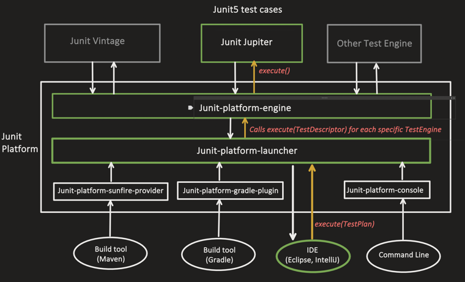

**Where do Extensions fit in:**


test Case are Our test case that we have created.

chain of Extensions means there can be multiple extensions.

Let's first go through each extension, then at the end we'll see the dummy flow to visualize the **ORDERING** of JUnit5 extensions — that will clarify a lot of things.

Some of the extension types are:

- Lifecycle Extensions
- Parameter Resolver
- Execution Condition
- Test Execution Callbacks (Before and After)
- Invocation Interceptor
- Exception Handler
- Instance Post Processor

---

### 1. Lifecycle Extensions

- Similar to the lifecycle annotations `@BeforeAll`, `@BeforeEach`, `@AfterAll`, `@AfterEach`.
- Used to execute custom logic before/after test classes or methods.

**Why do we need lifecycle extensions when we already have `@BeforeAll`/`@BeforeEach`/`@AfterAll`/`@AfterEach`?**

> Those lifecycle-annotated methods are tied to a **single class**. Lifecycle **extensions** are **reusable across many test classes**.

we have multiple `Callback` available. `Callback` is an interface

Our custom class implements the `BeforeAllCallback` extension interface:

```java
public class BeforeAllLifecycleExtension implements BeforeAllCallback {

    @Override
    public void beforeAll(ExtensionContext context) {
        System.out.println("Extension: Before all tests");
    }
}
```

`ExtensionContext` has all info about test class

Our custom class implements the `AfterAllCallback` extension interface:

```java
public class AfterAllLifecycleExtension implements AfterAllCallback {

    @Override
    public void afterAll(ExtensionContext context) throws Exception {
        System.out.println("Extension: After all tests");
    }
}
```

> The `ExtensionContext` object has all the info about: the **test class** (`getTestClass()`), the **test method** (`getTestMethod()`), **annotations** (`getElement()`), and the **test instance** (`getTestInstance()`).

**Registering multiple lifecycle extensions (comma separated) within a test class:**

```java
@ExtendWith({BeforeAllLifecycleExtension.class, AfterAllLifecycleExtension.class})
class MyServiceTest {

    MyServiceTest() {
        System.out.println("instance created");
    }

    @BeforeAll
    public static void beforeAllMethod() {
        System.out.println("inside beforeAll");
    }

    @BeforeEach
    public void beforeEachMethod() {
        System.out.println("inside beforeEach");
    }

    @Test
    void testMethod1() {
        System.out.println("inside test method");
    }

    @AfterEach
    public void afterEachMethod() {
        System.out.println("inside afterEach method");
    }

    @AfterAll
    public static void afterAllMethod() {
        System.out.println("inside afterAll method");
    }
}
```

Or we can write **one class** which implements all the lifecycle callback extension interfaces:

```java
public class LifecycleExtension implements BeforeAllCallback, AfterAllCallback,
        BeforeEachCallback, AfterEachCallback {

    @Override
    public void beforeAll(ExtensionContext context) {
        System.out.println("Extension: Before all tests");
    }

    @Override
    public void afterAll(ExtensionContext context) throws Exception {
        System.out.println("Extension: After all tests");
    }

    @Override
    public void afterEach(ExtensionContext context) throws Exception {
        System.out.println("Extension: After each tests");
    }

    @Override
    public void beforeEach(ExtensionContext context) throws Exception {
        System.out.println("Extension: Before each tests");
    }
}
```

```java
@ExtendWith(LifecycleExtension.class)
class MyServiceTest {

    MyServiceTest() {
        System.out.println("instance created");
    }

    @BeforeAll
    public static void beforeAllMethod() {
        System.out.println("inside beforeAll");
    }

    @BeforeEach
    public void beforeEachMethod() {
        System.out.println("inside beforeEach");
    }

    @Test
    void testMethod1() {
        System.out.println("inside test method");
    }

    @AfterEach
    public void afterEachMethod() {
        System.out.println("inside afterEach method");
    }

    @AfterAll
    public static void afterAllMethod() {
        System.out.println("inside afterAll method");
    }
}
```
see we have both annotation as well as Extension ,which will run first??

**Answer: it depends on whether it's a "before" callback or an "after" callback:**

- For the **"before" phase** — the **Extension callback runs first**, then the annotation.
  `BeforeAllCallback` → `@BeforeAll`, and `BeforeEachCallback` → `@BeforeEach`.
- For the **"after" phase** — it's reversed, the **annotation runs first**, then the Extension callback.
  `@AfterEach` → `AfterEachCallback`, and `@AfterAll` → `AfterAllCallback`.

> Think of the Extension as the **outer layer** wrapping the annotation-based lifecycle methods (like an onion, or "around" advice): it's the first thing to run on the way in, and the last thing to run on the way out.

**Correct execution order for the `MyServiceTest` example above:**

1. `Extension: Before all tests` — (`BeforeAllCallback.beforeAll`)
2. `inside beforeAll` — (`@BeforeAll`)
3. `instance created` — (constructor, once per test method under `PER_METHOD` lifecycle)
4. `Extension: Before each tests` — (`BeforeEachCallback.beforeEach`)
5. `inside beforeEach` — (`@BeforeEach`)
6. `inside test method` — (`@Test`)
7. `inside afterEach method` — (`@AfterEach`)
8. `Extension: After each tests` — (`AfterEachCallback.afterEach`)
9. `inside afterAll method` — (`@AfterAll`)
10. `Extension: After all tests` — (`AfterAllCallback.afterAll`)


so `extension` first and then annotation.

Output:

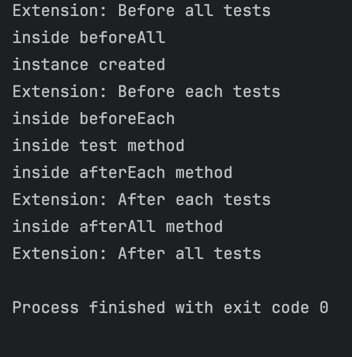

---

### 2. Parameter Resolver Extension

> With this, we can **dynamically supply values** to method or constructor parameters within a test class.

```java
public class Student {
    String name;
    int age;

    public Student(String name, int age) {
        this.name = name;
        this.age = age;
    }
}
```

```java
@ExtendWith(StudentParameterResolver.class)
class MyServiceTest {

    @Test
    void testMethod1(Student student) {
        System.out.println("Student name is: " + student.name);
    }
}
```
see above we need student class in testMethod1.

```java
public class StudentParameterResolver implements ParameterResolver {

    @Override
    public boolean supportsParameter(ParameterContext parameterContext,
                                      ExtensionContext extensionContext)
            throws ParameterResolutionException {

        return parameterContext.getParameter().getType() == Student.class;
    }

    @Override
    public Object resolveParameter(ParameterContext parameterContext,
                                    ExtensionContext extensionContext)
            throws ParameterResolutionException {

        return new Student("myName", 27);
    }
}
```
`ParameterResolver ` has two methods as seen above we need to resolve it

`supportsParameter` checks if the parameter is demanded can be created by me if yes then `resolveParamter` is exceuted .

if multiple parameters are needed we need multiple `ParameterResolver`.

---

- `@ExtendWith(StudentParameterResolver.class)` **at class level** — applied to all methods and constructors.
- Can also be used **at method level** — then applied to that particular method only.

> `ParameterContext` has all the info about the particular parameter: its position in the parameter list, its type, and which method or constructor declared this variable.

Output:

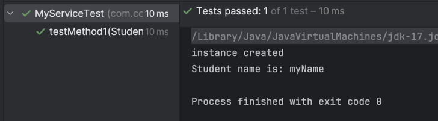


if `testMethod1` has multiple parameters,then we need multiple parameter resolver ,whichever parametrResolver supports it ,that will get the chnace to create object.


**What if `testMethod1` has multiple parameters?**

> If a test method has **multiple parameters**, we need **multiple `ParameterResolver`s** (one capable of resolving each parameter type) — registered together via `@ExtendWith({...})`. For **each parameter**, JUnit goes through **all the registered resolvers**, one by one, and calls `supportsParameter()` on each. Whichever resolver's `supportsParameter()` returns `true` for that particular parameter is the one that "gets the chance" to actually create/resolve the object for it, via `resolveParameter()`.

```java
public class Course {
    String title;

    public Course(String title) {
        this.title = title;
    }
}
```

```java
public class CourseParameterResolver implements ParameterResolver {

    @Override
    public boolean supportsParameter(ParameterContext parameterContext,
                                      ExtensionContext extensionContext)
            throws ParameterResolutionException {

        return parameterContext.getParameter().getType() == Course.class;
    }

    @Override
    public Object resolveParameter(ParameterContext parameterContext,
                                    ExtensionContext extensionContext)
            throws ParameterResolutionException {

        return new Course("JUnit5 Mastery");
    }
}
```

Register **both** resolvers on the class — order inside `@ExtendWith({...})` doesn't matter, since each resolver is only asked "can *you* handle *this* parameter?":

```java
@ExtendWith({StudentParameterResolver.class, CourseParameterResolver.class})
class MyServiceTest {

    @Test
    void testMethod1(Student student, Course course) {
        System.out.println("Student name is: " + student.name);
        System.out.println("Course title is: " + course.title);
    }
}
```

**What JUnit does internally, parameter by parameter:**

```
For parameter 1 (Student student):
    StudentParameterResolver.supportsParameter() → true   → StudentParameterResolver.resolveParameter() is called
    CourseParameterResolver.supportsParameter()  → false  → skipped for this parameter

For parameter 2 (Course course):
    StudentParameterResolver.supportsParameter() → false  → skipped for this parameter
    CourseParameterResolver.supportsParameter()  → true   → CourseParameterResolver.resolveParameter() is called
```

> If **none** of the registered resolvers return `true` for a given parameter, JUnit throws a `ParameterResolutionException` (no resolver found). If **more than one** resolver returns `true` for the *same* parameter, JUnit also throws an exception — resolution for a single parameter must be **unambiguous**, exactly one resolver should claim it.

We can use `ExtendWith` at method level too.

`LifeCycle Extension` cannot be at method level,it will always be at class level.

---

### 3. Execution Condition Extension

> Helps decide whether a test should be **enabled or disabled at runtime**, based on custom logic.

**`junit-platform.properties`:**

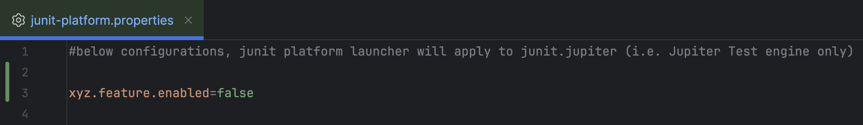

```java
public class ConditionalExecutionExtension implements ExecutionCondition {

    @Override
    public ConditionEvaluationResult evaluateExecutionCondition(ExtensionContext context) {

        boolean featureEnabled = Boolean.parseBoolean(
                context.getConfigurationParameter("xyz.feature.enabled").orElse("false")
        );

        return featureEnabled
                ? ConditionEvaluationResult.enabled("feature enabled, test can run")
                : ConditionEvaluationResult.disabled("feature disabled, test can not run");
    }
}
```

`@ExtendWith(ConditionalExecutionExtension.class)` used on top of a **method** — applies only to that method. Used on top of a **class** — applies to all methods of that class.

```java
class MyServiceTest {

    @Test
    @ExtendWith(ConditionalExecutionExtension.class)
    void testMethod1() {
        System.out.println("inside testMethod1");
    }

    @Test
    void testMethod2() {
        System.out.println("inside testMethod2");
    }
}
```

Output — only `testMethod1` is gated by the condition, so it's ignored while `testMethod2` runs normally:

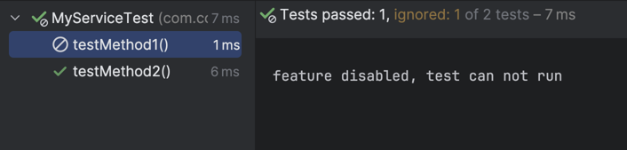

Using the extension on top of the class instead:

```java
@ExtendWith(ConditionalExecutionExtension.class)
class MyServiceTest {

    @Test
    void testMethod1() {
        System.out.println("inside testMethod1");
    }

    @Test
    void testMethod2() {
        System.out.println("inside testMethod2");
    }
}
```

Output (feature is currently disabled — both tests fail the condition):

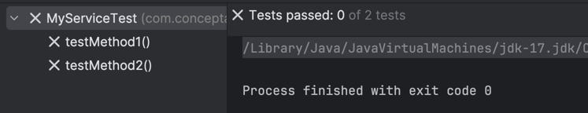

---

### 4. Test Execution Callback Extension

> Adds code logic **before or after** a test method executes.

We could do the same with `@BeforeEach`/`@AfterEach`, but those carry setup logic — it's not a good idea to mix them with custom logic like recording execution time, etc.as `@BeforeEach`/`@AfterEach` first is used to initialize variables and later to clean up.

- **`BeforeTestExecutionCallback`** — runs just **before** the invocation of the test method (after `BeforeAllCallback`, `@BeforeAll`, `BeforeEachCallback`, `@BeforeEach`).
- **`AfterTestExecutionCallback`** — runs just **after** the invocation of the test method (before `@AfterEach`, `AfterEachCallback`, `@AfterAll`, `AfterAllCallback`).

we want to get start time ane end time before every method. We do not use `@BeforeEach`/`@AfterEach` as first is used to initialize variables and later to clean up. also using  `@BeforeEach`/`@AfterEach` we need to put logic in every class which is not good.

```java
public class TestExecutionExtension implements BeforeTestExecutionCallback,
        AfterTestExecutionCallback {

    @Override
    public void beforeTestExecution(ExtensionContext context) {
        System.out.println("Starting test at: " + Instant.now());
    }

    @Override
    public void afterTestExecution(ExtensionContext context) {
        System.out.println("Finished test at: " + Instant.now());
    }
}
```

`@ExtendWith(TestExecutionExtension.class)` can also be used on top of a particular test method, if we don't want it applied to all test methods.

```java
@ExtendWith(TestExecutionExtension.class)
class MyServiceTest {

    @BeforeEach
    void beforeEachMethod() {
        System.out.println("inside beforeEach method");
    }

    @Test
    void testMethod1() {
        System.out.println("inside testMethod1");
    }

    @AfterEach
    void afterEachMethod() {
        System.out.println("inside afterEach method");
    }
}
```
>Note:This methods will run just before and after the `testMethod`

Output:

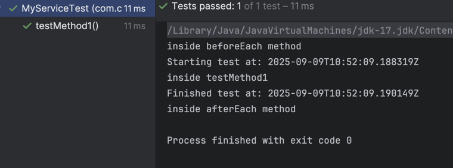

---

### 5. Invocation Interceptor Extension

> Helps **wrap the execution** of a test method — so we can write **pre-processing** and **post-processing** logic.

```java
public class CustomInvocationExtension implements InvocationInterceptor {

    @Override
    public void interceptTestMethod(Invocation<Void> invocation,
                                     ReflectiveInvocationContext<Method> context,
                                     ExtensionContext extensionContext) throws Throwable {

        System.out.println("Pre-processing before test");

        invocation.proceed(); // actual test runs here

        System.out.println("Post-processing after test");
    }
}
```

**Used at class level:**

```java
@ExtendWith(CustomInvocationExtension.class)
class MyServiceTest {

    @Test
    void testMethod1() {
        System.out.println("inside testMethod1");
    }
}
```

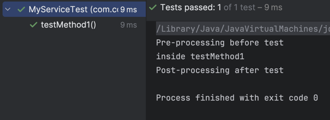

**Used at method level:**

```java
class MyServiceTest {

    @Test
    void testMethod1() {
        System.out.println("inside testMethod1");
    }

    @Test
    @ExtendWith(CustomInvocationExtension.class)
    void testMethod2() {
        System.out.println("inside testMethod2");
    }
}
```

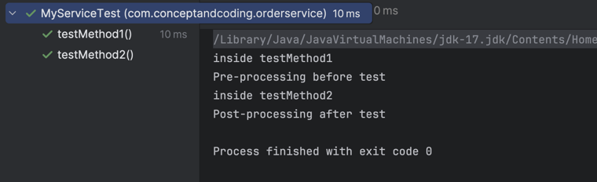

---

### 6. Exception Handler Extension

> Helps intercept exceptions thrown by a test method and handle them in our own way.

```java
public class CustomExceptionHandler implements TestExecutionExceptionHandler {

    @Override
    public void handleTestExecutionException(ExtensionContext context, Throwable throwable)
            throws Throwable {

        System.out.println("Exception occurred in test: " + context.getDisplayName());
        System.out.println("Exception message: " + throwable.getMessage());

        throw throwable;//just re throwing the exception
    }
}
```

```java
@ExtendWith(CustomExceptionHandler.class)
class MyServiceTest {

    @Test
    void testMethod1() {
        System.out.println("inside testMethod1");
        int x = 1 / 0;
    }
}
```

Output:

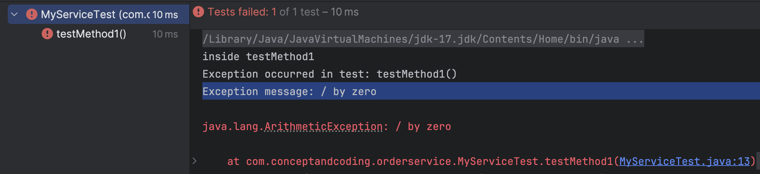

---

### 7. Instance Post Processor Extension

> Helps **manipulate or initialize** the test instance **after it has been created** — it runs before any lifecycle method or extension runs, or even the test method itself.

```java
public class CustomPostProcessorExtension implements TestInstancePostProcessor {

    @Override
    public void postProcessTestInstance(Object testObj, ExtensionContext context) {
        if (testObj instanceof MyServiceTest) {
            MyServiceTest myServiceTestObj = (MyServiceTest) testObj;
            myServiceTestObj.value = 100;
        }
    }
}
```

`@ExtendWith(CustomPostProcessorExtension.class)` can also be used at method level (works well for `PER_METHOD` lifecycle, since it creates a new instance for each test method).

```java
@ExtendWith(CustomPostProcessorExtension.class)
public class MyServiceTest {

    public int value;

    @Test
    void testMethod1() {
        System.out.println("inside testMethod1: " + value);
    }
}
```

Output:

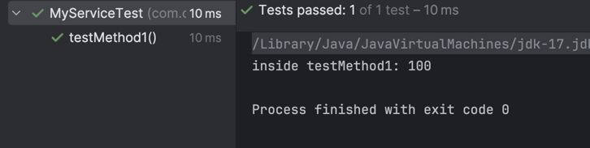

---

### Dummy Flow of the Jupiter Engine — Ordering of JUnit5 Extensions

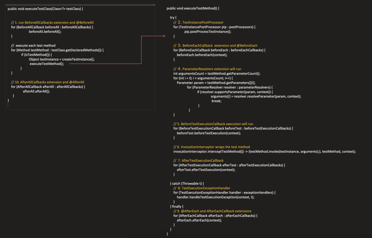

```java
public void executeTestClass(Class<?> testClass) {

    // 1. run BeforeAllCallbacks extension and @BeforeAll
    for (BeforeAllCallback beforeAll : beforeAllCallbacks) {
        beforeAll.beforeAll();
    }

    // execute for each test method
    for (Method testMethod : testClass.getDeclaredMethods()) {
        if (isTestMethod()) {
            Object testInstance = createTestInstance();
            executeTestMethod();
        }
    }

    // 10. AfterAllCallbacks extension and @AfterAll
    for (AfterAllCallback afterAll : afterAllCallbacks) {
        afterAll.afterAll();
    }
}

public void executeTestMethod() {

    try {
        // 2. TestInstancePostProcessor
        for (TestInstancePostProcessor pip : postProcessors) {
            pip.postProcessTestInstance();
        }

        // 3. BeforeEachCallback extension and @BeforeEach
        for (BeforeEachCallback beforeEach : beforeEachCallbacks) {
            beforeEach.beforeEach(context);
        }

        // 4. ParameterResolvers extension will run
        int argumentsCount = testMethod.getParameterCount();
        for (int i = 0; i < argumentsCount; i++) {
            Parameter param = testMethod.getParameters()[i];
            for (ParameterResolver resolver : parameterResolvers) {
                if (resolver.supportsParameter(param, context)) {
                    arguments[i] = resolver.resolveParameter(param, context);
                    break;
                }
            }
        }

        // 5. BeforeTestExecutionCallback execution will run
        for (BeforeTestExecutionCallback beforeTest : beforeTestExecutionCallbacks) {
            beforeTest.beforeTestExecution(context);
        }

        // 6. InvocationInterceptor wraps the test method
        invocationInterceptor.interceptTestMethod(() -> {
            testMethod.invoke(testInstance, arguments);
        }, testMethod, context);

        // 7. AfterTestExecutionCallback
        for (AfterTestExecutionCallback afterTest : afterTestExecutionCallbacks) {
            afterTest.afterTestExecution(context);
        }

    } catch (Throwable t) {
        // 8. TestExecutionExceptionHandler
        for (TestExecutionExceptionHandler handler : exceptionHandlers) {
            handler.handleTestExecutionException(context, t);
        }
    } finally {
        // 9. @AfterEach and AfterEachCallback extensions
        for (AfterEachCallback afterEach : afterEachCallbacks) {
            afterEach.afterEach(context);
        }
    }
}
```

**Ordering summary:**

1. `BeforeAllCallback` extensions + `@BeforeAll`
2. `TestInstancePostProcessor`
3. `BeforeEachCallback` extensions + `@BeforeEach`
4. `ParameterResolver` extensions
5. `BeforeTestExecutionCallback` extensions
6. `InvocationInterceptor` wraps the test method (`@Test` runs here)
7. `AfterTestExecutionCallback` extensions
8. `TestExecutionExceptionHandler` (only if an exception was thrown)
9. `@AfterEach` + `AfterEachCallback` extensions
10. `AfterAllCallback` extensions + `@AfterAll`
