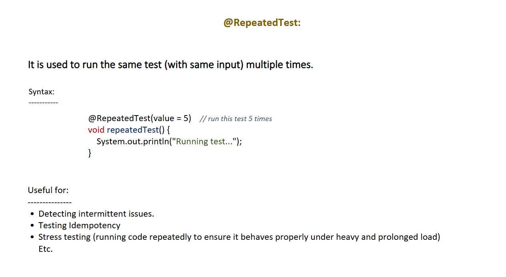
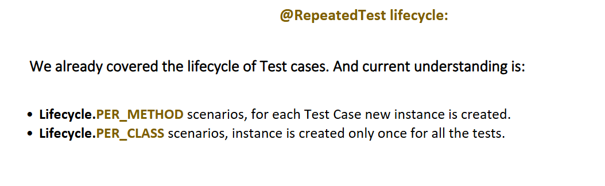
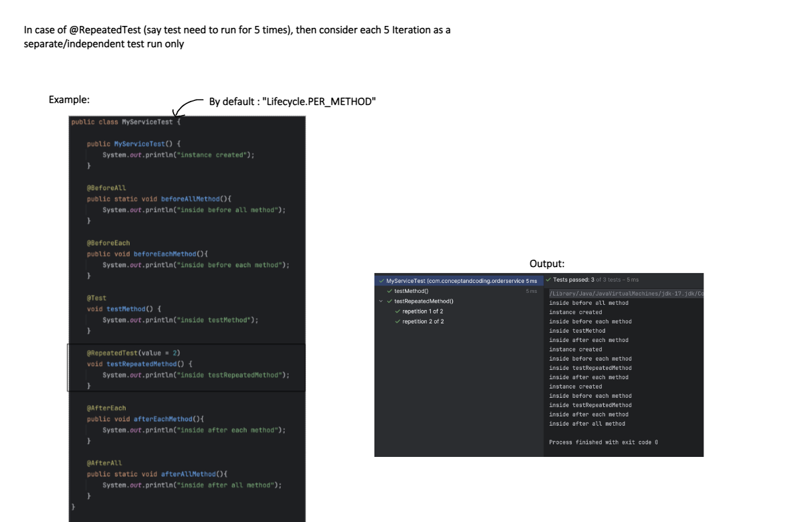
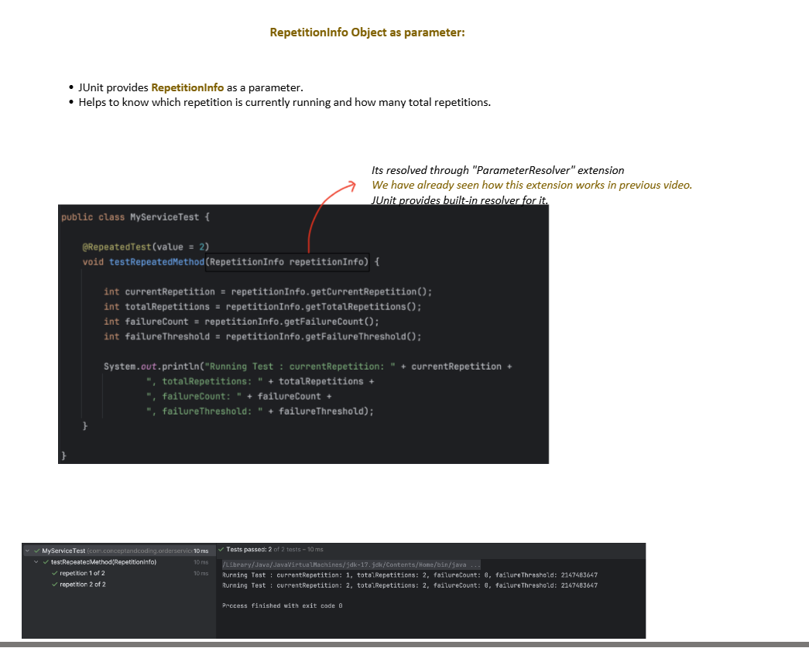
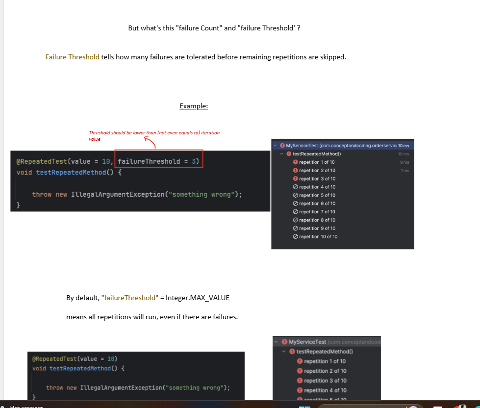
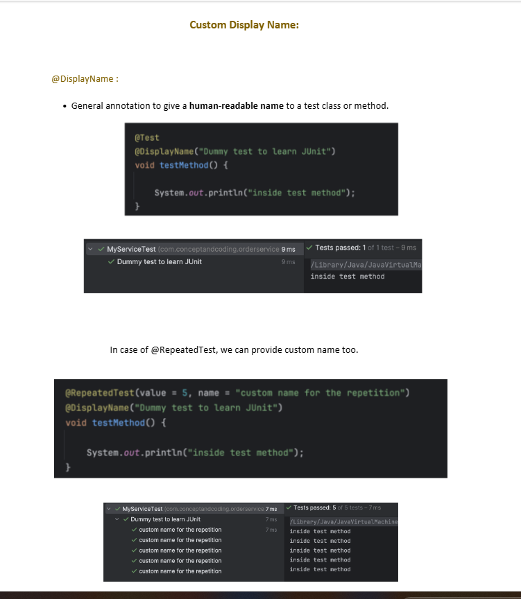
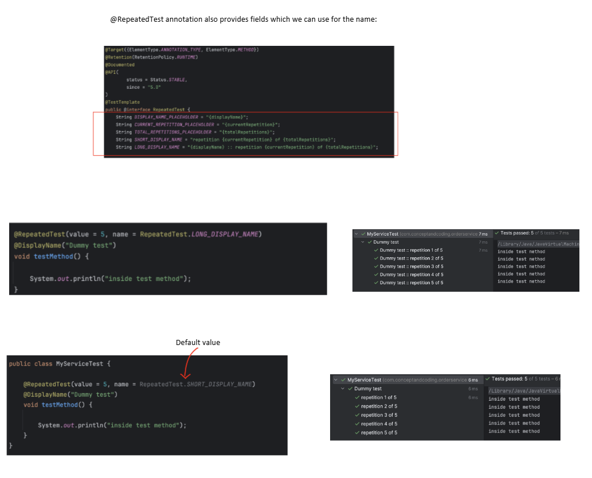
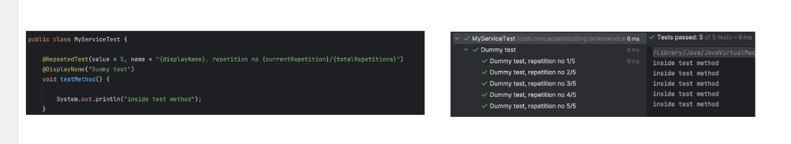

 This shows exactly how `@RepeatedTest` works with the lifecycle. Let me explain everything in complete detail.

`@RepeatedTest` internally has `@Test` annotation so we do pnot put `@Test` after `@RepeatedTest`!!


---

### What is `@RepeatedTest`?

> It runs the **same test method N times** — and each repetition is treated as a **completely independent test** with its own full lifecycle.

```java
@RepeatedTest(5)  // runs this test 5 times
void myTest() { ... }
// Each of 5 runs gets its OWN:
// → new class instance (PER_METHOD default)
// → @BeforeEach
// → @AfterEach
```

---

### The exact code from the image — explained

```java
public class MyServiceTest {

    // Constructor — called for EACH test method execution
    public MyServiceTest() {
        System.out.println("instance created");
    }

    @BeforeAll
    public static void beforeAllMethod() {
        System.out.println("inside before all method");
        // runs ONCE — before everything
    }

    @BeforeEach
    public void beforeEachMethod() {
        System.out.println("inside before each method");
        // runs before EVERY test AND every repetition
    }

    @Test
    void testMethod() {
        System.out.println("inside testMethod");
        // normal test — runs once
    }

    @RepeatedTest(value = 2)  // ← runs 2 times
    void testRepeatedMethod() {
        System.out.println("inside testRepeatedMethod");
        // runs 2 times — each as independent test
    }

    @AfterEach
    public void afterEachMethod() {
        System.out.println("inside after each method");
        // runs after EVERY test AND every repetition
    }

    @AfterAll
    public static void afterAllMethod() {
        System.out.println("inside after all method");
        // runs ONCE — after everything
    }
}
```

---

### Reading the output from the image — step by step

```
inside before all method       ← @BeforeAll (once)

// ── Normal @Test runs ──
instance created               ← new instance for testMethod()
inside before each method      ← @BeforeEach
inside testMethod              ← @Test
inside after each method       ← @AfterEach

// ── Repetition 1 of 2 ──
instance created               ← NEW instance for repetition 1
inside before each method      ← @BeforeEach
inside testRepeatedMethod      ← repetition 1
inside after each method       ← @AfterEach

// ── Repetition 2 of 2 ──
instance created               ← NEW instance for repetition 2
inside before each method      ← @BeforeEach
inside testRepeatedMethod      ← repetition 2
inside after each method       ← @AfterEach

inside after all method        ← @AfterAll (once)
```

This proves — **each repetition = completely independent test**:
- Fresh class instance created
- Full `@BeforeEach` → test → `@AfterEach` cycle
- Lifecycle is `PER_METHOD` by default

---

### IntelliJ sidebar from the image

```
MyServiceTest
    ✅ testMethod()              ← 1 test
    ✅ testRepeatedMethod()      ← parent node
         ✅ repetition 1 of 2   ← shown separately
         ✅ repetition 2 of 2   ← shown separately
Total: 3 tests passed ✅
```

Each repetition is a **separate node** in the test tree — you can see exactly which repetition failed!

---

### Basic `@RepeatedTest` usage

```java
@RepeatedTest(5)
void shouldRunFiveTimes() {
    System.out.println("Running test...");
    // Prints 5 times
    // Each time: new instance → @BeforeEach → test → @AfterEach
}
```

Let me explain `RepetitionInfo` completely with all details!

---

### What is `RepetitionInfo`?

> `RepetitionInfo` is an object **automatically injected** by JUnit into your `@RepeatedTest` method that gives you **complete information about the current repetition state**.

```java
@RepeatedTest(5)
void myTest(RepetitionInfo info) {
    //       ↑ JUnit injects this automatically
    //         via built-in ParameterResolver extension
}
```

---

### How injection works internally

```java
// JUnit's built-in ParameterResolver for RepetitionInfo:
class RepetitionInfoParameterResolver implements ParameterResolver {

    @Override
    public boolean supportsParameter(ParameterContext param,
                                     ExtensionContext ext) {
        // "Can I handle this parameter type?"
        return param.getParameter()
                    .getType() == RepetitionInfo.class; // YES ✅
    }

    @Override
    public Object resolveParameter(ParameterContext param,
                                   ExtensionContext ext) {
        // "Here is the actual RepetitionInfo object"
        return new DefaultRepetitionInfo(
            currentRepetition,  // which run (1,2,3...)
            totalRepetitions,   // total runs
            failureCount,       // how many failed so far
            failureThreshold    // max allowed failures
        );
    }
}
// You never write this — JUnit provides it built-in!
```

---

### All 4 methods — complete detail

---

### Method 1 — `getCurrentRepetition()`

```java
@RepeatedTest(5)
void shouldKnowCurrentRepetition(RepetitionInfo info) {

    // Returns which repetition is currently running
    int current = info.getCurrentRepetition();

    // Run 1 → returns 1
    // Run 2 → returns 2
    // Run 3 → returns 3
    // Run 4 → returns 4
    // Run 5 → returns 5

    System.out.println("Currently on: " + current);

    // Real use — vary test data per repetition
    double amount = current * 1000.0;
    // Rep 1 → 1000.0
    // Rep 2 → 2000.0
    // Rep 3 → 3000.0

    assertThat(taxService.calculate(amount))
        .isCloseTo(amount * 0.18, within(0.01));
}
```

---

### Method 2 — `getTotalRepetitions()`

```java
@RepeatedTest(5)
void shouldKnowTotalRepetitions(RepetitionInfo info) {

    // Returns total repetitions from @RepeatedTest(N)
    int total = info.getTotalRepetitions();
    // Always returns 5 — same for every repetition

    int current = info.getCurrentRepetition();

    // Detect FIRST repetition
    if (current == 1) {
        System.out.println("FIRST run — warm up cache");
        service.warmUp();
    }

    // Detect LAST repetition
    if (current == total) {
        System.out.println("LAST run — verify final state");
        assertThat(service.getCallCount()).isEqualTo(total);
    }

    // Middle repetitions
    if (current > 1 && current < total) {
        System.out.println("Middle run " + current);
    }

    // Progress tracking
    System.out.println(
        "Progress: " + current + "/" + total +
        " (" + (current * 100 / total) + "%)"
    );
    // Rep 1: Progress: 1/5 (20%)
    // Rep 2: Progress: 2/5 (40%)
    // Rep 3: Progress: 3/5 (60%)
    // Rep 4: Progress: 4/5 (80%)
    // Rep 5: Progress: 5/5 (100%)
}
```

---

### Method 3 — `getFailureCount()`

```java
@RepeatedTest(5)
void shouldTrackFailureCount(RepetitionInfo info) {

    // Returns how many repetitions have FAILED so far
    int failures = info.getFailureCount();

    // Before any failure → 0
    // After 1st rep fails → 1 (visible from 2nd rep onwards)
    // After 2nd rep fails → 2 (visible from 3rd rep onwards)

    System.out.println(
        "Rep " + info.getCurrentRepetition() +
        " | Failures so far: " + failures
    );

    // Real use — skip expensive setup if already failing
    if (failures > 0) {
        System.out.println("Previous failures detected!");
        // maybe use simpler/faster validation
    }

    // Simulate: fails on rep 2 and rep 4
    int current = info.getCurrentRepetition();
    if (current == 2 || current == 4) {
        throw new RuntimeException("Simulated failure!");
    }

    service.doWork();
}

// Timeline output:
// Rep 1 | Failures so far: 0  → PASSES ✅
// Rep 2 | Failures so far: 0  → FAILS  ❌ (failureCount becomes 1)
// Rep 3 | Failures so far: 1  → PASSES ✅
// Rep 4 | Failures so far: 1  → FAILS  ❌ (failureCount becomes 2)
// Rep 5 | Failures so far: 2  → PASSES ✅
```

---

### Method 4 — `getFailureThreshold()`

```java
// Default threshold — Integer.MAX_VALUE
@RepeatedTest(5)
void withDefaultThreshold(RepetitionInfo info) {

    int threshold = info.getFailureThreshold();
    // Returns: 2147483647 (Integer.MAX_VALUE)
    // = run ALL repetitions regardless of failures

    System.out.println("Threshold: " + threshold);
    // Threshold: 2147483647
    // Threshold: 2147483647
    // ... same every time
}


// Custom threshold
@RepeatedTest(value = 10, failureThreshold = 3)
void withCustomThreshold(RepetitionInfo info) {

    int threshold = info.getFailureThreshold();
    // Returns: 3

    int failures  = info.getFailureCount();
    int current   = info.getCurrentRepetition();

    System.out.println(
        "Rep: "       + current   +
        " | Failures: " + failures +
        "/" + threshold
    );

    // Real use — manual early exit
    if (failures >= threshold - 1) {
        // Approaching threshold — log warning
        System.out.println("⚠️ WARNING: Almost at failure limit!");
    }

    // JUnit automatically stops when
    // failureCount >= failureThreshold
    // No manual stopping needed — JUnit handles it!
}
```

---

### All 4 methods together — complete example

```java
@RepeatedTest(value = 5, failureThreshold = 3)
void shouldShowAllRepetitionInfo(RepetitionInfo info) {

    // ── All 4 methods ──
    int current   = info.getCurrentRepetition();   // 1,2,3,4,5
    int total     = info.getTotalRepetitions();    // always 5
    int failures  = info.getFailureCount();        // 0,1,2...
    int threshold = info.getFailureThreshold();    // always 3

    // Print complete state
    System.out.printf(
        "Rep %d/%d | Failures: %d/%d%n",
        current, total, failures, threshold
    );

    // First run setup
    if (current == 1) {
        System.out.println("→ First run: initializing");
    }

    // Last run cleanup
    if (current == total) {
        System.out.println("→ Last run: validating total");
        assertThat(failures).isLessThan(threshold);
    }

    // Stop if approaching threshold
    if (failures >= threshold - 1 && failures > 0) {
        System.out.println("→ WARNING: Near failure limit!");
    }

    // Your actual test logic
    orderService.processOrder(new Order("Item_" + current));

    assertThat(orderService.getProcessedCount())
        .isGreaterThan(0);
}

// Sample output:
// Rep 1/5 | Failures: 0/3 → First run: initializing
// Rep 2/5 | Failures: 0/3
// Rep 3/5 | Failures: 0/3
// Rep 4/5 | Failures: 0/3
// Rep 5/5 | Failures: 0/3 → Last run: validating total
```

---

### `RepetitionInfo` in practical scenarios

#### Scenario 1 — Retry pattern

```java
@RepeatedTest(value = 3, failureThreshold = 1)
void shouldRetryOnce(RepetitionInfo info) {

    System.out.println(
        "Attempt " + info.getCurrentRepetition() +
        " of " + info.getTotalRepetitions()
    );

    // Try connecting to flaky service
    // First attempt might fail — second should succeed
    externalService.connect();

    assertThat(externalService.isConnected()).isTrue();

    // If attempt 1 fails:
    // failureCount = 1 = threshold → rep 2,3 skipped
    // Test reported as failed

    // If attempt 1 passes:
    // All good — no retries needed
}
```

#### Scenario 2 — Load testing

```java
@RepeatedTest(100)
void shouldHandleLoad(RepetitionInfo info) {

    int current = info.getCurrentRepetition();
    int total   = info.getTotalRepetitions();

    // Log every 10th repetition
    if (current % 10 == 0) {
        System.out.println(
            "Progress: " + current + "/" + total +
            " | Failures: " + info.getFailureCount()
        );
    }

    // Test with increasing concurrent users
    int users = current;
    assertThat(service.handleUsers(users))
        .isEqualTo("OK");
}
```

#### Scenario 3 — Random data validation

```java
@RepeatedTest(50)
void shouldAlwaysGenerateValidData(RepetitionInfo info) {

    // Generate random test data
    User randomUser = userGenerator.generateRandom();

    // Validate — should ALWAYS be valid
    assertThat(randomUser.getName()).isNotBlank();
    assertThat(randomUser.getAge()).isBetween(0, 150);
    assertThat(randomUser.getEmail()).contains("@");

    // Log if close to end
    int remaining = info.getTotalRepetitions()
                  - info.getCurrentRepetition();
    if (remaining == 0) {
        System.out.println(
            "All 50 random users validated! " +
            "Failures: " + info.getFailureCount()
        );
    }
}
```

---

### `RepetitionInfo` ONLY works with `@RepeatedTest`

```java
// ✅ Works — @RepeatedTest
@RepeatedTest(5)
void works(RepetitionInfo info) { }

// ❌ FAILS — @Test does NOT support RepetitionInfo
@Test
void doesNotWork(RepetitionInfo info) { }
// ParameterResolutionException:
// No ParameterResolver registered for RepetitionInfo

// ❌ FAILS — @ParameterizedTest does NOT support it either
@ParameterizedTest
@ValueSource(ints = {1,2,3})
void doesNotWork(int val, RepetitionInfo info) { }
// Use RepetitionInfo ONLY with @RepeatedTest!
```

---

### Complete `RepetitionInfo` reference

| Method | Return type | Value | Changes per rep? |
|---|---|---|---|
| `getCurrentRepetition()` | `int` | 1, 2, 3... N | ✅ Yes |
| `getTotalRepetitions()` | `int` | Always N | ❌ No |
| `getFailureCount()` | `int` | 0, 1, 2... | ✅ Yes (after failures) |
| `getFailureThreshold()` | `int` | Custom or MAX_INT | ❌ No |

---

### Bottom line

> `RepetitionInfo` is JUnit's way of giving your test **self-awareness** — it knows exactly where it is in the repetition sequence
>
> `getCurrentRepetition()` — "which run am I on?"
> `getTotalRepetitions()` — "how many total runs?"
> `getFailureCount()` — "how many have failed before me?"
> `getFailureThreshold()` — "when will JUnit stop running?"
>
> It's injected automatically via JUnit's built-in **ParameterResolver** — just declare it as a parameter and JUnit handles everything
>
> Only works with `@RepeatedTest` — not with `@Test` or `@ParameterizedTest`


---

### Using `RepetitionInfo` — know WHICH repetition you're on

```java
@RepeatedTest(5)
void shouldKnowCurrentRepetition(RepetitionInfo repetitionInfo) {
    // JUnit injects RepetitionInfo automatically!

    int current = repetitionInfo.getCurrentRepetition(); // 1,2,3,4,5
    int total   = repetitionInfo.getTotalRepetitions();  // 5

    System.out.println("Running " + current + " of " + total);

    // Use repetition number in your test logic:
    if (current == 1) {
        System.out.println("First run — setup extra data");
    }
    if (current == total) {
        System.out.println("Last run — verify final state");
    }
}
```

---

### Custom display name for repetitions

```java
// Default display name:
@RepeatedTest(3)
void defaultName() { }
// Shows: repetition 1 of 3
//        repetition 2 of 3
//        repetition 3 of 3

// Custom display name:
@RepeatedTest(
    value = 3,
    name = "Test {currentRepetition} of {totalRepetitions}"
)
void customName() { }
// Shows: Test 1 of 3
//        Test 2 of 3
//        Test 3 of 3

// Even more descriptive:
@RepeatedTest(
    value = 3,
    name = "Retry attempt {currentRepetition}/{totalRepetitions}"
)
void retryTest() { }
// Shows: Retry attempt 1/3
//        Retry attempt 2/3
//        Retry attempt 3/3

// Available placeholders:
// {displayName}        → method name
// {currentRepetition} → current run number
// {totalRepetitions}  → total runs
```

---

### Real world use cases

#### Use case 1 — Test randomness/non-deterministic behavior

```java
@RepeatedTest(100)
void shouldAlwaysGenerateValidToken() {

    // Arrange
    TokenService tokenService = new TokenService();

    // Act — token generation uses random values
    String token = tokenService.generate();

    // Assert — run 100 times to catch rare failures
    assertThat(token)
        .isNotBlank()
        .hasSize(32)
        .matches("[A-Za-z0-9]+");
    // If token generation has a bug that occurs 1% of time
    // → single test misses it
    // → 100 repetitions catches it ✅
}
```

#### Use case 2 — Test concurrency issues

```java
@RepeatedTest(50)
void shouldHandleConcurrentAccess(RepetitionInfo info) {

    // Run same test 50 times to expose race conditions
    CounterService counter = new CounterService();

    // Simulate concurrent increment
    List<Thread> threads = IntStream.range(0, 10)
        .mapToObj(i -> new Thread(() -> counter.increment()))
        .collect(Collectors.toList());

    threads.forEach(Thread::start);
    threads.forEach(t -> {
        try { t.join(); } catch (InterruptedException e) {}
    });

    // Should always be 10 — race condition would cause less
    assertThat(counter.getCount()).isEqualTo(10);

    System.out.println("Repetition " + info.getCurrentRepetition()
        + ": count = " + counter.getCount());
}
```

#### Use case 3 — Retry flaky tests

```java
@RepeatedTest(
    value = 3,
    name = "Retry {currentRepetition} of {totalRepetitions}"
)
void shouldConnectToExternalService(RepetitionInfo info) {

    try {
        // External service might be briefly unavailable
        String response = externalService.ping();
        assertThat(response).isEqualTo("OK");

        // If we get here — test passed!
        System.out.println("Connected on attempt "
            + info.getCurrentRepetition());

    } catch (ServiceUnavailableException e) {
        if (info.getCurrentRepetition()
                == info.getTotalRepetitions()) {
            // Last retry — now actually fail
            fail("Service unavailable after "
                + info.getTotalRepetitions() + " attempts");
        }
        // Otherwise — let next repetition try again
    }
}
```

#### Use case 4 — Test with different data each repetition

```java
@RepeatedTest(5)
void shouldHandleRandomAmounts(RepetitionInfo info) {

    // Use repetition number to vary test data
    double amount = info.getCurrentRepetition() * 1000.0;
    // Rep 1: 1000.0
    // Rep 2: 2000.0
    // Rep 3: 3000.0
    // ...

    // Act
    double tax = taxService.calculate(amount);

    // Assert — 18% GST
    assertThat(tax).isCloseTo(amount * 0.18, within(0.01));
}
```

---

### `@RepeatedTest` vs `@ParameterizedTest`

```java
// @RepeatedTest — runs SAME test N times
// Use when: testing randomness, flakiness, concurrency
@RepeatedTest(5)
void repeatedTest() {
    double random = Math.random();
    assertThat(random).isBetween(0.0, 1.0);
    // Same assertion, different random value each time
}


// @ParameterizedTest — runs with DIFFERENT inputs
// Use when: testing same logic with different data
@ParameterizedTest
@ValueSource(ints = {1, 2, 3, 4, 5})
void parameterizedTest(int value) {
    assertThat(value).isPositive();
    // Different value each run
}
```

---

### Full lifecycle with `@RepeatedTest(2)` — visualized

```
@BeforeAll (ONCE)
│
│  ┌─── Repetition 1 ──────────────────────┐
│  │  new TestInstance()  ← PER_METHOD      │
│  │  @BeforeEach                           │
│  │  testRepeatedMethod() ← repetition 1  │
│  │  @AfterEach                            │
│  └────────────────────────────────────────┘
│
│  ┌─── Repetition 2 ──────────────────────┐
│  │  new TestInstance()  ← fresh instance! │
│  │  @BeforeEach                           │
│  │  testRepeatedMethod() ← repetition 2  │
│  │  @AfterEach                            │
│  └────────────────────────────────────────┘
│
@AfterAll (ONCE)
```

Each repetition is **completely isolated** — no shared state between them (with default PER_METHOD lifecycle).

---

### Summary table

| Feature | `@Test` | `@RepeatedTest(N)` |
|---|---|---|
| Runs how many times | Once | N times |
| Each run isolated | Yes | Yes — fresh instance |
| `@BeforeEach` called | Once | Once per repetition |
| `@AfterEach` called | Once | Once per repetition |
| IntelliJ shows | 1 node | 1 parent + N children |
| `RepetitionInfo` available | No | Yes — injected |
| Best for | Normal tests | Random, flaky, concurrency |

---

### Bottom line

> `@RepeatedTest(N)` treats each repetition as a **completely independent test** with its own full lifecycle — new instance, `@BeforeEach`, test, `@AfterEach`
>
> Use `RepetitionInfo` to know **which repetition** you're currently on and adapt your test logic accordingly
>
> Best used for testing **non-deterministic behavior** (randomness, concurrency, network flakiness) where running once might not catch rare bugs — running 50 or 100 times dramatically increases confidence





Great diagram! This explains the `RepetitionInfo` object in complete detail. Let me break down everything.

---

### What is `RepetitionInfo`?

> It is an object JUnit **automatically injects** into your `@RepeatedTest` method that tells you **everything about the current repetition**.

```java
@RepeatedTest(2)
void testRepeatedMethod(RepetitionInfo repetitionInfo) {
    //                  ↑
    // JUnit injects this automatically
    // via ParameterResolver extension (built-in)
}
```

---

### How does JUnit inject it? — ParameterResolver

As the diagram says:
> *"It's resolved through ParameterResolver extension. JUnit provides built-in resolver for it."*

```java
// JUnit has this built-in internally:
class RepetitionInfoParameterResolver implements ParameterResolver {

    @Override
    public boolean supportsParameter(
            ParameterContext paramContext,
            ExtensionContext extContext) {
        // "Can I provide this parameter type?"
        return paramContext.getParameter()
                           .getType() == RepetitionInfo.class;
        // YES — if parameter type is RepetitionInfo
    }

    @Override
    public Object resolveParameter(
            ParameterContext paramContext,
            ExtensionContext extContext) {
        // "Here is the actual value"
        return new RepetitionInfoImpl(
            currentRepetition,   // which run we're on
            totalRepetitions,    // total runs
            failureCount,        // how many failed so far
            failureThreshold     // max allowed failures
        );
    }
}
// You never write this — JUnit ships it built-in!
```

---

### The exact code from the image — fully explained

```java
@RepeatedTest(value = 2)
void testRepeatedMethod(RepetitionInfo repetitionInfo) {

    // Method 1 — getCurrentRepetition()
    int currentRepetition = repetitionInfo.getCurrentRepetition();
    // Repetition 1 → returns 1
    // Repetition 2 → returns 2

    // Method 2 — getTotalRepetitions()
    int totalRepetitions = repetitionInfo.getTotalRepetitions();
    // Always returns 2 (value from @RepeatedTest)

    // Method 3 — getFailureCount()
    int failureCount = repetitionInfo.getFailureCount();
    // How many repetitions have FAILED so far
    // Repetition 1 → 0 (nothing failed yet)
    // Repetition 2 → 0 (rep 1 passed) OR 1 (rep 1 failed)

    // Method 4 — getFailureThreshold()
    int failureThreshold = repetitionInfo.getFailureThreshold();
    // Max failures allowed before stopping
    // Default = Integer.MAX_VALUE (2147483647)
    // = basically "never stop due to failures"

    System.out.println(
        "Running Test : currentRepetition: " + currentRepetition +
        ", totalRepetitions: "               + totalRepetitions  +
        ", failureCount: "                   + failureCount      +
        ", failureThreshold: "               + failureThreshold
    );
}
```

---

### Output from the image — explained

```
// Repetition 1 output:
Running Test : currentRepetition: 1,
               totalRepetitions: 2,
               failureCount: 0,        ← nothing failed yet
               failureThreshold: 2147483647  ← Integer.MAX_VALUE

// Repetition 2 output:
Running Test : currentRepetition: 2,
               totalRepetitions: 2,
               failureCount: 0,        ← rep 1 passed, so still 0
               failureThreshold: 2147483647  ← Integer.MAX_VALUE
```

`2147483647` = `Integer.MAX_VALUE` = default threshold = practically unlimited failures allowed.

---

### All 4 methods of `RepetitionInfo`

#### 1. `getCurrentRepetition()`

```java
@RepeatedTest(5)
void shouldKnowCurrentRun(RepetitionInfo info) {

    int current = info.getCurrentRepetition();
    // Run 1 → 1
    // Run 2 → 2
    // Run 3 → 3
    // Run 4 → 4
    // Run 5 → 5

    System.out.println("Currently on run: " + current);
}
```

#### 2. `getTotalRepetitions()`

```java
@RepeatedTest(5)
void shouldKnowTotalRuns(RepetitionInfo info) {

    int total = info.getTotalRepetitions();
    // Always 5 — regardless of which repetition

    System.out.println("Total runs: " + total);

    // Use to detect last repetition:
    if (info.getCurrentRepetition() == total) {
        System.out.println("This is the LAST repetition!");
    }
}
```

#### 3. `getFailureCount()`

```java
@RepeatedTest(5)
void shouldTrackFailures(RepetitionInfo info) {

    int failures = info.getFailureCount();
    // Before any failure → 0
    // After 1st rep fails → 1
    // After 2nd rep fails → 2

    System.out.println("Failures so far: " + failures);

    // Use to stop if too many failures:
    if (failures >= 2) {
        fail("Too many failures — stopping test!");
    }

    // Your test logic here...
    // If this repetition fails → failureCount increases for next rep
}
```

#### 4. `getFailureThreshold()`

```java
// Setting a custom failure threshold:
@RepeatedTest(
    value = 10,
    failureThreshold = 3  // stop after 3 failures
)
void shouldStopAfterThreeFailures(RepetitionInfo info) {

    int threshold = info.getFailureThreshold();
    // Returns 3 — your custom value

    System.out.println(
        "Will stop after " + threshold + " failures"
    );

    // JUnit automatically stops running repetitions
    // when failureCount reaches failureThreshold!
}
```

---

### `failureThreshold` — real power feature

```java
// Without failureThreshold:
@RepeatedTest(100)
void withoutThreshold(RepetitionInfo info) {
    // If EVERY rep fails → runs all 100 → very slow!
    riskyOperation(); // might fail
}

// With failureThreshold:
@RepeatedTest(value = 100, failureThreshold = 3)
void withThreshold(RepetitionInfo info) {
    // Stops automatically after 3 failures!
    // No need to run all 100 if clearly broken
    riskyOperation();
}

// Execution example with failureThreshold = 3:
// Rep 1  → PASSES ✅ (failureCount = 0)
// Rep 2  → FAILS  ❌ (failureCount = 1)
// Rep 3  → FAILS  ❌ (failureCount = 2)
// Rep 4  → FAILS  ❌ (failureCount = 3 = threshold!)
// Rep 5-100 → SKIPPED ⏭️ automatically — threshold reached!
```

---

### Real world examples using `RepetitionInfo`

#### Example 1 — progressive data

```java
@RepeatedTest(5)
void shouldHandleIncreasingLoad(RepetitionInfo info) {

    // Scale load based on repetition number
    int requestCount = info.getCurrentRepetition() * 100;
    // Rep 1 → 100 requests
    // Rep 2 → 200 requests
    // Rep 3 → 300 requests
    // Rep 4 → 400 requests
    // Rep 5 → 500 requests

    long startTime = System.currentTimeMillis();

    // Send that many requests
    IntStream.range(0, requestCount)
             .forEach(i -> service.processRequest());

    long duration = System.currentTimeMillis() - startTime;

    System.out.println("Rep " + info.getCurrentRepetition()
        + ": " + requestCount + " requests in " + duration + "ms");

    // Assert response time scales reasonably
    assertThat(duration).isLessThan(requestCount * 10L);
}
```

#### Example 2 — first and last repetition special handling

```java
@RepeatedTest(5)
void shouldDoSpecialThingsOnFirstAndLast(RepetitionInfo info) {

    int current = info.getCurrentRepetition();
    int total   = info.getTotalRepetitions();

    // First repetition — extra setup
    if (current == 1) {
        System.out.println("First rep — warming up cache");
        service.warmUp();
    }

    // Middle repetitions — normal test
    String result = service.process("input_" + current);
    assertThat(result).isNotNull();

    // Last repetition — verify accumulated state
    if (current == total) {
        System.out.println("Last rep — verifying final state");
        assertThat(service.getProcessedCount()).isEqualTo(total);
    }
}
```

#### Example 3 — stop on too many failures

```java
@RepeatedTest(value = 10, failureThreshold = 2)
void shouldStopEarlyOnFailures(RepetitionInfo info) {

    System.out.println(
        "Rep " + info.getCurrentRepetition()
        + " | Failures so far: " + info.getFailureCount()
        + " | Threshold: " + info.getFailureThreshold()
    );

    // Simulate flaky test — fails every 3rd repetition
    if (info.getCurrentRepetition() % 3 == 0) {
        fail("Simulated failure on rep "
            + info.getCurrentRepetition());
    }

    service.doWork();

    // Execution:
    // Rep 1  → PASSES ✅ (failureCount=0)
    // Rep 2  → PASSES ✅ (failureCount=0)
    // Rep 3  → FAILS  ❌ (failureCount=1)
    // Rep 4  → PASSES ✅ (failureCount=1)
    // Rep 5  → PASSES ✅ (failureCount=1)
    // Rep 6  → FAILS  ❌ (failureCount=2 = threshold!)
    // Rep 7-10 → SKIPPED ⏭️ threshold reached!
}
```

---

### `RepetitionInfo` methods — complete reference

| Method | Returns | Description |
|---|---|---|
| `getCurrentRepetition()` | `int` | Which repetition is running (1-based) |
| `getTotalRepetitions()` | `int` | Total repetitions from `@RepeatedTest(N)` |
| `getFailureCount()` | `int` | How many reps have failed so far |
| `getFailureThreshold()` | `int` | Max failures before stopping (default = MAX_INT) |

---

### IntelliJ sidebar — from the image

```
MyServiceTest
    ✅ testRepeatedMethod(RepetitionInfo)
         ✅ repetition 1 of 2    ← each shown separately
         ✅ repetition 2 of 2

Tests passed: 2 of 2 tests — 10ms
```

Each repetition is a **separate node** — if repetition 2 fails, you see exactly which one failed instantly.

---

### Bottom line

> `RepetitionInfo` is automatically injected by JUnit's built-in **`ParameterResolver`** extension — you just declare it as a parameter and JUnit handles everything
>
> It gives you 4 key pieces of information: **current repetition**, **total repetitions**, **failure count so far**, and **failure threshold**
>
> Use `failureThreshold` to **stop early** when too many repetitions fail — prevents wasting time running 100 tests when clearly something is broken after 3 failures
>
> The default `failureThreshold` is `Integer.MAX_VALUE` (2147483647) — meaning JUnit will run ALL repetitions regardless of failures unless you set a custom threshold





Perfect! This image clearly shows the difference between **with** and **without** `failureThreshold`. Let me explain everything in complete detail.

---

### What is `failureThreshold`?

> It tells JUnit — **"how many failures to tolerate before SKIPPING remaining repetitions"**

```java
@RepeatedTest(value = 10, failureThreshold = 3)
// Run 10 times total
// BUT stop (skip remaining) after 3 failures
```

---

### The two examples from the image

---

### Example 1 — WITH `failureThreshold = 3`

```java
@RepeatedTest(value = 10, failureThreshold = 3)
void testRepeatedMethod() {
    throw new IllegalArgumentException("something wrong");
    // Every repetition FAILS
}
```

Output from the image:

```
MyServiceTest
    ⚠️ testRepeatedMethod()
         ❌ repetition 1 of 10   ← FAILED  (failureCount = 1)
         ❌ repetition 2 of 10   ← FAILED  (failureCount = 2)
         ❌ repetition 3 of 10   ← FAILED  (failureCount = 3 = threshold!)
         ⏭️ repetition 4 of 10   ← SKIPPED automatically
         ⏭️ repetition 5 of 10   ← SKIPPED
         ⏭️ repetition 6 of 10   ← SKIPPED
         ⏭️ repetition 7 of 10   ← SKIPPED
         ⏭️ repetition 8 of 10   ← SKIPPED
         ⏭️ repetition 9 of 10   ← SKIPPED
         ⏭️ repetition 10 of 10  ← SKIPPED
```

After 3 failures → threshold reached → remaining 7 are **automatically skipped** ⏭️

---

### Example 2 — WITHOUT `failureThreshold` (default)

```java
@RepeatedTest(value = 10)
// No failureThreshold → default = Integer.MAX_VALUE
void testRepeatedMethod() {
    throw new IllegalArgumentException("something wrong");
    // Every repetition FAILS
}
```

Output from the image:

```
MyServiceTest
    ❌ testRepeatedMethod()
         ❌ repetition 1 of 10   ← FAILED
         ❌ repetition 2 of 10   ← FAILED
         ❌ repetition 3 of 10   ← FAILED
         ❌ repetition 4 of 10   ← FAILED
         ❌ repetition 5 of 10   ← FAILED
         ... and so on
         ❌ repetition 10 of 10  ← FAILED
// ALL 10 run — no stopping — even though ALL fail!
```

ALL 10 run regardless — because default threshold = `Integer.MAX_VALUE` = practically unlimited.

---

### The important note from the image

> **"Threshold should be lower than (not even equals to) iteration value"**

```java
// ❌ WRONG — threshold equals value
@RepeatedTest(value = 10, failureThreshold = 10)
// If all 10 fail → threshold=10 reached on last rep
// No benefit — same as not having threshold!

// ❌ WRONG — threshold greater than value
@RepeatedTest(value = 10, failureThreshold = 15)
// Threshold can never be reached — useless!

// ✅ CORRECT — threshold LESS than value
@RepeatedTest(value = 10, failureThreshold = 3)
// Stops after 3 failures — saves running 7 more useless reps ✅

// Rule:
// failureThreshold < value (total repetitions)
```

---

### How JUnit tracks `failureCount` internally

```java
// Simplified internal JUnit logic:
int failureCount = 0;

for (int current = 1; current <= totalRepetitions; current++) {

    // Check threshold BEFORE running
    if (failureCount >= failureThreshold) {
        // Skip this and all remaining repetitions
        markAsSkipped("repetition " + current);
        continue;
    }

    try {
        // Run your test method
        executable.execute();
        // Passed — failureCount stays same

    } catch (Throwable t) {
        // Failed — increment counter
        failureCount++;
        markAsFailed("repetition " + current, t);
    }
}
```

```
Execution timeline with value=10, threshold=3:

Rep 1  → runs → FAILS  → failureCount=1 (1 < 3 → continue)
Rep 2  → runs → FAILS  → failureCount=2 (2 < 3 → continue)
Rep 3  → runs → FAILS  → failureCount=3 (3 >= 3 → STOP!)
Rep 4  → check: 3 >= 3 → SKIP ⏭️
Rep 5  → check: 3 >= 3 → SKIP ⏭️
...
Rep 10 → check: 3 >= 3 → SKIP ⏭️
```

---

### Real world examples

#### Example 1 — Flaky external service

```java
@RepeatedTest(value = 5, failureThreshold = 2)
void shouldConnectToPaymentGateway() {

    // External service might be flaky
    // Tolerate 2 failures but not more
    String response = paymentGateway.ping();
    assertThat(response).isEqualTo("OK");

    // If gateway is truly down:
    // Rep 1 → FAILS ❌ (failureCount=1)
    // Rep 2 → FAILS ❌ (failureCount=2 = threshold!)
    // Rep 3,4,5 → SKIPPED ⏭️
    // → Test fails fast — don't waste time!
}
```

#### Example 2 — Random number validation

```java
@RepeatedTest(value = 100, failureThreshold = 1)
void shouldAlwaysGeneratePositiveRandom() {

    double random = randomService.generate();

    // Should NEVER be negative
    // threshold=1 means → stop IMMEDIATELY on first failure
    assertThat(random).isPositive();

    // If there's a bug:
    // Rep 1-49  → PASSES ✅
    // Rep 50    → FAILS ❌ (failureCount=1 = threshold!)
    // Rep 51-100 → SKIPPED ⏭️
    // → Fails fast as soon as bug found!
}
```

#### Example 3 — Using `RepetitionInfo` with threshold

```java
@RepeatedTest(value = 10, failureThreshold = 3)
void shouldMonitorFailures(RepetitionInfo info) {

    System.out.println(
        "Rep: "       + info.getCurrentRepetition() +
        "/" + info.getTotalRepetitions() +
        " | Failures: " + info.getFailureCount() +
        "/" + info.getFailureThreshold()
    );

    // Simulate: fails on rep 2 and rep 4
    int current = info.getCurrentRepetition();
    if (current == 2 || current == 4) {
        throw new RuntimeException("Simulated failure!");
    }

    // Timeline:
    // Rep 1  → PASSES ✅ | Failures: 0/3
    // Rep 2  → FAILS  ❌ | Failures: 1/3
    // Rep 3  → PASSES ✅ | Failures: 1/3
    // Rep 4  → FAILS  ❌ | Failures: 2/3
    // Rep 5  → PASSES ✅ | Failures: 2/3
    // ... continues because 2 < 3 threshold
    // Rep 10 → PASSES ✅ | Failures: 2/3
    // All 10 run — threshold=3 never reached!
}
```

---

### `failureThreshold` decision guide

```
How many failures should stop the test?

ZERO tolerance (stop immediately on first fail):
    failureThreshold = 1
    Use when: bug should NEVER occur (security, data integrity)

LOW tolerance:
    failureThreshold = 2 or 3
    Use when: testing flaky external services

MEDIUM tolerance:
    failureThreshold = value/2  (half the repetitions)
    Use when: testing randomly failing operations

NO threshold (default):
    failureThreshold = Integer.MAX_VALUE (don't set it)
    Use when: need data from ALL repetitions regardless

Rule: failureThreshold < value (total reps)
```

---

### Summary table

| Scenario | `failureThreshold` | Behavior |
|---|---|---|
| Not set | `Integer.MAX_VALUE` | All reps run regardless of failures |
| `= 1` | Stop on first failure | Skip remaining after 1 fail |
| `= 3` | Tolerate 3 failures | Skip remaining after 3 fails |
| `= value` | Same as not set | Threshold never helps |
| `> value` | Useless | Threshold never reached |
| `< value` ✅ | Correct usage | Stops early when failures exceed threshold |

---

### Visual comparison

```
WITHOUT threshold (default):
value=10, all fail:
❌❌❌❌❌❌❌❌❌❌  → runs ALL 10 → SLOW & wasteful

WITH threshold=3:
value=10, all fail:
❌❌❌⏭️⏭️⏭️⏭️⏭️⏭️⏭️ → runs 3, skips 7 → FAST & efficient
```

---

### Bottom line

> `failureThreshold` = **"maximum failures I can tolerate before giving up on remaining repetitions"**
>
> Without it → ALL repetitions run even if every single one fails (wasteful for broken code)
>
> With it → JUnit **automatically skips** remaining repetitions once threshold is hit — **saves time** and **fails fast**
>
> Always set `failureThreshold` **strictly less than** `value` (total repetitions) — otherwise it has no effect
>
> Default is `Integer.MAX_VALUE` (2147483647) — meaning by default JUnit **never stops** due to failures alone











Great! These three images cover everything about **Custom Display Names** in JUnit 5. Let me explain all of it in complete detail.

---

### What is `@DisplayName`?

> Gives a **human-readable name** to a test class or method — shown in IntelliJ sidebar and test reports instead of the method name.

---

### Image 1 — `@DisplayName` basics

#### On a normal `@Test`

```java
// Without @DisplayName — shows method name
@Test
void testMethod() { }
// IntelliJ shows: testMethod()  ← not readable!

// With @DisplayName — shows your custom name
@Test
@DisplayName("Dummy test to learn JUnit")
void testMethod() {
    System.out.println("inside test method");
}
// IntelliJ shows: Dummy test to learn JUnit ← readable! ✅
```

Output from image 1:
```
MyServiceTest
    ✅ Dummy test to learn JUnit   ← custom name shown!
```

---

#### On `@RepeatedTest` — combine both annotations

```java
@RepeatedTest(value = 5, name = "custom name for the repetition")
@DisplayName("Dummy test to learn JUnit")
void testMethod() {
    System.out.println("inside test method");
}
```

Output from image 1:
```
MyServiceTest
    ✅ Dummy test to learn JUnit        ← @DisplayName = parent node name
         ✅ custom name for the repetition  ← name = each repetition name
         ✅ custom name for the repetition
         ✅ custom name for the repetition
         ✅ custom name for the repetition
         ✅ custom name for the repetition
Tests passed: 5 of 5
```

Key insight:
```
@DisplayName → controls the PARENT node name
name =       → controls each REPETITION node name
```

---

### Image 2 — Built-in placeholders from `@RepeatedTest`

#### The `@RepeatedTest` annotation source code

```java
public @interface RepeatedTest {

    // Placeholders you can use in name:
    String DISPLAY_NAME_PLACEHOLDER        = "{displayName}";
    // → replaced with @DisplayName value

    String CURRENT_REPETITION_PLACEHOLDER  = "{currentRepetition}";
    // → replaced with current repetition number (1,2,3...)

    String TOTAL_REPETITIONS_PLACEHOLDER   = "{totalRepetitions}";
    // → replaced with total repetitions

    String SHORT_DISPLAY_NAME =
        "repetition {currentRepetition} of {totalRepetitions}";
    // → DEFAULT format: "repetition 1 of 5"

    String LONG_DISPLAY_NAME =
        "{displayName} :: repetition {currentRepetition} of {totalRepetitions}";
    // → LONG format: "Dummy test :: repetition 1 of 5"
}
```

---

#### Using `LONG_DISPLAY_NAME`

```java
@RepeatedTest(value = 5, name = RepeatedTest.LONG_DISPLAY_NAME)
@DisplayName("Dummy test")
void testMethod() {
    System.out.println("inside test method");
}
```

Output from image 2:
```
MyServiceTest
    ✅ Dummy test                          ← @DisplayName
         ✅ Dummy test :: repetition 1 of 5  ← LONG_DISPLAY_NAME
         ✅ Dummy test :: repetition 2 of 5
         ✅ Dummy test :: repetition 3 of 5
         ✅ Dummy test :: repetition 4 of 5
         ✅ Dummy test :: repetition 5 of 5
```

Format: `{displayName} :: repetition {currentRepetition} of {totalRepetitions}`

---

#### Using `SHORT_DISPLAY_NAME` — DEFAULT

```java
@RepeatedTest(value = 5, name = RepeatedTest.SHORT_DISPLAY_NAME)
@DisplayName("Dummy test")
void testMethod() {
    System.out.println("inside test method");
}
// SHORT_DISPLAY_NAME is the DEFAULT —
// same as NOT specifying name at all
```

Output from image 2:
```
MyServiceTest
    ✅ Dummy test           ← @DisplayName
         ✅ repetition 1 of 5  ← SHORT_DISPLAY_NAME (default)
         ✅ repetition 2 of 5
         ✅ repetition 3 of 5
         ✅ repetition 4 of 5
         ✅ repetition 5 of 5
```

Format: `repetition {currentRepetition} of {totalRepetitions}`

---

### Image 3 — Custom format using placeholders

```java
@RepeatedTest(
    value = 5,
    name = "{displayName}, repetition no {currentRepetition}/{totalRepetitions}"
)
@DisplayName("Dummy test")
void testMethod() {
    System.out.println("inside test method");
}
```

Output from image 3:
```
MyServiceTest
    ✅ Dummy test                      ← @DisplayName
         ✅ Dummy test, repetition no 1/5  ← custom format
         ✅ Dummy test, repetition no 2/5
         ✅ Dummy test, repetition no 3/5
         ✅ Dummy test, repetition no 4/5
         ✅ Dummy test, repetition no 5/5
```

You can combine placeholders ANY way you want!

---

### All placeholders — complete reference

```java
// Available placeholders:
"{displayName}"          // → value from @DisplayName
"{currentRepetition}"    // → 1, 2, 3, 4, 5...
"{totalRepetitions}"     // → total count (5 in this case)

// Built-in constants:
RepeatedTest.SHORT_DISPLAY_NAME
// = "repetition {currentRepetition} of {totalRepetitions}"
// → "repetition 1 of 5"

RepeatedTest.LONG_DISPLAY_NAME
// = "{displayName} :: repetition {currentRepetition} of {totalRepetitions}"
// → "Dummy test :: repetition 1 of 5"
```

---

### All combinations — side by side

```java
// 1. No name, no DisplayName (bare minimum)
@RepeatedTest(5)
void testMethod() { }
// Shows: repetition 1 of 5
//        repetition 2 of 5  ...

// 2. Only @DisplayName
@RepeatedTest(5)
@DisplayName("Order Test")
void testMethod() { }
// Parent: Order Test
// Children: repetition 1 of 5
//           repetition 2 of 5 ...

// 3. Custom name only
@RepeatedTest(value = 5, name = "Run {currentRepetition}")
void testMethod() { }
// Shows: Run 1
//        Run 2  ...

// 4. SHORT_DISPLAY_NAME (default)
@RepeatedTest(value = 5, name = RepeatedTest.SHORT_DISPLAY_NAME)
@DisplayName("Order Test")
void testMethod() { }
// Parent: Order Test
// Children: repetition 1 of 5
//           repetition 2 of 5 ...

// 5. LONG_DISPLAY_NAME
@RepeatedTest(value = 5, name = RepeatedTest.LONG_DISPLAY_NAME)
@DisplayName("Order Test")
void testMethod() { }
// Parent: Order Test
// Children: Order Test :: repetition 1 of 5
//           Order Test :: repetition 2 of 5 ...

// 6. Fully custom format
@RepeatedTest(
    value = 5,
    name = "{displayName}, repetition no {currentRepetition}/{totalRepetitions}"
)
@DisplayName("Order Test")
void testMethod() { }
// Parent: Order Test
// Children: Order Test, repetition no 1/5
//           Order Test, repetition no 2/5 ...
```

---

### `@DisplayName` on test CLASS too

```java
@DisplayName("Order Service - All Tests")  // class level
class OrderServiceTest {

    @Test
    @DisplayName("Should calculate total price correctly")
    void shouldCalculateTotal() { }

    @Test
    @DisplayName("Should apply 10% discount for premium users")
    void shouldApplyDiscount() { }

    @RepeatedTest(
        value = 3,
        name = RepeatedTest.LONG_DISPLAY_NAME
    )
    @DisplayName("Should handle concurrent orders")
    void shouldHandleConcurrentOrders() { }
}
```

IntelliJ shows:
```
Order Service - All Tests                    ← class @DisplayName
    ✅ Should calculate total price correctly ← method @DisplayName
    ✅ Should apply 10% discount for premium users
    ✅ Should handle concurrent orders        ← @DisplayName
         ✅ Should handle concurrent orders :: repetition 1 of 3
         ✅ Should handle concurrent orders :: repetition 2 of 3
         ✅ Should handle concurrent orders :: repetition 3 of 3
```

---

### Why `@DisplayName` matters in reports

```
Without @DisplayName — cryptic test report:
────────────────────────────────────────────
✅ testCalcTotal()
✅ testApplyDisc()
❌ testConcOrd()
// What does testConcOrd mean? Hard to understand!

With @DisplayName — readable test report:
────────────────────────────────────────────
✅ Should calculate total price correctly
✅ Should apply 10% discount for premium users
❌ Should handle concurrent orders
// Crystal clear — even non-developers understand! ✅
```

---

### Summary table

| Annotation / Property | Controls | Example output |
|---|---|---|
| `@DisplayName("text")` on class | Class node name | `Order Service Tests` |
| `@DisplayName("text")` on method | Parent node name | `Should calculate total` |
| `name = "text"` | Each repetition name | `custom name for repetition` |
| `name = RepeatedTest.SHORT_DISPLAY_NAME` | Default format | `repetition 1 of 5` |
| `name = RepeatedTest.LONG_DISPLAY_NAME` | Long format | `Dummy test :: repetition 1 of 5` |
| `{displayName}` placeholder | Inserts `@DisplayName` value | `Dummy test` |
| `{currentRepetition}` placeholder | Current run number | `1`, `2`, `3`... |
| `{totalRepetitions}` placeholder | Total run count | `5` |

---

### Bottom line

> `@DisplayName` makes your tests **human-readable** in IDE and reports — use it on both classes and methods
>
> For `@RepeatedTest`, combine `@DisplayName` (parent node) with `name =` (each repetition node) for fully descriptive output
>
> Use built-in constants `SHORT_DISPLAY_NAME` (default) and `LONG_DISPLAY_NAME` — or build your **own format** by mixing `{displayName}`, `{currentRepetition}`, and `{totalRepetitions}` placeholders any way you like


###  How to create a **Custom Composed Annotation** that wraps `@RepeatedTest`. 

---

### What is this image showing?

> You can create your **OWN annotation** that inherits the behavior of `@RepeatedTest` — so instead of writing `@RepeatedTest(10)` every time, you just write `@TenIterations`.

This is called a **Meta-Annotation** or **Composed Annotation**.

---

### First — understanding `@RepeatedTest`'s own annotations

```java
// From the source code shown in the image:

@Target({ElementType.ANNOTATION_TYPE, ElementType.METHOD})
//        ↑                            ↑
//  can be used ON other annotations   can be used ON methods

@Retention(RetentionPolicy.RUNTIME)
// annotation available at runtime

@Documented
@API(status = Status.STABLE, since = "5.0")

@TestTemplate          // tells JUnit this is a test template
public @interface RepeatedTest {

    String DISPLAY_NAME_PLACEHOLDER        = "{displayName}";
    String CURRENT_REPETITION_PLACEHOLDER  = "{currentRepetition}";
    String TOTAL_REPETITIONS_PLACEHOLDER   = "{totalRepetitions}";
    String SHORT_DISPLAY_NAME = "repetition {currentRepetition} of {totalRepetitions}";
    String LONG_DISPLAY_NAME  = "{displayName} :: repetition {currentRepetition} of {totalRepetitions}";
}
```

Key point :
```
@Target({ElementType.ANNOTATION_TYPE, ElementType.METHOD})
                      ↑
         This means @RepeatedTest CAN be placed
         ON TOP OF another annotation!
         That's how composed annotations work!
```

---

### Creating `@TenIterations` — custom composed annotation

```java
// Step 1: Create your custom annotation
@Target({ ElementType.METHOD })
// ↑ can be placed on methods

@Retention(RetentionPolicy.RUNTIME)
// ↑ available at runtime so JUnit can read it

@RepeatedTest(10)
// ↑ THIS is the key!
// Place @RepeatedTest ON your annotation
// Your annotation INHERITS @RepeatedTest's behavior!
// = "this annotation means @RepeatedTest(10)"

public @interface TenIterations {
    // empty — all behavior inherited from @RepeatedTest(10)
}
```

```java
// Step 2: Use your annotation — super clean!
@TenIterations                    // ← your custom annotation
void testMethod() {
    System.out.println("inside test method");
}

// Instead of writing:
@RepeatedTest(10)                 // ← verbose
void testMethod() {
    System.out.println("inside test method");
}
```

---

### Output from the image

```
MyServiceTest
    ✅ testMethod()
         ✅ repetition 1 of 10
         ✅ repetition 2 of 10
         ✅ repetition 3 of 10
         ✅ repetition 4 of 10
         ✅ repetition 5 of 10
         ✅ repetition 6 of 10
         ✅ repetition 7 of 10
         ✅ repetition 8 of 10
         ✅ repetition 9 of 10
         ✅ repetition 10 of 10

Tests passed: 10 of 10 — 7ms
```

Works exactly like `@RepeatedTest(10)` — just with a cleaner annotation!

---

### More real world composed annotations

#### `@FiveIterations`

```java
@Target(ElementType.METHOD)
@Retention(RetentionPolicy.RUNTIME)
@RepeatedTest(5)
public @interface FiveIterations {
}

// Usage:
@FiveIterations
void shouldTestFiveTimes() { ... }
// = @RepeatedTest(5)
```

#### `@ThreeTimesWithThreshold`

```java
@Target(ElementType.METHOD)
@Retention(RetentionPolicy.RUNTIME)
@RepeatedTest(value = 3, failureThreshold = 1)
public @interface ThreeTimesWithThreshold {
}

// Usage:
@ThreeTimesWithThreshold
void shouldStopOnFirstFailure() { ... }
// = @RepeatedTest(value=3, failureThreshold=1)
```

#### `@RepeatedIntegrationTest` — combine multiple annotations

```java
@Target(ElementType.METHOD)
@Retention(RetentionPolicy.RUNTIME)
@RepeatedTest(
    value = 5,
    name = RepeatedTest.LONG_DISPLAY_NAME
)
@DisplayName("Integration Test")
@Tag("integration")               // tag for filtering
public @interface RepeatedIntegrationTest {
}

// Usage — ONE annotation does everything!
@RepeatedIntegrationTest
void shouldTestIntegration() { ... }

// = @RepeatedTest(value=5, name=LONG_DISPLAY_NAME)
// + @DisplayName("Integration Test")
// + @Tag("integration")
// All in ONE annotation! ✅
```

#### `@SlowTest` — composed with `@Test`

```java
// You can compose with @Test too!
@Target(ElementType.METHOD)
@Retention(RetentionPolicy.RUNTIME)
@Test
@Tag("slow")
@DisplayName("Slow Test")
@Timeout(value = 5, unit = TimeUnit.SECONDS)
public @interface SlowTest {
}

// Usage:
@SlowTest
void shouldCompleteWithinFiveSeconds() {
    // automatically tagged "slow"
    // automatically has 5 second timeout
    // automatically has "Slow Test" display name
}
```

---

### How composed annotations work internally

```
@TenIterations
void testMethod() { }

↓ JUnit reads the annotation

@TenIterations found
    → checks: what's ON @TenIterations?
    → finds: @RepeatedTest(10)
    → treats testMethod() as if it had @RepeatedTest(10)
    → runs 10 times!

This is called "meta-annotation inheritance"
JUnit's annotation processing handles it automatically
```

---

### `ElementType.ANNOTATION_TYPE` — why it matters

```java
// @RepeatedTest is declared with:
@Target({ElementType.ANNOTATION_TYPE, ElementType.METHOD})
//        ↑
// ANNOTATION_TYPE = can be placed ON OTHER annotations

// This is what allows:
@RepeatedTest(10)          // placed ON @TenIterations annotation
public @interface TenIterations { }

// If @RepeatedTest only had ElementType.METHOD:
@Target({ElementType.METHOD})  // only on methods
// Then you COULDN'T put @RepeatedTest on another annotation
// Composed annotations would be IMPOSSIBLE!
```

---

### Practical benefits

```
Without composed annotation:
────────────────────────────────────────────
// Every test class repeats same config:
@RepeatedTest(value = 10, failureThreshold = 3)
void test1() { }

@RepeatedTest(value = 10, failureThreshold = 3)
void test2() { }

@RepeatedTest(value = 10, failureThreshold = 3)
void test3() { }
// Repetitive! If you change config → update everywhere!

With composed annotation:
────────────────────────────────────────────
@TenIterations  // one place to change config
void test1() { }

@TenIterations
void test2() { }

@TenIterations
void test3() { }
// DRY principle! Change config in ONE place ✅
```

---

### Summary table

| Annotation property | Purpose |
|---|---|
| `@Target(ElementType.METHOD)` | Your annotation goes ON methods |
| `@Target(ElementType.ANNOTATION_TYPE)` | Your annotation goes ON other annotations |
| `@Retention(RetentionPolicy.RUNTIME)` | JUnit can read it at runtime |
| `@RepeatedTest(10)` | Inherits repeated test behavior |
| Empty body `{ }` | No extra properties needed |

---

### Bottom line

> `@RepeatedTest` has `ElementType.ANNOTATION_TYPE` in its `@Target` — this deliberately allows it to be placed **on top of other annotations**
>
> You can create your own **composed annotation** like `@TenIterations` by placing `@RepeatedTest(10)` on your custom annotation — JUnit automatically inherits all the behavior
>
> This follows the **DRY principle** — define your test configuration once in the annotation, reuse it everywhere with a single clean annotation instead of repeating `@RepeatedTest(value=10, failureThreshold=3, name="...")` on every method

