### `@RepeatedTest`

> It is used to run the **same test** (with the same input) **multiple times**.

```java
@RepeatedTest(value = 5)   // run this test 5 times
void repeatedTest() {
    System.out.println("Running test...");
}
```

**Useful for:**

- Detecting intermittent issues.
- Testing Idempotency.
- Stress testing (running code repeatedly to ensure it behaves properly under heavy and prolonged load).
- etc.

---

### `@RepeatedTest` Lifecycle

We already covered the lifecycle of test cases. Current understanding:

- `Lifecycle.PER_METHOD` scenarios — for each test case, a **new instance** is created.
- `Lifecycle.PER_CLASS` scenarios — instance is created **only once** for all the tests.

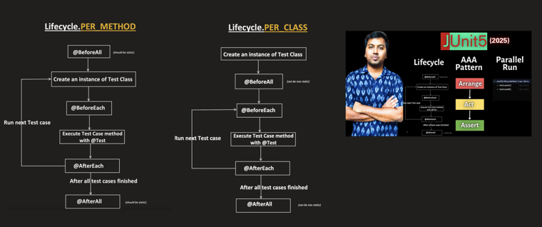

> In case of `@RepeatedTest` (say it needs to run 5 times), consider **each of the 5 iterations as a separate/independent test run**.

```java
public class MyServiceTest {

    public MyServiceTest() {
        System.out.println("instance created");
    }

    @BeforeAll
    public static void beforeAllMethod() {
        System.out.println("inside before all method");
    }

    @BeforeEach
    public void beforeEachMethod() {
        System.out.println("inside before each method");
    }

    @Test
    void testMethod() {
        System.out.println("inside testMethod");
    }

    @RepeatedTest(value = 2)
    void testRepeatedMethod() {
        System.out.println("inside testRepeatedMethod");
    }

    @AfterEach
    public void afterEachMethod() {
        System.out.println("inside after each method");
    }

    @AfterAll
    public static void afterAllMethod() {
        System.out.println("inside after all method");
    }
}
```

**Exact Execution Order (`PER_METHOD`):**

Before anything runs — a single call to `@BeforeAll` (static).

**Test 1 → `testMethod()`**
1. instance created
2. inside before each method
3. inside testMethod
4. inside after each method

**Test 2 → `testRepeatedMethod()` (1st repetition)** — each repetition = **new instance**
1. instance created
2. inside before each method
3. inside testRepeatedMethod
4. inside after each method

**Test 3 → `testRepeatedMethod()` (2nd repetition)** — again a new instance
1. instance created
2. inside before each method
3. inside testRepeatedMethod
4. inside after each method

**After all tests** — a single call to `@AfterAll` (static).

So the final printed output will be:

```
inside before all method

instance created
inside before each method
inside testMethod
inside after each method

instance created
inside before each method
inside testRepeatedMethod
inside after each method

instance created
inside before each method
inside testRepeatedMethod
inside after each method

inside after all method
```

---

### `RepetitionInfo` Object as Parameter

- JUnit provides `RepetitionInfo` as a parameter.
- Helps to know which repetition is currently running and how many total repetitions there are.

```java
import org.junit.jupiter.api.RepetitionInfo;
import org.junit.jupiter.api.RepeatedTest;

public class MyServiceTest {

    @RepeatedTest(value = 2)
    void testRepeatedMethod(RepetitionInfo repetitionInfo) {

        int currentRepetition = repetitionInfo.getCurrentRepetition();
        int totalRepetitions = repetitionInfo.getTotalRepetitions();
        int failureCount = repetitionInfo.getFailureCount();
        int failureThreshold = repetitionInfo.getFailureThreshold();

        System.out.println(
                "Running Test : currentRepetition: " + currentRepetition +
                ", totalRepetitions: " + totalRepetitions +
                ", failureCount: " + failureCount +
                ", failureThreshold: " + failureThreshold
        );
    }
}
```

Sample output for `value = 2`:

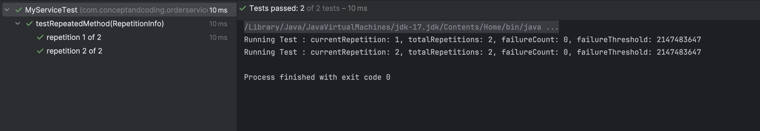

**`RepetitionInfo` gives you:**

| Method | Meaning |
|---|---|
| `getCurrentRepetition()` | Which iteration is running (1, 2, 3...) |
| `getTotalRepetitions()` | Total configured repetitions |
| `getFailureCount()` | How many previous repetitions failed |
| `getFailureThreshold()` | Maximum failures allowed before aborting |

---

### `failureCount` and `failureThreshold`

> **Failure Threshold** tells how many failures are tolerated before the remaining repetitions are **skipped**.

By default, `failureThreshold = Integer.MAX_VALUE`, meaning **all repetitions will run**, even if there are failures:

```java
@RepeatedTest(value = 10)
void testRepeatedMethod() {
    throw new IllegalArgumentException("something wrong");
}
```

All 10 repetitions run (and fail), since there's no threshold configured:

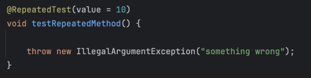
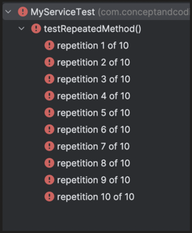

Setting an explicit `failureThreshold`:

> Threshold should be **lower than** (not even equal to) the iteration value.

```java
@RepeatedTest(value = 10, failureThreshold = 3)
void testRepeatedMethod() {
    throw new IllegalArgumentException("something wrong");
}
```

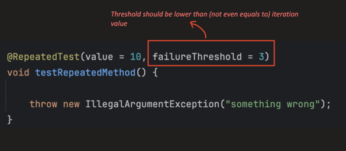

After 3 failures, the remaining repetitions are **skipped**:

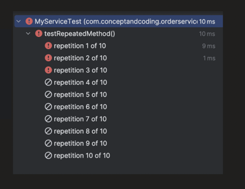

---

### Custom Display Name

**`@DisplayName`** — general annotation to give a human-readable name to a test class or method.

```java
@Test
@DisplayName("Dummy test to learn JUnit")
void testMethod() {
    System.out.println("inside test method");
}
```

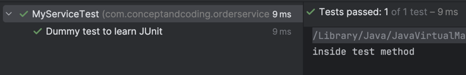

In case of `@RepeatedTest`, we can provide a custom `name` too:

```java
@RepeatedTest(value = 5, name = "custom name for the repetition")
@DisplayName("Dummy test to learn JUnit")
void testMethod() {
    System.out.println("inside test method");
}
```

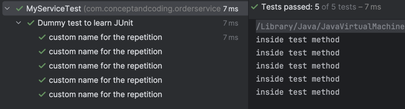

`@RepeatedTest` annotation source — it also provides fields which we can use for the name:

```java
@Target({ElementType.ANNOTATION_TYPE, ElementType.METHOD})
@Retention(RetentionPolicy.RUNTIME)
@Documented
@API(
        status = Status.STABLE,
        since = "5.0"
)
@TestTemplate
public @interface RepeatedTest {
    String DISPLAY_NAME_PLACEHOLDER = "{displayName}";
    String CURRENT_REPETITION_PLACEHOLDER = "{currentRepetition}";
    String TOTAL_REPETITIONS_PLACEHOLDER = "{totalRepetitions}";
    String SHORT_DISPLAY_NAME = "repetition {currentRepetition} of {totalRepetitions}";
    String LONG_DISPLAY_NAME = "{displayName} :: repetition {currentRepetition} of {totalRepetitions}";
}
```

> `ElementType.ANNOTATION_TYPE` means it can be used over an annotation too. `ElementType.METHOD` means it can be used over a method too.

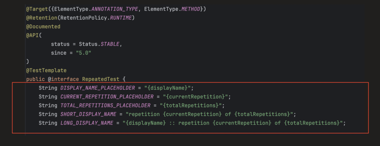

**Example 1 — `LONG_DISPLAY_NAME`:**

```java
@RepeatedTest(value = 5, name = RepeatedTest.LONG_DISPLAY_NAME)
@DisplayName("Dummy test")
void testMethod() {
    System.out.println("inside test method");
}
```

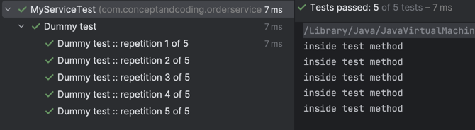

**Example 2 — `SHORT_DISPLAY_NAME` (default value):**

```java
public class MyServiceTest {

    // SHORT_DISPLAY_NAME is Default value
    @RepeatedTest(value = 5, name = RepeatedTest.SHORT_DISPLAY_NAME)
    @DisplayName("Dummy test")
    void testMethod() {
        System.out.println("inside test method");
    }
}
```

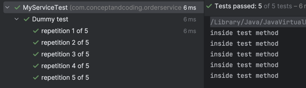

**Example 3 — custom placeholder string:**

```java
public class MyServiceTest {

    @RepeatedTest(value = 5, name = "{displayName}, repetition no {currentRepetition}/{totalRepetitions}")
    @DisplayName("Dummy test")
    void testMethod() {
        System.out.println("inside test method");
    }
}
```

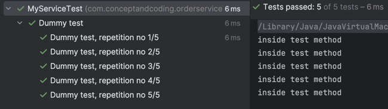

---

### Using `@RepeatedTest` as Metadata

In the Java playlist, custom annotations are already discussed in depth — check it out if there's any doubt.

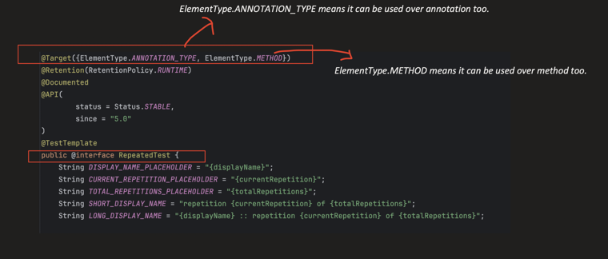

```java
@Target({ElementType.METHOD})
@Retention(RetentionPolicy.RUNTIME)
@RepeatedTest(10)
public @interface TenIterations {
}
```

```java
@TenIterations
void testMethod() {
    System.out.println("inside test method");
}
```

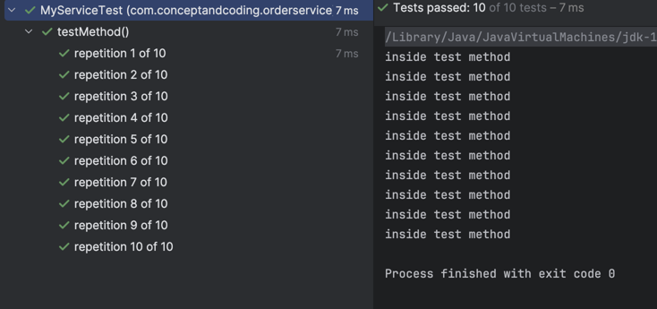
