### Definition

ReapeatedTests was used to do same test with same input multiple times but we need multiple inputs on different test case.

> Parameterized tests are used to run the **same test** (but with **different inputs**) multiple times.


For single parameter we have different way and multiple it is different see.

---

### Single Parameter Parameterized Tests

Provides a **single parameter** to the test, running it multiple times with different values.

- `@ValueSource`
- `@EnumSource`

These two only help in single parameter.

### Multiple Parameter Parameterized Tests

Provides **multiple parameters** to the test, running it multiple times with different values.

- `@CsvSource`
- `@CsvFileSource`


### Objects and complex parameters


3rd one is for complex parameters

### Single Parameter Parameterized Tests

first let us see this

#### `@ValueSource`

```java
public class MyStringUtilTest {

    @ParameterizedTest
    @ValueSource(strings = {"civic", "level", "madam"})
    void testPalindrome(String word) {
        assertTrue(MyStringUtil.isPalindrome(word));
    }
}
```

Test runs 3 times, each with a different parameter (`civic`, `level`, `madam`):

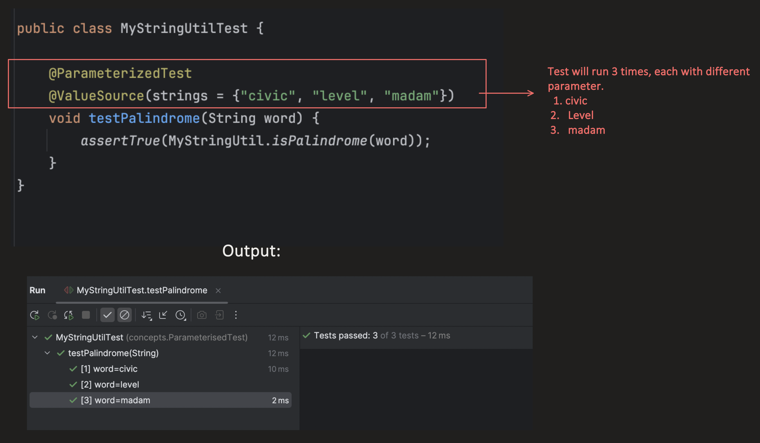

Supported types for `@ValueSource`:

| Supported Type | Example |
|---|---|
| strings | `@ValueSource(strings = {"civic","level","madam"})` |
| ints | `@ValueSource(ints = {1, 2, 3})` |
| shorts | `@ValueSource(shorts = {1, 2, 3})` |
| bytes | `@ValueSource(bytes = {1, 2, 3})` |
| longs | `@ValueSource(longs = {1L, 2L, 3L})` |
| floats | `@ValueSource(floats = {1.1f, 2.2f})` |
| doubles | `@ValueSource(doubles = {1.1, 2.2})` |
| classes | `@ValueSource(classes = {String.class, Integer.class})` |

---

### Implicit & Explicit Conversions

**Implicit Conversions** — JUnit 5 automatically converts between compatible types.

```java
// implicit conversion
@ParameterizedTest
@ValueSource(strings = {"1", "2", "3"})
void testImplicitIntConversion(int num) {   // String is converted to int implicitly
    assertTrue(num >= 1);
}
```

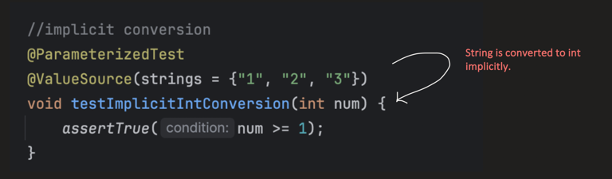

If it **can not** convert, it throws `ParameterResolutionException`:

```java
@ParameterizedTest
@ValueSource(strings = {"1", "2", "hello"})   // "hello" cannot convert to int
void testImplicitIntConversion(int num) {
    assertTrue(num >= 1);
}
```

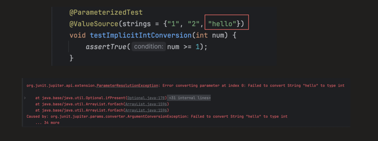

**Explicit Conversions** — `@ConvertWith` annotation along with the `ArgumentConverter` interface is used for manually defining the conversion logic.

- `@ValueSource` provides raw string values `"hello"`, `"world"`.
- `@ConvertWith` calls our converter **before** the test parameter is injected.
- Inside the converter, we define any custom logic.
- The test only sees the **converted** value.

```java
// explicit conversion
@ParameterizedTest
@ValueSource(strings = {"hello", "world"})
void testExplicitConversion(@ConvertWith(StringUpperCaseConverter.class) String word) {
    // All words are converted to uppercase before assertion
    assertEquals(word, word.toUpperCase());
}
```

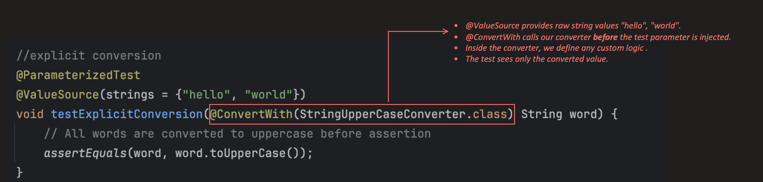

we have `StringUpperCaseConverter` clas below defined ,we only need to define it.

`ParameterContext` has all the info about the particular parameter: its position in the parameter list, its type, and which method or constructor declared this variable.

```java
public class StringUpperCaseConverter implements ArgumentConverter {

    @Override
    public Object convert(Object source, ParameterContext parameterContext) throws ArgumentConversionException {
        //custom logic
        if (source instanceof String && parameterContext.getParameter().getType() == String.class) {
            return ((String) source).toUpperCase();
        }
        throw new IllegalArgumentException("Conversion failed");
    }
}
```

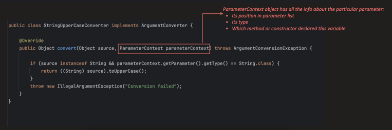

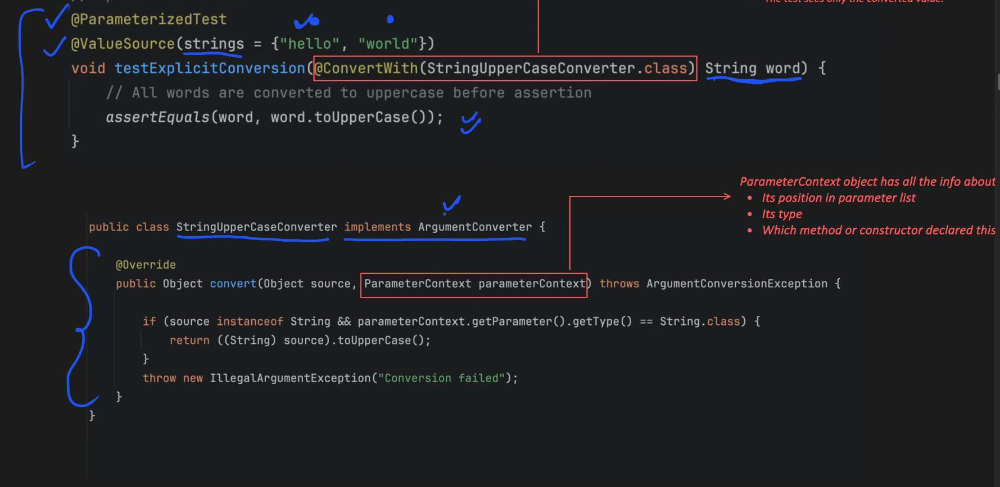

`ConvertWith` only converts single parameter.

---

### `@NullSource`, `@EmptySource`, `@NullAndEmptySource`

Using `@ValueSource` we **cannot** provide a `null` value, so there are specialized annotations for it:

- **`@NullSource`** — feeds a `NULL` value
- **`@EmptySource`** — feeds an empty value to the object
- **`@NullAndEmptySource`** — combines both

```java
@ParameterizedTest
@NullAndEmptySource
@ValueSource(strings = {"civic", "level", "madam"})
void testPalindrome(String word) {
    assertTrue(MyStringUtil.isPalindrome(word));
}
```

The `null` case fails (since `isPalindrome(null)` isn't handled), while the empty string and the rest pass:

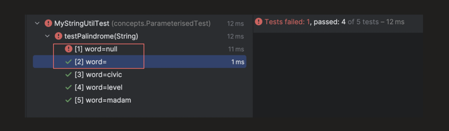

---

### `@EnumSource`

this is for single parameter only

```java
// Enum Parameter: All Enum values
@ParameterizedTest
@EnumSource(value = Day.class)
void testEnumValues(Day day) {
    assertTrue(day.name().length() > 0);
}
```

```java
public enum Day {
    SUNDAY, MONDAY, TUESDAY, WEDNESDAY, THURSDAY, FRIDAY, SATURDAY
}
```

Runs once for every enum constant (7 tests):

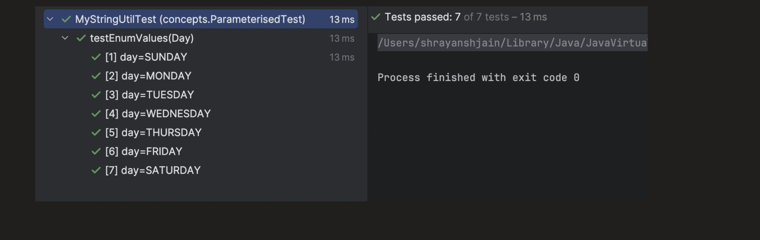

**Only Specific Enum Values** — using `names` with `mode`:

```java
// Enum Parameter: specific Enum values (INCLUDE is the default mode)
@ParameterizedTest
@EnumSource(value = Day.class, names = {"MONDAY", "TUESDAY"}, mode = EnumSource.Mode.INCLUDE)
void testEnumValues(Day day) {
    assertTrue(day.name().length() > 0);
}
```

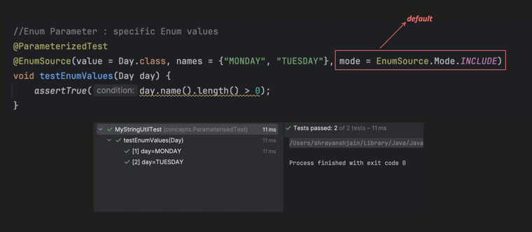

Using **Exclude** mode — runs for every value *except* the ones listed:

```java
// Enum Parameter: specific Enum values
@ParameterizedTest
@EnumSource(value = Day.class, names = {"MONDAY", "TUESDAY"}, mode = EnumSource.Mode.EXCLUDE)
void testEnumValues(Day day) {
    assertTrue(day.name().length() > 0);
}
```

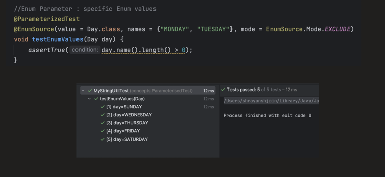

---

### Multiple Parameter Parameterized Tests

Provides **multiple parameters** to the test, running it multiple times with different values.

- `@CsvSource`
- `@CsvFileSource`

#### `@CsvSource`

Using this, we can provide multiple parameters inline. By default, `,` is used as the delimiter.


see below we need 3 parameters `a,b,expected`

```java
@ParameterizedTest
@CsvSource(value = {"1,2,3", "5,5,10"}, delimiter = ',')   // ',' is default, so even skipping it works fine
void testCSVSource(int a, int b, int expected) {
    assertEquals(expected, a + b);
}
```

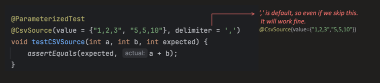

The first line can be used as a CSV header by setting `useHeadersInDisplayName = true`,so first line will be skipped

```java
@ParameterizedTest
@CsvSource(
        delimiter = '|',
        useHeadersInDisplayName = true,
        value = {
                "Val1|Val2|ExpectedVal",
                "1|2|3",
                "5|5|10",
                "4|1|5"
        }
)
void testCSVSourceWithHeader(int a, int b, int expected) {
    assertEquals(expected, a + b);
}
```

we have comma as delimeter and comma in input too,then? we use single quote for this

So what if a value itself needs a `,`? Enclose the value within `'` (single quotes):

```java
@ParameterizedTest
@CsvSource(value = {"hello,5", "world,5", "'Delhi,India',11"})
void testCSVSourceWithSingleQuotes(String word, int length) {
    assertEquals(length, word.length());
}
```

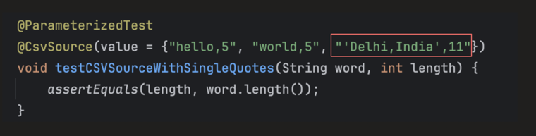

A few more edge cases:

| Example Input | Result |
|---|---|
| `@CsvSource({ "hello, world" })` | 1st argument: `hello`, 2nd argument: `world` |
| `@CsvSource({ "hello, 'Delhi, India'" })` | 1st argument: `hello`, 2nd argument: `Delhi,India` |
| `@CsvSource({ "hello, ''" })` — single quote start and end | 1st argument: `hello`, 2nd argument: `''` (empty) |
| `@CsvSource({ "hello, " })` | 1st argument: `hello`, 2nd argument: `null` |
| `@CsvSource(value = {"hello, world, N/A"}, nullValues = "N/A")` | 1st: `hello`, 2nd: `world`, 3rd: `null` As N/A is treated as null |
| `@CsvSource(value = {" hello, world"}, ignoreLeadingAndTrailingWhitespace = false)` — by default this is `true` | 1st: `' hello'`, 2nd: `' world'` (space not trimmed) |

---

#### `@CsvFileSource`

When input data is large, we can use `@CsvFileSource` to load test data from an **external CSV file** instead of writing it inline.

```java
@ParameterizedTest
// file is read from path: /src/test/resources
@CsvFileSource(resources = "/inputData.csv", numLinesToSkip = 1)
void testCSVFileSource(int a, int b, int expected) {
    assertEquals(expected, a + b);
}
```

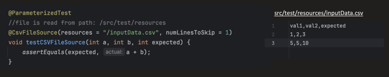

Output:

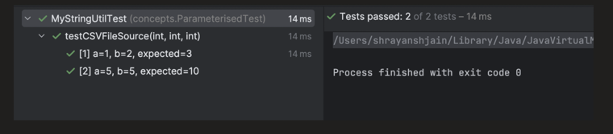

Instead of `numLinesToSkip`, we can also set `useHeadersInDisplayName = true`:

```java
@ParameterizedTest
// file is read from path: /src/test/resources
@CsvFileSource(resources = "/inputData.csv", useHeadersInDisplayName = true)
void testCSVFileSource(int a, int b, int expected) {
    assertEquals(expected, a + b);
}
```

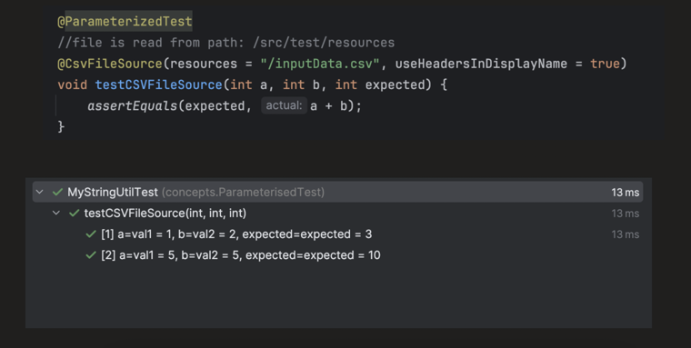

But **don't use both** — it will skip 2 lines: one by `numLinesToSkip`, another by `useHeadersInDisplayName` (which treats the line as a header and skips it too):

```java
@ParameterizedTest
@CsvFileSource(resources = "/inputData.csv", numLinesToSkip = 1, useHeadersInDisplayName = true)
void testCSVFileSource(int a, int b, int expected) {
    assertEquals(expected, a + b);
}
```

Only 1 test data run, and the first 2 rows got skipped:

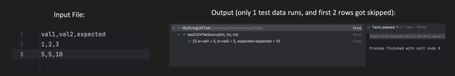

---

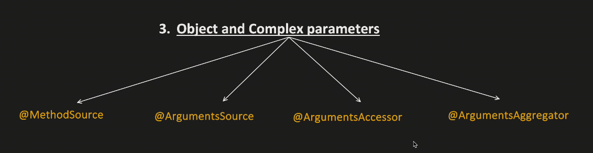

### Object and Complex Parameters — `@MethodSource`

Provides test data from a **static method** in the same or a different class. The static method can return any of these types (we can pass anything — `String`, `Integer`, `Object`, etc.):

- `Stream<T>` — for a single parameter
- `Stream<Arguments>` — for multiple parameters
- `Collection<T>` — for a single parameter
- `T[]` — for a single parameter
- `Object[]` — for a single parameter
- `Object[][]` — for multiple parameters
- etc.

**`Stream<T>`**

```java
@ParameterizedTest
@MethodSource("testDataForStreamSingleParameter")
void testMethodSourceStreamSingleParameter(String word) {
    assertTrue(MyStringUtil.isPalindrome(word));
}

static Stream<String> testDataForStreamSingleParameter() {
    return Stream.of("civic", "radar");
}
```

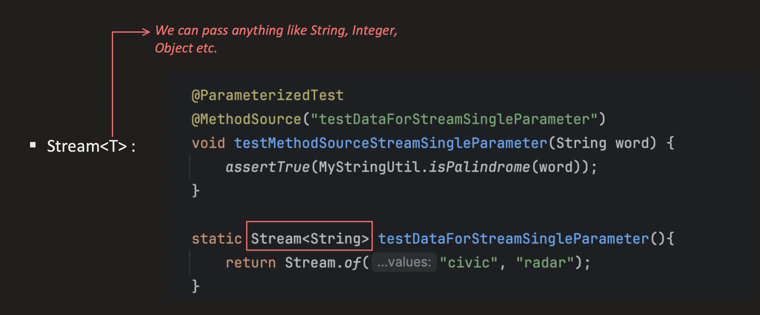

**`Collection<T>`** — when the test-data method name is omitted, by default it looks for a static method with the **same name as the test method**:

```java
@ParameterizedTest
@MethodSource()
void testMethodSourceCollectionSingleParameter(String word) {
    assertTrue(MyStringUtil.isPalindrome(word));
}

static List<String> testMethodSourceCollectionSingleParameter() {
    return List.of("civic", "radar", "madam");
}
```

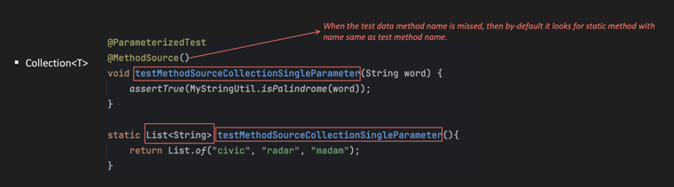

**`T[]`**

```java
@ParameterizedTest
@MethodSource("testDataForArraySingleParameter")
void testMethodSourceArraySingleParameter(String word) {
    assertTrue(MyStringUtil.isPalindrome(word));
}

static String[] testDataForArraySingleParameter() {
    return new String[] {"civic", "madam"};
}
```

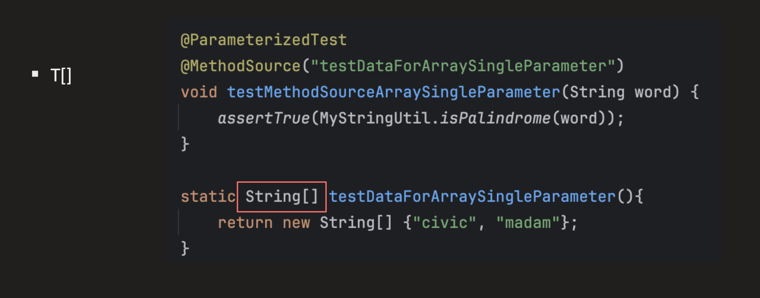

**`Object[]`** — object parameters too can be fed:

```java
@ParameterizedTest
@MethodSource("userTestData")
void testMethodSourceObjectArraySingleParameter(User user) {
    assertTrue(user.age > 18);
}

static Object[] userTestData() {
    return new Object[] {
            new User("A", 20),
            new User("B", 21)
    };
}
```

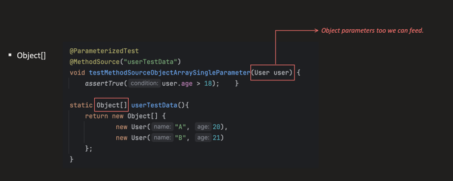

**`Stream<Arguments>`** — for multiple parameters:

```java
@ParameterizedTest
@MethodSource("testDataForStreamMultipleParameter")
void testMethodSourceStreamMultipleParameter(String word, int expectedLength) {
    assertEquals(expectedLength, word.length());
}

static Stream<Arguments> testDataForStreamMultipleParameter() {
    return Stream.of(
            Arguments.of("hello", 5),
            Arguments.of("world", 5));
}
```

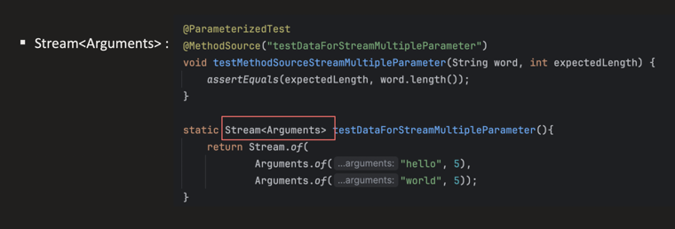

When the test-data static method is present in a **different class**, we need to provide the fully qualified path:

```java
@ParameterizedTest
@MethodSource("concepts.ParameterisedTest.User#testDataForStreamMultipleParameter2")
void testMethodSourceStreamMultipleParameter2(String word, int expectedLength) {
    assertEquals(expectedLength, word.length());
}
```

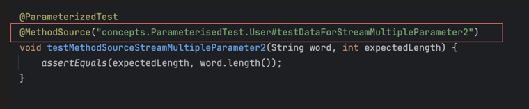

---

### `@ArgumentsSource`

Somewhat similar to `@MethodSource`, but here instead of a static method, we create a **separate class**, which provides more flexibility when we have complex test input data.

> `Arguments` represents one set of parameters for our test method.
>
> - `Arguments.of(1, 2, 3)` — multiple parameters
> - `Arguments.of("Hello")` — single parameter
> - `Arguments.of(userObj)` — object parameter

```java
@ParameterizedTest
@ArgumentsSource(UserArgumentProvider.class)
void testCustomSource(User user) {
    assertNotNull(user.name);
}
```

```java
public class UserArgumentProvider implements ArgumentsProvider {

    @Override
    public Stream<? extends Arguments> provideArguments(ExtensionContext context) {
        // ExtensionContext has info about: test method, test class, instance, annotations, parameters etc.
        return Stream.of(
                Arguments.of(new User("A", 25)),
                Arguments.of(new User("B", 30))
        );
    }
}
```

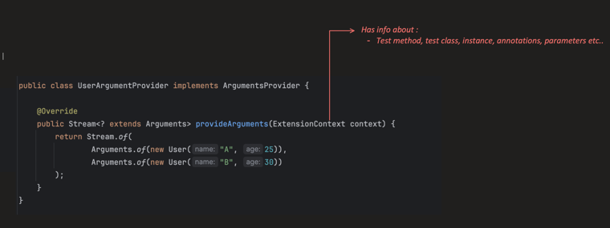

it can be used for complex objects. here return type be always `stream of arguments`

here we also get `ExtensionContext ` so taht you can see in Extensions notes.

---

### `@ArgumentsAccessor`

There could be a case where we have many parameters in the method signature, e.g.:

```java
void testWithMultipleParameter(String arg1, String arg2, String arg3, int arg4, int arg5, int arg6 /* ... */) {
}
```

One way to resolve this is `@ArgumentsAccessor`:

```java
@ParameterizedTest
@CsvSource({
        "A, 25",
        "B, 30"
})
void testWithArgumentsAccessor(ArgumentsAccessor accessor) {
    String name = accessor.getString(0);
    int age = accessor.getInteger(1);
    //use when you have multiple arguments like 10 or 20
    User userObj = new User(name, age);

    assertTrue(userObj.age > 18);
}
```

---

### `@ArgumentsAggregator`

Automatically maps multiple parameters into an object. This is similar to `@ConvertWith` (which we saw earlier), but that was only for a **single parameter** — `@AggregateWith` is for **multiple parameters**.

```java
@ParameterizedTest
@CsvSource({
        "A, 25",
        "B, 30"
})
void testAggregatorUser(@AggregateWith(UserAggregator.class) User user) {
    assertTrue(user.age > 20);
}
```

```java
class UserAggregator implements ArgumentsAggregator {

    @Override
    public Object aggregateArguments(ArgumentsAccessor accessor, ParameterContext context) {
        return new User(accessor.getString(0), accessor.getInteger(1));
    }
}
```

---

### Customizing Display Names

We can control the display name for each invocation:

| Placeholder | Meaning |
|---|---|
| `{index}` | Current invocation number |
| `{arguments}` | Comma-separated list of all arguments |
| `{0}`, `{1}`, `{2}` ... | Individual argument placeholders |

**Single Parameter:**

```java
@ParameterizedTest(name = "Test {index}: Testing palindrome for {0}")
@ValueSource(strings = {"civic", "madam"})
void testDisplayNameSingleParameter(String word) {
    assertTrue(MyStringUtil.isPalindrome(word));
}
```

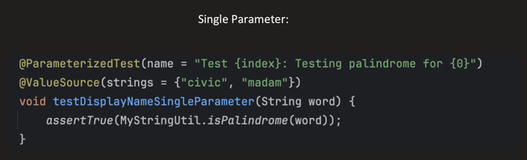

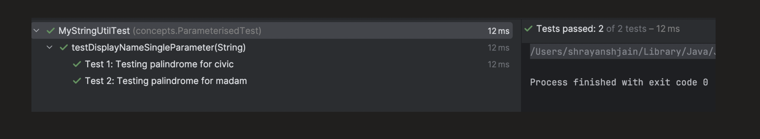

**Multiple Parameter:**

```java
@ParameterizedTest(name = "Test {index} : {arguments}")
@CsvSource(value = {"1,2,3", "5,5,10"}, delimiter = ',')
void testDisplayNameMultipleParameter(int a, int b, int expected) {
    assertEquals(expected, a + b);
}
```

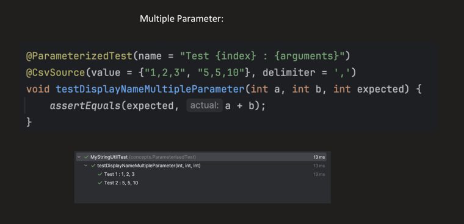

Or reference individual arguments — and combine them into a custom message:

```java
@ParameterizedTest(name = "Test {index} : {0} + {1} = {2}")
@CsvSource(value = {"1,2,3", "5,5,10"}, delimiter = ',')
void testDisplayNameMultipleParameterIndividually(int a, int b, int expected) {
    assertEquals(expected, a + b);
}
```

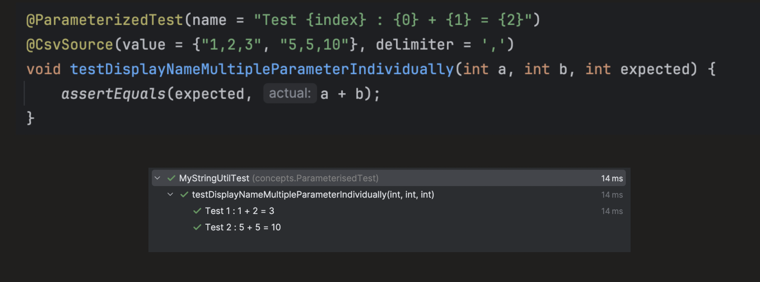

---

### Code Reference

`Junit5Lectures/src/test/java/concepts/ParameterisedTest` — shrayansh jain / JUnit5AndMockito · GitLab
