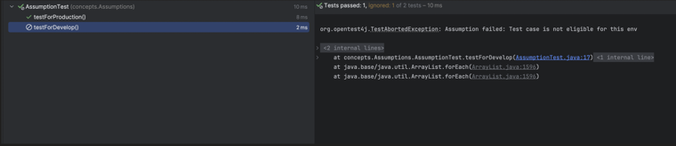
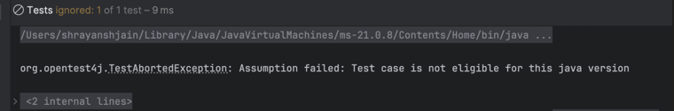
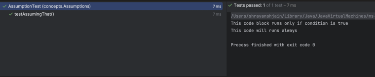
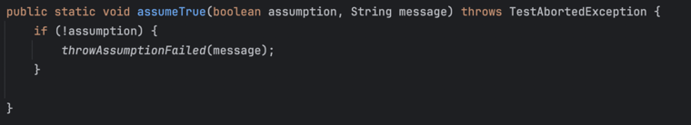

### What are Assumptions?

> The `Assumptions` class provides static methods. We can provide a **condition**, and only if the condition is `true` does the test case proceed. If the condition fails, the test is **skipped (aborted)** — not failed.

Three main methods:

| Method | Behavior |
|---|---|
| `assumeTrue(boolean condition)` / `assumeTrue(boolean condition, String message)` | Skips the test if condition is **false** |
| `assumeFalse(boolean condition)` / `assumeFalse(boolean condition, String message)` | Skips the test if condition is **true** (i.e. runs only if condition is false) |
| `assumingThat(boolean condition, Executable executable)` | Executes the code block only if condition is **true**. If false, the **rest of the test case still runs** |

---

### Setup — class used in all examples

```java
package concepts.Assumptions;

import org.junit.jupiter.api.Assumptions;
import org.junit.jupiter.api.BeforeEach;
import org.junit.jupiter.api.Test;
import org.opentest4j.TestAbortedException;

public class AssumptionTest {

    @BeforeEach
    void setup() {
        System.setProperty("env", "Prod");
    }

    @Test
    void testForDevelop() {
        Assumptions.assumeTrue("Dev".equals(System.getProperty("env")),
                "Test case is not eligible for this env");
    }

    @Test
    void testForProduction() {
        Assumptions.assumeTrue("Prod".equals(System.getProperty("env")));
        System.out.println("Test case can proceed");
    }
}
```

---

### `assumeTrue` — skips the test if condition is `false`

When Jupiter runs a test and encounters `assumeTrue`, internally it simply checks — if the assumption is false, it throws an exception:

```java
public static void assumeTrue(boolean assumption, String message) throws TestAbortedException {
    if (!assumption) {
        throwAssumptionFailed(message);
    }
}
```

In the example above, `env` is set to `"Prod"` in `@BeforeEach`:
- `testForProduction()` → condition `"Prod".equals(env)` is `true` → **runs normally**
- `testForDevelop()` → condition `"Dev".equals(env)` is `false` → **aborted/skipped**, with the message `"Test case is not eligible for this env"`

Output:



---

### `assumeFalse` — runs the test only if condition is `false`

```java
@Test
void testMethod() {
    Assumptions.assumeFalse(Runtime.version().feature() == 17,
            "Test case is not eligible for this java version");
}
```

Here the condition (`java feature version == 17`) is `true`, so `assumeFalse` **skips (ignores)** the test:



---

### `assumingThat` — runs the block conditionally, but the rest of the test always runs

- Executes the code block only if the condition is `true`.
- If the condition is `false`, the block is skipped, but the **rest of the test case still runs** (unlike `assumeTrue`/`assumeFalse`, which abort the whole test).

```java
@Test
void testAssumingThat() {
    Assumptions.assumingThat(
            Runtime.version().feature() == 21,
            () -> {
                System.out.println("This code block runs only if condition is true");
            }
    );
    System.out.println("This code will runs always");
}
```

Since the running JDK feature version is `21`, both lines print and the test passes:



---

### Internal implementation reference

Internal JUnit source for `assumeTrue`, showing how the assumption check and abort work under the hood:


