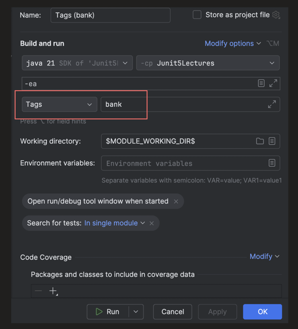
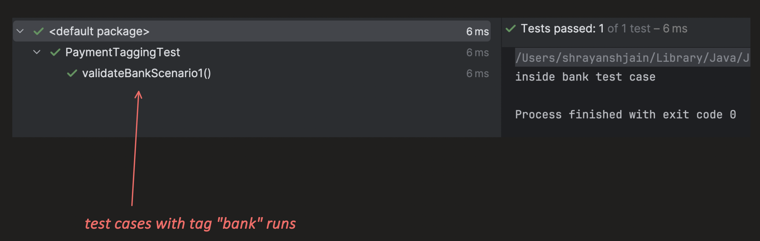
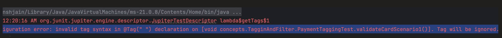
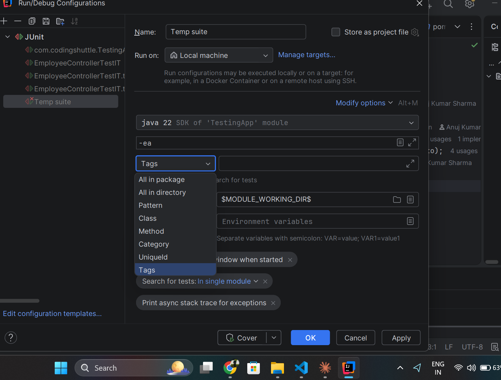
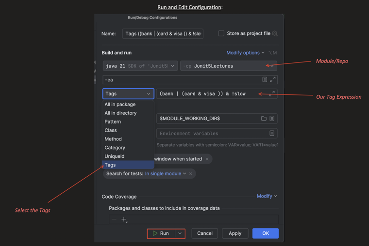
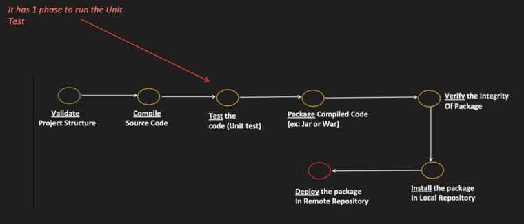
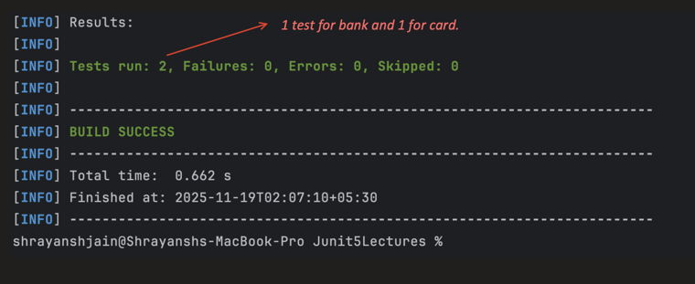
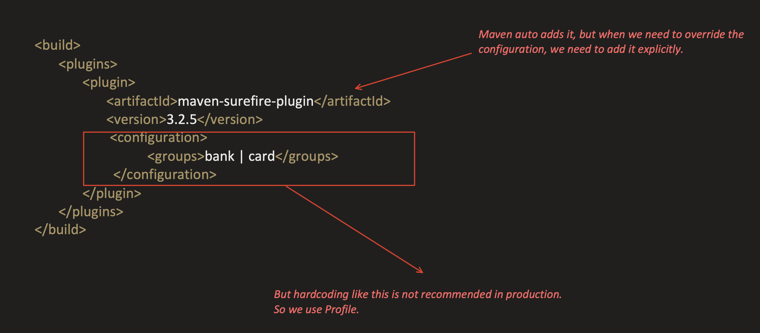

### What is Tagging?

> Tags allow us to **categorize tests**, so that we can **selectively run or skip** them.

```java
class PaymentTaggingTest {

    @Test
    @Tag("card")
    void validateCardScenario1() {
        System.out.println("inside Card testcase");
    }

    @Test
    @Tag("bank")
    void validateBankScenario1() {
        System.out.println("inside Bank testcase");
    }

}
```

---

### Running the tests through IntelliJ

Create a Run/Debug Configuration, choose **Tags** as the test kind, and pass the tag name (e.g. `bank`).



Only the test method(s) carrying that tag get executed:



---

### Syntax Rules for Tags

1. **Tag must not be null or empty** — JUnit will ignore such tags.

   ```java
   @Test
   @Tag(" ")
   void validateCardScenario1() {
       System.out.println("inside card test case");
   }
   ```

   Running this gives a configuration error and the tag is ignored:

   

2. **Stripped tag must not contain whitespaces** — Internally JUnit first *strips* the tag (removes leading/trailing whitespace); after that there must be **no whitespace** left inside it.

stripped means without no leading and trailing whitespaces.

   ```java
   // VALID
   @Test
   @Tag(" cardPayment ")
   void validateCardScenario1() {
       System.out.println("inside card test case");
   }

   // NOT VALID
   @Test
   @Tag("bank payment")
   void validateBankScenario1() {
       System.out.println("inside bank test case");
   }
   ```

3. **Stripped tag must not contain any reserved characters** — JUnit explicitly bans these characters in tag names, because they're used in **Tag Expressions** (used for filtering):

   ```
   , ( ) & | !
   ```

---

### Multiple Tags and Class-Level Tag

A tag can be applied at the **class level** too — it then applies to every test method in that class, in addition to any method-level tags.

```java
// Class level tag, applied to all test methods
@Tag("slow")
class PaymentTaggingTest {

    /* This test method has 3 tags associated:
       - card
       - visa
       - slow (class level one)
    */
    @Test
    @Tag("card")
    @Tag("visa")
    void validateCardScenario1() {
        System.out.println("inside card test case");
    }

    /* This test method has 2 tags associated:
       - bank
       - slow (class level one)
    */
    @Test
    @Tag("bank")
    void validateBankScenario1() {
        System.out.println("inside bank test case");
    }

}
```

---

### Tag Expression

> Used for **filtering** the tags. It's a boolean expression built with the operators `( ) & | !`

| Expression | Filter logic |
|---|---|
| `card & visa` | **AND** — test method should have both `card` and `visa` tags |
| `card \| visa` | **OR** — any one of the tags should be present on the test method |
| `!visa` | **NOT** — all tests which do **not** have the `visa` tag |
| `bank \| ((card & visa) & !slow)` | Either `bank`, **or** (`card` and `visa` tags present **but not** `slow`) |

---

### Execution

**1. Through IntelliJ**

The IDE internally calls the same JUnit **Launcher API** and also passes the tag info. Select **Tags** as the test kind and enter the tag expression:





**2. Through the Maven Plugin**

Maven has a lifecycle phase (**Test**) that runs the unit tests as part of `mvn test`:



Hardcode the tag expression directly in the `maven-surefire-plugin` config:

```xml
<build>
    <plugins>
        <plugin>
            <artifactId>maven-surefire-plugin</artifactId>
            <version>3.2.5</version>
            <configuration>
                <groups>bank | card</groups>
            </configuration>
        </plugin>
    </plugins>
</build>
```
`mvn test` will run only test phase.


Running `mvn test` picks up only the tests matching the expression:



> Hardcoding the tag expression like this is **not recommended in production** — use a Maven **profile** instead.

---

### Passing the Tag Expression at Runtime via a Maven Profile

Use a profile with a `${groups}` placeholder inside `<groups>`. This lets us pass the tag expression **at runtime** instead of hardcoding it.

```xml
<profiles>
    <profile>
        <id>tagTest</id>
        <build>
            <plugins>
                <plugin>
                    <artifactId>maven-surefire-plugin</artifactId>
                    <configuration>
                        <!--suppress UnresolvedMavenProperty -->
                        <groups>${groups}</groups>
                    </configuration>
                </plugin>
            </plugins>
        </build>
    </profile>
</profiles>
```



Run it with:

```bash
mvn test -PtagTest -Dgroups="bank | card"
```

After `-P` then we have profile Name `tagTest`.

> Think of a **profile** as a **switch**. Activate it with `-P<profileName>` when you want to use it; skip it otherwise.
>
> Plain `mvn test` (without `-PtagTest`) simply runs **all** the tests.

TestSuite is also one of popular way to group and runmultiple test together.
