### Test Suite

> In simple terms: it's a **collection of related test cases grouped together** so that they can be executed as a unit.

We can create multiple test suites based on our need.

**Real world use cases:**

1. **PR (Pull Request) validation** — instead of running all test cases for every PR, run only the P0 (critical) Test Suite.
2. **Hotfix or targeted change** — e.g. a bank flow hotfix: we can only run the Bank test suite (this saves time and reduces unnecessary test execution).
3. **Better maintainability and organization** — grouping of test cases feature-wise:
   - **Instrument-wise grouping**: Bank Test Suite, Card Test Suite, Balance Test Suite, etc.
   - **Country-wise grouping**: India Test Suite, US Test Suite, etc.

In a slightly different way, if we try to understand Test Suite: **Test Suite logic is run by `junit-platform-launcher`**.

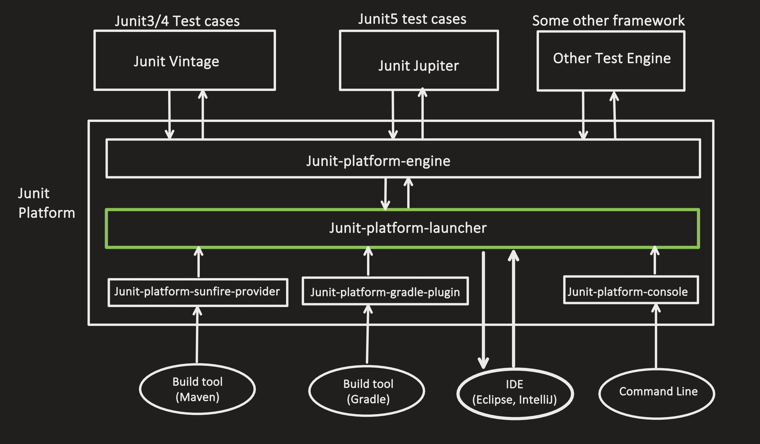

---

### Test Suite Works in 2 Logical Phases

**Step 1: "Discovery"** — Identify all the test cases which are candidates to be grouped together.
- Based on Class
- Based on Package

**Step 2: "Filtering"** — the test cases discovered in step 1 are filtered using:
- `IncludeTags`
- `ExcludeTags`
- `IncludeClassNamePatterns`
- etc.

At this step, some discovered tests are discarded, and the final filtered set is executed.

---

### Example of Test Suite

**Dependency** — this internally pulls `junit-jupiter-api`, `junit-jupiter-engine`, `junit-platform-launcher`:

```xml
<parent>
    <groupId>org.springframework.boot</groupId>
    <artifactId>spring-boot-starter-parent</artifactId>
    <version>3.5.6</version>
</parent>
```

We know that Test Suite logic is run by `junit-platform-launcher`, but it **can not understand Test Suite specific annotations**. For that, we need to add the `junit-platform-suite` dependency:

```xml
<dependency>
    <groupId>org.junit.platform</groupId>
    <artifactId>junit-platform-suite</artifactId>
    <version>1.10.2</version>
    <scope>test</scope>
</dependency>
```

---

### Discovery Step

> Test Suite needs **selectors** — these selectors decide **where** to look for test cases.

```java
import org.junit.platform.suite.api.Suite;

/*
This annotation tells Junit that, this is a Test suite class,
use this to discover the test cases which need to be grouped together.
*/
@Suite
public class MySuite {
}
```

But here we have not added any selector, so it will not be able to discover any test cases:

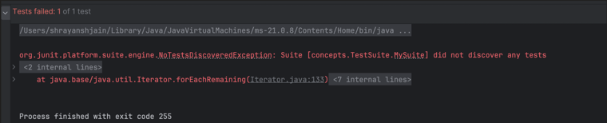

Let's add a selector. We have different selectors:

- `@SelectPackages`
- `@SelectClasses`
- `@SelectMethod` and `@SelectMethods`

**1. `@SelectPackages`**

Include or search all Test classes and Test methods within this package and its subpackages.

```java
import org.junit.platform.suite.api.SelectPackages;
import org.junit.platform.suite.api.Suite;

@Suite
/*
These are packages, Test Suite will discover all the test
classes and test methods present inside these 3 packages and
their subpackages too (recursively)
*/
@SelectPackages({
        "concepts.TaggingAndFilter",
        "concepts.RepeatedTest",
        "concepts.ParameterisedTest"
})
public class MySuite {
}
```

Test run output:

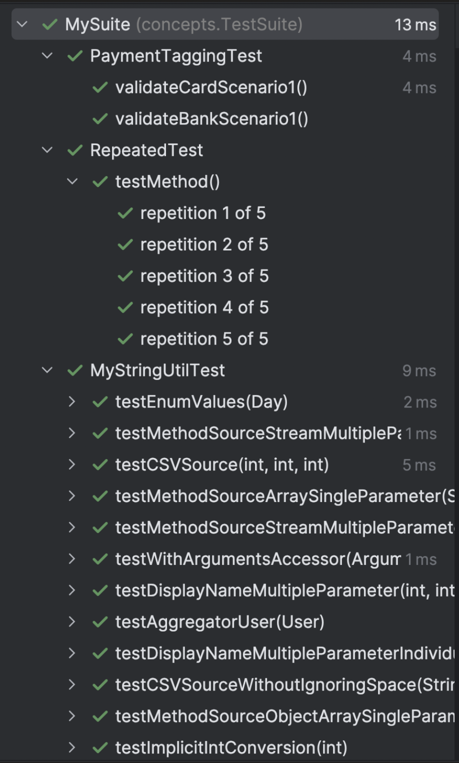

**2. `@SelectClasses`**

Include or search specific Test classes and Test methods within those classes only.

```java
import org.junit.platform.suite.api.SelectClasses;
import org.junit.platform.suite.api.Suite;

@Suite
@SelectClasses({
        concepts.TaggingAndFilter.PaymentTaggingTest.class,
        concepts.RepeatedTest.RepeatedTest.class
})
public class MySuiteClassSelectorExample {
}
```

Test run output:

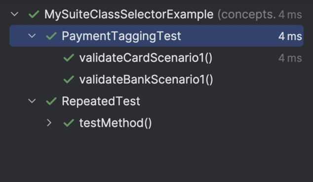

**3. `@SelectMethod` and `@SelectMethods`**

- Include or search a specific Test method only.
- Works reliably only for **non-parameterized** test methods.

```java
import org.junit.platform.suite.api.SelectMethod;
import org.junit.platform.suite.api.SelectMethods;
import org.junit.platform.suite.api.Suite;

@Suite
/* for selecting single test method */
@SelectMethod(
        type = concepts.TaggingAndFilter.PaymentTaggingTest.class,
        name = "validateCardScenario1"
)

/* for selecting multiple test methods */
@SelectMethods({
        @SelectMethod(
                type = concepts.Assumptions.AssumptionTest.class,
                name = "testForProduction"
        ),
        @SelectMethod(
                type = concepts.RepeatedTest.RepeatedTest.class,
                name = "testMethod"
        )
})
public class MySuiteMethodSelectorExample {
}
```

Test run output:

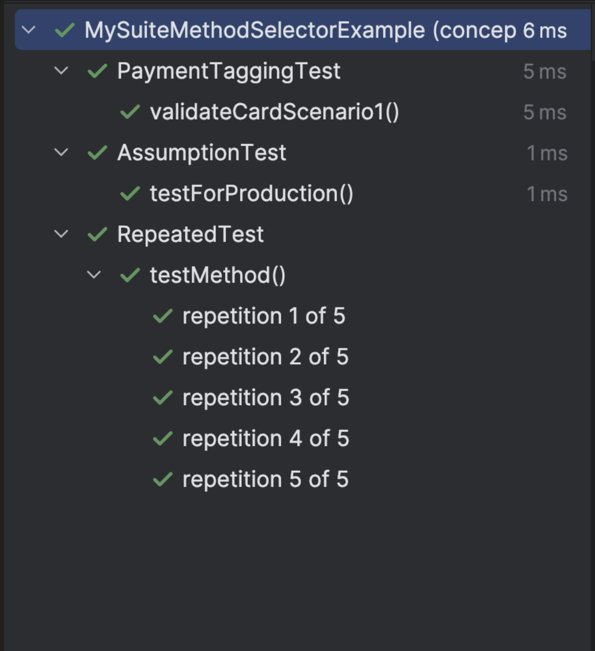

**If we try to run for a parameterized test method, it won't be able to resolve it.**

This is the test method we want to add to the Test Suite:

```java
public class MyStringUtilTest {

    /******************* Single parameter *******************/
    /*
    @ValueSource
    */

    @ParameterizedTest
    @ValueSource(strings = {"civic", "level", "madam"})
    public void testPalindrome(String word) {
        assertTrue(MyStringUtil.isPalindrome(word));
    }
}
```

```java
import org.junit.platform.suite.api.SelectMethod;
import org.junit.platform.suite.api.Suite;

@Suite
/* for selecting single test method */
@SelectMethod(
        type = concepts.ParameterisedTest.MyStringUtilTest.class,
        name = "testPalindrome"
)
public class MySuiteMethodSelectorExample {
}
```

Internally it will try to look for a method `testPalindrome()`, but there is no such method (with that exact signature) in `MyStringUtilTest` — since it's parameterized, the actual method has a `String` parameter, and selection fails:

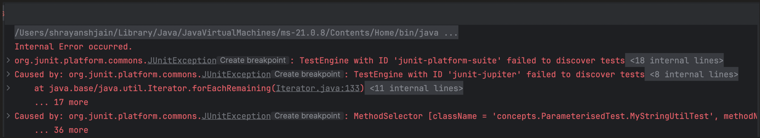

---

### Filtering Step

> Filters decide **which** tests run from the already discovered test set. Below are frequently used filters (there are more apart from these):

- `@IncludePackages` / `@ExcludePackages`
- `@IncludeTags` / `@ExcludeTags`
- `@IncludeClassNamePatterns` / `@ExcludeClassNamePatterns`
- `@IncludeEngines` / `@ExcludeEngines`

**`@IncludePackages`**

Within the `concepts` package:
1. During the discovery phase, it selected multiple packages: `concepts.Assumptions`, `concepts.ParameterisedTest`, `concepts.RepeatedTest`, `concepts.TaggingAndFilter`.
2. `@IncludePackages` — we filter out the packages we actually want, and only these packages are included.

```java
@Suite
@SelectPackages({
        "concepts"
})
@IncludePackages({
        "concepts.TaggingAndFilter",
        "concepts.RepeatedTest"
})
public class MySuiteFilterExample {
}
```

Output — out of multiple packages, `TaggingAndFilter` and `RepeatedTest` packages are included, rest all packages are excluded:

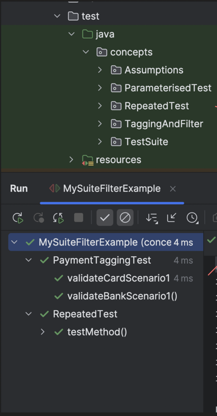

**`@ExcludePackages`**

We filter out the packages we **don't** want, and rest all packages are included.

```java
@Suite
@SelectPackages({
        "concepts"
})
@ExcludePackages({
        "concepts.ParameterisedTest",
        "concepts.TestSuite"
})
public class MySuiteFilterExample {
}
```

Output:

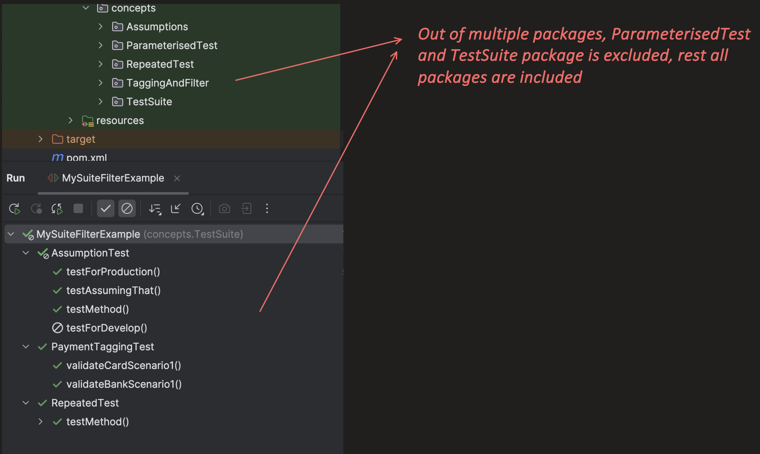

**When both used together:**

Suite first does: **(Discovery ∩ inclusion Filters) − Exclusion Filters**

(`∩` — intersection, common elements between 2 sets)

```java
@Suite
@SelectPackages({
        "concepts"
})
@IncludePackages({
        "concepts.TaggingAndFilter",
        "concepts.RepeatedTest"
})
@ExcludePackages({
        "concepts.ParameterisedTest",
        "concepts.TestSuite",
        "concepts.RepeatedTest"
})
public class MySuiteFilterExample {
}
```

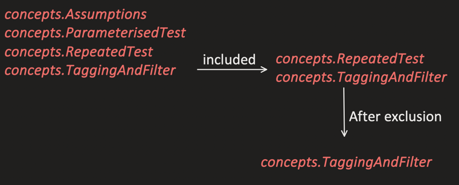

**`@IncludeTags`**

Run only those test methods that have one of the given tags.

```java
@Suite
@SelectPackages({
        "concepts"
})
@IncludeTags({
        "card",
        "bank"
})
public class MySuiteFilterExample {
}
```

This `concepts` package (and its subpackages) might have 1000s of test cases, but `@IncludeTags` filter only includes those test cases which have one of these tags: `@Tag("card")` or `@Tag("bank")`.

Output:

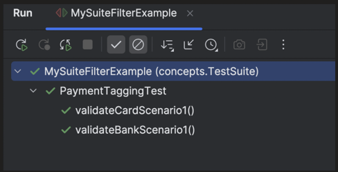

**`@ExcludeTags`**

Removes those test methods that have one of the given tags. All other test methods are included.

```java
@Suite
@SelectPackages({
        "concepts"
})
@ExcludeTags({
        "bank"
})
public class MySuiteFilterExample {
}
```

**`@IncludeClassNamePatterns` and `@ExcludeClassNamePatterns`**

`@IncludeClassNamePatterns` — runs test classes whose name matches the regex pattern:

```java
@IncludeClassNamePatterns({
        ".*Test"
})
public class MySuiteFilterExample {
}
```

`@ExcludeClassNamePatterns` — skips test classes whose name matches the regex pattern, and includes others:

```java
@ExcludeClassNamePatterns({
        ".*Example"
})
public class MySuiteFilterExample {
}
```

**Useful Regex Patterns:**

| Pattern | Meaning | Example |
|---|---|---|
| `.` | Any single character | `s.j` matches `s_j`, anything 1 character between `s` and `j` |
| `*` | Zero or more times | `sj*` matches `sja`, `sjaa` |
| `.*` | Anything | `.*payment.*` — anything before + `payment` + anything after |
| `^` | Start of text | `^Payment` — `PaymentTest` matches, `CardPaymentTest` does not match |
| `\|` | OR | `.*(payment\|order).*` matches either substring `payment` or `order` anywhere in the text. `(payment\|order)$` only matches if it ends with `payment` or `order` |
| `(?i)` | Case insensitive | By default regex is case sensitive: `.*payment` — `cardPaymentTest` does not match. `(?i).*payment` — we are telling that anything after `(?i)` should be case insensitive |

---

### `@IncludeEngines` and `@ExcludeEngines`

If we recall from the Architecture topic:

> Platform initiates Discovery Phase → Each engine returns the tests which belong to them → Platform creates the Test Plan.

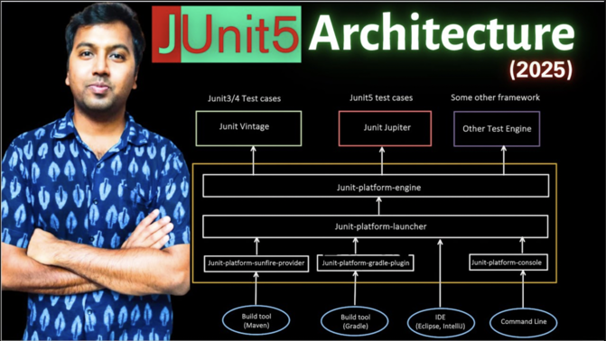

So the platform has information about which test case belongs to which engine:

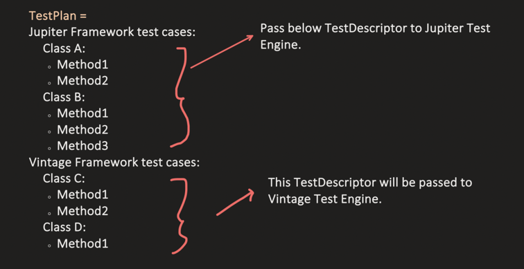

```java
@IncludeEngines({
        "junit-jupiter"
})
@ExcludeEngines({
        "junit-vintage"
})
public class MySuiteFilterExample {
}
```

**We can run the Suite using a Maven command** (same can be configured in a CI job):

```
mvn test -Dtest=MySuite1,MySuite2
```

---

### Before We Wrap Up: 2 Important Points

**1st: Avoid duplicate test runs**

If a Test Suite class itself lives inside a package that's also being selected (e.g. `@SelectPackages({"concepts"})`, and the suite classes live under `concepts.TestSuite`), those suite classes are subpackages too — so they'll get executed as well, and the underlying tests may run **multiple times**:

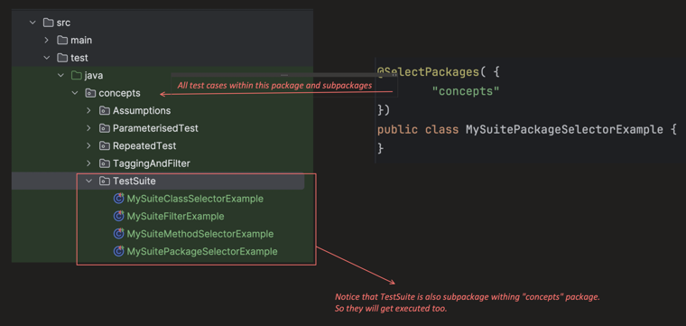

Same test (`validateCardScenario1()`) runs multiple times, once per suite that (directly or indirectly) selects it:

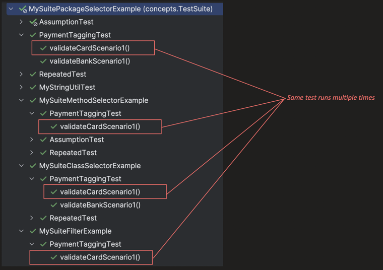

**2nd: Difference between Tagging with Filter and Test Suite**

> Both are industry standard — it's not like one wins over the other.

**Tagging with Filter:**

```java
@Tag("slow")
class PaymentTaggingTest {

    @Test
    @Tag("card")
    @Tag("visa")
    void validateCardScenario1() {
        System.out.println("inside card test case");
    }

    @Test
    @Tag("bank")
    void validateBankScenario1() {
        System.out.println("inside bank test case");
    }
}
```

To execute:

```bash
mvn test -PtagTest -Dgroups="bank | card"
```

- Dynamically (during runtime), we are deciding which tests to run.
- Because of this dynamic nature, it's more preferred in CI jobs, as it provides flexibility (no code change required).
- Less risk of duplicate test case runs.
- Low maintenance — no extra Java classes, only annotations on existing test classes and methods.

**Test Suite:**

```java
@Suite
@SelectPackages({
        "concepts.Bank",
        "concepts.Card"
})
public class MySuitePackageSelectorExample {
}
```

- A proper Java class, which hardcodes (statically) which tests to discover and group together.
- It is more readable — a suite class clearly shows what belongs to a group.
- Chance of duplicate test case runs (as seen above).
- Little extra overhead to maintain test suite classes — any change in grouping logic needs to be changed in those classes too.
