### `@TestFactory` — Dynamic Tests in JUnit5

**`@TestFactory`:**

- It is **not** a Test method.
- It is used to **create tests dynamically**.

**Normal Test method:**

> `@Test` — it's static, meaning test cases are known at **compile time**.

```java
@Test
void addTest() {
    assertEquals(7, 4 + 3);
}
```

**Dynamic Test:**

> `@TestFactory` — means it's not a normal test method, it **generates test cases dynamically during runtime**.

```java
@TestFactory
DynamicTest addDynamicTest() {

    return DynamicTest.dynamicTest(
            "addDynamicTest",
            () -> assertEquals(7, 4 + 3)
    );
}
/*
addDynamicTest : This is display name
() -> assertEquals(7, 4+3) : This lambda expression is our executable,
our actual test case.
*/
```

---

### Internally, What Happens

From the previous Architecture topic, we know there are 2 phases:

1. **Discover** — `TestDescriptor` object is created.
2. **Execute** — uses `TestDescriptor` to execute the test cases.

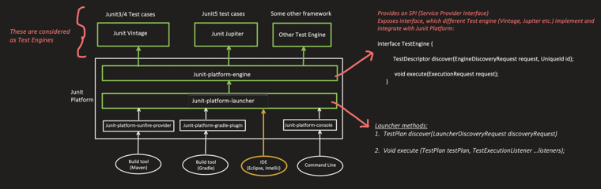

---

### Normal Tests (`@Test`)

```
TestDescriptor
    ├── displayName = "addTest"
    └── executable = method reference
```

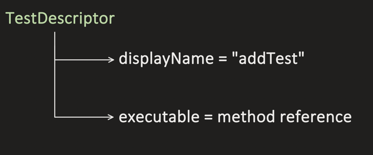

**`TestMethodTestDescriptor` (Framework):**

```java
@Override
public JupiterEngineExecutionContext execute(JupiterEngineExecutionContext context,
                                              DynamicTestExecutor dynamicTestExecutor) {
    ThrowableCollector throwableCollector = context.getThrowableCollector();

    invokeBeforeEachCallbacks(context);
    if (throwableCollector.isEmpty()) {
        invokeBeforeEachMethods(context);              // Lifecycle methods
        if (throwableCollector.isEmpty()) {
            invokeBeforeTestExecutionCallbacks(context);
            if (throwableCollector.isEmpty()) {
                invokeTestMethod(context, dynamicTestExecutor);   // Invoke Test method
            }
            invokeAfterTestExecutionCallbacks(context);
        }
        invokeAfterEachMethods(context);                // Lifecycle methods
    }
    invokeAfterEachCallbacks(context);

    return context;
}
```

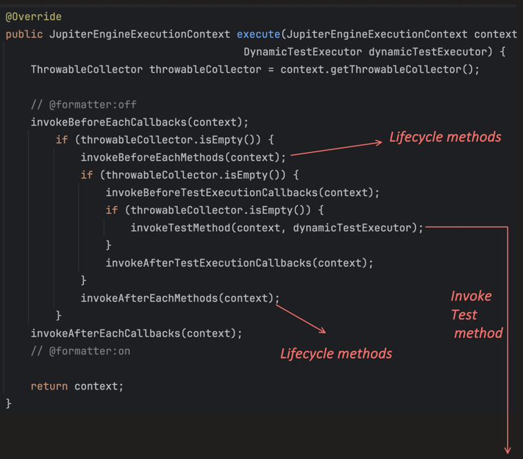

This is our **executable**, in which reflection is used to invoke the test method:

```java
protected void invokeTestMethod(JupiterEngineExecutionContext context, DynamicTestExecutor dynamicTestExecutor) {
    ExtensionContext extensionContext = context.getExtensionContext();
    ThrowableCollector throwableCollector = context.getThrowableCollector();

    throwableCollector.execute(() -> {
        try {
            Method testMethod = getTestMethod();
            Object instance = extensionContext.getRequiredTestInstance();
            executableInvoker.invoke(testMethod, instance, extensionContext, context.getExtensionRegistry(),
                    interceptorCall);
        } catch (Throwable throwable) {
            UnrecoverableExceptions.rethrowIfUnrecoverable(throwable);
            invokeTestExecutionExceptionHandlers(context.getExtensionRegistry(), extensionContext, throwable);
        }
    });
}
```

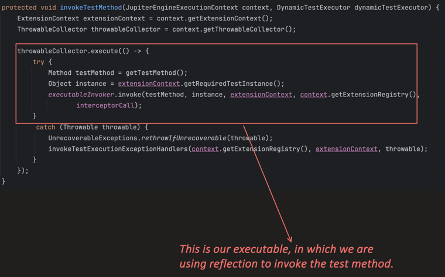

---

### Dynamic Test (`@TestFactory`)

```
TestDescriptor
    ├── displayName = "addDynamicTest"
    └── executable = lambda expression
```

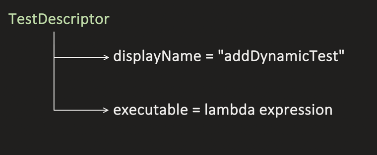

The framework's `execute()` for a dynamic test uses the **lambda expression** as the executable:

```java
@Override
public JupiterEngineExecutionContext execute(JupiterEngineExecutionContext context,
                                              DynamicTestExecutor dynamicTestExecutor) {

    InvocationInterceptor.Invocation<Void> invocation = () -> {
        dynamicTest.getExecutable().execute();
        return null;
    };

    DynamicTestInvocationContext dynamicTestInvocationContext = new DefaultDynamicTestInvocationContext(
            dynamicTest.getExecutable());
    ExtensionContext extensionContext = context.getExtensionContext();
    ExtensionRegistry extensionRegistry = context.getExtensionRegistry();

    interceptorChain.invoke(invocation, extensionRegistry, InterceptorCall.ofVoid(
            (interceptor, wrappedInvocation) -> interceptor.interceptDynamicTest(wrappedInvocation,
                    dynamicTestInvocationContext, extensionContext)));
    return context;
}
```

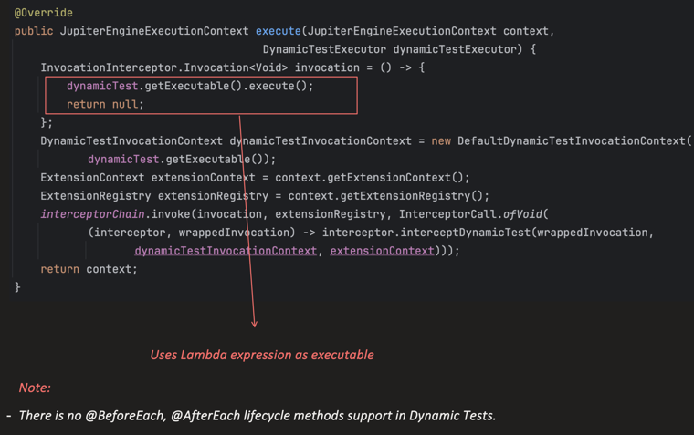

> **Note:** There is no `@BeforeEach`, `@AfterEach` lifecycle method support in Dynamic Tests. So dynamic Test does not support this .BeforeAll and AfterAll is ooresent.

Both have executable() but here we have lamda expression run directly. In normal one it needs to create lamda first and then it run so internally both are exactly same executing lambda expressions.


---

### Use Case — Where Dynamic Tests Are Really Helpful

Before proceeding further, it's worth understanding a real use case (there could be many others):

```
Payment gateway <-- settlement.csv -- Bank
(Bank daily sends one file, say settlement.csv)
```

- **`settlement.csv` file is stable, known schema, same validation for each row** →
  - Parameterized Test using `@CsvFileSource` — 1 test method, executed N times (N = no of rows in file)
  - Dynamic Test using `@TestFactory` — also works fine here.N independent test , 1 more each row.

- **`settlement.csv` file is unstable, columns may appear or disappear, column order may change, or different validation is needed for different rows** →
  - Parameterized Test using `@CsvFileSource` — not flexible enough for this.
  - Dynamic Test using `@TestFactory` — **N independent tests, 1 for each row**, and each row's test logic can differ.` Sometimes interviewer ask why we need Dynamic Tests so here is answer.`


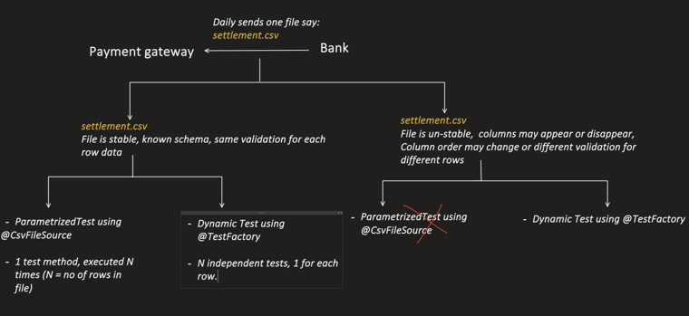

---

### Dynamic Test Hierarchy

> **Note:** This actually follows the **Composite design pattern** in Low Level Design. `DynamicContainer` is just a logical grouping of dynamic tests.

```
<<abstract class>>
DynamicNode
    ├── DynamicTest         (<<leaf node>>)
    │       Executable executable;
    │
    └── DynamicContainer    (<<non-leaf node>>)
            Stream<DynamicNode> children;
                ├── DynamicTest         (<<leaf node>>)
                └── DynamicContainer    (<<non-leaf node>>)
                        ...
```

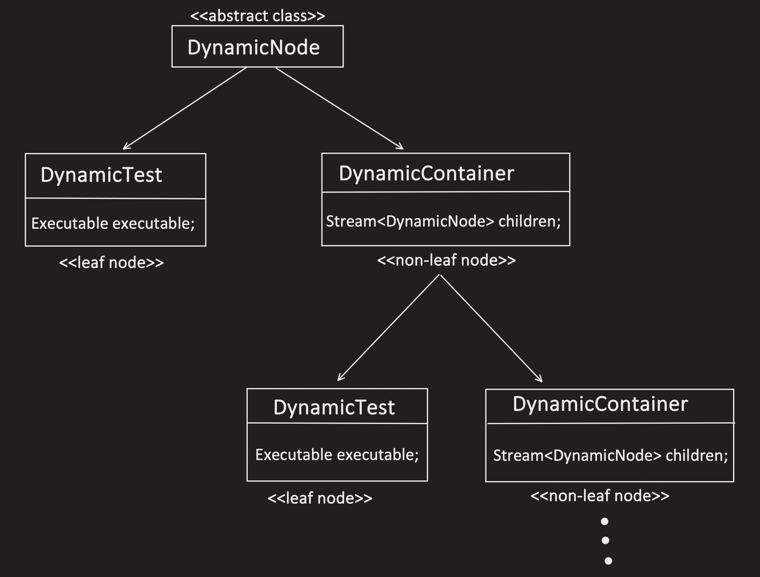

leaf-Node means that is exceutable.

Example hierarchy for a settlement file:

```
DynamicContainer: "Settlement.csv"
    ├── DynamicTest 1: file exist and is readable
    ├── DynamicTest 2: header and footer present
    ├── DynamicContainer: "Transactions"
    │       ├── DynamicTest 3: at-least one transaction present
    │       ├── DynamicTest 4: transaction count matches header
    │       └── DynamicContainer ...
    └── DynamicContainer: "Footer"
            └── DynamicTest 5: checksum is valid
```

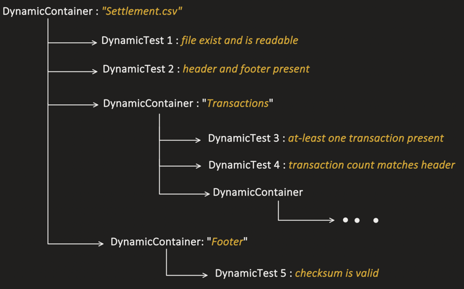

---

### With This Understanding, Let's Write the Dynamic Tests

**1. Single Dynamic Test**

```java
// single test
//TestFactory makes it dynamic test
@TestFactory
DynamicTest addDynamicTest() {

    return DynamicTest.dynamicTest(
            "addTest",
            () -> assertEquals(7, 4 + 3)
    );
}

// OR: Even DynamicNode can be used as return type, as it is parent of DynamicTest.

// single test
@TestFactory
DynamicNode addDynamicTestDynamicNode() {

    return DynamicTest.dynamicTest(
            "addTest",
            () -> assertEquals(7, 4 + 3)
    );
}
```

Output:

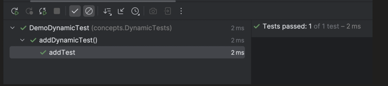

**2. Multiple Dynamic Test**

```java
@TestFactory
Stream<DynamicTest> multipleDynamicTest() {

    return Stream.of(1, 2, 3, -5)
            .map((Integer n) -> {
                return DynamicTest.dynamicTest(
                        "Positive Check for number: " + n,
                        () -> assertTrue(n > 0)
                );
            });
}
```

Output — 3 pass, 1 fails (as expected, since `-5` is not positive):

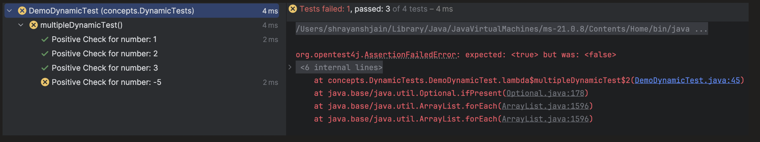

**Apart from `Stream<DynamicTest>`, we can also have:**

- `Collection<DynamicTest>`
- `DynamicTest[]`
- `Iterator<DynamicTest>`

```java
// COLLECTION
@TestFactory
Collection<DynamicTest> multipleDynamicTestsCollectionReturn() {

    List<DynamicTest> tests = new ArrayList<>();

    for (int n : List.of(1, 2, 3, -5)) {
        tests.add(
                DynamicTest.dynamicTest(
                        "Positive Check for number: " + n,
                        () -> assertTrue(n > 0)
                )
        );
    }

    return tests;
}

//for each test will run

// ARRAY
@TestFactory
DynamicTest[] multipleDynamicTestsArrayReturn() {

    return new DynamicTest[] {
            DynamicTest.dynamicTest(
                    "Positive Check for number: 1",
                    () -> assertTrue(1 > 0)
            ),
            DynamicTest.dynamicTest(
                    "Positive Check for number: 2",
                    () -> assertTrue(2 > 0)
            ),
            DynamicTest.dynamicTest(
                    "Positive Check for number: 3",
                    () -> assertTrue(3 > 0)
            )
    };
}
```

**3. Dynamic Container — Different Number of Dynamic Tests for Different Rows**

it can have `dynamic test` as well as `dynamic container`

Sample file:

| Txn_Id | Amount | Currency |
|---|---|---|
| Txn1 | 100 | INR |
| Txn2 | ABC | USD |

for INR we need differnet test like amount is Integer and amount>=0<br>
else amount is Integer or not

```java
@TestFactory
Stream<DynamicContainer> fileRowDynamicTests() {

    List<String[]> rows = List.of(
            new String[]{"Txn1", "100", "INR"},
            new String[]{"Txn2", "ABC", "USD"}
    );

    // Iterates over each row
    return rows.stream().map((String[] row) -> {

        String txnId = row[0];
        String amount = row[1];
        String currency = row[2];

        List<DynamicTest> tests = new ArrayList<>();

        // For each row, this dynamic test is created
        tests.add(DynamicTest.dynamicTest(
                "amount is integer",
                () -> assertTrue(amount.matches("\\d+"))
        ));

        // This dynamic test created for specific rows only
        if ("INR".equals(currency)) {
            tests.add(DynamicTest.dynamicTest(
                    "amount is greater than zero",
                    () -> assertTrue(Integer.parseInt(amount) > 0)
            ));
        }

        // Now, all the dynamic tests created for 1 row need to be
        // grouped, so we use Dynamic Container
        return DynamicContainer.dynamicContainer(
                "Row " + txnId,
                tests
        );
    });
}
```

Output — `Row Txn1` passes both checks; `Row Txn2` fails `"amount is integer"` since `"ABC"` isn't numeric (and correctly, the currency-specific check doesn't even run for it since it's `USD`, not `INR`):

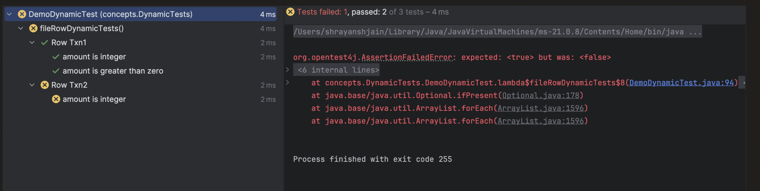

**4. Dynamic Container → Dynamic Test + Dynamic Container**

```
Parent Container
    ├── addTest
    └── Nested container
            └── MultiplyTest
```

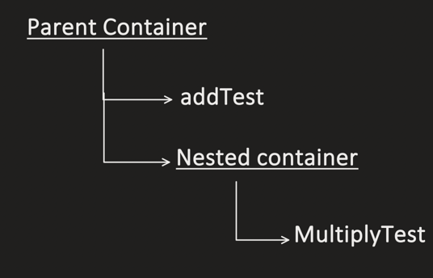

```java
@TestFactory
DynamicContainer containerWithTestAndContainer() {

    // A simple test directly inside the parent container
    DynamicTest simpleTest = DynamicTest.dynamicTest(
            "addTest",
            () -> assertEquals(2, 1 + 1)
    );

    // A nested container with its own test
    DynamicContainer nestedContainer = DynamicContainer.dynamicContainer(
            "Nested container",
            Stream.of(
                    DynamicTest.dynamicTest(
                            "MultiplyTest",
                            () -> assertEquals(4, 2 * 2)
                    )
            )
    );

    // Parent container containing both
    return DynamicContainer.dynamicContainer(
            "Parent container",
            Stream.of(
                    simpleTest,
                    nestedContainer
            )
    );
}
```

Output:

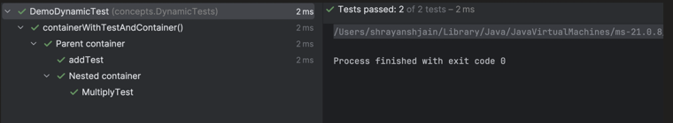
