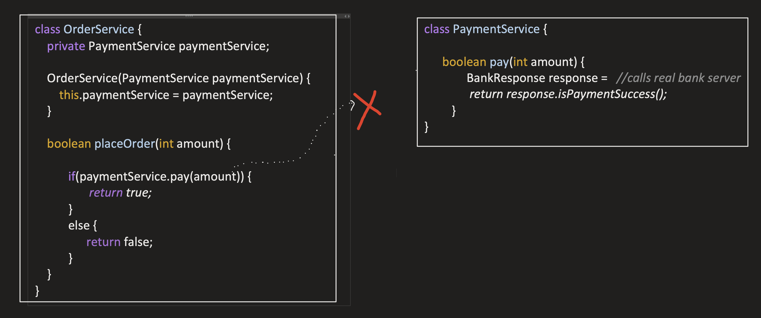
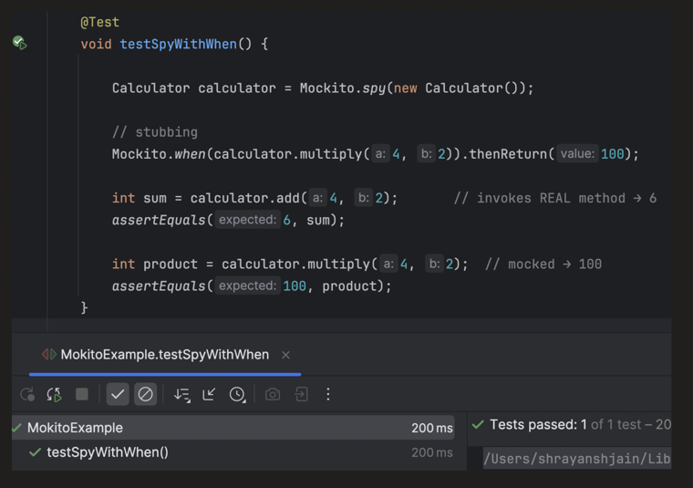

### Introduction (Mocking vs Stubbing vs Spy)

### Mocking

- In unit test cases, we test a unit **in isolation**.
- And a unit could be:
  - A single public method of a class.
  - Or a single behavior or responsibility.

But in the real world, classes do not live alone — they depend on:

- Other classes
- External API
- DB
- Message Broker
- File system
- etc.

> **Mocking** helps achieve isolation by replacing real dependencies with fake (Mock) objects, so that our unit test does not use the real object.

```java
class OrderService {
    private PaymentService paymentService;

    OrderService(PaymentService paymentService) {
        this.paymentService = paymentService;
    }

    boolean placeOrder(int amount) {

        if (paymentService.pay(amount)) {
            return true;
        } else {
            return false;
        }
    }
}
```

```java
class PaymentService {

    boolean pay(int amount) {
        BankResponse response = //calls real bank server
        return response.isPaymentSuccess();
    }
}
```

`OrderService.placeOrder(int amt)` invokes `PaymentService.pay(int amt)` for placing the order.

So, when we write unit test cases for the `OrderService.placeOrder` method, we should **not** invoke `PaymentService` or any other class — we need to **MOCK** (fake object) them.

**Test case scenario 1: Place an order and payment transaction gets success.**

```java
@Test
void placeOrderSuccess() {

    // Fake object (Mock) of PaymentService Class.
    PaymentService paymentService = mock(PaymentService.class);
    // Mock object is passed to SUT (system under test).
    OrderService orderService = new OrderService(paymentService);
    /*
    Using Mock object, I can define what value should be returned when a
    particular method is invoked.
    */
    when(paymentService.pay(10)).thenReturn(true);

    boolean result = orderService.placeOrder(10);
    /*
    Here we are testing the OrderService "placeOrder" method outcome,
    when PaymentService "pay" method is succeeded, "placeOrder"
    should also return true.
    */
    assertTrue(result);
}
```

So above, we mocked the call `paymentService.pay(10)`.

> **Mocking** means: instead of invoking the real method, we tell the test framework, "when this method is called, just return the predefined value without executing the actual logic."

**Test case scenario 2: Place an order and payment transaction gets failed.**

```java
@Test
void placeOrderFailure() {

    PaymentService paymentService = mock(PaymentService.class);

    OrderService orderService = new OrderService(paymentService);
    /*
    Since we need to test how "placeOrder" method behaves when Payment
    got failed. That's why we are returning false when the pay method
    on the Mock object gets invoked.
    */
    when(paymentService.pay(10)).thenReturn(false);

    boolean result = orderService.placeOrder(10);
    /*
    So the expectation is, when payment gets failed, "placeOrder"
    should also return false.
    */
    assertFalse(result);
}
```

So now, in both the above scenarios, `OrderService.placeOrder` method does **not** invoke `PaymentService.pay` method:



---

### What Mocking Solves

**1. Isolation**

As discussed in the 2 scenarios above — mocking isolates the unit under test by replacing real dependencies with fake objects (Mock obj).

**2. Fast + no Flaky tests**

- No I/O calls
- No network calls
- No DB access

Tests become fast and stable.

**3. Controlled Output**

- Mocking allows us to control the behavior and response of dependencies.
- Enables testing of edge cases (like timeout) and failure scenarios easily.

**4. Reduced tight coupling**

Without mocking, a unit test depends on: database schema, message broker, external API, etc. A change in these systems can cause unrelated unit tests to fail.

For example: DB schema got changed → results in failure of test cases which internally invoke the DB.

---

### What's the Difference Between Stubbing, Mocking, and Spying

### Stubbing

- Defines **what a dependency should return**.
- Focus is only on **input and output**.

```java
@Test
void placeOrderSuccess() {

    PaymentService paymentService = mock(PaymentService.class);

    OrderService orderService = new OrderService(paymentService);
    /*
    This is stubbing.
    Here we are telling:

    If this method is invoked with this argument, then return this value
    or throw exception.
    */
    when(paymentService.pay(10)).thenReturn(true);

    boolean result = orderService.placeOrder(10);

    assertTrue(result);
}
```

### Mocking

- Stubbing is just **one part** of Mocking.
- Mocking provides more features, like:
  - Was a method called?
  - How many times?
  - With what arguments?
  - In what order?

```java
@Test
void placeOrderSuccess() {

    PaymentService paymentService = mock(PaymentService.class);

    OrderService orderService = new OrderService(paymentService);

    // Stubbing
    when(paymentService.pay(10)).thenReturn(true);

    boolean result = orderService.placeOrder(10);

    assertTrue(result);

    // Was the method called?
    verify(paymentService).pay(10);

    // How many times was it called?
    verify(paymentService, times(1)).pay(10);

    // With what arguments?
    verify(paymentService).pay(eq(10));

    // Was it the only interaction?
    verifyNoMoreInteractions(paymentService);
}
```

- Focus is **not only** on input and output, but also on **interaction** (how the system collaborates with its dependencies).

### Spying

- It's a **partial mock** of a real object.
- Real methods are invoked **by default**.
- But we can **stub and verify** selected methods too.

```java
class Calculator {

    int add(int a, int b) {
        return a + b;
    }

    int multiply(int a, int b) {
        return a * b;
    }
}
```

```java
Calculator calculator = spy(new Calculator());

// stubbing
when(calculator.multiply(4, 2)).thenReturn(100);

int sum = calculator.add(4, 2);   // invokes REAL method → 6
assertEquals(6, sum);

int product = calculator.multiply(4, 2);   // mocked → 100
assertEquals(100, product);
```

Output:



---

### Spying Needs to Be Used Carefully

There is a chance that we are trying to do stubbing, but **mistakenly also invoke the real method**.

Like this — here stubbing is happening, but it will **also invoke** the `multiply` method:

```java
Calculator calculator = spy(new Calculator());

// stubbing: But also invokes real method
when(calculator.multiply(4, 2)).thenReturn(100);

int sum = calculator.add(4, 2);       // invokes REAL method → 6
int product = calculator.multiply(4, 2);   // mocked → 100
```

**Safe implementation** — make use of `doReturn(...)` for stubbing, to avoid calling the real method:

```java
Calculator calculator = spy(new Calculator());

// stubbing: do not invoke real method, safe to use with spy
doReturn(100).when(calculator).multiply(4, 2);

int sum = calculator.add(4, 2);       // invokes REAL method → 6
int product = calculator.multiply(4, 2);   // mocked → 100
```

> **What? How come for `when()...thenReturn()` it invokes the real method, but for `doReturn().when()` it doesn't invoke the real method?**
>
> This comes down to the **order of evaluation**: `when(calculator.multiply(4, 2))` first actually **calls** `calculator.multiply(4, 2)` on the spy (since it's a real object, not a pure mock) to record the call, and *then* `.thenReturn(100)` sets up the stub — so the real method runs once as a side effect. `doReturn(100).when(calculator).multiply(4, 2)` instead sets up the stub directly without invoking the real method first — Mockito never has to call through to the real implementation to know which method to stub.
