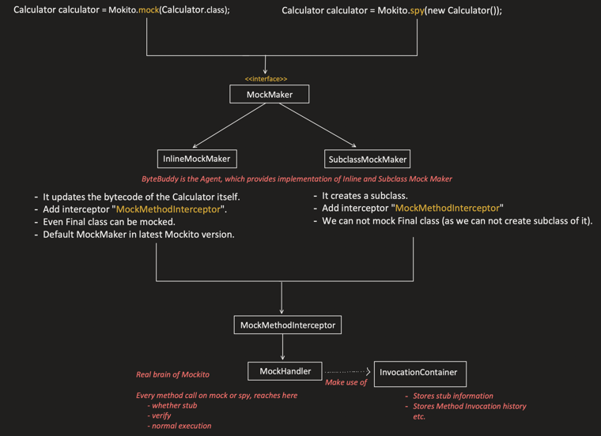
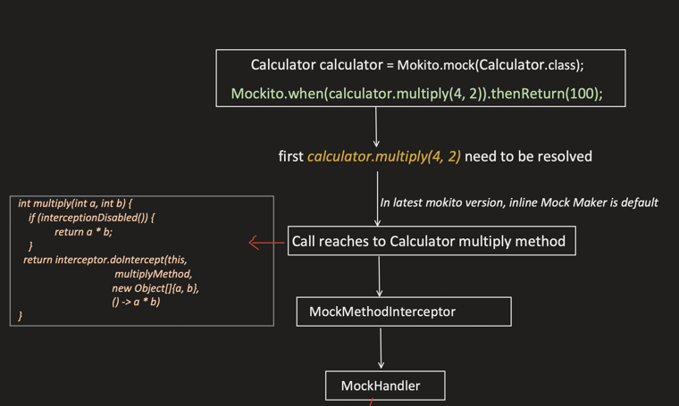
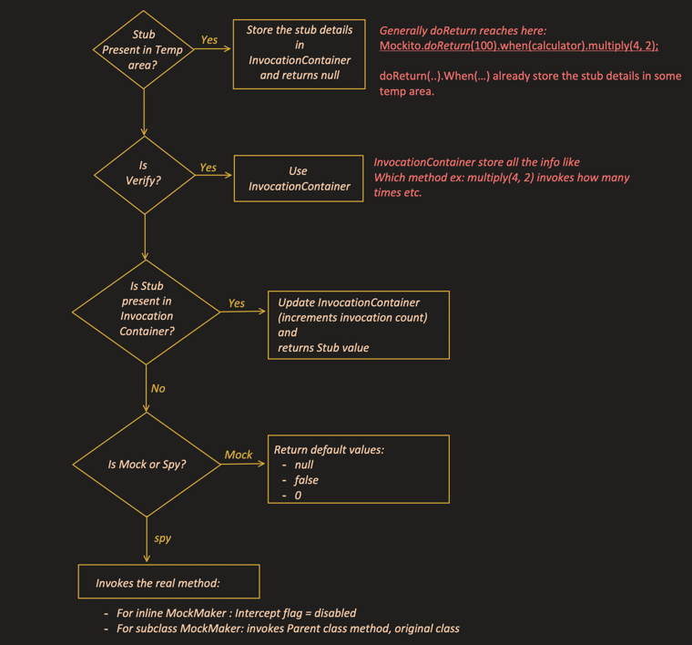
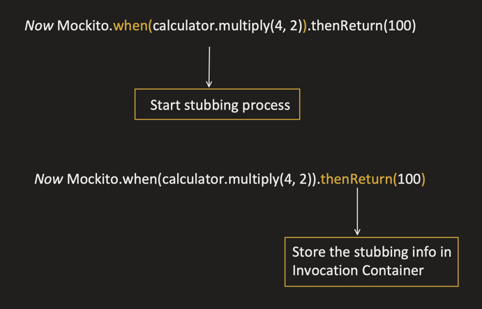
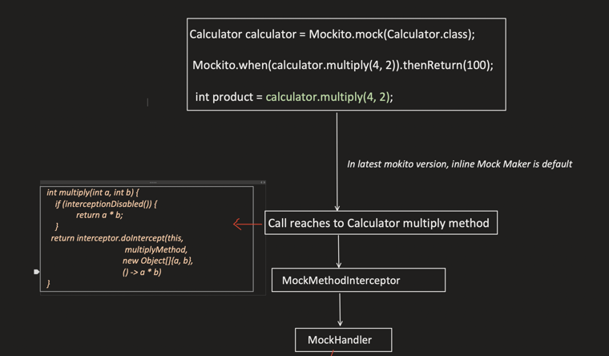
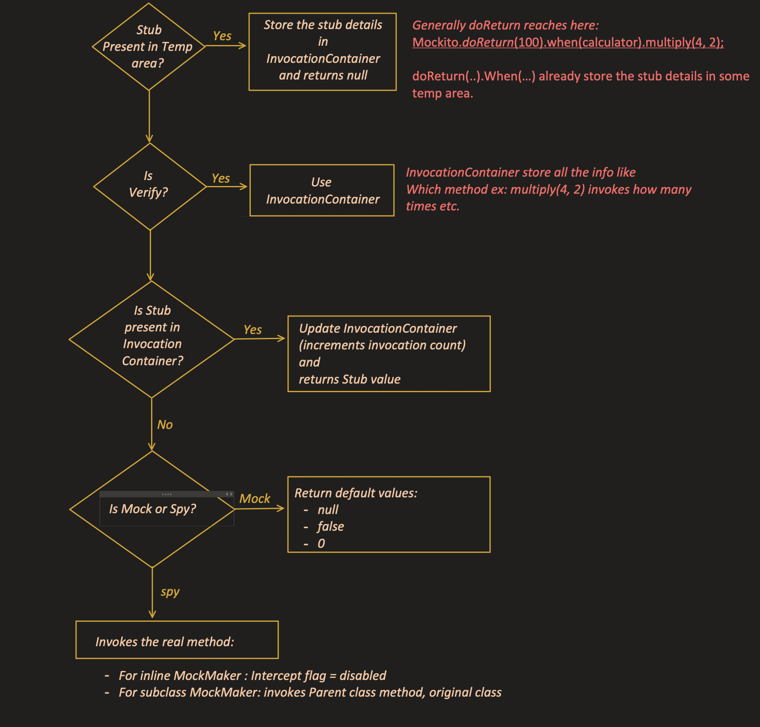

### Mockito Internals

> **Video:** [Mockito Architecture — How Mock, Stub and Spy Work Internally](https://www.youtube.com/watch?v=uU-55imZN4g)

No interviwer asks this ,just for learning!! We seen mocking ,stubbing and spying . We wil see it later.

```java
class Calculator {

    int add(int a, int b) {
        return a + b;
    }

    int multiply(int a, int b) {
        return a * b;
    }
}
```

```java
@Test
void testMultiply() {

    Calculator calculator = mock(Calculator.class);

    when(calculator.multiply(4, 2)).thenReturn(100);

    int output = calculator.multiply(4, 2);

    assertEquals(100, output);
}
```

---

### Video Topic Index

- [00:00 — Introduction](https://www.youtube.com/watch?v=uU-55imZN4g&t=0s)
- [00:52 — Four parts of a typical Mockito test](https://www.youtube.com/watch?v=uU-55imZN4g&t=52s)
- [02:28 — What happens when a mock or spy is created](https://www.youtube.com/watch?v=uU-55imZN4g&t=148s)
- [03:17 — `MockMaker` interface and its implementations](https://www.youtube.com/watch?v=uU-55imZN4g&t=197s)
- [03:42 — `SubclassMockMaker`](https://www.youtube.com/watch?v=uU-55imZN4g&t=222s)
- [04:49 — `InlineMockMaker`](https://www.youtube.com/watch?v=uU-55imZN4g&t=289s)
- [05:38 — Default mock maker before and after Mockito 5](https://www.youtube.com/watch?v=uU-55imZN4g&t=338s)
- [06:33 — Byte Buddy's role](https://www.youtube.com/watch?v=uU-55imZN4g&t=393s)
- [07:10 — Conceptual subclass proxy code](https://www.youtube.com/watch?v=uU-55imZN4g&t=430s)
- [08:34 — Inputs passed to `doIntercept(...)`](https://www.youtube.com/watch?v=uU-55imZN4g&t=514s)
- [09:49 — Conceptual inline bytecode modification](https://www.youtube.com/watch?v=uU-55imZN4g&t=589s)
- [12:39 — Common mock/spy interception flow](https://www.youtube.com/watch?v=uU-55imZN4g&t=759s)
- [13:12 — `MockMethodInterceptor` as the entry point](https://www.youtube.com/watch?v=uU-55imZN4g&t=792s)
- [13:17 — `MockHandler`, the brain of Mockito](https://www.youtube.com/watch?v=uU-55imZN4g&t=797s)
- [14:28 — `InvocationContainer`](https://www.youtube.com/watch?v=uU-55imZN4g&t=868s)
- [17:09 — Why inline interception needs an enable/disable flag](https://www.youtube.com/watch?v=uU-55imZN4g&t=1029s)
- [20:44 — What happens internally during stubbing](https://www.youtube.com/watch?v=uU-55imZN4g&t=1244s)
- [22:09 — Java evaluates the inner `when(...)` call first](https://www.youtube.com/watch?v=uU-55imZN4g&t=1329s)
- [23:13 — `MockHandler` decision tree](https://www.youtube.com/watch?v=uU-55imZN4g&t=1393s)
- [23:51 — Temporary stub data used by `doReturn(...)`](https://www.youtube.com/watch?v=uU-55imZN4g&t=1431s)
- [25:41 — Processing `when(...).thenReturn(...)`](https://www.youtube.com/watch?v=uU-55imZN4g&t=1541s)
- [27:19 — Default return values for mocks and spies](https://www.youtube.com/watch?v=uU-55imZN4g&t=1639s)
- [28:19 — Why `doReturn(...)` is safer for spies](https://www.youtube.com/watch?v=uU-55imZN4g&t=1699s)
- [33:15 — What happens during the actual invocation](https://www.youtube.com/watch?v=uU-55imZN4g&t=1995s)
- [37:30 — Verification through invocation history](https://www.youtube.com/watch?v=uU-55imZN4g&t=2250s)
- [38:06 — Final interception-flag recap](https://www.youtube.com/watch?v=uU-55imZN4g&t=2286s)
- [39:12 — Re-enabling interception after the real method](https://www.youtube.com/watch?v=uU-55imZN4g&t=2352s)

---

### 1. What Happens Internally When We Create a Mock or Spy Object

> **Video timestamp:** [02:28](https://www.youtube.com/watch?v=uU-55imZN4g&t=148s)

```
Calculator calculator = Mockito.mock(Calculator.class);    
 Calculator calculator = Mockito.spy(new Calculator());
```


Both go through the same `MockMaker` interface (`<<interface>>`), which has two implementations:



- **`InlineMockMaker`**
  - It updates the **bytecode of the `Calculator` class itself**.
  - Adds an interceptor: `MockMethodInterceptor`.
  - Even a **final class** can be mocked.
  - This is the **default `MockMaker` in the latest Mockito version**.

- **`SubclassMockMaker`**
  - It **creates a subclass** of `Calculator`.
  - Adds the same interceptor: `MockMethodInterceptor`.
  - We **can not** mock a `final` class (since we can't create a subclass of it).

Both then flow into: `MockMethodInterceptor` → `MockHandler` → `InvocationContainer`.


## Why we change bytecode??

Mockito updates the `Calculator` bytecode so it can **intercept method calls**.

Normally, this call directly executes the original method:

```java
calculator.multiply(4, 2);
```

```text
multiply() → original code → return a * b
```

But a mock must behave differently:

```text
multiply()
   ↓
Mockito interceptor
   ↓
Check for stubbing
   ├─ Stub exists → return stubbed value
   ├─ Mock without stub → return 0
   └─ Spy without stub → execute the real method
```

`InlineMockMaker` does not create a subclass. Therefore, it modifies the already-compiled class bytecode in memory and adds interception logic conceptually like:

```java
int multiply(int a, int b) {
    if (this object is controlled by Mockito) {
        return mockitoInterceptor.doIntercept(...);
    }

    return a * b;
}
```

Why modify bytecode instead of Java source?

- Tests run against compiled `.class` files.
- Mockito operates at runtime—it cannot modify and recompile your source code.
- Byte Buddy and Java instrumentation allow Mockito to redefine the loaded class in memory.
- It enables mocking `final` classes and `final` methods, where subclassing and overriding cannot work.

The original `.class` file on disk is generally not permanently changed. The runtime version loaded inside that test JVM is instrumented. Regular objects still execute their original behavior; only objects registered as Mockito mocks or spies are routed through Mockito’s interceptor.

> **`MockHandler`** is the **real brain of Mockito** — every method call on a mock or spy reaches here (whether it's a stub setup, a `verify()` call, or normal execution).
>
> **`InvocationContainer`** stores the stub information and the method invocation history (which method was called, how many times, with what arguments, etc.). `MockHandler` makes use of it.

> `ByteBuddy` is the underlying agent/library that actually provides the bytecode-manipulation implementation for both `InlineMockMaker` and `SubclassMockMaker`.

---

### Conceptual Code — What `InlineMockMaker` Might Have Done

> **Video timestamp:** [09:49](https://www.youtube.com/watch?v=uU-55imZN4g&t=589s)

Since it rewrites the bytecode of the `Calculator` class itself, conceptually the modified class looks something like this:

```java
class Calculator {

    MockMethodInterceptor mockitoInterceptor;

    void setMockitoInterceptor(MockMethodInterceptor interceptor) {
        this.mockitoInterceptor = interceptor;
    }

    int multiply(int a, int b) {

        // if interception toggle is off, run real code, it is
        // required to avoid infinite loop.
        if (interceptFlagDisabled()) {
            return a * b;
        }

        return mockitoInterceptor.doIntercept(this, multiply, new Object[]{a, b}, realMethod);
    }

    // similar changes for add method
}
```

**Use case — why `interceptFlagDisabled()` exists:**

This `interceptFlagDisabled` toggle is specifically required for the **Spy** use case, where we want to call the **real method** when stubbing isn't available for it.

```
Unit test → multiply(a, b) → intercept → MockHandler → no stubbing found →
Spy object, so by default it will invoke real method → Now interception should
be disabled, else it will cause an infinite loop.
```

(Without disabling interception, calling the real method from inside the interceptor would re-trigger the interceptor again — an infinite loop.)

---

### Conceptual Code — What `SubclassMockMaker` Might Have Done

> **Video timestamp:** [07:10](https://www.youtube.com/watch?v=uU-55imZN4g&t=430s)

Since it creates a subclass of `Calculator` instead of rewriting its bytecode:

```java
class CalculatorSpyProxy extends Calculator {

    MockMethodInterceptor mockitoInterceptor;

    void setMockitoInterceptor(MockMethodInterceptor interceptor) {
        this.mockitoInterceptor = interceptor;
    }

    @Override
    int add(int a, int b) {
        return mockitoInterceptor.doIntercept(this, add, new Object[]{a, b}, realMethod);
    }

    @Override
    int multiply(int a, int b) {
        return mockitoInterceptor.doIntercept(this, multiply, new Object[]{a, b}, () -> super.multiply(a, b));
    }
}
```

Here, since it's a real subclass, calling the real method is simply `super.multiply(a, b)` — no toggle flag is needed the way `InlineMockMaker` needs one, because overriding + `super` naturally avoids re-triggering the same overridden method.

---

### What Happens Internally When We Do Stubbing on Mock/Spy Objects

> **Video timestamp:** [20:44](https://www.youtube.com/watch?v=uU-55imZN4g&t=1244s)

For `Mockito.when(calculator.multiply(4, 2)).thenReturn(100)`:

**Step 1 — `calculator.multiply(4, 2)` needs to be resolved first:**

```
Calculator calculator = Mockito.mock(Calculator.class);
Mockito.when(calculator.multiply(4, 2)).thenReturn(100);
```

```
Call reaches Calculator.multiply() method
        ↓
MockMethodInterceptor
        ↓
MockHandler
```

(In the latest Mockito version, `InlineMockMaker` is the default, so the call is intercepted via the rewritten bytecode shown above.)

**Step 2 — Within `MockHandler`, the flow is:**



```
Is Stub Present in Temp area?
  → Yes: Store the stub details in InvocationContainer, and return null.
          (Generally doReturn(...) reaches here:
           Mockito.doReturn(100).when(calculator).multiply(4, 2);
           doReturn(...).when(...) already stores the stub details in some temp area.)

Is Verify?
  → Yes: Use InvocationContainer.
          (InvocationContainer stores all the info, like which method — e.g. multiply(4, 2) —
           was invoked, how many times, etc.)

Is Stub present in InvocationContainer?
  → Yes: Update InvocationContainer (increments invocation count), and return the stub value.

Is Mock or Spy?
  → Mock: Return default values — null, false, 0 (depending on return type).
  → Spy: Invoke the real method.
          - For InlineMockMaker: interceptFlagDisabled = true, then call real code.
          - For SubclassMockMaker: invokes the parent class's method (super.<method>()).
```



**So for `Mockito.when(calculator.multiply(4, 2)).thenReturn(100)`:**

At the moment `calculator.multiply(4, 2)` is evaluated (before `.thenReturn(100)` even runs), there's no stub registered yet — and since `calculator` is a plain **Mock** (not a Spy), the flow falls through to "Is Mock or Spy? → Mock → Return default values" — so this inner call **returns `0`** (default value for `int`). *Then* `.thenReturn(100)` registers `100` as the stub value for that method+arguments combination.

---

### What Happens When the Method Is Actually Invoked

> **Video timestamp:** [33:15](https://www.youtube.com/watch?v=uU-55imZN4g&t=1995s)

```java
Calculator calculator = Mockito.mock(Calculator.class);
Mockito.when(calculator.multiply(4, 2)).thenReturn(100);

int product = calculator.multiply(4, 2);
```

**Step 1 — the call is intercepted the same way as before:**



```
Call reaches Calculator.multiply() method
        ↓
MockMethodInterceptor
        ↓
MockHandler
```

**Step 2 — within `MockHandler`, the same decision tree runs again:**



This time:

```
Is Stub Present in Temp area?  → No
Is Verify?                     → No
Is Stub present in InvocationContainer?  → Yes (we registered it via thenReturn(100) earlier)
        → Update InvocationContainer (increments invocation count), and return the stub value.
```



**So `calculator.multiply(4, 2)` returns `100`** — the stubbed value we set up earlier.

---

### Additional Points From the Video

#### Four Parts of a Typical Mockito Test

> **Video timestamp:** [00:52](https://www.youtube.com/watch?v=uU-55imZN4g&t=52s)

The video divides a normal Mockito test into four parts:

1. **Create a mock or spy object.**
2. **Do stubbing** — decide what the dependency should return.
3. **Perform the actual invocation.**
4. **Assert the result or verify the interaction.**

For the example used above:

```java
Calculator calculator = mock(Calculator.class);             // 1. Create mock
when(calculator.multiply(4, 2)).thenReturn(100);            // 2. Stubbing
int output = calculator.multiply(4, 2);                     // 3. Actual invocation
assertEquals(100, output);                                  // 4. Assertion
```

#### Default `MockMaker` Version Difference

> **Video timestamp:** [05:38](https://www.youtube.com/watch?v=uU-55imZN4g&t=338s)

- Mockito versions **before Mockito 5** generally used `SubclassMockMaker` as the default.
- In Mockito 5 and later, `InlineMockMaker` is the default.
- The newer versions still provide both approaches, but the inline approach also supports mocking final classes because it does not need to create a subclass.

#### Information Passed to `doIntercept(...)`

> **Video timestamp:** [08:34](https://www.youtube.com/watch?v=uU-55imZN4g&t=514s)

The conceptual `MockMethodInterceptor.doIntercept(...)` call receives:

1. The mock or spy object on which the call was made.
2. A `Method` object containing method metadata.
3. An `Object[]` containing the arguments passed to the method.
4. A `RealMethod` object/callback containing the information needed to invoke the original implementation.

Conceptually:

```java
mockitoInterceptor.doIntercept(
        this,                  // mock/spy object
        multiplyMethod,        // method metadata
        new Object[]{a, b},    // invocation arguments
        realMethod             // how to call the original method
);
```

#### Why `doReturn(...).when(...)` Is Safer for a Spy

> **Video timestamp:** [28:19](https://www.youtube.com/watch?v=uU-55imZN4g&t=1699s)

```java
when(calculatorSpy.multiply(4, 2)).thenReturn(100);
```

Java evaluates `calculatorSpy.multiply(4, 2)` before `when(...)` is completed. At that moment no stub has been registered. Since the object is a spy, its default behavior is to invoke the real method. The returned result is ignored for the final stub, but the real method has already executed.

With this form:

```java
doReturn(100).when(calculatorSpy).multiply(4, 2);
```

`doReturn(100).when(calculatorSpy)` first places the pending stub information in a temporary area. When `multiply(4, 2)` is intercepted, `MockHandler` recognizes that stubbing is in progress, transfers the method, arguments, and answer into `InvocationContainer`, and does **not** execute the real method.

For a plain mock, both forms are safe because an unstubbed call returns a default value instead of invoking real business logic. The reason for preferring `doReturn(...)` with a spy is to prevent unnecessary real-method execution, **not because `doReturn(...)` is faster**.

#### Interception Is Enabled Again After a Real Spy Call

> **Video timestamp:** [39:12](https://www.youtube.com/watch?v=uU-55imZN4g&t=2352s)

When an inline spy has no matching stub, Mockito conceptually performs this sequence:

```text
Disable interception
        ↓
Invoke the real method
        ↓
Enable interception again
```

Disabling interception prevents the real call from re-entering `MockMethodInterceptor` forever. Re-enabling it afterward ensures that later calls on the spy are intercepted normally.

---

### Explained by ChatGPT

#### What Makes Real-Method Execution During Spy Stubbing Risky?

Calling a real method while merely configuring a test can do much more than waste a little time. The method may:

- change the spy object's state;
- write to a database, file, queue, or another external system;
- call an uninitialized dependency and throw an exception;
- perform an expensive operation; or
- produce a different result depending on the object's current state.

For example:

```java
List<String> spyList = spy(new ArrayList<>());

// Risky: get(0) runs immediately while the list is empty and throws.
when(spyList.get(0)).thenReturn("Mockito");

// Safe: the real get(0) method is not executed during stubbing.
doReturn("Mockito").when(spyList).get(0);
```

This is why `doReturn(...).when(spy)...` is normally preferred when stubbing a spy.
