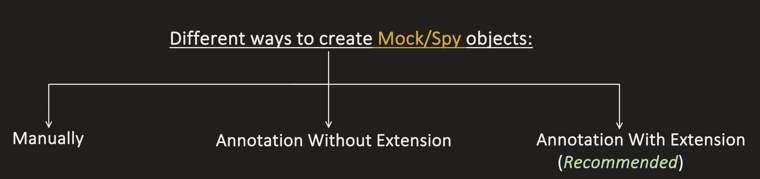
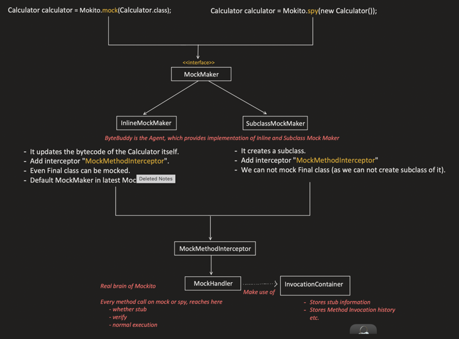
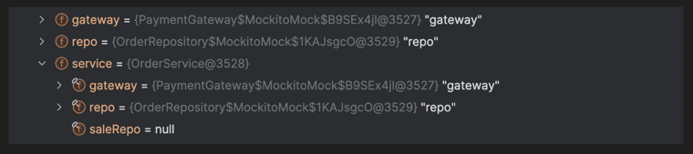
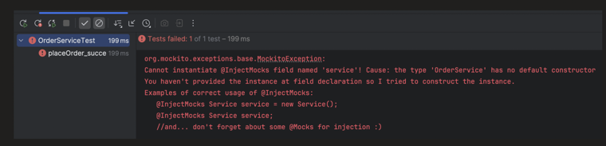
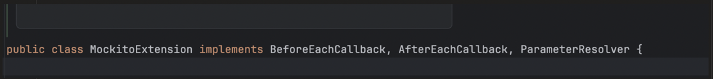

### `@Mock`, `@InjectMocks` (JUnit & Mockito Integration)

```
Different ways to create Mock/Spy objects:

    Manually        Annotation Without Extension        Annotation With Extension
                                                                (Recommended)
```



**Pre-requisite:** this topic builds on the "Mock vs Stub vs Spy" and "Mockito Architecture" topics — check those first if anything below feels unfamiliar.

---

### 1. Manually

**Mock:**

```java
@Test
void testMultiplySuccess() {

    Calculator calculator = Mockito.mock(Calculator.class);

    when(calculator.multiply(4, 2)).thenReturn(10);

    int output = calculator.multiply(4, 2);

    assertEquals(10, output);
}
```

**Spy:**

```java
@Test
void testMultiplySuccess() {

    Calculator calculator = Mockito.spy(new Calculator());

    Mockito.doReturn(10).when(calculator).multiply(4, 2);

    int product = calculator.multiply(4, 2);   // mocked
    assertEquals(10, product);

    int sum = calculator.add(4, 2);   // calls the real method
}
```

In the Architecture topic, we already saw what internally happens when we do this — these classes (`Mockito`, `MockMaker`, `MockHandler`, etc.) are all present in the **`mockito-core`** library:



So, when we create the mock/spy manually, we're also **manually**:

- Creating the mock/spy.
- Stubbing.
- Verifying.

All we need is the `mockito-core` library:

```xml
<dependency>
    <groupId>org.mockito</groupId>
    <artifactId>mockito-core</artifactId>
    <scope>test</scope>
</dependency>
```

---

### Where Should We Create the Mock/Spy Object? (JUnit Lifecycle + Manual Creation)

**1. In `@BeforeEach` method — Safe**

```java
@BeforeEach
void setup() {
    calculator = Mockito.mock(Calculator.class);
}
```

Safe, because:
- Fresh mock per test.
- No need to reset.
- No need to clean up any resource.

**2. In `@BeforeAll` method — Not Safe**

```java
@BeforeAll
void setup() {
    calculator = Mockito.mock(Calculator.class);
}
```

Not safe, because:
- The **same mock is shared across tests**.
- Stubbing can **leak into other tests**.

**3. In a Field Initializer**

**`PER_METHOD` lifecycle — Safe:**

```java
public class CalculatorTest {

    Calculator calculator = Mockito.mock(Calculator.class);

    @BeforeEach
    void setup() {
        . . .
    }
}
```

Safe, because a **new test class instance is created per test method** — so fresh fields, fresh mocks.

**`PER_CLASS` lifecycle — Not Safe:**

```java
@TestInstance(TestInstance.Lifecycle.PER_CLASS)
public class CalculatorTest {

    Calculator calculator = Mockito.mock(Calculator.class);

    @Test
    void test1() {
        calculator.multiply(10, 2);
        Mockito.verify(calculator).multiply(10, 2);
    }

    @Test
    void test2() {
        calculator.multiply(5, 6);
        /*
        Fails because, mock object remembers the interaction
        from previous test method too.
        So expectation is 1 call to multiply method,
        but actually it's 2.
        */
        Mockito.verify(calculator).multiply(5, 6);   // FAILS
    }
}
```

Not safe, because the **test class instance is created only once** and used by all test methods — so the **same mock object** is used across all test methods, risking:
- Leaking stubs.
- Leaking interaction history (`verify`).
- etc.

---

### 2. Annotation Without Extension

```java
public class OrderService {

    private final PaymentGateway gateway;
    private final OrderRepository repo;

    public OrderService(PaymentGateway gateway, OrderRepository repo) {
        this.gateway = gateway;
        this.repo = repo;
    }

    public boolean placeOrder(int amount) {
        …………do something……….
    }
}
```

**`PaymentGateway.java`:**

```java
public interface PaymentGateway {
    boolean charge(int amount);
}
```

**`OrderRepository.java`:**

```java
public interface OrderRepository {
    void save();
}
```

```java
class OrderServiceTest {

    AutoCloseable closable;

    /*
    At this moment, nothing happens.
    Only @Mock metadata is added with this field.
    gateway = null
    */
    @Mock
    PaymentGateway gateway;

    /*
    At this moment, nothing happens.
    Only @Mock metadata is added with this field.
    repo = null
    */
    @Mock
    OrderRepository repo;

    /*
    At this moment, nothing happens.
    Only @InjectMocks metadata is added with this field.
    service = null
    */
    @InjectMocks
    OrderService service;

    @BeforeEach
    void init() {
        /*
        *** All the major work happens in this line: ***

        Step1: Reflection scan:
        - Find fields with @Mock annotation.
        - Find fields with @Spy annotation.
        - Find fields with @InjectMocks annotation.

        Step2: Create Mock object for @Mock fields
        - Internally it will do:
          gateway = Mockito.mock(PaymentGateway.class);
          repo = Mockito.mock(OrderRepository.class);

        Step3: InjectMocks handling
        - Create the real object of the field annotated with @InjectMocks.
        - And in the real object's member variables, set the mock objects
          which were created in Step2.

          service = new OrderService(gateway, repo);

        Step4: Stores internal state information
        - Which fields are mocked.
        - Which fields are injected.

        This is stored in a ThreadLocal, and even after the test method is
        finished, this data is still present for the running thread.

        So the problem is: if we have a thread pool and resource cleanup
        does not happen, the same thread might later pick up a different
        test and see unpredictable behavior.

        Also, if resource cleanup doesn't happen, it might unnecessarily
        consume a lot of memory.
        */
        closable = MockitoAnnotations.openMocks(this);
    }

    @AfterEach
    void cleanup() throws Exception {
        /*
        After each test, we need to release the resources,
        so that GC can clean it up.
        */
        closable.close();
    }

    @Test
    void placeOrder_success() {
        Mockito.when(gateway.charge(100)).thenReturn(true);

        boolean result = service.placeOrder(100);

        assertTrue(result);
        Mockito.verify(repo).save();
    }
}
```

> These Mockito annotation classes (`@Mock`, `@InjectMocks`, `MockitoAnnotations`) are present in the **`mockito-core`** library. So, all we need is still just `mockito-core`:

```xml
<dependency>
    <groupId>org.mockito</groupId>
    <artifactId>mockito-core</artifactId>
    <scope>test</scope>
</dependency>
```

**Cons of "Annotations without Extension":**

- **Boilerplate** — in *every* test class, we have to write:

  ```java
  AutoCloseable closable;

  @BeforeEach
  void init() {
      closable = MockitoAnnotations.openMocks(this);
  }

  @AfterEach
  void cleanup() throws Exception {
      closable.close();
  }
  ```

- **Easy to forget `close()`.**
- **Manually need to wire the mock creation with the JUnit lifecycle** — need to make sure `openMocks(this)` is added in `@BeforeEach` (not, say, mistakenly in `@BeforeAll`), and `close()` is added in `@AfterEach`.

---

### `@InjectMocks` Internals — How Are the Member Variables Set?

In Step 3 above: *"in the real object's member variables, set the mock objects which were created in Step 2"* — `service = new OrderService(gateway, repo)`.

**What are the different ways to set the member variables, and what are the rules?**

1. **Constructor Injection** (First priority)
2. **Setter Injection** (Second priority)
3. **Field Injection** (Last priority)

---

### 1. Constructor Injection

**Rules:**

- Always pick the constructor with the **most parameters**.
- **Do not guess** values for primitive data types.
- If a Mock is not available for any constructor parameter object, pass `null` for it (but do **not** create a mock for that object).
- If not able to fill any parameter of the picked constructor, **fall back to the default constructor**.

**Use case #1 — Only 1 constructor present: Exact Match**

```java
public class OrderService {

    private final PaymentGateway gateway;
    private final OrderRepository repo;

    public OrderService(PaymentGateway gateway, OrderRepository repo) {
        this.gateway = gateway;
        this.repo = repo;
    }

    public boolean placeOrder(int amount) {
        …………do something……….
    }
}
```

```java
class OrderServiceTest {

    @Mock
    PaymentGateway gateway;

    @Mock
    OrderRepository repo;

    @InjectMocks
    OrderService service;
    .
    .
    .
}
```

Internally it does: `service = new OrderService(gateway, repo)` — it found the constructor that has all the Mock object types available.

**Use case #2 — More than 1 constructor present: able to resolve the dependencies**

```java
public class OrderService {

    private final PaymentGateway gateway;
    private final OrderRepository repo;
    private final SalesRepository salesRepo;

    public OrderService(PaymentGateway gateway, OrderRepository repo) {
        this.gateway = gateway;
        this.repo = repo;
        this.salesRepo = null;
    }

    public OrderService(PaymentGateway gateway, OrderRepository repo, SalesRepository salesRepo) {
        this.gateway = gateway;
        this.repo = repo;
        this.salesRepo = salesRepo;
    }

    public boolean placeOrder(int amount) {
        …………do something……….
    }
}
```

```java
class OrderServiceTest {

    @Mock
    PaymentGateway gateway;

    @Mock
    OrderRepository repo;

    @InjectMocks
    OrderService service;
    .
    .
    .
}
```

**Always pick the constructor with the most parameters** — constructor picked: `OrderService(PaymentGateway gateway, OrderRepository repo, SalesRepository salesRepo)`.

- `PaymentGateway gateway` — Mock is available.
- `OrderRepository repo` — Mock is available.
- `SalesRepository salesRepo` — **no** Mock object available for it, so pass **`null`** (per the rule: use `null`, but don't create a mock for it).

`@InjectMocks` is able to create the `OrderService` object: `service = new OrderService(gateway, repo, null)`. You can see `saleRepo = null` while `gateway`/`repo` hold real mock instances, and the test still passes:




**Use case #3 — More than 1 constructor present: NOT able to resolve the dependencies**

```java
public class OrderService {

    private final PaymentGateway gateway;
    private final OrderRepository repo;
    int var;

    public OrderService(PaymentGateway gateway, OrderRepository repo) {
        this.gateway = gateway;
        this.repo = repo;
    }

    public OrderService(PaymentGateway gateway, OrderRepository repo, int var) {
        this.gateway = gateway;
        this.repo = repo;
        this.var = var;
    }

    public boolean placeOrder(int amount) {
        …………do something……….
    }
}
```

**Always pick the constructor with the most parameters** — constructor picked: `OrderService(PaymentGateway gateway, OrderRepository repo, int var)`.

- `PaymentGateway gateway` — Mock is available.
- `OrderRepository repo` — Mock is available.
- `int var` — **do not guess** values for primitive data types, so it's **not able to resolve** this parameter of the picked constructor.

**If not able to fill the parameters of the picked constructor, fall back to the default constructor.**

Try to invoke: `service = new OrderService();` — but if we **don't** have a default (no-arg) constructor in the `OrderService` class at all, it fails outright:



```
org.mockito.exceptions.base.MockitoException:
Cannot instantiate @InjectMocks field named 'service'! Cause: the type 'OrderService' has no default constructor
You haven't provided the instance at field declaration so I tried to construct the instance.
Examples of correct usage of @InjectMocks:
  @InjectMocks Service service = new Service();
  @InjectMocks Service service;
  //and... don't forget about @Mocks for injection :)
```

---

### 2. Setter Injection

**Rules:**

- A **default no-arg constructor must be present**. Why? Because Constructor Injection is 1st priority — to fall through to Setter Injection, Mockito needs to first fail to resolve the picked constructor's parameters, then fall back to the default constructor, and *then* call setter methods on that newly created object.
- The setter method **must follow the naming convention**: `setSalesRepo(SalesRepository salesRepo)` — **not** `salesRepo(SalesRepository salesRepo)` or `addSalesRepo(SalesRepository salesRepo)`, etc.
- The setter method **must take exactly 1 argument** — `setAll(A a, B b)` is ignored.
- **Setter injection does not work for `final` fields.**
- If Setter Injection is not possible for certain fields, Mockito then tries **Field Injection** through reflection for those fields (even `private` fields will get set — but not `final` ones).

```java
public class OrderService {

    private PaymentGateway gateway;
    private OrderRepository repo;
    private SalesRepository salesRepo;

    public OrderService() { }

    public OrderService(PaymentGateway gateway, OrderRepository repo, int var) {
        this.gateway = gateway;
        this.repo = repo;
    }

    public void setGateway(PaymentGateway gateway) {
        this.gateway = gateway;
    }

    public boolean placeOrder(int amount) {
        …………do something……….
    }
}
```

```java
class OrderServiceTest {

    @Mock
    PaymentGateway gate;

    @Mock
    OrderRepository repo;

    @Mock
    SalesRepository salesRepo;

    @InjectMocks
    OrderService service;
    .
    .
    .
}
```

**Step 1: Go for Constructor Injection**

Pick the constructor with the most parameters — picked: `OrderService(PaymentGateway gateway, OrderRepository repo, int var)`. But it's **not able to satisfy all parameters** of the picked constructor (`int var` — can't guess the value).

So, it falls back to the **default no-arg constructor**, and is able to find it: `OrderService service = new OrderService();`

Once the object is created, Mockito tries **Setter Injection first, then Field Injection**, to initialize all remaining fields.

**Step 2: Go for Setter Injection**

`OrderService` object has 3 fields: `gateway`, `repo`, `salesRepo`.

1. It picks the first field: `private PaymentGateway gateway;` → looks for its setter method: `setGateway(PaymentGateway gateway)` → **found**. Then checks: do I have a Mock object for type `PaymentGateway`? Yes (`@Mock PaymentGateway gate;`) — so it invokes `setGateway(...)`. Now `gateway` = the Mock gateway.

2. `OrderService` object still has 2 more fields to set: `repo` and `salesRepo`. For **both**, Mockito is **not able to find a setter method**.

**Step 3: Go for Field Injection for these fields**

- `private OrderRepository repo` = `@Mock OrderRepository repo`
- `private SalesRepository salesRepo` = `@Mock SalesRepository salesRepo`

Even `private` fields are set (via reflection).

---

### 1. Annotation With Extension (Recommended)

It's similar to "Annotation Without Extension." The **only difference** is: we don't have to worry about `openMocks()`, closing the resource, or wiring into the JUnit lifecycle ourselves — **it's all managed by the Extension**.

(If any doubts on how Extensions work internally, check the in-depth `005 extensions` notes/video in this JUnit5 series.)

```java
public class OrderService {

    private final PaymentGateway gateway;
    private final OrderRepository repo;

    public OrderService(PaymentGateway gateway, OrderRepository repo) {
        this.gateway = gateway;
        this.repo = repo;
    }

    public boolean placeOrder(int amount) {
        …………do something……….
    }
}
```

```java
public interface PaymentGateway {
    boolean charge(int amount);
}
```

```java
public interface OrderRepository {
    void save();
}
```

```java
@ExtendWith(MockitoExtension.class)
class OrderServiceTest {

    @Mock
    PaymentGateway gateway;

    @Mock
    OrderRepository repo;

    @InjectMocks
    OrderService service;

    @Test
    void placeOrder_success() {
        Mockito.when(gateway.charge(100)).thenReturn(true);
        boolean result = service.placeOrder(100);
        assertTrue(result);
        Mockito.verify(repo).save();
    }
}
```

**1. `MockitoExtension` enables hooks in the Jupiter (JUnit5) engine.**

It gets lifecycle callbacks like `beforeEach` and `afterEach`:

```java
public class MockitoExtension implements BeforeEachCallback, AfterEachCallback, ParameterResolver {
    ...
}
```



`MockitoExtension` comes from a separate dependency:

```xml
<dependency>
    <groupId>org.mockito</groupId>
    <artifactId>mockito-junit-jupiter</artifactId>
    <version>5.11.0</version>
    <scope>test</scope>
</dependency>
```

> `mockito-junit-jupiter` also transitively pulls in `mockito-core`, so we don't need to separately add the `mockito-core` dependency.

**2. Before each test method, it internally calls something similar to:**

```java
closable = MockitoAnnotations.openMocks(this);
```

```java
@Override
public void beforeEach(final ExtensionContext context) {
    ...
    MockitoSession session =
            Mockito.mockitoSession()
                    .initMocks(testInstances.toArray())
                    .strictness(actualStrictness)
                    .logger(new MockitoSessionLoggerAdapter(Plugins.getMockitoLogger()))
                    .startMocking();
    ...
}
```

**3. After each test method, it internally calls something similar to:**

```java
closable.close();
```

```java
@Override
public void afterEach(ExtensionContext context) {
    ...
    context.getStore(MOCKITO)
            .remove(SESSION, MockitoSession.class)
            .finishMocking(context.getExecutionException().orElse(null));
    ...
}
```

> The **Constructor, Setter, and Field Injection rules and process are exactly the same** as "Annotation without Extension" — `MockitoExtension` just handles the JUnit lifecycle wiring (`openMocks`/`close`) for us automatically.
