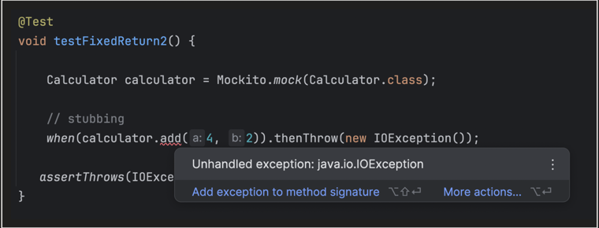
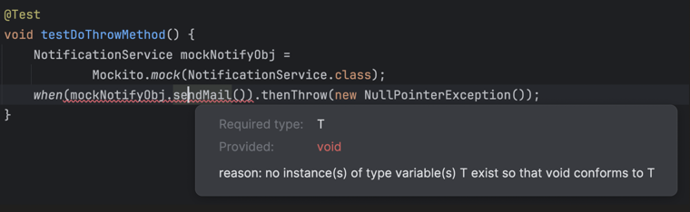

### Stubbing Behavior

> **Video:** [Mockito Stubbing](https://www.youtube.com/watch?v=wnFjZFh99YA&list=PL6W8uoQQ2c61_unqN5bY0kYp65Dt_Sm3c&index=18)
>
> **Timestamp:** [00:49](https://www.youtube.com/watch?v=wnFjZFh99YA&t=49s)

### Video Topic Index

| Timestamp | Topic |
|---|---|
| [00:49](https://www.youtube.com/watch?v=wnFjZFh99YA&t=49s) | Default behavior of a mock and why stubbing is needed |
| [02:43](https://www.youtube.com/watch?v=wnFjZFh99YA&t=163s) | `when(...).thenReturn(...)` and exact argument matching |
| [04:05](https://www.youtube.com/watch?v=wnFjZFh99YA&t=245s) | `when(...).thenThrow(...)` |
| [05:23](https://www.youtube.com/watch?v=wnFjZFh99YA&t=323s) | Checked exceptions while stubbing |
| [06:45](https://www.youtube.com/watch?v=wnFjZFh99YA&t=405s) | Sequential stubbing |
| [08:12](https://www.youtube.com/watch?v=wnFjZFh99YA&t=492s) | `doReturn(...).when(...)` for spies |
| [10:28](https://www.youtube.com/watch?v=wnFjZFh99YA&t=628s) | `doNothing()` for `void` methods |
| [12:26](https://www.youtube.com/watch?v=wnFjZFh99YA&t=746s) | `doThrow()` for `void` methods |
| [13:49](https://www.youtube.com/watch?v=wnFjZFh99YA&t=829s) | Argument matchers |
| [15:14](https://www.youtube.com/watch?v=wnFjZFh99YA&t=914s) | Common matcher types |
| [16:25](https://www.youtube.com/watch?v=wnFjZFh99YA&t=985s) | All-or-none matcher rule and `eq(...)` |
| [17:59](https://www.youtube.com/watch?v=wnFjZFh99YA&t=1079s) | Dynamic stubbing with `thenAnswer()` and `doAnswer()` |
| [18:59](https://www.youtube.com/watch?v=wnFjZFh99YA&t=1139s) | Static `UserRepository` stubbing example |
| [23:25](https://www.youtube.com/watch?v=wnFjZFh99YA&t=1405s) | Stateless versus stateful behavior |
| [24:30](https://www.youtube.com/watch?v=wnFjZFh99YA&t=1470s) | Building a stateful in-memory repository stub |
| [25:10](https://www.youtube.com/watch?v=wnFjZFh99YA&t=1510s) | `doAnswer()` captures and saves the invocation argument |
| [27:44](https://www.youtube.com/watch?v=wnFjZFh99YA&t=1664s) | `thenAnswer()` reads the requested ID and returns the saved user |
| [29:11](https://www.youtube.com/watch?v=wnFjZFh99YA&t=1751s) | Why the in-memory stub tests call-dependent behavior |

> In the Mockito Architecture topic, we already covered how stubbing works internally.

**By default, Mockito mocks:**

- return `null` for objects
- return `0` for primitives
- return `false` for `boolean`
- return empty collections (for some types)

**But stubbing overrides that.**

#### Added by ChatGPT

Mockito's normal default answer is called `RETURNS_DEFAULTS`. More precisely, it returns zero-like values for primitive return types, `null` for most reference types, and empty values for several commonly used container types. These values do **not** come from the real method; they are generated by the mock because no matching stub was found.

For example, in the test case below, no stubbing is used:

```java
@Test
void testWithoutStub() {

    Calculator calculator = Mockito.mock(Calculator.class);
    int sum = calculator.add(4, 2);

    assertEquals(6, sum);   // FAILS — sum is actually 0 (default), not 6
}
```

---

### Let's See the Different Ways of Stubbing

### 1. `when(...).thenReturn(...)`

> **Timestamp:** [02:43](https://www.youtube.com/watch?v=wnFjZFh99YA&t=163s)

Defines the behavior to return a specific value when a certain condition is met.

```java
@Test
void testFixedReturn1() {
    Calculator calculator = Mockito.mock(Calculator.class);
    /*
    This does exact argument matching
    */

    // stubbing
    Mockito.when(calculator.add(4, 2)).thenReturn(10);

    int sum = calculator.add(4, 2);
    assertEquals(10, sum);
}
```

> If the `add()` method is invoked with **other** parameters, like `calculator.add(5, 4)`, then this mock stub (`Mockito.when(calculator.add(4, 2)).thenReturn(10)`) will **not** be used, since the arguments don't match.
>
> So `calculator.add(5, 4)` will return the **default value**, i.e. `0`.

---

### 2. `when(...).thenThrow(...)`

> **Timestamp:** [04:05](https://www.youtube.com/watch?v=wnFjZFh99YA&t=245s) · Checked exceptions: [05:23](https://www.youtube.com/watch?v=wnFjZFh99YA&t=323s)

Used to stub a method so that it throws a specified exception when invoked during a test.

There are 2 types of exceptions:

**1. Unchecked Exception — Runtime exception**

- The compiler does **not** enforce us to handle it.

```java
@Test
void testFixedReturn2() {

    Calculator calculator = Mockito.mock(Calculator.class);

    // stubbing
    when(calculator.add(4, 2)).thenThrow(new NullPointerException());

    assertThrows(NullPointerException.class, () -> calculator.add(4, 2));
}
```

This test case works fine.

**2. Checked Exception — Compile time exception**

- The compiler **forces** us to handle it, either by try/catch or by propagating it.
- The test method must **match the method signature** (declare `throws`).

```java
public int add(int a, int b) throws IOException {
    return a + b;
}
```

If the real method doesn't declare `throws IOException`, stubbing it to throw `IOException` won't even compile:



```java
@Test
void testFixedReturn2() throws IOException {

    Calculator calculator = Mockito.mock(Calculator.class);

    // stubbing
    when(calculator.add(4, 2)).thenThrow(new IOException());

    assertThrows(IOException.class, () -> calculator.add(4, 2));
}
```

#### Added by ChatGPT — checked-exception correction

There are two different checks here:

1. If `add(...)` **declares** `throws IOException`, Java requires the call inside `when(calculator.add(...))` to be handled or declared. That is why the test method uses `throws IOException`.
2. If `add(...)` **does not declare** `IOException`, the stubbing statement can still compile, but Mockito rejects that checked exception while the test runs, usually with `MockitoException: Checked exception is invalid for this method!`

So “won't even compile” applies to calling a method that already declares an unhandled checked exception; Mockito's rule about stubbing an undeclared checked exception is normally enforced at runtime.

---

### 3. `when(...).thenReturn(...).thenReturn(...)`

> **Timestamp:** [06:45](https://www.youtube.com/watch?v=wnFjZFh99YA&t=405s)

Used for **sequential stubbing** — returning different values on successive invocations of the same method.

```java
when(service.get("u123"))
        .thenReturn(null)
        .thenReturn("shrayansh");
```

**Behavior:**

```
1st call of service.get("u123") -> null
2nd call of service.get("u123") -> shrayansh
3rd call of service.get("u123") -> shrayansh   (last value repeats)
```

```java
@Test
void testSequentialStub() {
    Calculator calculator = Mockito.mock(Calculator.class);
    // stubbing
    when(calculator.add(4, 2))
            .thenReturn(5)
            .thenReturn(6)
            .thenThrow(new NullPointerException())
            .thenReturn(7);

    assertEquals(5, calculator.add(4, 2));
    assertEquals(6, calculator.add(4, 2));
    assertThrows(NullPointerException.class, () -> calculator.add(4, 2));
    assertEquals(7, calculator.add(4, 2));
}
```

---

### 4. `doReturn(...).when(...)`

> **Timestamp:** [08:12](https://www.youtube.com/watch?v=wnFjZFh99YA&t=492s)

- Stubs a method **without invoking the real method** during stubbing.
- Useful for **spies**.

```java
class Calculator {
    int add(int a, int b) {
        return a + b;
    }
}
```

```java
Calculator calculator = spy(new Calculator());

// stubbing: But also invokes real method
/*
Like this, here stubbing is happening.
But it will also invoke the add method.
*/
when(calculator.add(4, 2)).thenReturn(100);

int sum = calculator.add(4, 2);   // returns 100, but it will also invoke the real method too
```

**Safer version for spy objects:**

```java
Calculator calculator = spy(new Calculator());

// stubbing: do not invoke real method, safe to use with spy
doReturn(100).when(calculator).add(4, 2);

int sum = calculator.add(4, 2);   // mocked → 100
```

> Why `doReturn().when()` is safe for spy objects was already covered in the `013 mockito architecture` notes/video.

---

### 5. `doNothing()`

> **Timestamp:** [10:28](https://www.youtube.com/watch?v=wnFjZFh99YA&t=628s)

Used to **explicitly** stub a `void` method, so that it performs no action when invoked.

```java
class NotificationService {
    void sendMail() {
        . . .
    }
}
```

**Using Mock:**

```java
@Test
void testVoidReturnMethod() {

    NotificationService mockNotifyObj = Mockito.mock(NotificationService.class);

    mockNotifyObj.sendMail();
}
```

All good — `mockNotifyObj.sendMail()` does nothing by default (mocks don't call the real method).

**Using Spy:**

```java
@Test
void testVoidReturnMethod() {

    NotificationService spyNotifyObj = Mockito.spy(new NotificationService());

    spyNotifyObj.sendMail();
}
```

The above code **will** invoke the real `sendMail()` method (since it's a spy, and no stubbing was applied to prevent that).

**So, how to fix for Spy?**

```java
@Test
void testVoidReturnMethod() {

    NotificationService spyNotifyObj = Mockito.spy(new NotificationService());

    doNothing().when(spyNotifyObj).sendMail();
}
```

#### Added by ChatGPT

For a plain mock, a `void` method already does nothing by default, so `doNothing()` is mainly useful for making the intention explicit, suppressing a real method on a spy, or creating sequential behavior for a `void` method:

```java
doNothing()
        .doThrow(new RuntimeException("second call failed"))
        .when(notificationService).sendMail();
```

Here the first call does nothing and the second call throws.

---

### 6. `doThrow()`

> **Timestamp:** [12:26](https://www.youtube.com/watch?v=wnFjZFh99YA&t=746s)

Used to stub a `void` method so that it throws a specified exception when invoked, **without calling the real method**.

**How to test the exception scenario for a `void` method?**

We can **not** use `when(...).thenThrow(...)` here — it won't even compile, since `when(voidMethodCall())` doesn't work (a `void` call can't be passed as an argument):



```
Required type: T
Provided: void
reason: no instance(s) of type variable(s) T exist so that void conforms to T
```

**Answer is: `doThrow()`**

```java
@Test
void testDoThrowMethod() {
    NotificationService mockNotifyObj = Mockito.mock(NotificationService.class);

    doThrow(new RuntimeException()).when(mockNotifyObj).sendMail();

    assertThrows(RuntimeException.class, () -> mockNotifyObj.sendMail());
}
```

---

### 7. Matchers

> **Timestamp:** [13:49](https://www.youtube.com/watch?v=wnFjZFh99YA&t=829s) · Common matchers: [15:14](https://www.youtube.com/watch?v=wnFjZFh99YA&t=914s) · Matcher rule: [16:25](https://www.youtube.com/watch?v=wnFjZFh99YA&t=985s)

Recall from earlier: the problem of "**exact argument matching**" —

> If the `add()` method is invoked with other parameters, like `calculator.add(5, 4)`, then the mock stub `Mockito.when(calculator.add(4, 2)).thenReturn(10)` will **not** be used, since arguments are not matched. So `calculator.add(5, 4)` returns the default value, i.e. `0`.

**How do we resolve this? Answer: Matchers.**

> Mockito matchers allow **flexible argument matching** when stubbing method calls.

```java
@Test
void testFixedReturn1() {
    Calculator calculator = Mockito.mock(Calculator.class);

    // stubbing
    Mockito.when(calculator.add(anyInt(), anyInt())).thenReturn(10);

    assertEquals(10, calculator.add(4, 2));
    assertEquals(10, calculator.add(5, 4));
}
```

Now the stub applies to **any** `int` arguments.

**Common matchers:**

| Matcher | Description | Example |
|---|---|---|
| `any()` | Matches any object of any type (including null) | `when(service.process(any())).thenReturn("ok")` |
| `anyString()` | Matches any `String` (including null) | `when(service.getUser(anyString())).thenReturn(user)` |
| `anyInt()` | Matches any `int` value | `when(service.add(anyInt(), anyInt())).thenReturn(10)` |
| `anyLong()` | Matches any `long` value | `when(repo.findById(anyLong())).thenReturn(entity)` |
| `anyDouble()` | Matches any `double` value | `when(service.applyDiscount(anyDouble())).thenReturn(100.0)` |
| `anyList()` | Matches any `List` (including null) | `when(service.process(anyList())).thenReturn(true)` |
| `anyMap()` | Matches any `Map` (including null) | `when(service.process(anyMap())).thenReturn(true)` |
| `eq()` | Matches an exact value (used when mixing matchers) | `when(service.add(eq(5), anyInt())).thenReturn(15)` |
| `isNull()` | Matches only `null` values | `when(service.process(isNull())).thenReturn("empty")` |
| `notNull()` | Matches non-null values | `when(service.process(notNull())).thenReturn("valid")` |
| `gt()` | Matches values greater than a specific value | `when(service.calculate(gt(100))).thenReturn("high")` |
| `lt()` | Matches values less than a specific number | `when(service.calculate(lt(10))).thenReturn("low")` |
| `geq()` | Matches values greater than or equal to a specific value | `when(service.calculate(geq(50))).thenReturn("eligible")` |
| `leq()` | Matches values less than or equal to a specific value | `when(service.calculate(leq(20))).thenReturn("small")` |
| `contains()` | Matches a string containing a given substring | `when(service.getUser(contains("admin"))).thenReturn(adminUser)` |
| `startsWith()` | Matches a string starting with a given prefix | `when(service.getUser(startsWith("user_"))).thenReturn(user)` |
| `endsWith()` | Matches a string ending with a given suffix | `when(service.getUser(endsWith("@gmail.com"))).thenReturn(gmailUser)` |
| `matches()` | Matches a string using a regex pattern | `when(service.getUser(matches("user\\d+"))).thenReturn(user)` |

#### Added by ChatGPT — matching `null`

In current Mockito versions, typed matchers such as `anyString()`, `anyList()`, `anyMap()`, and `any(SomeClass.class)` match **non-null** values of the appropriate type. Use `isNull()` when only `null` should match, or `nullable(SomeClass.class)` when either `null` or an instance of that type should match. The untyped `any()` is the special matcher that can also match `null`.

Matchers return dummy values only to satisfy Java's compiler; Mockito records the matcher internally. Therefore, use them only inside stubbing or verification calls—not as ordinary application values.

**Important — if you use one matcher, ALL arguments must use matchers:**

```java
// WRONG — Mixing a raw value and a matcher does not work
when(calculator.add(anyInt(), 5)).thenReturn(15);

// CORRECT — use eq() for the raw value too
when(calculator.add(anyInt(), eq(5))).thenReturn(15);
```

---

### 8. Dynamic Stubbing: `thenAnswer()` and `doAnswer()`

> **Timestamp:** [17:59](https://www.youtube.com/watch?v=wnFjZFh99YA&t=1079s)

**Problem:**

```java
public class UserService {

    private final UserRepository repository;

    public UserService(UserRepository repository) {
        this.repository = repository;
    }

    public void register(User user) {
        repository.save(user);
    }

    public User getUser(Long id) {
        return repository.findById(id);
    }
}
```

**Without Dynamic Stubbing:**

> **Example starts:** [18:59](https://www.youtube.com/watch?v=wnFjZFh99YA&t=1139s)

```java
@Test
void testWithoutDynamicStubbing() {

    UserRepository repository = mock(UserRepository.class);
    UserService userService = new UserService(repository);

    User user1 = new User(1L, "A");
    User user2 = new User(2L, "B");

    // Stubbing
    doNothing().when(repository).save(user1);
    doNothing().when(repository).save(user2);

    userService.register(user1);
    userService.register(user2);

    // Stubbing
    when(repository.findById(1L)).thenReturn(user1);
    when(repository.findById(2L)).thenReturn(user2);

    User result1 = userService.getUser(1L);
    User result2 = userService.getUser(2L);

    // assertion
    assertEquals("A", result1.getName());
    assertEquals("B", result2.getName());
}
```

This test case works fine, but it has some weaknesses:

1. **Every new user → we need to add 2 new stubs** (one for `save`, one for `findById`). 10 users → 20 stubs.
2. **Not a realistic behavior of the repository.** If we observe this test case properly, it actually doesn't test the real behavior — the real behavior we intend to test is: during `save`, it stores the data; during `find`, it fetches from that storage. But this test case does neither — it just hardcodes what each call should independently return.

**So:**

- **STATELESS** dependency → output depends only on input → **static stubbing is fine**.
- **STATEFUL** dependency → output depends on a previous call → **dynamic stubbing helps**.

Stateful examples:
- Cache: `get()` depends on a previous `put()`.
- Retry logic: say for the first 3 calls a retry happens, but the 4th call should throw an exception.
- etc.

#### Added by ChatGPT — choosing between a fixed stub, an `Answer`, and a fake

- Use fixed `thenReturn(...)` values when each result depends only on the current input.
- Use sequential stubbing when the test needs a small, predetermined series of results.
- Use an `Answer` when the result must be calculated from invocation arguments or small amounts of earlier state.
- If the in-memory behavior becomes large or complicated, a small fake implementation of the dependency is often clearer than putting substantial business logic inside Mockito lambdas.

**With Dynamic Stubbing:**

> **Implementation:** [24:30](https://www.youtube.com/watch?v=wnFjZFh99YA&t=1470s) · `doAnswer()`: [25:10](https://www.youtube.com/watch?v=wnFjZFh99YA&t=1510s) · `thenAnswer()`: [27:44](https://www.youtube.com/watch?v=wnFjZFh99YA&t=1664s)

```java
@Test
void testWithDynamicStubbing() {

    UserRepository repository = mock(UserRepository.class);
    UserService userService = new UserService(repository);

    Map<Long, User> store = new HashMap<>();

    // simulate save
    doAnswer(invocation -> {
        User user = invocation.getArgument(0);
        store.put(user.getId(), user);
        return null;
    }).when(repository).save(any());

    // simulate findById
    when(repository.findById(anyLong()))
            .thenAnswer(invocation -> {
                Long id = invocation.getArgument(0);
                return store.get(id);
            });

    User user1 = new User(1L, "A");
    User user2 = new User(2L, "B");

    userService.register(user1);
    userService.register(user2);

    User result1 = userService.getUser(1L);
    User result2 = userService.getUser(2L);

    assertEquals("A", result1.getName());
    assertEquals("B", result2.getName());
}
```

> `doAnswer(...)` (for `void` methods) and `thenAnswer(...)` (for methods with a return value) let us write **custom logic** that runs when the stubbed method is invoked — using `invocation.getArgument(index)` to access whatever arguments were passed in that specific call. This is what lets the stub behave like a real, stateful implementation (a fake in-memory store here), instead of a fixed canned response.
