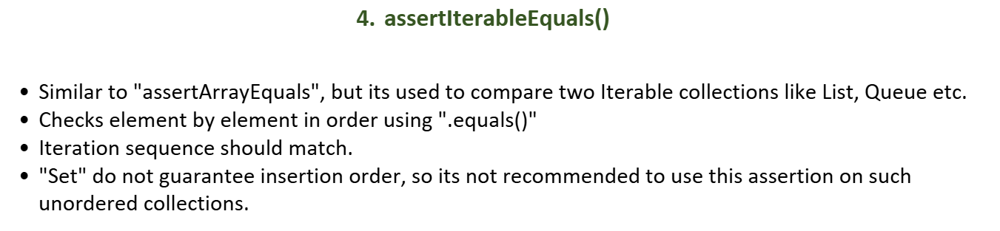

### What are Assertions?

> Assertions are **checks** you put in your test to verify that your code produced the **expected result**.
>
> If the assertion **passes** → test is GREEN ✅
> If the assertion **fails** → test is RED ❌ with a clear error message

```java
// Basic structure:
assertThat(ACTUAL).isEqualTo(EXPECTED);
//          ↑           ↑
//    what your     what you
//    code gave     expected
```

---

### Setup — class used in all examples

```java
// Production class being tested
public class User {
    private String name;
    private int age;
    private String email;
    private boolean active;
    private List<String> roles;

    // constructor, getters, setters
    public boolean isAdult() { return age >= 18; }
}
```

---

### 1. `assertEquals` / `isEqualTo` — check exact value

```java
@Test
void shouldReturnCorrectUserName() {

    // Arrange
    User user = new User("Alice", 25, "alice@gmail.com");

    // Act
    String name = user.getName();

    // Assert
    assertEquals("Alice", name);              // JUnit style
    assertThat(name).isEqualTo("Alice");      // AssertJ style ✅ preferred

    // Failure message if wrong:
    // expected: "Alice" but was: "Bob"
}
```


---

### The Core Rule of `assertEquals`

```
Primitive types  (int, double, boolean) → uses  ==
Object types     (String, User, Order)  → uses  .equals()
```

---

### For Primitives — uses `==`

```java
@Test
void shouldAssertPrimitiveValues() {

    int a = 5;
    int b = 5;

    assertEquals(a, b);  // uses == internally → passes ✅
    // 5 == 5 → true ✅

    double price1 = 100.0;
    double price2 = 100.0;
    assertEquals(price1, price2); // 100.0 == 100.0 → true ✅

    boolean flag = true;
    assertEquals(true, flag);     // true == true → true ✅
}
```

---

### For Objects — uses `.equals()`

#### String — works fine because String OVERRIDES `.equals()`

```java
@Test
void testAssertEqualsForObject() {

    // This is the exact code from the image
    assertEquals("hello", new String("hello"));

    // Internally JUnit does:
    // "hello".equals(new String("hello"))
    // String.equals() compares CHARACTER BY CHARACTER
    // "hello" == "hello" → TRUE ✅ (content is same)

    // Even though they are TWO different objects in memory:
    // Object 1: "hello" at address 0x001
    // Object 2: new String("hello") at address 0x002
    // String.equals() doesn't care about address — compares content ✅
}
```

Why does String work? Because Java's `String` class **overrides** `equals()`:

```java
// Inside Java's String class — simplified:
public class String {

    @Override
    public boolean equals(Object obj) {
        if (this == obj) return true;
        if (obj instanceof String other) {
            // compares character by character
            return this.value.equals(other.value); // content check ✅
        }
        return false;
    }
}

// So "hello".equals(new String("hello"))
// → compares 'h','e','l','l','o'  vs  'h','e','l','l','o'
// → TRUE ✅
```

---

### Custom Object WITHOUT `equals()` override — FAILS ❌

```java
// Production class — NO equals() override
public class User {
    private String name;
    private int age;

    public User(String name, int age) {
        this.name = name;
        this.age  = age;
    }
    // NO equals() or hashCode() — uses Object's default!
}
```

```java
@Test
void shouldFailBecauseNoEqualsOverride() {

    // Arrange
    User user1 = new User("Alice", 25); // address: 0x001
    User user2 = new User("Alice", 25); // address: 0x002

    // Assert
    assertEquals(user1, user2); // ❌ FAILS!

    // Internally JUnit does:
    // user1.equals(user2)
    // → uses Object.equals() (default — NOT overridden)
    // → Object.equals() checks REFERENCE (memory address)
    // → 0x001 == 0x002 → FALSE ❌

    // Error message:
    // expected: User@1a2b3c but was: User@4d5e6f
    //           ↑                        ↑
    //      memory address           different address
}
```

---

### Custom Object WITH `equals()` override — PASSES ✅

```java
// Production class — WITH equals() and hashCode()
public class User {
    private String name;
    private int age;

    public User(String name, int age) {
        this.name = name;
        this.age  = age;
    }

    @Override
    public boolean equals(Object obj) {
        if (this == obj) return true;
        if (!(obj instanceof User other)) return false;
        // compares CONTENT — not memory address
        return Objects.equals(this.name, other.name)
            && this.age == other.age;
    }

    @Override
    public int hashCode() {
        // ALWAYS override hashCode when you override equals!
        return Objects.hash(name, age);
    }
}
```

```java
@Test
void shouldPassBecauseEqualsIsOverridden() {

    // Arrange
    User user1 = new User("Alice", 25); // address: 0x001
    User user2 = new User("Alice", 25); // address: 0x002

    // Assert
    assertEquals(user1, user2); // ✅ PASSES!

    // Internally JUnit does:
    // user1.equals(user2)
    // → uses YOUR overridden equals()
    // → compares name: "Alice" == "Alice" ✅
    // → compares age:  25     == 25      ✅
    // → returns TRUE ✅
}
```

---

### Using Lombok — easiest way to add equals/hashCode

```java
// With Lombok — auto-generates equals() and hashCode()
@Data           // generates equals, hashCode, toString, getters, setters
public class User {
    private String name;
    private int age;
    private String email;
}

// OR more specific:
@EqualsAndHashCode  // only generates equals and hashCode
public class User {
    private String name;
    private int age;
}
```

```java
@Test
void shouldWorkWithLombok() {

    User user1 = new User("Alice", 25);
    User user2 = new User("Alice", 25);

    assertEquals(user1, user2); // ✅ Lombok handles it!
}
```

---

### `==` vs `.equals()` — the full picture

```java
@Test
void shouldUnderstandDifference() {

    String s1 = "hello";              // String pool
    String s2 = "hello";              // same pool reference
    String s3 = new String("hello");  // new heap object

    // == checks REFERENCE (memory address)
    assertTrue(s1 == s2);    // ✅ same pool reference
    assertFalse(s1 == s3);   // ❌ different objects

    // .equals() checks CONTENT
    assertTrue(s1.equals(s2)); // ✅ same content
    assertTrue(s1.equals(s3)); // ✅ same content — even different objects!

    // assertEquals uses .equals() for objects:
    assertEquals(s1, s3);  // ✅ PASSES — content is same
    assertSame(s1, s3);    // ❌ FAILS — different references
    //  ↑
    // assertSame checks == (reference equality)
    // assertEquals checks .equals() (content equality)
}
```

---

### `assertEquals` vs `assertSame`

```java
@Test
void shouldShowDifferenceBetweenEqualsAndSame() {

    User user1 = new User("Alice", 25);
    User user2 = new User("Alice", 25); // same content, different object
    User user3 = user1;                 // same reference!

    // assertEquals → uses .equals() → content check
    assertEquals(user1, user2); // ✅ if equals() overridden
    assertEquals(user1, user3); // ✅ same content

    // assertSame → uses == → reference check
    assertSame(user1, user3);   // ✅ same object reference
    assertSame(user1, user2);   // ❌ different objects in memory!
}
```

---

### Why override `hashCode` too?

```java
// Rule: if two objects are equal → they MUST have same hashCode
// If you override equals but NOT hashCode:

User u1 = new User("Alice", 25);
User u2 = new User("Alice", 25);

u1.equals(u2) // → true  (equals overridden)
u1.hashCode() // → 12345 (random — NOT overridden)
u2.hashCode() // → 67890 (different random)

// This BREAKS HashMap and HashSet!
Map<User, String> map = new HashMap<>();
map.put(u1, "value");
map.get(u2); // → null! ❌ can't find it — different hashCode
             // even though u1.equals(u2) is true!

// Always override BOTH together! ✅
```

---

### Summary table

| Comparison | Uses | Works correctly without override? |
|---|---|---|
| `int`, `double`, `boolean` (primitives) | `==` | ✅ Yes |
| `String` | `.equals()` | ✅ Yes — String overrides it |
| `Integer`, `Long` (wrappers) | `.equals()` | ✅ Yes — they override it |
| Your custom `User`, `Order` class | `.equals()` | ❌ No — must override! |
| `assertSame()` | `==` always | N/A — checks reference |
| `assertEquals()` | `==` for primitives, `.equals()` for objects | Only if equals() overridden |

---

### Bottom line

> `assertEquals` uses `==` for primitives and `.equals()` for objects
>
> `String` works out of the box because Java already overrides `.equals()` to compare characters
>
> For your **custom classes** — always override **both `equals()` AND `hashCode()`** — otherwise two objects with same data will NOT be considered equal in tests, HashMaps, or HashSets
>
> Use **Lombok's `@Data` or `@EqualsAndHashCode`** to generate them automatically and avoid bugs
---

### 2. `assertNotEquals` / `isNotEqualTo` — check value is different

```java
@Test
void shouldGenerateUniqueOrderIds() {

    // Arrange
    OrderService orderService = new OrderService();

    // Act
    String id1 = orderService.generateId();
    String id2 = orderService.generateId();

    // Assert
    assertNotEquals(id1, id2);               // JUnit style
    assertThat(id1).isNotEqualTo(id2);       // AssertJ style ✅

    // Failure message if wrong:
    // expected: not equal to "ORD-001" but was: "ORD-001"
}
```

---

### 3. `assertTrue` / `isTrue` — check boolean is true

```java
@Test
void shouldConfirmUserIsAdult() {

    // Arrange
    User user = new User("Alice", 20);

    // Act
    boolean result = user.isAdult();

    // Assert
    assertTrue(result);              // JUnit style
    assertThat(result).isTrue();     // AssertJ style ✅

    // Failure message if wrong:
    // expected: true but was: false
}
```

---

### 4. `assertFalse` / `isFalse` — check boolean is false

```java
@Test
void shouldConfirmMinorIsNotAdult() {

    // Arrange
    User user = new User("Bob", 15);

    // Act
    boolean result = user.isAdult();

    // Assert
    assertFalse(result);             // JUnit style
    assertThat(result).isFalse();    // AssertJ style ✅

    // Failure message if wrong:
    // expected: false but was: true
}
```

---

### 5. `assertNull` / `isNull` — check value is null

```java
@Test
void shouldReturnNullWhenUserNotFound() {

    // Arrange
    UserService userService = new UserService();

    // Act
    User user = userService.findByEmail("unknown@gmail.com");

    // Assert
    assertNull(user);                // JUnit style
    assertThat(user).isNull();       // AssertJ style ✅

    // Failure message if wrong:
    // expected: null but was: User{name='Alice'}
}
```

---

### 6. `assertNotNull` / `isNotNull` — check value is NOT null

```java
@Test
void shouldReturnUserWhenFound() {

    // Arrange
    UserService userService = new UserService();

    // Act
    User user = userService.findByEmail("alice@gmail.com");

    // Assert
    assertNotNull(user);             // JUnit style
    assertThat(user).isNotNull();    // AssertJ style ✅

    // Failure message if wrong:
    // expected: not null but was: null
}
```

---

### 7. `assertThrows` / `assertThatThrownBy` — check exception is thrown

```java
@Test
void shouldThrowExceptionWhenUserIdIsInvalid() {

    // Arrange
    UserService userService = new UserService();

    // Act + Assert — JUnit style
    assertThrows(UserNotFoundException.class,
        () -> userService.findById(-1L)
    );

    // AssertJ style ✅ — also checks message!
    assertThatThrownBy(() -> userService.findById(-1L))
        .isInstanceOf(UserNotFoundException.class)
        .hasMessage("User not found with id: -1")
        .hasMessageContaining("-1");

    // Failure message if wrong:
    // expected UserNotFoundException but no exception was thrown
}
```

---

### 8. `assertThat().contains()` — check collection contains element

```java
@Test
void shouldContainAdminRole() {

    // Arrange
    User user = new User("Alice");
    user.addRole("ADMIN");
    user.addRole("USER");

    // Act
    List<String> roles = user.getRoles();

    // Assert
    assertThat(roles).contains("ADMIN");             // contains at least this
    assertThat(roles).containsExactly("ADMIN","USER");// exact elements, exact order
    assertThat(roles).containsExactlyInAnyOrder("USER","ADMIN"); // any order
    assertThat(roles).doesNotContain("SUPER_ADMIN");  // NOT in list

    // Failure message if wrong:
    // expected to contain: "ADMIN" but did not
}
```

---

### 9. `assertThat().hasSize()` — check collection size

```java
@Test
void shouldReturnAllActiveUsers() {

    // Arrange
    UserService userService = new UserService();
    userService.save(new User("Alice", true));
    userService.save(new User("Bob",   true));
    userService.save(new User("Carol", false)); // inactive

    // Act
    List<User> activeUsers = userService.getActiveUsers();

    // Assert
    assertThat(activeUsers).hasSize(2);       // exactly 2
    assertThat(activeUsers).isNotEmpty();      // at least 1
    assertThat(activeUsers).hasSizeGreaterThan(1);
    assertThat(activeUsers).hasSizeLessThan(5);

    // Failure message if wrong:
    // expected size: 2 but was: 3
}
```

---

### 10. `assertThat().extracting()` — extract field and assert

```java
@Test
void shouldReturnOnlyActiveUserNames() {

    // Arrange
    UserService userService = new UserService();

    // Act
    List<User> users = userService.getActiveUsers();

    // Assert — extract specific field from objects in list
    assertThat(users)
        .extracting(User::getName)             // pull out just names
        .containsExactlyInAnyOrder("Alice", "Carol");

    // Extract multiple fields
    assertThat(users)
        .extracting("name", "age")             // extract 2 fields
        .containsExactly(
            tuple("Alice", 25),
            tuple("Carol", 30)
        );

    // Failure message if wrong:
    // expected: ["Alice", "Carol"] but was: ["Alice", "Bob"]
}
```

---

### 11. Number assertions — `isGreaterThan`, `isBetween`, `isCloseTo`

```java
@Test
void shouldApplyCorrectDiscount() {

    // Arrange
    PriceService priceService = new PriceService();

    // Act
    double discountedPrice = priceService.applyDiscount(1000.0, 10);

    // Assert
    assertThat(discountedPrice).isEqualTo(900.0);
    assertThat(discountedPrice).isGreaterThan(0);
    assertThat(discountedPrice).isLessThan(1000.0);
    assertThat(discountedPrice).isBetween(800.0, 1000.0);

    // For floating point — avoid exact equality!
    double tax = priceService.calculateTax(100.0);
    assertThat(tax).isCloseTo(18.0, within(0.01));
    // ✅ passes if value is between 17.99 and 18.01

    // Failure message if wrong:
    // expected 900.0 to be close to 18.0 within 0.01 but was 18.05
}
```

---

### 12. String assertions — `startsWith`, `endsWith`, `matches`

```java
@Test
void shouldGenerateValidEmailFormat() {

    // Arrange
    User user = new User("Alice");

    // Act
    String email = user.getEmail();

    // Assert
    assertThat(email)
        .isNotBlank()
        .isNotEmpty()
        .startsWith("alice")
        .endsWith(".com")
        .contains("@")
        .doesNotContain("  ")           // no spaces
        .matches("[a-z.]+@[a-z]+\\.com") // regex match
        .hasSize(17);

    // Failure message if wrong:
    // expected "bob@gmail.com" to start with "alice"
}
```

---

### 13. Object assertions — `hasFieldOrPropertyWithValue`

```java
@Test
void shouldCreateUserWithCorrectDetails() {

    // Arrange
    UserService userService = new UserService();

    // Act
    User user = userService.createUser("Alice", 25, "alice@gmail.com");

    // Assert — check specific fields
    assertThat(user)
        .isNotNull()
        .hasFieldOrPropertyWithValue("name",  "Alice")
        .hasFieldOrPropertyWithValue("age",   25)
        .hasFieldOrPropertyWithValue("active", true);

    // Or use extracting
    assertThat(user)
        .extracting(User::getName, User::getAge)
        .containsExactly("Alice", 25);

    // Failure message if wrong:
    // expected field "name" to be "Alice" but was "Bob"
}
```

---

### 14. `assertAll` — run ALL assertions even if one fails

```java
@Test
void shouldVerifyAllUserFields() {

    // Arrange
    User user = new User("Alice", 25, "alice@gmail.com", true);

    // Act — nothing, checking state

    // Assert — ALL run even if first one fails!
    assertAll("user validation",
        () -> assertThat(user.getName()).isEqualTo("Alice"),
        () -> assertThat(user.getAge()).isEqualTo(25),
        () -> assertThat(user.getEmail()).contains("@"),
        () -> assertThat(user.isActive()).isTrue()
    );

    // Without assertAll — if first fails, others don't run
    // With assertAll — ALL run, ALL failures reported together ✅

    // Failure message shows ALL failures at once:
    // Multiple failures:
    // 1) expected "Bob" but was "Alice"
    // 2) expected 30 but was 25
}
```

---

### 15. `as()` — custom failure message

```java
@Test
void shouldActivateUserAfterRegistration() {

    // Arrange
    UserService userService = new UserService();

    // Act
    User user = userService.register("alice@gmail.com");

    // Assert — with custom label for better error messages
    assertThat(user.isActive())
        .as("User should be active after registration")
        .isTrue();

    assertThat(user.getEmail())
        .as("Email should match registration input")
        .isEqualTo("alice@gmail.com");

    // Failure message:
    // [User should be active after registration]
    // expected: true but was: false
    // ← much clearer than just "expected true but was false"!
}
```

---

### Quick reference — all assertions

| Assertion | Checks | Example |
|---|---|---|
| `isEqualTo(x)` | exact value match | `assertThat(name).isEqualTo("Alice")` |
| `isNotEqualTo(x)` | values differ | `assertThat(id1).isNotEqualTo(id2)` |
| `isTrue()` | boolean true | `assertThat(result).isTrue()` |
| `isFalse()` | boolean false | `assertThat(result).isFalse()` |
| `isNull()` | value is null | `assertThat(user).isNull()` |
| `isNotNull()` | value not null | `assertThat(user).isNotNull()` |
| `isInstanceOf(X)` | type check | `assertThat(ex).isInstanceOf(RuntimeException.class)` |
| `contains(x)` | list has element | `assertThat(list).contains("ADMIN")` |
| `hasSize(n)` | collection size | `assertThat(list).hasSize(3)` |
| `isEmpty()` | empty collection | `assertThat(list).isEmpty()` |
| `isNotEmpty()` | not empty | `assertThat(list).isNotEmpty()` |
| `extracting(fn)` | pull field | `assertThat(users).extracting(User::getName)` |
| `isGreaterThan(x)` | number compare | `assertThat(price).isGreaterThan(0)` |
| `isBetween(a,b)` | range check | `assertThat(age).isBetween(18, 60)` |
| `isCloseTo(x,d)` | float check | `assertThat(tax).isCloseTo(18.0, within(0.01))` |
| `startsWith(x)` | string start | `assertThat(email).startsWith("alice")` |
| `matches(regex)` | regex match | `assertThat(email).matches("[a-z]+@[a-z]+\\.com")` |
| `assertAll(...)` | run all checks | `assertAll(() -> ..., () -> ...)` |
| `as("label")` | custom message | `assertThat(x).as("should be active").isTrue()` |

---

### Bottom line

> Assertions are the **verdict of your test** — they answer "did the code do what it should?"
>
> Prefer **AssertJ** (`assertThat(...)`) over plain JUnit assertions — it gives **better error messages**, **fluent chaining**, and **richer methods**
>
> One golden rule — **assert ONE concept per test** — when a test fails, you instantly know exactly what broke and why


---

### What is `assertArrayEquals()`?

> It checks that **two arrays are equal** — same length, same elements, same order.

```java
// Why can't we use assertEquals() for arrays?
int[] arr1 = {1, 2, 3};
int[] arr2 = {1, 2, 3};

assertEquals(arr1, arr2);      // ❌ FAILS!
// uses == → compares memory address → different objects → FAILS

assertArrayEquals(arr1, arr2); // ✅ PASSES!
// compares element by element → 1==1, 2==2, 3==3 → PASSES
```

---

### Why `assertEquals` FAILS for arrays

```java
@Test
void shouldShowWhyEqualsFailsForArrays() {

    int[] arr1 = {1, 2, 3}; // address: 0x001
    int[] arr2 = {1, 2, 3}; // address: 0x002

    // Arrays do NOT override .equals()
    // So .equals() falls back to Object.equals() → reference check
    assertEquals(arr1, arr2);
    // ❌ FAILS
    // expected: [I@1a2b3c
    // but was:  [I@4d5e6f
    // ← cryptic memory addresses — useless error message!
}
```

---

### Basic `assertArrayEquals` — primitive arrays

#### int array

```java
@Test
void shouldAssertIntArray() {

    // Arrange
    int[] expected = {1, 2, 3, 4, 5};

    // Act
    int[] actual = mathService.getFirstFiveNumbers();

    // Assert
    assertArrayEquals(expected, actual);
    // checks: length same? element by element same?
    // 1==1 ✅ 2==2 ✅ 3==3 ✅ 4==4 ✅ 5==5 ✅ → PASSES

    // Failure message if wrong:
    // array differ at element [2]:
    // expected: 3 but was: 99
    //                ↑ tells exact index that failed!
}
```

#### double array — with delta

```java
@Test
void shouldAssertDoubleArray() {

    // Arrange
    double[] expected = {1.1, 2.2, 3.3};

    // Act
    double[] actual = calculationService.getValues();

    // Assert — for doubles ALWAYS use delta!
    assertArrayEquals(expected, actual, 0.001);
    //                                  ↑
    //                              delta/tolerance
    // passes if each element is within 0.001 of expected
    // expected[0]=1.1, actual[0]=1.1001 → difference=0.0001 < 0.001 ✅

    // WHY delta for doubles?
    // Floating point math is imprecise:
    // 0.1 + 0.2 = 0.30000000000000004 (not exactly 0.3!)
    // delta handles this imprecision ✅
}
```

#### boolean array

```java
@Test
void shouldAssertBooleanArray() {

    // Arrange
    boolean[] expected = {true, false, true, true};

    // Act
    boolean[] actual = userService.getActiveFlags();
    // checks which users are active

    // Assert
    assertArrayEquals(expected, actual);
    // true==true ✅ false==false ✅ true==true ✅ true==true ✅
}
```

#### char array

```java
@Test
void shouldAssertCharArray() {

    // Arrange
    char[] expected = {'h', 'e', 'l', 'l', 'o'};

    // Act
    char[] actual = stringService.toCharArray("hello");

    // Assert
    assertArrayEquals(expected, actual);
    // 'h'=='h' ✅ 'e'=='e' ✅ 'l'=='l' ✅ ...
}
```

---

### String array

```java
@Test
void shouldAssertStringArray() {

    // Arrange
    String[] expected = {"Alice", "Bob", "Carol"};

    // Act
    String[] actual = userService.getAllUserNames();

    // Assert
    assertArrayEquals(expected, actual);
    // uses String.equals() for each element
    // "Alice".equals("Alice") ✅
    // "Bob".equals("Bob")     ✅
    // "Carol".equals("Carol") ✅

    // Failure if order is wrong:
    // String[] actual = {"Bob", "Alice", "Carol"};
    // array differ at element [0]:
    // expected: "Alice" but was: "Bob" ❌
}
```

---

### Object array — needs `equals()` override

```java
@Test
void shouldAssertObjectArray() {

    // Arrange
    // User MUST have equals() overridden!
    User[] expected = {
        new User("Alice", 25),
        new User("Bob",   30)
    };

    // Act
    User[] actual = userService.getTopUsers();

    // Assert
    assertArrayEquals(expected, actual);
    // calls equals() on each User object
    // user1.equals(user1) ✅
    // user2.equals(user2) ✅

    // ⚠️ If User does NOT override equals():
    // uses reference comparison → ❌ FAILS even with same data!
}
```

---

### 2D array — nested array comparison

```java
@Test
void shouldAssert2DArray() {

    // Arrange
    int[][] expected = {
        {1, 2, 3},
        {4, 5, 6},
        {7, 8, 9}
    };

    // Act
    int[][] actual = matrixService.createMatrix();

    // Assert
    assertArrayEquals(expected, actual);
    // checks each row array element by element
    // row[0]: 1==1 ✅ 2==2 ✅ 3==3 ✅
    // row[1]: 4==4 ✅ 5==5 ✅ 6==6 ✅
    // row[2]: 7==7 ✅ 8==8 ✅ 9==9 ✅

    // Failure message for 2D:
    // array differ at element [1][2]:
    // expected: 6 but was: 99 ← tells EXACT row and column! ✅
}
```

---

### Common failure scenarios

#### Different length

```java
@Test
void shouldFailWhenDifferentLength() {

    int[] expected = {1, 2, 3};
    int[] actual   = {1, 2};      // missing element!

    assertArrayEquals(expected, actual);
    // ❌ FAILS
    // array lengths differed:
    // expected: 3 but was: 2
}
```

#### Same elements, different order

```java
@Test
void shouldFailWhenDifferentOrder() {

    String[] expected = {"Alice", "Bob", "Carol"};
    String[] actual   = {"Bob", "Alice", "Carol"}; // order changed!

    assertArrayEquals(expected, actual);
    // ❌ FAILS — order matters!
    // array differ at element [0]:
    // expected: "Alice" but was: "Bob"

    // If order doesn't matter → use AssertJ instead:
    assertThat(actual)
        .containsExactlyInAnyOrder("Alice", "Bob", "Carol"); // ✅
}
```

#### null array

```java
@Test
void shouldHandleNullArrays() {

    // Both null → PASSES ✅
    assertArrayEquals(null, null); // ✅

    // One null → FAILS ❌
    int[] expected = {1, 2, 3};
    assertArrayEquals(expected, null);
    // ❌ FAILS
    // expected array but was: null
}
```

---

### `assertArrayEquals` vs AssertJ for arrays

```java
// JUnit assertArrayEquals:
assertArrayEquals(new int[]{1,2,3}, actual);

// AssertJ equivalent — more readable, more options:
assertThat(actual)
    .containsExactly(1, 2, 3);             // exact order
    .containsExactlyInAnyOrder(3, 1, 2);   // any order
    .contains(1, 2);                        // at least these
    .hasSize(3);                            // length check
    .startsWith(1);                         // first element
    .endsWith(3);                           // last element
    .doesNotContain(99);                    // absence check
```

---

### Summary table

| Array type | Usage | Note |
|---|---|---|
| `int[]`, `long[]`, `byte[]` | `assertArrayEquals(expected, actual)` | Direct comparison |
| `double[]`, `float[]` | `assertArrayEquals(expected, actual, delta)` | Always use delta! |
| `String[]` | `assertArrayEquals(expected, actual)` | Uses String.equals() |
| `Object[]` (custom) | `assertArrayEquals(expected, actual)` | Must override equals()! |
| `int[][]` (2D) | `assertArrayEquals(expected, actual)` | Compares row by row |
| Any order | Use AssertJ `containsExactlyInAnyOrder` | Order independent |

---

### Bottom line

> `assertArrayEquals()` compares arrays **element by element** — something `assertEquals()` cannot do for arrays since arrays don't override `.equals()`
>
> Always use **delta** for `double[]` and `float[]` arrays due to floating point imprecision
>
> For **custom object arrays** — always override `equals()` and `hashCode()` or the comparison falls back to reference equality and fails
>
> If **order doesn't matter** — use AssertJ's `containsExactlyInAnyOrder()` instead





`assertIterableEquals()` is specifically designed for comparing any `Iterable` collections. Let me explain it fully.

---

### What is `assertIterableEquals()`?

> It checks that **two Iterable collections** have the **same elements in the same order**, where each element is compared using `.equals()`.

```java
// Works with ANY Iterable:
List<>    → ✅
Set<>     → ✅
Queue<>   → ✅
LinkedList<> → ✅
Any custom Iterable → ✅
```

---

### Why not use `assertEquals()` for collections?

```java
@Test
void shouldShowWhyEqualsFailsForCollections() {

    List<String> list1 = List.of("Alice", "Bob");
    List<String> list2 = List.of("Alice", "Bob");

    // assertEquals on List — actually works for List
    // because List DOES override .equals()
    assertEquals(list1, list2); // ✅ works

    // BUT — comparing List vs LinkedList with assertEquals:
    List<String>       list   = List.of("Alice", "Bob");
    LinkedList<String> linked = new LinkedList<>(List.of("Alice", "Bob"));

    assertEquals(list, linked);         // ⚠️ may fail — different types!

    assertIterableEquals(list, linked); // ✅ PASSES — only content matters!
    // assertIterableEquals doesn't care about TYPE
    // only cares about ELEMENTS and ORDER
}
```

---

### Basic example — List of Strings

```java
@Test
void shouldAssertStringList() {

    // Arrange
    List<String> expected = List.of("Alice", "Bob", "Carol");

    // Act
    List<String> actual = userService.getAllUserNames();

    // Assert
    assertIterableEquals(expected, actual);
    // checks element by element:
    // "Alice".equals("Alice") ✅
    // "Bob".equals("Bob")     ✅
    // "Carol".equals("Carol") ✅

    // Failure message if wrong:
    // iterable differ at element [1]:
    // expected: "Bob" but was: "Dave"
    //                 ↑ tells exact index! ✅
}
```

---

### List of Integers

```java
@Test
void shouldAssertIntegerList() {

    // Arrange
    List<Integer> expected = List.of(1, 2, 3, 4, 5);

    // Act
    List<Integer> actual = mathService.getFirstFiveNumbers();

    // Assert
    assertIterableEquals(expected, actual);
    // 1==1 ✅ 2==2 ✅ 3==3 ✅ 4==4 ✅ 5==5 ✅
}
```

---

### List of custom Objects — needs `equals()` override

```java
// User class MUST override equals() and hashCode()
@Data  // Lombok generates equals, hashCode, toString
public class User {
    private String name;
    private int age;
    private String email;
}
```

```java
@Test
void shouldAssertUserList() {

    // Arrange
    List<User> expected = List.of(
        new User("Alice", 25, "alice@gmail.com"),
        new User("Bob",   30, "bob@gmail.com")
    );

    // Act
    List<User> actual = userService.getActiveUsers();

    // Assert
    assertIterableEquals(expected, actual);
    // calls equals() on each User:
    // user1.equals(user1) ✅
    // user2.equals(user2) ✅

    // ⚠️ Without equals() override:
    // compares references → FAILS even if same data! ❌
}
```

---

### Different Iterable types — same content

```java
@Test
void shouldAssertDifferentIterableTypes() {

    // Arrange — different types, same content
    List<String>       list       = List.of("A", "B", "C");
    LinkedList<String> linkedList = new LinkedList<>(List.of("A","B","C"));
    ArrayDeque<String> deque      = new ArrayDeque<>(List.of("A","B","C"));

    // Act
    Iterable<String> actual = userService.getNames(); // returns some Iterable

    // Assert — doesn't matter what TYPE the collection is
    assertIterableEquals(list,       actual); // ✅
    assertIterableEquals(linkedList, actual); // ✅
    assertIterableEquals(deque,      actual); // ✅

    // Only CONTENT and ORDER matter — not the collection type!
}
```

---

### Nested Iterables — List of Lists

```java
@Test
void shouldAssertNestedIterables() {

    // Arrange
    List<List<String>> expected = List.of(
        List.of("Alice", "Bob"),      // group 1
        List.of("Carol", "Dave"),     // group 2
        List.of("Eve")                // group 3
    );

    // Act
    List<List<String>> actual = groupService.getUserGroups();

    // Assert
    assertIterableEquals(expected, actual);
    // checks outer list element by element
    // for each element (which is also a List) → checks inner elements
    // group1: "Alice"=="Alice" ✅ "Bob"=="Bob"   ✅
    // group2: "Carol"=="Carol" ✅ "Dave"=="Dave" ✅
    // group3: "Eve"=="Eve"     ✅
}
```

---

### Common failure scenarios

#### Different size

```java
@Test
void shouldFailWhenDifferentSize() {

    List<String> expected = List.of("Alice", "Bob", "Carol");
    List<String> actual   = List.of("Alice", "Bob"); // missing Carol!

    assertIterableEquals(expected, actual);
    // ❌ FAILS
    // iterable lengths differ:
    // expected: 3 but was: 2
}
```

#### Same elements, wrong order

```java
@Test
void shouldFailWhenWrongOrder() {

    List<String> expected = List.of("Alice", "Bob", "Carol");
    List<String> actual   = List.of("Bob", "Alice", "Carol"); // order changed!

    assertIterableEquals(expected, actual);
    // ❌ FAILS — order matters!
    // iterable differ at element [0]:
    // expected: "Alice" but was: "Bob"

    // If order doesn't matter — use AssertJ:
    assertThat(actual)
        .containsExactlyInAnyOrder("Alice", "Bob", "Carol"); // ✅
}
```

#### null elements inside list

```java
@Test
void shouldHandleNullElements() {

    List<String> expected = List.of("Alice", null, "Carol");
    List<String> actual   = Arrays.asList("Alice", null, "Carol");

    assertIterableEquals(expected, actual); // ✅ PASSES
    // null == null → treated as equal ✅
}
```

#### Both null iterables

```java
@Test
void shouldHandleNullIterables() {

    // Both null → PASSES ✅
    assertIterableEquals(null, null); // ✅

    // One null → FAILS ❌
    List<String> expected = List.of("Alice");
    assertIterableEquals(expected, null);
    // ❌ FAILS
    // expected iterable but was: null
}
```

---

### `assertIterableEquals` vs `assertArrayEquals` vs AssertJ

```java
List<String> expected = List.of("Alice", "Bob");
List<String> actual   = userService.getNames();

// JUnit — assertArrayEquals (arrays only)
assertArrayEquals(
    expected.toArray(),
    actual.toArray()
);  // works but awkward for collections

// JUnit — assertIterableEquals (any Iterable) ✅
assertIterableEquals(expected, actual);

// AssertJ — most readable, most options ✅✅
assertThat(actual)
    .containsExactly("Alice", "Bob")          // exact order
    .containsExactlyInAnyOrder("Bob", "Alice") // any order
    .contains("Alice")                         // partial match
    .hasSize(2)                                // size check
    .doesNotContain("Carol");                  // absence check
```

---

### When to use what

```
assertArrayEquals()     → when you have primitive or object ARRAYS
assertIterableEquals()  → when you have List, Set, Queue, any Iterable
AssertJ containsExactly → when you want more readable assertions
                          or order doesn't matter
```

---

### Summary table

| Scenario | Use |
|---|---|
| Same elements, same order | `assertIterableEquals(expected, actual)` |
| Same elements, any order | AssertJ `containsExactlyInAnyOrder(...)` |
| Different Iterable types (List vs LinkedList) | `assertIterableEquals` — type ignored ✅ |
| Custom objects | Must override `equals()` and `hashCode()` |
| Nested collections | `assertIterableEquals` handles recursively |
| Partial match | AssertJ `contains(...)` |
| Both null | `assertIterableEquals(null, null)` → passes |

---

### Bottom line

> `assertIterableEquals()` compares **any two Iterables element by element** in order — it doesn't care about the collection **type**, only the **content**
>
> For **custom objects** — always override `equals()` and `hashCode()`, otherwise comparison falls back to reference equality and fails
>
> If **order doesn't matter** or you need **partial matching** — use AssertJ's `containsExactlyInAnyOrder()` or `contains()` instead